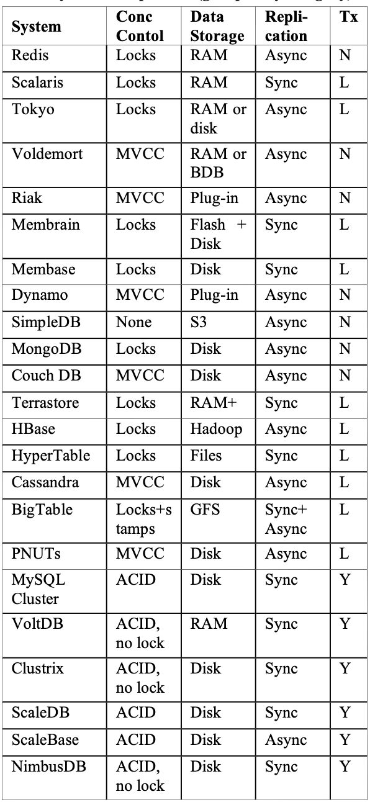

# Comparisons

### Relational vs Non-Relational Databases

A **relational database** is one where data is stored in the form of a table. Each table has a **schema**, which is the columns and types a record is required to have. Each schema must have at least one primary key that uniquely identifies that record. In other words, there are no duplicate rows in your database. Moreover, each table can be related to other tables using foreign keys.
One important aspect of relational databases is that a change in a schema must be applied to all records. This can sometimes cause breakages and big headaches during migrations.**Non-relational databases**tackle things in a different way. They are inherently schema-less, which means that records can be saved with different schemas and with a different, nested structure. Records can still have primary keys, but a change in the schema is done on an entry-by-entry basis.

https://www.prisma.io/blog/comparison-of-database-models-1iz9u29nwn37

http://www.cattell.net/datastores/Datastores.pdf

## Row Oriented vs Column Oriented (columnar) Databases

Here is an example: Say we have a table that stores the following data for 1M users:user_id, name, # logins, last_login. So we effectively have 1M rows and 4 columns. A row-oriented data store will physically store each user's data (i.e., each row) contiguously on disk. By contrast, a columnar store will store all of the user_id's together, all of the names together, and so forth, so that each column's data is stored contiguously on disk.

As a result, shallow-and-wide queries will be faster on a row store (e.g., "fetch all data for user X"), while deep-and-narrow queries will be faster on a column store (e.g., "calculate the average number of logins for all users").
In particular, columnar stores do really well with narrow queries over very wide data. With such storage, only the designated columns need to be read from disk (rather than bringing in pages of data from disk with the entire rows, then selecting one or a few columns just in memory).

Additionally, because individual columns of data are typically the same type and are often drawn from a more limited domain or range, they typically compress better than an entire wide row of data comprising many different data types and ranges. For example, our column of number of logins would all be of an integer type and may cover a small range of numeric values.

Yet columnar stores are not without trade-offs. First of all, inserts take much longer: the system needs to split each record into the appropriate columns and write it to disk accordingly. Second, it is easier for row-based stores to take advantage of an index (e.g., B-tree) to quickly find the appropriate records. Third, with a row-store it is easier to normalize your dataset, such that you can more efficiently store related datasets in other tables.

As a result, the choice of row-oriented vs. columnar database greatly depends on your workload. Typically, row-oriented stores are used with transactional (OLTP) workloads, while columnar stores are used with analytical (OLAP) workloads.

https://blog.timescale.com/blog/building-columnar-compression-in-a-row-oriented-database

### Benefits of Columnar Formats

#### READ-OPTIMIZATION

Let me pretend I want to run a SQL query against this data, for example:

SELECT COUNT(1) from people where last_name = "Rathbone"

With a regular CSV a SQL engine would have to scan every row, parse each column, extract thelast_namevalue, then count allRathbonevalues that it sees.
In CCSV, the SQL engine can skip past the first two fields and simply scan line 3, which contains all the last name values available.

Why is that good? Well now the SQL engine is only processing around 1/6 of the data, so CCSV just delivered a (theoretical and totally unsubstantiated)600% performance improvement vs regular CSV files.

Imagine the same gains against a petabyte-scale dataset. It is not hard to imagine columnar file format optimizations saving a tonne of processing power (and money) compared to regular JSON datasets. This is the core value of columnar file formats.

Of course, in reality there is more work that CCSV would need to do to be a viable file format, but that is getting a little into the weeds, so I will not cover those topics here.

#### COMPRESSION IMPROVEMENTS

Storing like-data together also has advantages for compression codecs. Many compression codecs (including GZIP and Snappy) have a higher compression-ratio when compressing sequences of similar data. By storing records column-by-column, in many cases each section of column data will contain similar values - that makes it ripe for compression. In fact, each column could be compressed independently of the others to optimize this further.

The final benefit is that compression and dense-packing in columnar databases free up space - space that may be used to sort and index data within the columns. In other words, **columnar databases have higher sorting and indexing efficiency**, which comes more as a side benefit of having some leftover space from strong compression. It is also, in fact, mutually beneficial: researchers who study columnar databases point out that sorted data compress better than unsorted data, because sorting lowers entropy.

### Negatives of Columnar Formats

The biggest negative of columnar formats is that re-constructing a complete record is slower and requires reading segments from each row, one-by-one. It is for this reason that columnar-file-formats initially hit their groove for analytics-style workflows, rather than Map/Reduce style workflows - which by default operate on whole rows of data at a time.
For real columnar file formats (like [Parquet](http://parquet.apache.org/)), this downside is minimized by some clever tricks like breaking the file up into 'row groups' and building extensive metadata, although for particularly wide datasets (like 200+ columns), the speed impact can be fairly significant.

The other downside, is that they are more CPU and ram intensive to write, as the file writer needs to collect a whole bunch of metadata, and reorganize the rows before it can write the file.

https://blog.matthewrathbone.com/2019/11/21/guide-to-columnar-file-formats.html
