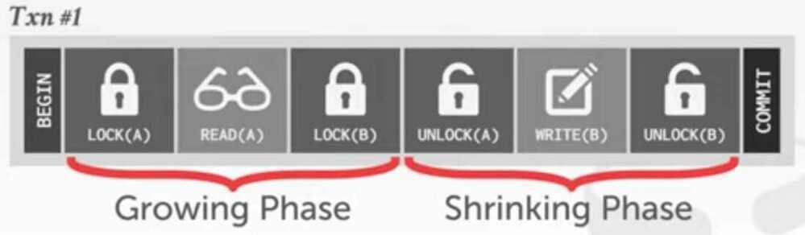
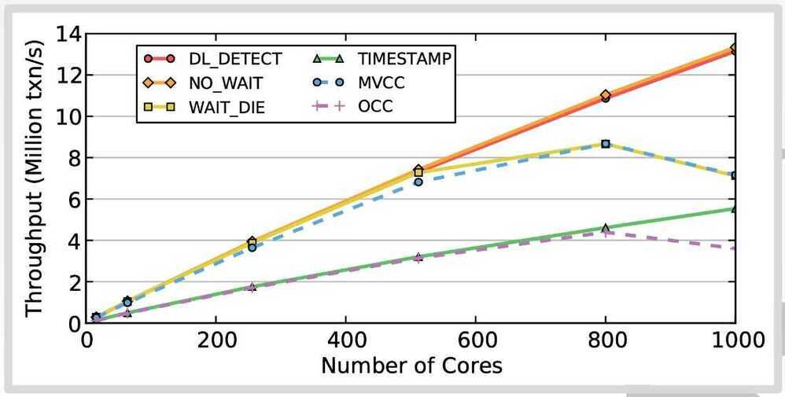
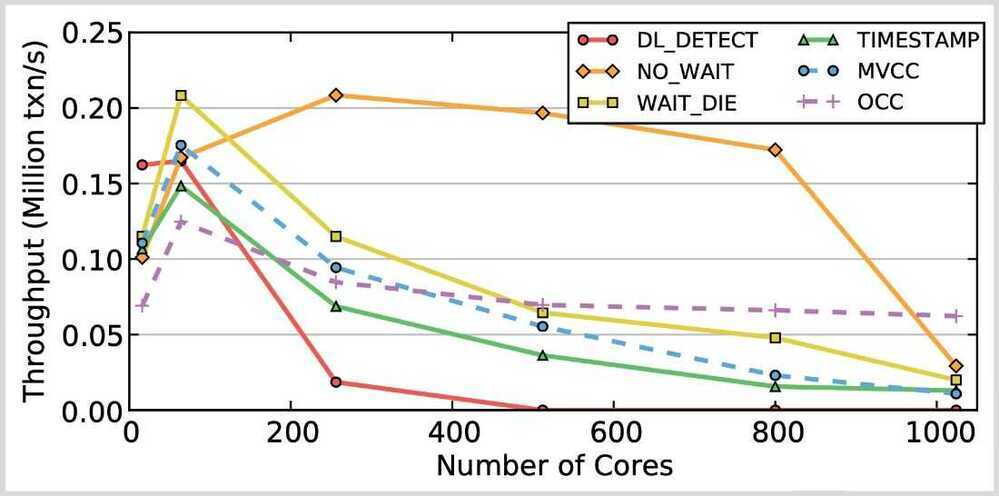
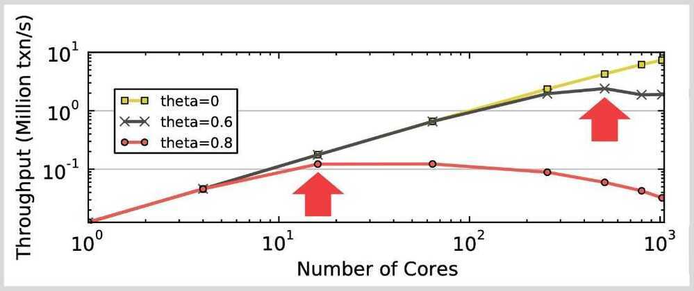
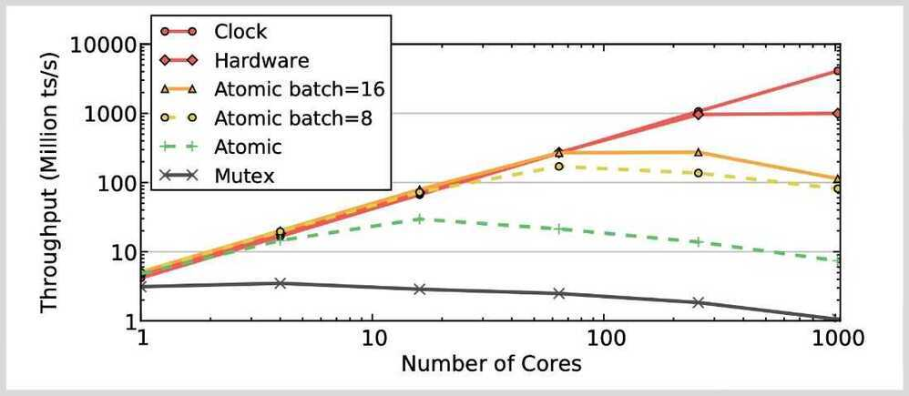

# Concurrency Control

The protocol to allow transactions to access a database in a multi-programmed fashion while preserving the illusion that each of them is executing alone on a dedicated system

- Provides Atomicity + Isolation in ACID
- The goal is to have the effect of a group of transactions on the database's state is equivalent to any serial execution of all transactions.

Computer systems, both [software](https://en.wikipedia.org/wiki/Software) and [hardware](https://en.wikipedia.org/wiki/Computer_hardware), consist of modules, or components. Each component is designed to operate correctly, i.e., to obey or to meet certain consistency rules. When components that operate concurrently interact by messaging or by sharing accessed data (in [memory](https://en.wikipedia.org/wiki/Computer_memory) or [storage](https://en.wikipedia.org/wiki/Computer_data_storage)), a certain component's consistency may be violated by another component. The general area of concurrency control provides rules, methods, design methodologies, and [theories](https://en.wikipedia.org/wiki/Scientific_theory) to maintain the consistency of components operating concurrently while interacting, and thus the consistency and correctness of the whole system. Introducing concurrency control into a system means applying operation constraints which typically result in some performance reduction. Operation consistency and correctness should be achieved with as good as possible efficiency, without reducing performance below reasonable levels. Concurrency control can require significant additional complexity and overhead in a [concurrent algorithm](https://en.wikipedia.org/wiki/Concurrent_algorithm) compared to the simpler [sequential algorithm](https://en.wikipedia.org/wiki/Sequential_algorithm).

For example, a failure in concurrency control can result in [data corruption](https://en.wikipedia.org/wiki/Data_corruption) from [torn read or write operations](https://en.wikipedia.org/w/index.php?title=Torn_data-access_operation&action=edit&redlink=1).

## MySQL Concurreny Control

- Lock based concurrency control
- Multi version concurrency control (MVCC)

## Concurrency control mechanisms

### Optimistic vs Pessimistic Locking

#### Pessimistic Locking

Acquire all the locks beforehand and then commit our transaction

[Understanding Pessimistic Locking with Mutex - YouTube](https://www.youtube.com/watch?v=4F-WiPFrPsA)

#### Optimistic Locking

We do not acquire any locks on data and when commiting a transaction we check to see if any other transaction updated the record we are working on.

[Optimistic Locking - What, When, Why, and How? - YouTube](https://www.youtube.com/watch?v=eMotoFvgdUo)

### Optimistic vs Pessimistic Concurrency Control

#### Pessimistic concurrency control

Widely used by relational databases, this approach assumes that conflicting changes are likely to happen and so blocks access to a resource in order to prevent conflicts. A typical example is locking a row before reading its data, ensuring that only the thread that placed the lock is able to make changes to the data in that row.

#### Optimistic concurrency control

Used by Elasticsearch, this approach assumes that conflicts are unlikely to happen and doesn't block operations from being attempted. However, if the underlying data has been modified between reading and writing, the update will fail. It is then up to the application to decide how it should resolve the conflict. For instance, it could reattempt the update, using the fresh data, or it could report the situation to the user.

### Categories

- **[Optimistic](https://en.wikipedia.org/wiki/Optimistic_concurrency_control)-** Delay the checking of whether a transaction meets the isolation and other integrity rules (e.g., [serializability](https://en.wikipedia.org/wiki/Serializability) and [recoverability](https://en.wikipedia.org/wiki/Serializability#Correctness_-_recoverability)) until its end, without blocking any of its (read, write) operations ("...and be optimistic about the rules being met..."), and then abort a transaction to prevent the violation, if the desired rules are to be violated upon its commit. An aborted transaction is immediately restarted and re-executed, which incurs an obvious overhead (versus executing it to the end only once). If not too many transactions are aborted, then being optimistic is usually a good strategy.
- **Pessimistic-** Block an operation of a transaction, if it may cause violation of the rules, until the possibility of violation disappears. Blocking operations is typically involved with performance reduction.
- **Semi-optimistic-** Block operations in some situations, if they may cause violation of some rules, and do not block in other situations while delaying rules checking (if needed) to transaction's end, as done with optimistic.

Different categories provide different performance, i.e., different average transaction completion rates (throughput), depending on transaction types mix, computing level of parallelism, and other factors. If selection and knowledge about trade-offs are available, then category and method should be chosen to provide the highest performance.

The mutual blocking between two transactions (where each one blocks the other or more) results in a [deadlock](https://en.wikipedia.org/wiki/Deadlock), where the transactions involved are stalled and cannot reach completion. Most non-optimistic mechanisms (with blocking) are prone to deadlocks which are resolved by an intentional abort of a stalled transaction (which releases the other transactions in that deadlock), and its immediate restart and re-execution. The likelihood of a deadlock is typically low.

Blocking, deadlocks, and aborts all result in performance reduction, and hence the trade-offs between the categories.

### Methods

Many methods for concurrency control exist. Most of them can be implemented within either main category above. The major methods, which have each many variants, and in some cases may overlap or be combined, are:

#### 1. Locking (e.g., [Two-phase locking](https://en.wikipedia.org/wiki/Two-phase_locking)- 2PL)

- Controlling access to data by [locks](https://en.wikipedia.org/wiki/Lock_(computer_science)) assigned to the data. Access of a transaction to a data item (database object) locked by another transaction may be blocked (depending on lock type and access operation type) until lock release.
- **Assume transactions will conflict so they must acquire locks on database objects before they are allowed to access them.**
- There are two ways to deal with deadlocks in a two-phase locking (2PL) concurrency control protocol
    - **Deadlock Detection**
        - Each txn maintains a queue of the txns that hold the locks that it is waiting for
        - A separate thread checks these queues for deadlocks
        - If deadlock is found, use a heuristic to decide what transaction to kill in order to break deadlock.
    - **Deadlock Prevention**
        - Check whether another txn already holds a lock when another txn requests it
        - If lock is not available, the txn will either
            - wait
            - commit suicide
            - kill the other txn

#### 2. Serialization [graph checking](https://en.wikipedia.org/wiki/Serializability#Testing_conflict_serializability)

Also called Serializability, or Conflict, or Precedence graph checking

Checking for [cycles](https://en.wikipedia.org/wiki/Cycle_(graph_theory)) in the schedule's [graph](https://en.wikipedia.org/wiki/Directed_graph) and breaking them by aborts.

#### 3. [Timestamp ordering](https://en.wikipedia.org/wiki/Timestamp-based_concurrency_control)(TO)

- Assigning timestamps to transactions, and controlling or checking access to data by timestamp order.
- **Assume that conflicts are rare so transactions do not need to first acquire locks on database objects and instead check for conflicts at commit time.**

#### 4. [Commitment ordering](https://en.wikipedia.org/wiki/Commitment_ordering)(or Commit ordering; CO)

Controlling or checking transactions' chronological order of commit events to be compatible with their respective [precedence order](https://en.wikipedia.org/wiki/Serializability#Testing_conflict_serializability).

Other major concurrency control types that are utilized in conjunction with the methods above include:

- **[Multiversion concurrency control](https://en.wikipedia.org/wiki/Multiversion_concurrency_control)(MVCC) -** Increasing concurrency and performance by generating a new version of a database object each time the object is written, and allowing transactions' read operations of several last relevant versions (of each object) depending on scheduling method.
- **[Index concurrency control](https://en.wikipedia.org/wiki/Index_locking)-** Synchronizing access operations to [indexes](https://en.wikipedia.org/wiki/Index_(database)), rather than to user data. Specialized methods provide substantial performance gains.
- **Private workspace model(Deferred update) -** Each transaction maintains a private workspace for its accessed data, and its changed data become visible outside the transaction only upon its commit (e.g., [Weikum and Vossen 2001](https://en.wikipedia.org/wiki/Concurrency_control#Weikum01)). This model provides a different concurrency control behavior with benefits in many cases.

The most common mechanism type in database systems since their early days in the 1970s has been [Strong strict Two-phase locking](https://en.wikipedia.org/wiki/Two-phase_locking)(SS2PL; also calledRigorous schedulingorRigorous 2PL) which is a special case (variant) of both [Two-phase locking](https://en.wikipedia.org/wiki/Two-phase_locking)(2PL) and [Commitment ordering](https://en.wikipedia.org/wiki/Commitment_ordering)(CO). It is pessimistic. In spite of its long name (for historical reasons) the idea of the SS2PL mechanism is simple: "Release all locks applied by a transaction only after the transaction has ended." SS2PL (or Rigorousness) is also the name of the set of all schedules that can be generated by this mechanism, i.e., these are SS2PL (or Rigorous) schedules, have the SS2PL (or Rigorousness) property.

https://en.wikipedia.org/wiki/Concurrency_control

https://www.geeksforgeeks.org/lock-based-concurrency-control-protocol-in-dbms

https://en.wikipedia.org/wiki/Two-phase_locking

https://www.geeksforgeeks.org/two-phase-locking-protocol

https://vladmihalcea.com/database-deadlock

## Timestamp Ordering (T/O) Concurrency Control

Use timestamps to determine the order of transactions.

### Basic T/O Protocol

- Every transaction is assigned a unique timestamp when they arrive in the system.
- The DBMS maintains separate timestamps in each tuple's header of the last transaction that read that tuple or wrote to it.
- Each transaction check for conflicts on each read/write by comparing their timestamp with the timestamp of the tuple they are accessing.
- The DBMS needs copy a tuple into the transaction's private workspace when reading a tuple to ensure repeatable reads.

## Optimistic Concurrency Control (OCC)

Store all changes in private workspace. Check for conflicts at commit time and then merge.
The protocol puts transactions through three phases during its execution:

### 1. Read Phase

Transaction's copy tuples accessed to private work space to ensure repeatable reads, and keep track of read/write sets.

### 2. Validation Phase

When the transaction invokes COMMIT, the DBMS checks if it conflicts with other transactions. Parallel validation means that each transaction must check the read/write set of other transactions that are trying to validate at the same time. Each transaction has to acquire locks for its write set records in some global order. Original OCC uses serial validation.

The DBMS can proceed with the validation in two directions:

- Backward Validation: Check whether the committing transaction intersects its read/write sets with those of any transactions that have already committed.
- Forward Validation: Check whether the committing transaction intersects its read/write sets with any active transactions that have not yet committed.

### 3. Write Phase

The DBMS propagates the changes in the transactions write set to the database and makes them visible to other transactions' items. As each record is updated, the transaction releases the lock acquired during the Validation Phase

## Timestamp Allocation

There are different ways for the DBMS to allocate timestamps for transactions. Each have their own performance trade-offs.

- **Mutex:** This is the worst option. Mutexes are always a terrible idea.
- **Atomic Addition:** Use compare-and-swap to increment a single global counter. Requires cache invalidation on write.
- **Batched Atomic Addition:** Use compare-and-swap to increment a single global counter in batches. Needs a back-off mechanism to prevent fast burn.
- **Hardware Clock:** The CPU maintains an internal clock (not wall clock) that is synchronized across all cores. Intel only. Not sure if it will exist in future CPUs.
- **Hardware Counter:** Single global counter maintained in hardware. Not implemented in any existing CPUs.

## Observation

- When there is low contention, optimistic protocols perform better because the DBMS spends less time checking for conflicts
- At high contention, the both classes of protocols degenerate to essentially the same serial execution

## Benchmarks

### 1. Read-only workloads

### 2. Write-intensive / Medium-contention

### 3. Write-intensive / High-contention

## Performance Bottlenecks

All concurrency control protocols have performance and scalability problems when there are a large number of concurrent threads and large amount of contention (i.e., the transactions are all trying to read/write to the same set of tuples).

### Lock Thrashing

- DL_DETECT, WAIT_DIE
- Each transaction waits longer to acquire locks, causing other transaction to wait longer to acquire locks.
- Can measure this phenomenon by removing deadlock detection/prevention overhead.
- Force txns to acquire locks in primary key order
- Deadlocks are not possible

### Timestamp Allocation

- All T/O algorithms + WAIT_DIE
- Mutex (Worst option)
- Atomic Addition (Requires cache invaliadtion on write)
- Batched Atomic Addition (Needs a back-off mechanism to prevent fast burn)
- Hardware Clock (Not sure if it will exist in future CPUs)
- Hardware Counter (Not implemented in existing CPUs)

### Memory Allocation

- OCC + MVCC
- Copying data on every read/write access slows down the DBMS because of contention on the memory controller.
- In-place updates and non-copying reads are not affected as much
- Default libc malloc is slow. Never use it

## Operational Transformation

Operational transformation(OT) is a technology for supporting a range of collaboration functionalities in advanced [collaborative software](https://en.wikipedia.org/wiki/Collaborative_software) systems. OT was originally invented for consistency maintenance and [concurrency control](https://en.wikipedia.org/wiki/Concurrency_control) in collaborative editing of plain text documents. Its capabilities have been extended and its applications expanded to include group undo, locking, conflict resolution, operation notification and compression, group-awareness, HTML/XML and tree-structured document editing, collaborative office productivity tools, application-sharing, and collaborative computer-aided media design tools.In 2009 OT was adopted as a core technique behind the collaboration features in [Apache Wave](https://en.wikipedia.org/wiki/Apache_Wave) and [Google Docs](https://en.wikipedia.org/wiki/Google_Docs).

### System architecture

Collaboration systems utilizing Operational Transformations typically use replicated document storage, where each client has their own copy of the document; clients operate on their local copies in a [lock-free](https://en.wikipedia.org/wiki/Lock_(computer_science)), [non-blocking](https://en.wikipedia.org/wiki/Blocking_(computing)) manner, and the changes are then propagated to the rest of the clients; this ensures the client high responsiveness in an otherwise high-latency environment such as the Internet. When a client receives the changes propagated from another client, it typically transforms the changes before executing them; the transformation ensures that application-dependent consistency criteria ([invariants](https://en.wikipedia.org/wiki/Invariant_(computer_science))) are maintained by all sites. This mode of operation results in a system particularly suited for implementing collaboration features, like simultaneous document editing, in a high-latency environment such as [the web](https://en.wikipedia.org/wiki/Www).

### Consistency models

- The CC model
- The CCI model
- The CSM model
- The CA model

Operational Transformation (OT) is an algorithm/technique for the transformation of operations such that they can be applied to documents whose states have diverged, bringing them both back to the same state.

### How does Operational Transformation work?

- Every change (insertion or deletion) is represented as anoperation. An operation can be applied to the current document which results into a new document state.
- To handle concurrent operations, we use thetranformfunction that takes two operations that have been applied to the same document state (but on different clients) and computes a new operation that can be applied after the second operation and that preserves the first operation's intended change

https://en.wikipedia.org/wiki/Operational_transformation

https://medium.com/coinmonks/operational-transformations-as-an-algorithm-for-automatic-conflict-resolution-3bf8920ea447

https://operational-transformation.github.io

## Differential Synchronization

Keeping two or more copies of the same document synchronized with each other in real-time is a complex challenge. **Differential synchronization** offers scalability, fault-tolerance, and responsive collaborative editing across an unreliable network.

https://neil.fraser.name/writing/sync
