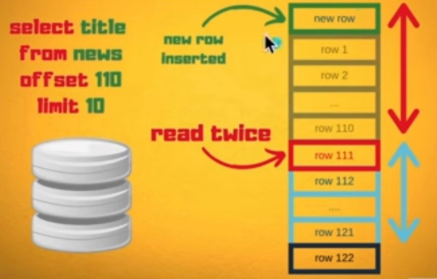

# Core Concepts

CRUD - Create, Read, Update, Delete

INSERT, SELECT, UPDATE, DELETE

## Idempotent - UUID

Try to make all statements Idempotent

## Transaction Log

In the field of [databases](https://en.wikipedia.org/wiki/Database) in [computer science](https://en.wikipedia.org/wiki/Computer_science), atransaction log(alsotransaction journal, database log, binary logoraudit trail) is a history of actions executed by a [database management system](https://en.wikipedia.org/wiki/Database_management_system) used to guarantee [ACID](https://en.wikipedia.org/wiki/ACID) properties over [crashes](https://en.wikipedia.org/wiki/Crash_(computing)) or hardware failures. Physically, a log is a [file](https://en.wikipedia.org/wiki/Computer_file) listing changes to the database, stored in a stable storage format.

If, after a start, the database is found in an [inconsistent](https://en.wikipedia.org/wiki/Consistency_(database_systems)) state or not been shut down properly, the database management system reviews the database logs for [uncommitted](https://en.wikipedia.org/wiki/Commit_(data_management)) transactions and [rolls back](https://en.wikipedia.org/wiki/Rollback_(data_management)) the changes made by these [transactions](https://en.wikipedia.org/wiki/Database_transaction). Additionally, all transactions that are already committed but whose changes were not yet materialized in the database are re-applied. Both are done to ensure [atomicity](https://en.wikipedia.org/wiki/Atomicity_(database_systems)) and [durability](https://en.wikipedia.org/wiki/Durability_(computer_science)) of transactions.

## Types of database log records

1. Update log record
2. Compensation log record
3. Commit record
4. Abort record
5. Checkpoint record
6. Completion record

https://en.wikipedia.org/wiki/Transaction_log

## Prepared Statement

In [database management systems](https://en.wikipedia.org/wiki/Database_management_system)(DBMS), aprepared statementorparameterized statementis a feature used to execute the same or similar database statements repeatedly with high efficiency. Typically used with [SQL](https://en.wikipedia.org/wiki/SQL) statements such as queries or updates, the prepared statement takes the form of a [template](https://en.wikipedia.org/wiki/Template_processor) into which certain constant values are substituted during each execution.

The typical workflow of using a prepared statement is as follows:

- **Prepare:** At first, the application creates the statement template and send it to the DBMS. Certain values are left unspecified, calledparameters, placeholdersorbind variables(labelled "?" below):

```sql
INSERT INTO products(name, price)VALUES(?,?);
```

- Then, the DBMS compiles (parses, [optimizes](https://en.wikipedia.org/wiki/Query_optimization) and translates) the statement template, and stores the result without executing it.

- **Execute:** At a later time, the application supplies (orbinds) values for the parameters of the statement template, and the DBMS executes the statement (possibly returning a result). The application may execute the statement as many times as it wants with different values. In the above example, it might supply "bike" for the first parameter and "10900" for the second parameter.
As compared to executing statements directly, prepared statements offer two main advantages:

- The overhead of compiling the statement is incurred only once, although the statement is executed multiple times. However not all optimization can be performed at the time the statement template is compiled, for two reasons: the best plan may depend on the specific values of the parameters, and the best plan may change as tables and indexes change over time.

- Prepared statements are resilient against [SQL injection](https://en.wikipedia.org/wiki/SQL_injection) because values which are transmitted later using a different protocol are not compiled like the statement template. If the statement template is not derived from external input, SQL injection cannot occur.

On the other hand, if a query is executed only once, server-side prepared statements can be slower because of the additional round-trip to the server.Implementation limitations may also lead to performance penalties; for example, some versions of MySQL did not cache results of prepared queries. A [stored procedure](https://en.wikipedia.org/wiki/Stored_procedure), which is also precompiled and stored on the server for later execution, has similar advantages. Unlike a stored procedure, a prepared statement is not normally written in a procedural language and cannot use or modify variables or use control flow structures, relying instead on the declarative database query language. Due to their simplicity and client-side emulation, prepared statements are more portable across vendors.

https://en.wikipedia.org/wiki/Prepared_statement

## Cursor

Cursoris a Temporary Memory or Temporary Work Station. It is Allocated by Database Server at the Time of Performing DML operations on Table by User. Cursors are used to store Database Tables.
There are 2 types of Cursors:

1. **Implicit Cursors**

Implicit Cursors are also known as Default Cursors of SQL SERVER. These Cursors are allocated by SQL SERVER when the user performs DML operations.

2. **Explicit Cursors**

Explicit Cursors are Created by Users whenever the user requires them. Explicit Cursors are used for Fetching data from Table in Row-By-Row Manner.

https://www.geeksforgeeks.org/what-is-cursor-in-sql

[**How Database Cursors Help in Fetching Large Result sets from your SQL**](https://www.youtube.com/watch?v=C1Y6P6vDFts)

## Pros

- Save on memory on client side
- Streaming to websocket/grpc
- Easily cancel the query
- Paging

## Cons

- Long running transaction (cannot share cursors)
- Stateful

## LIMIT and OFFSET

LIMIT and OFFSET allow you to retrieve just a portion of the rows that are generated by the rest of the query

https://www.postgresql.org/docs/8.0/queries-limit.html

[don't use "offset" in your SQL](https://youtu.be/WDJRRNCGIRs)

- select * from communication_log limit 100 offset 1000000;
- offset means fetch and drop the first X number of rows
- fetch 110 rows and drop first 100
- as the offset increases the database need to do more work, which means offset is very very expensive
- You can accidently read duplicate rows, if someone inserted new row after reading 1st page



- select * from communication_log where id > 140211644 limit 100;
- Change offset to where query to filter using id, using index scan
- A good alternative for using OFFSET will be the Seek Method
- The seek method is all about finding a unique column or set of columns that identifies each row. Then, instead of using the OFFSET clause, we can just use that unique value as a bookmark that presents the position of the last row we've fetched and query the next set of rows by starting from this position in the WHERE clause.

https://www.eversql.com/faster-pagination-in-mysql-why-order-by-with-limit-and-offset-is-slow

## Cursor Pagination vs Offset Pagination

### Pros

- Superior Real-Time Data Capabilities
- No Skipped Data
- No Duplicated Data
- Handling Big Data Sets Efficiently

### Cons

- Limited Sort Features
- Cursors Can Be a Bit Trickier to Implement
- Infinite Scroll Can Be Addicting
- The cursor-based pagination presents an opaque "cursor" indicator that the client may use to page through the result set. This pagination style only presents forward and reverse controls, and does not allow the client to navigate to arbitrary positions.

https://uxdesign.cc/why-facebook-says-cursor-pagination-is-the-greatest-d6b98d86b6c0

https://medium.com/swlh/how-to-implement-cursor-pagination-like-a-pro-513140b65f32

https://medium.com/swlh/how-to-implement-cursor-pagination-like-a-pro-513140b65f32

https://www.django-rest-framework.org/api-guide/pagination/#cursorpagination

https://slack.engineering/evolving-api-pagination-at-slack

https://betterprogramming.pub/building-apis-a-comparison-between-cursor-and-offset-pagination-88261e3885f8

[API Pagination: Making Billions of Products Scrolling Possible - YouTube](https://www.youtube.com/watch?v=14K_a2kKTxU)


