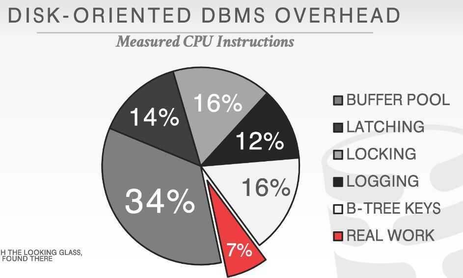
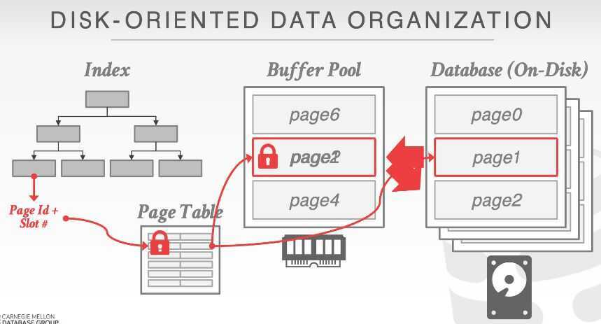

# Disk oriented vs in-memory DBs

## Background

The history of DBMSs development is about dealing with the limitations of hardware. The first DBMSs in the 1970s were designed in environment with the following characteristics:

- Uniprocessor (single core CPU)
- RAM was severely limited
- Database had to be stored on disk
- Disk was slow.
But now DRAM capacities are large enough that most structured databases will entirely fit in memory. This merits us to rethink all aspects of the DBMS to account for this.

## Disk-Oriented Database Management Systems

For a disk oriented DBMS, the system architecture is predicated on the assumption that data is stored in non-volatile memory. This means that the DBMS may have to read data from disk during query execution.In a disk-based system, only approximately 7% of instructions are done on actual work. The majority of the DBMS's instructions time are in managing three of its key components:

- buffer pool
- concurrency control
- logging/recovery

## Buffer Pool

The DBMS organizes the database as a set of fixed-length blocks called **slotted pages**. The system uses an in-memory (volatile) buffer pool to cache the blocks cached from disk.

- When a query accesses a page, the DBMS checks to see if that page is already in memory.
    - If it's not, then the DBMS must retrieve it from disk and copy it into a **frame** in its buffer pool
    - If there are no free frames, then find a page to evict
    - If the page being evicted is dirty, then the DBMS must write it back to disk
- Once the page is in memory, the DBMS translates any on-disk addresses to their in-memory addresses.
- Every tuple access has to go through the buffer pool manager regardless of whether that data will always be in memory.
    - Always translate a tuple's record id to its memory location
    - Worker thread must pin pages that it needs to make sure that they are not swapped to disk

## Concurrency Control

In a disk oriented DBMS, the system assumes that a transaction could stall at any time when it tries to access data that is not in memory. The system's concurrency control protocol allows the DBMS to execute other transactions at the same time to improve performance while still preserving atomicity and isolation guarantees.

- Set locks to provide ACID guarantees for transactions.
- Locks are stored in a separate data structure to avoid being swapped to disk.

## Logging and Recovery

Most DBMS use STEAL+NO-FORCE buffer pool policies, so all modifications have to be flushed to the WAL before a transaction can commit. Each log entry contain before and after image of record modified. Lots of work to keep track of LSNs all throughout the DBMS.

## Why not MMaps?

Memory-map (mmap) a database file into DRAM and let the OS be in charge of swapping data in and out as needed.

Use madvise and msync to give hints to the OS about what data is safe to flush.
Notable mmap DBMSs

- MongoDB(pre WiredTiger)
- MonetDB
- LMDB
- MemSQL

Using mmap gives up fine-grained control on the contents of memory.

- Cannot perform non-blocking memory access.
- The "on-disk" representation has to be the same as the "in-memory" representation.
- The DBMS has no way of knowing what pages are in memory or not.
- Various mmap-related syscallsare not portable.

## In-Memory Database Management Systems

The system architecture assumes that the primary storage location of the database is in memory. This means that the DBMS does not need to perform extra steps during execution to handle the case where it has to retrieve data from disk. If disk I/O is no longer the slowest resource, much of the DBMS architecture will have to change to account for other bottlenecks:

- Locking/latching
- Cache-line misses
- Pointer chasing
- Predicate evaluation
- Data movement and copying
- Networking (between application and DBMS)

## Data Organization

An in-memory DBMS splits the data for tuples into fixed-length and variable-length pools. Indexes use pointers to the fixed-length data for each tuple. These tuples then have 64-bit pointers to any variable-length values stored in a separate memory location.

- Direct memory pointers vs record ids
- Fixed-length vs variable-length data pools
- Use checksums to detct software errors from trashing the database

## Concurrency Control

In-memory DBMSs still use either a pessimistic or optimistic concurrency control schemes to interleave transactions. They will use modern variants of these algorithms that are designed for in-memory data stor-age. The new bottleneck is contention caused from transactions trying to access data at the same time.

One key difference is that an in-memory DBMS can store locking information about each tuple together with its data. This is because the cost of a transaction acquiring a lock is the same as accessing data. Contrast this with disk-oriented DBMSs where locks are physically stored separate from their tuples because the tuples may get swapped out to disk.

- This helps with CPU cache locality
- Mutexes are too slow. Need to use compare-and-swap (CAS) instructions.

## Indexes

Like with concurrency control schemes, in-memory DBMSs will use data structures for their indexes that are optimized for fast, in-memory access.

In-memory DBMSs will not log index updates. Instead, the system will rebuild the indexes upon restart when it loads the database back into memory. This avoids the runtime overhead of logging updates toindexes during transaction execution.

## Query Processing

The best strategy for executing a query plan in a DBMS changes when all the data is already in memory.

- Sequential scans are no longer significantly faster than random access.

The traditional tuple-at-a-time iterator model is too slow because of function calls.

- This problem is more significant in OLAP DBMSs

## Logging and Recovery

The DBMS still needs WAL on non-volatile storage since the system could halt at anytime.

- Use group commit to batch log entries and flush them together to amortize fsync cost
- In many cases, however, it may be possible to use more lightweight logging schemes (e.g., only store redo information). For example, since there are no "dirty pages", the DBMS does not need to maintain LSNs throughout the systems.
- In-memory DBMSs still takes checkpoints to reduce the amount of log that the system has to replay during recovery.
- Different methods for checkpointing:
    - Maintain a second copy of the database in memory that is updated by replaying the WAL.
    - Switch to a special "copy-on-write" mode and then write a dump of the database to disk.
    - Fork the DBMS process and then have the child process write its contents to disk.

## Bottlenecks

If I/O is no longer the slowest resource, much of the DBMS's architecture will have to change account for other bottlenecks:

- Locking/latching
- Cache-line misses
- Pointer chasing
- Predicate evaluations
- Data movement & copying
- Networking (between application & DBMS)

## Larger than memory databases

DRAM is fast, but data is not accessed with the same frequency and in the same manner.

- Hot Data: OLTP Operations
- Cold Data: OLAP Queries

We will study techniques for how to bring back disk-resident data without slowing down the entire system.

## Notable Early In-memory DBMSs

- **TimesTen**: Originally Smallbase from HP Labs. Multi-process, shared memory DBMS. Bought by Oracle in 2005.
- **Dali:** Multi-process shared memory storage manager using memory mapped files [? ].
- **`P*TIME`:** Korean in-memory DBMS from the 2000s. Lots of interesting features (e.g., hybrid storage layouts, support for larger-than-memory databases). Sold to SAP in 2005 and is now part of HANA.

https://www.youtube.com/watch?v=m72mt4VN9ik
