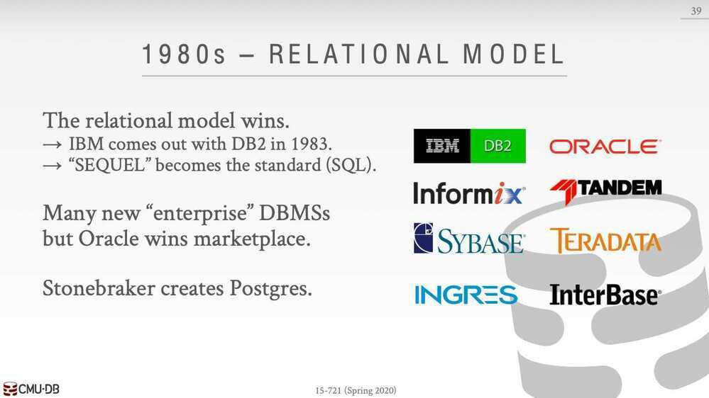
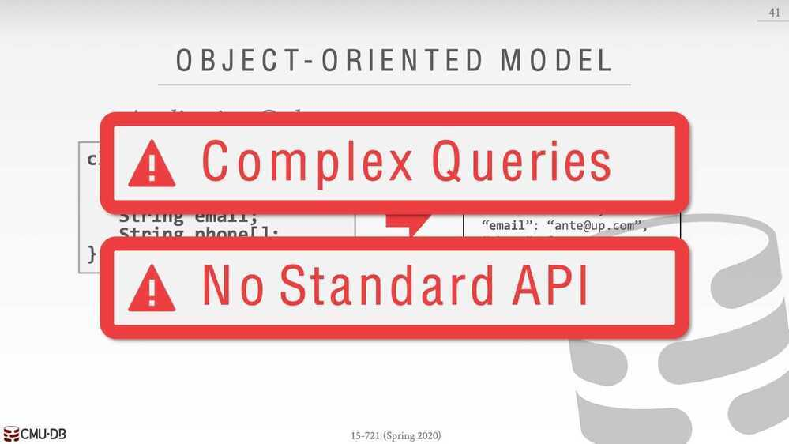
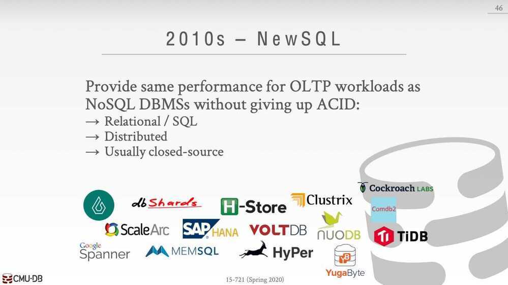
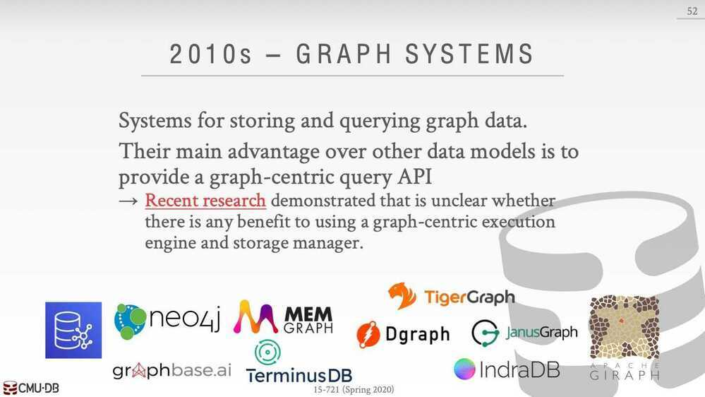
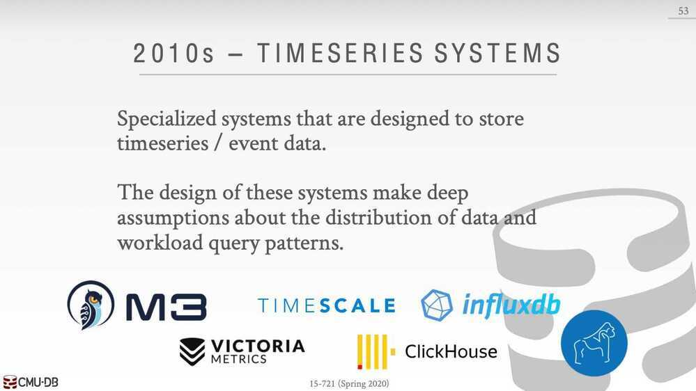

# History

[01 - History of Databases (CMU Databases / Spring 2020)](https://www.youtube.com/watch?v=SdW5RKUboKc)

[Databases in 2023: A Year in Review | OtterTune](https://ottertune.com/blog/2023-databases-retrospective)
