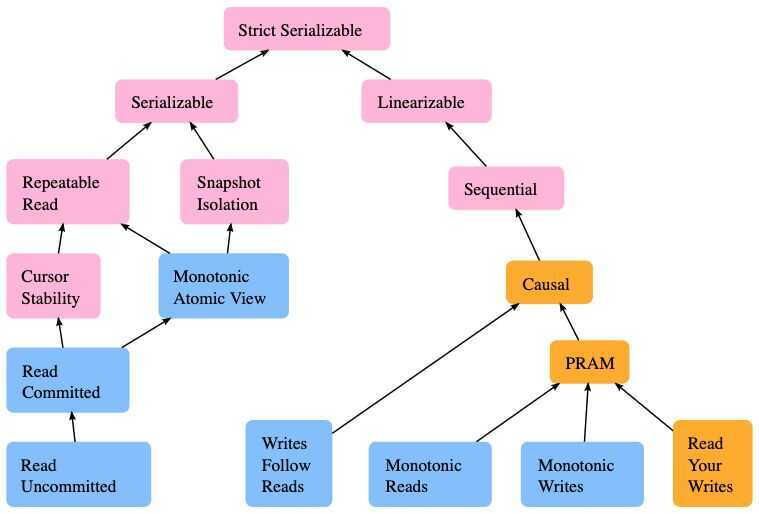

# Isolation Levels

```sql
SELECT @@TX_ISOLATION;
-- REPEATABLE-READ

SHOW ENGINE INNODB STATUS;

-- online update commands
SET TRANSACTION ISOLATION LEVEL READ UNCOMMITTED;
```

In [database](https://en.wikipedia.org/wiki/Database) systems, isolation determines how [transaction](https://en.wikipedia.org/wiki/Database_transaction) integrity is visible to other users and systems. For example, when a user is creating a Purchase Order and has created the header, but not the Purchase Order lines, is the header available for other systems/users (carrying out [concurrent](https://en.wikipedia.org/wiki/Concurrency_(computer_science)) operations, such as a report on Purchase Orders) to see? (Refers to current, not past database systems).

A lower isolation level increases the ability of many users to access the same data at the same time, but increases the number of concurrency effects (such as dirty reads or lost updates) users might encounter. Conversely, a higher isolation level reduces the types of concurrency effects that users may encounter, but requires more system resources and increases the chances that one transaction will block another.

Isolation is typically defined at database level as a property that defines how/when the changes made by one operation become visible to other. On older systems, it may be implemented systemically, for example through the use of temporary tables. In two-tier systems, a Transaction Processing (TP) manager is required to maintain isolation. In n-tier systems (such as multiple websites attempting to book the last seat on a flight), a combination of stored procedures and transaction management is required to commit the booking and send confirmation to the customer.

Isolation is one of the [ACID](https://en.wikipedia.org/wiki/ACID)([Atomicity](https://en.wikipedia.org/wiki/Atomicity_(database_systems)), [Consistency](https://en.wikipedia.org/wiki/Consistency_(database_systems)), Isolation, [Durability](https://en.wikipedia.org/wiki/Durability_(database_systems))) properties.

## Read Phenomenon (DLNP)

The ANSI/ISO standard SQL 92 refers to three differentread phenomenawhen Transaction 1 reads data that Transaction 2 might have changed.

#### Dirty reads

*A dirty read (aka uncommitted dependency)* occurs when a transaction is allowed to read data from a row that has been modified by another running transaction and not yet committed.

#### Lost Update

A lost update occurs when two different transactions are trying to update the same column on the same row within a database at the same time. Typically, one transaction updates a particular column in a particular row, while another that began very shortly afterward did not see this update before updating the same value itself. The result of the first transaction is then "lost", as it is simply overwritten by the second transaction.

#### Non-repeatable reads

A *non-repeatable read* occurs, when during the course of a transaction, a row is retrieved twice and the values within the row differ between reads.

#### Phantom reads

A *phantom read* occurs when, in the course of a transaction, new rows are added or removed by another transaction to the records being read.

[Understanding Phantom Reads Problem with hands on examples - YouTube](https://www.youtube.com/watch?v=n_t0IO0mq5Q)

#### The incorrect summary problem

While one transaction takes a summary over the values of all the instances of a repeated data-item, a second transaction updates some instances of that data-item. The resulting summary does not reflect a correct result for any (usually needed for correctness) precedence order between the two transactions (if one is executed before the other), but rather some random result, depending on the timing of the updates, and whether certain update results have been included in the summary or not.

## Isolation Levels (SRRR)

Of the four [ACID](https://en.wikipedia.org/wiki/ACID) properties in a [DBMS](https://en.wikipedia.org/wiki/Database_management_system)(Database Management System), the isolation property is the one most often relaxed. When attempting to maintain the highest level of isolation, a DBMS usually acquires [locks](https://en.wikipedia.org/wiki/Lock_(database)) on data which may result in a loss of [concurrency](https://en.wikipedia.org/wiki/Concurrency_(computer_science)) or implements [multiversion concurrency](https://en.wikipedia.org/wiki/Multiversion_concurrency_control) control. This requires adding logic for the [application](https://en.wikipedia.org/wiki/Software_application) to function correctly.

Most DBMSs offer a number of transaction isolation levels, which control the degree of locking that occurs when selecting data. For many database applications, the majority of database transactions can be constructed to avoid requiring high isolation levels (e.g. SERIALIZABLE level), thus reducing the locking overhead for the system. The programmer must carefully analyze database access code to ensure that any relaxation of isolation does not cause software bugs that are difficult to find. Conversely, if higher isolation levels are used, the possibility of [deadlock](https://en.wikipedia.org/wiki/Deadlock) is increased, which also requires careful analysis and programming techniques to avoid.

### Serializable

This is the *highest* isolation level.

With a lock-based [concurrency control](https://en.wikipedia.org/wiki/Concurrency_control) DBMS implementation, [serializability](https://en.wikipedia.org/wiki/Serializability) requires read and write locks (acquired on selected data) to be released at the end of the transaction. Alsorange-locks must be acquired when a [SELECT](https://en.wikipedia.org/wiki/Select_(SQL)) query uses a ranged WHERE clause, especially to avoid the [phantom reads](https://en.wikipedia.org/wiki/Isolation_(database_systems)#Phantom_reads) phenomenon.

When using non-lock based concurrency control, no locks are acquired; however, if the system detects awrite collisionamong several concurrent transactions, only one of them is allowed to commit. See [snapshot isolation](https://en.wikipedia.org/wiki/Snapshot_isolation) for more details on this topic.

### Repeatable reads

In this isolation level, a lock-based [concurrency control](https://en.wikipedia.org/wiki/Concurrency_control) DBMS implementation keeps read and write locks (acquired on selected data) until the end of the transaction. However, range-locks are not managed, so [phantom reads](https://en.wikipedia.org/wiki/Isolation_(database_systems)#Phantom_reads) can occur.

Write skew is possible at this isolation level, a phenomenon where two writes are allowed to the same column(s) in a table by two different writers (who have previously read the columns they are updating), resulting in the column having data that is a mix of the two transactions

### Read committed

In this isolation level, a lock-based [concurrency control](https://en.wikipedia.org/wiki/Concurrency_control) DBMS implementation keeps write locks (acquired on selected data) until the end of the transaction, but read locks are released as soon as the [SELECT](https://en.wikipedia.org/wiki/Select_(SQL)) operation is performed (so the [non-repeatable reads phenomenon](https://en.wikipedia.org/wiki/Isolation_(database_systems)#Non-repeatable_reads) can occur in this isolation level). As in the previous level, range-locks are not managed.

Putting it in simpler words, **read committed is an isolation level that guarantees that any data read is committed at the moment it is read**. It simply restricts the reader from seeing any intermediate, uncommitted, 'dirty' read. It makes no promise whatsoever that if the transaction re-issues the read, it will find the same data; data is free to change after it is read.

### Read uncommitted

This is the *lowest* isolation level. In this level, dirty reads are allowed, so one transaction may see *not-yet-committed* changes made by other transactions.

| **Isolation level** | **Dirty reads** | **Lost updates** | **Non-repeatable reads** | **Phantoms** |
| ------------------- | --------------- | ---------------- | ------------------------ | ------------ |
| Read Uncommitted    | may occur       | may occur        | may occur                | may occur    |
| Read Committed      | don't occur     | may occur        | may occur                | may occur    |
| Repeatable Read     | don't occur     | don't occur      | don't occur              | may occur    |
| Serializable        | don't occur     | don't occur      | don't occur              | don't occur  |

Isolation levels in distributed systems get more complicated. Many distributed systems implement variations of the serializable isolation level, such as **one copy-serializability (1SR), strict serializability (strict 1SR)orupdate serializability (US)**. Of those, [**"strict serializability"** is the most perfect](https://fauna.com/blog/serializability-vs-strict-serializability-the-dirty-secret-of-database-isolation-levels) of those serializable options.

The isolation levels defined as part of SQL-92 standard only focused on anomalies that can occur in a 2PL-based DBMS.

There are two additional isolation levels:

### 1. Cursor Stability

- Between repeatable reads and read committed
- Prevents "Lost Update" Anomaly
- Default isolation level in IBM DB2

### 2. Snapshot Isolation

- Guarantees that all reads made in a transaction see a consistent snapshot of the database that existed at the time the transaction started.
- A transaction will commit only if its writes do not conflict with any concurrent updates made since that snapshot.
- Susceptible to write skew anomaly.

#### Write Skew Anomaly

In a *write skew* anomaly, two transactions (T1 and T2) concurrently read an overlapping data set (e.g. values V1 and V2), concurrently make disjoint updates (e.g. T1 updates V1, T2 updates V2), and finally concurrently commit, neither having seen the update performed by the other. Were the system serializable, such an anomaly would be impossible, as either T1 or T2 would have to occur "first", and be visible to the other. In contrast, snapshot isolation permits write skew anomalies.

[Snapshot isolation - Wikipedia](https://en.wikipedia.org/wiki/Snapshot_isolation)



https://en.wikipedia.org/wiki/Isolation_(database_systems)

http://highscalability.com/blog/2011/2/10/database-isolation-levels-and-their-effects-on-performance-a.html

https://fauna.com/blog/introduction-to-transaction-isolation-levels

## Demystifying Database Systems: Correctness Anomalies Under Serializable Isolation

**What Does "Serializable" Mean in a Distributed/ReplicatedSystem?**

We defined "serializable isolation" above as a guarantee that even though a database system is allowed to run transactions in parallel, the final result is equivalent to as if they were running one after the other. In a replicated system, this guarantee must be strengthened in order to avoid the anomalies that would only occur at lower levels of isolation in non-replicated systems.- The Immortal Write

- The Stale Read
- The Casual Reverse

### Classification of Serializable Systems

| **System Guarantee** | **Immortal write** | **Stale read** | **Causal reverse** |
|---|---|---|---|
| ONE COPY SERIALIZABLE | Possible | Possible | Possible |
| STRONG SESSION SERIALIZABLE | Possible (but not within same session) | Possible (but not within same session) | Possible (but not within same session) |
| ASYNCHRONOUS SERIALIZABLE | Not Possible | Possible | Not Possible |
| PARTITIONED SERIALIZABLE | Not Possible | Not Possible | Possible |
| STRICT SERIALIZABLE | Not Possible | Not Possible | Not Possible |

https://fauna.com/blog/demystifying-database-systems-correctness-anomalies-under-serializable-isolation

## Isolation Table with Anomalies

| **System Guarantee**                                               | **Dirty read** | **Non-repeatable read** | **Phantom Read** | **Write Skew** | **Immortal write** | **Stale read** | **Causal reverse** |
| ------------------------------------------------------------------ | -------------- | ----------------------- | ---------------- | -------------- | ------------------ | -------------- | ------------------ |
| READ UNCOMMITTED                                                   | Possible       | Possible                | Possible         | Possible       | Possible           | Possible       | Possible           |
| READ COMMITTED                                                     | Not Possible   | Possible                | Possible         | Possible       | Possible           | Possible       | Possible           |
| REPEATABLE READ                                                    | Not Possible   | Not Possible            | Possible         | Possible       | Possible           | Possible       | Possible           |
| SNAPSHOT ISOLATION                                                 | Not Possible   | Not Possible            | Not Possible     | Possible       | Possible           | Possible       | Possible           |
| SERIALIZABLE / ONE COPY SERIALIZABLE / STRONG SESSION SERIALIZABLE | Not Possible   | Not Possible            | Not Possible     | Not Possible   | Possible           | Possible       | Possible           |
| ASYNCHRONOUS SERIALIZABLE                                          | Not Possible   | Not Possible            | Not Possible     | Not Possible   | Not Possible       | Possible       | Not Possible       |
| PARTITIONED SERIALIZABLE                                           | Not Possible   | Not Possible            | Not Possible     | Not Possible   | Not Possible       | Not Possible   | Possible           |
| STRICT SERIALIZABLE                                                | Not Possible   | Not Possible            | Not Possible     | Not Possible   | Not Possible       | Not Possible   | Not Possible       |

## Distributed Locking

- **Efficiency:** Taking a lock saves you from unnecessarily doing the same work twice (e.g. some expensive computation). If the lock fails and two nodes end up doing the same piece of work, the result is a minor increase in cost (you end up paying 5 cents more to AWS than you otherwise would have) or a minor inconvenience (e.g. a user ends up getting the same email notification twice)
- **Correctness:** Taking a lock prevents concurrent processes from stepping on each others' toes and messing up the state of your system. If the lock fails and two nodes concurrently work on the same piece of data, the result is a corrupted file, data loss, permanent inconsistency, the wrong dose of a drug administered to a patient, or some other serious problem

https://martin.kleppmann.com/2016/02/08/how-to-do-distributed-locking.html

SLOG - Serializable, Low-Latency, Geo-Replicated transactions

## MySQL

You can enforce a high degree of consistency with the default [REPEATABLE READ](https://dev.mysql.com/doc/refman/5.7/en/innodb-transaction-isolation-levels.html#isolevel_repeatable-read) level, for operations on crucial data where [ACID](https://dev.mysql.com/doc/refman/5.7/en/glossary.html#glos_acid) compliance is important. Or you can relax the consistency rules with [READ COMMITTED](https://dev.mysql.com/doc/refman/5.7/en/innodb-transaction-isolation-levels.html#isolevel_read-committed) or even [READ UNCOMMITTED](https://dev.mysql.com/doc/refman/5.7/en/innodb-transaction-isolation-levels.html#isolevel_read-uncommitted), in situations such as bulk reporting where precise consistency and repeatable results are less important than minimizing the amount of overhead for locking. [SERIALIZABLE](https://dev.mysql.com/doc/refman/5.7/en/innodb-transaction-isolation-levels.html#isolevel_serializable) enforces even stricter rules than [REPEATABLE READ](https://dev.mysql.com/doc/refman/5.7/en/innodb-transaction-isolation-levels.html#isolevel_repeatable-read), and is used mainly in specialized situations, such as with [XA](https://dev.mysql.com/doc/refman/5.7/en/glossary.html#glos_xa) transactions and for troubleshooting issues with concurrency and [deadlocks](https://dev.mysql.com/doc/refman/5.7/en/glossary.html#glos_deadlock).

### MySQL Lost Update problem

https://stackoverflow.com/questions/53562850/mysql-repeatable-read-isolation-level-and-lost-update-phenomena

https://forums.mysql.com/read.php?22,56420,57733

https://dev.mysql.com/doc/refman/5.7/en/innodb-transaction-isolation-levels.html

## References

https://dbmsmusings.blogspot.com/2019/08/an-explanation-of-difference-between.html

http://dbmsmusings.blogspot.com/2019/10/introducing-slog-cheating-low-latency.html

[Transaction Isolation in Postgres, explained](https://www.thenile.dev/blog/transaction-isolation-postgres)

[What write skew looks like](https://www.cockroachlabs.com/blog/what-write-skew-looks-like/)
