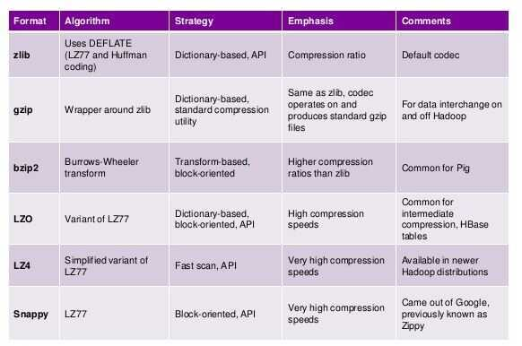

# Others

## JDBC - Java Database Connectivity

Java Database Connectivity (JDBC) is an [application programming interface](https://en.wikipedia.org/wiki/Application_programming_interface)(API) for the programming language [Java](https://en.wikipedia.org/wiki/Java_(programming_language)), which defines how a client may access a [database](https://en.wikipedia.org/wiki/Database). It is a Java-based data access technology used for Java database connectivity. It is part of the [Java Standard Edition](https://en.wikipedia.org/wiki/Java_Standard_Edition) platform, from [Oracle Corporation](https://en.wikipedia.org/wiki/Oracle_Corporation). It provides methods to query and update data in a database, and is oriented towards [relational databases](https://en.wikipedia.org/wiki/Relational_database). A JDBC-to-[ODBC](https://en.wikipedia.org/wiki/ODBC) bridge enables connections to any ODBC-accessible data source in the [Java virtual machine](https://en.wikipedia.org/wiki/Java_virtual_machine)(JVM) host environment

https://en.wikipedia.org/wiki/Java_Database_Connectivity

## ODBC - Opensource Database Connectivity

In [computing](https://en.wikipedia.org/wiki/Computing), Open Database Connectivity(ODBC) is a standard [application programming interface](https://en.wikipedia.org/wiki/Application_programming_interface)(API) for accessing [database management systems](https://en.wikipedia.org/wiki/Database_management_system)(DBMS) . The designers of ODBC aimed to make it independent of database systems and [operating systems](https://en.wikipedia.org/wiki/Operating_system). An application written using ODBC can be ported to other platforms, both on the client and server side, with few changes to the data access code.

ODBC accomplishes DBMS independence by using anODBC driveras a translation layer between the application and the DBMS. The application uses ODBC functions through an ODBC driver manager with which it is linked, and the driver passes the [query](https://en.wikipedia.org/wiki/Query_language) to the DBMS. An ODBC driver can be thought of as analogous to a printer driver or other driver, providing a standard set of functions for the application to use, and implementing DBMS-specific functionality. An application that can use ODBC is referred to as "ODBC-compliant". Any ODBC-compliant application can access any DBMS for which a driver is installed. Drivers exist for all major DBMSs, many other data sources like [address book](https://en.wikipedia.org/wiki/Address_book) systems and [Microsoft Excel](https://en.wikipedia.org/wiki/Microsoft_Excel), and even for text or [comma-separated values](https://en.wikipedia.org/wiki/Comma-separated_values)(CSV) files.

ODBC was originally developed by [Microsoft](https://en.wikipedia.org/wiki/Microsoft) and [Simba Technologies](https://en.wikipedia.org/wiki/Simba_Technologies) during the early 1990s, and became the basis for the [Call Level Interface](https://en.wikipedia.org/wiki/Call_Level_Interface)(CLI) standardized by [SQL Access Group](https://en.wikipedia.org/wiki/SQL_Access_Group) in the [Unix](https://en.wikipedia.org/wiki/Unix) and [mainframe](https://en.wikipedia.org/wiki/Mainframe_computer) field. ODBC retained several features that were removed as part of the CLI effort. Full ODBC was later ported back to those platforms, and became a [de facto standard](https://en.wikipedia.org/wiki/De_facto_standard) considerably better known than CLI. The CLI remains similar to ODBC, and applications can be ported from one platform to the other with few changes.

https://en.wikipedia.org/wiki/Open_Database_Connectivity

## Data Integrity

It's vital to users that the data they interact with is secure, correct and sensible. Examples are making sure that age isn't a negative number, or that no two students have the same information. We refer to this as data integrity.

Data integrity takes several forms and can be divided into four categories:

- **Entity Integrity:** No duplicate rows exist in a table. For example, we can't insert Ron Weasley twice in the database.
- **Domain Integrity:** Restricting the type of values that one can insert in order to enforce correct values. For example, a House can only be Gryffindor, Ravenclaw, Slytherin, or Hufflepuff. This also includes the length.
- **Referential Integrity:** Records that are used by other records cannot be deleted. A teacher cannot be deleted if they are currently teaching a course.
- **User-Defined Integrity:** An "other" category that consists of business-related logic and rules to the database.

### Referential Integrity Constraints

Referential integrity constraints are one of the features of DBMSs we become acquainted with. We use them because they make us feel comfortable. These **constraints guarantee that you will never mistakenly insert a value that doesn't exist in the referenced column.** It also prevents you from deleting a row whose column is referenced on the other side of the constraint.

If you have seconds thoughts about using referential integrity constraints, their use is not tied to business requirements for your running software. They act as safety nets, preventing your code from sustaining mistaken behavior and beginning to write uncorrelated data to your database. Because we are applying zero-downtime migrations to our schema and none of our migrations are destructive, you still have another safety net: you never lose any data, and you are always capable of deploying your previous version into production without the fear of losing or corrupting anything. In this sense, we believe that it is safe to simply drop your referential integrity constraints before applying your series of migrations. Later, when everything is deployed into production and you know that you are done with the refactorings, you will recreate the constraints using the new columns

## Data Deduplication (Dedup)

Data Deduplication is a specialized [data compression](https://en.wikipedia.org/wiki/Data_compression) technique for eliminating duplicate copies of repeating data. Related and somewhat synonymous terms are **intelligent (data) compression** and [single-instance (data) storage](https://en.wikipedia.org/wiki/Single-instance_storage). This technique is used to improve storage utilization and can also be applied to network data transfers to reduce the number of bytes that must be sent. In the deduplication process, unique chunks of data, or byte patterns, are identified and stored during a process of analysis. As the analysis continues, other chunks are compared to the stored copy and whenever a match occurs, the redundant chunk is replaced with a small reference that points to the stored chunk. Given that the same byte pattern may occur dozens, hundreds, or even thousands of times (the match frequency is dependent on the chunk size), the amount of data that must be stored or transferred can be greatly reduced

Today, you usually head about deduplication in the contest of storage devices or architectures. It is a way of, for example, saving disk space when large amounts of duplicate data is present (imagine, for example, having 100 VM images on a SAN - there is likely to be a lot of duplication among the operating system and other common files on each VM).

Deduplication is a way of storing this redundant data only once.

https://en.wikipedia.org/wiki/Data_deduplication

https://searchstorage.techtarget.com/definition/data-deduplication

## General Data Types

### Scalar Types

A scalar type can represent exactly one value. The scalar types are number, string, binary, Boolean, and null.

### Document Types

A document type can represent a complex structure with nested attributes, such as you would find in a JSON document. The document types are list and map.

### Set Types

A set type can represent multiple scalar values. The set types are string set, number set, and binary set.

## Autoincrement

AUTOINCREMENT'ing is a common way of generating primary keys. It's not uncommon to see cases where databases are used as ID generators and there are ID-generation designated tables in a database.

There are a few reasons why generating primary keys via auto-incrementing may not be not ideal:

- In distributed database systems, auto-incrementing is a hard problem. A global lock would be needed to be able to generate an ID. If you can generate a UUID instead, it would not require any collaboration between database nodes. Auto-incrementing with locks may introduce contention and may significantly downgrade the performance for insertions in distributed situations. Some databases like MySQL may require specific [configuration](https://www.percona.com/blog/2011/01/12/conflict-avoidance-with-auto_increment_incremen-and-auto_increment_offset/) and more attention to get things right in master-master replication. The configuration is easy to mess up and can lead to write outages.
- Some databases have partitioning algorithms based on primary keys. Sequential IDs may cause unpredictable hotspots and may overwhelm some partitions while others stay idle.
- The fastest way to access to a row in a database is by its primary key. If you have better ways to identify records, sequential IDs may make the most significant column in tables a meaningless value. Please pick a globally unique natural primary key (e.g. a username) where possible.

Please consider the impacts of auto-incremented IDs vs UUIDs on indexing, partitioning and sharding before you decide on what works better for you.

https://medium.com/@rakyll/things-i-wished-more-developers-knew-about-databases-2d0178464f78

## Database Storage Engines

https://medium.com/yugabyte/a-busy-developers-guide-to-database-storage-engines-the-basics-6ce0a3841e59

## Performance Benchmarks

### SQL Databases

When you make a lot of inserts or updates do it one statement or disable autocommit and use explicit transactions.

https://github.com/harryho/db-samples
