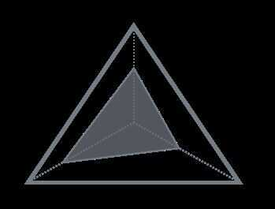

# RUM Conjecture

RUM - Read Update Memory

There are many ways to read and write the data: data structures, access patterns, optimizations: all of it contributes to the performance of the resulting system. But it's hard to make system that'll be simultaneously optimized in all directions. In an ideal world we would have data structures that can guarantee the best read and write performance and have no storage overhead, but of course in practice this is not possible. Researchers from Harvard DB lab summarized the three parameters people working on database systems are trying to optimize for:**ReadOverhead, UpdateOverhead, and Memory Overhead**. Deciding which overhead to optimize for will influence the choice of data structures, access methods and even suitability for certain workloads. RUM Conjecture states that setting an upper bound for two of the mentioned overheads also sets a lower bound for the third one.

RUM Conjecture separates data structures in Read, Update and Memory optimized.
Tree-based data structures are typically optimized for read performance, which is traded for the space overhead and write amplification coming from node splits/merges, relocation, and fragmentation/misbalance-related maintenance. In terms of read amplification, Tree-based structures help to minimize the ratio between the total data accessed and the data that's intended to be read. Using adaptive data structures gives better read performance at the price of higher maintenance costs. Adding metadata facilitating traversals (like fractional cascading) will have an impact on write time and take space, but can improve the read time.
As we have already discussed, LSM-Trees optimize for Write Performance. Both updates are deletes do not require searching for the data on disk and guarantee sequential writes by deferring and buffering all insert, update and delete operations. This comes at a price of higher maintenance costs and a need for compaction (which is just a way to mitigate the ever-growing price of reads) and more expensive reads (as the data has to be read from multiple files and merged together). At the same time, LSM Trees help to improve the memory efficiency by avoiding reserving empty space (a source of overhead in some read-optimised data structures) and allowing block compression due to the better occupancy and immutability of the end file.

Optimizing for memory efficiency might involve using compression (for example, algorithms such as [Gorilla compression](http://www.vldb.org/pvldb/vol8/p1816-teller.pdf), delta encoding and many others), which will add some read and write overhead. Sometimes you can trade functionality for efficiency. For example, heap files and hash indexes can give great performance guarantees and smaller space overhead due to the file format simplicity for the price of not being able to perform anything but point queries. You can also trade precision for efficiency, by using approximate data structures, such as [Bloom Filter](https://www.jasondavies.com/bloomfilter/), [HyperLogLog](https://research.neustar.biz/2012/10/25/sketch-of-the-day-hyperloglog-cornerstone-of-a-big-data-infrastructure/), [Count Min Sketch](https://redislabs.com/blog/count-min-sketch-the-art-and-science-of-estimating-stuff/) and many others.

These three tunables:Read, UpdateandMemoryoverheads can help you to evaluate the database and deeper understand the workloads it's best suitable for. All of them are quite intuitive and it's often easy to sort the storage system into one of the buckets and guess how it's going to perform.

RUM Conjecture: Setting an upper bound on two tunables also sets a lower bound on the thirdone.

That said, using the best data structures is just a half of job: there are enough parts in database systems where performance may still be a bottleneck. But we assume that database developers always aspire to eliminate problems and make their product perform best under the workloads it's designed for and well enough for all other use cases.

https://medium.com/databasss/on-disk-storage-part-4-b-trees-30791060741
