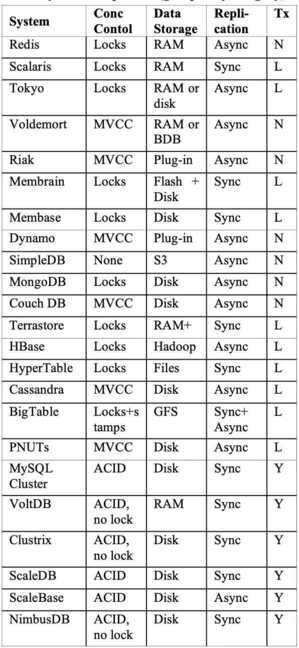

# Types of Databases

## Relational database (ACID)

- MySQL Cluster
- PostgreSQL
- VoltDB
- Clustrix
- ScaleBase
- NimbusDB
- Megastore over BigTable
- MariaDB
- SQLite

## NoSQL Databases (Scales better, Higher availability)

- While the traditional SQL can be effectively used to handle large amount of structured data, we need NoSQL (Not Only SQL) to handle unstructured data
- NoSQL databases store unstructured data with no particular schema
- Each row can have its own set of column values. NoSQL gives better performance in storing massive amount of data

### Key-Value

- Project Voldemort
- Riak
- Redis
- Aerospike
- Scalaris
- Tokyo cabinet
- Memcached, membrain, and membase
- LF (fully decentralized fully replicated key/value store.)
- Etcd

### Wide Column / Extensible Record Stores / Column-family

Can have many many different types of column

- HBase
- HyperTable
- Cassandra

## Column Oriented Database

Not to be confused with column-family databases, column-oriented databases are very similar to relational databases, but store data on disk by column instead of by row. This means that all of the data for a single column is together, allowing for faster aggregation on larger data sets. Since the columns are separate from each other, inserting or updating values is a performance intensive task, so column-oriented databases are primarily used for analytical work where entire data sets can be preloaded at one time.- Druid

## Object Oriented Database

Object-oriented databases store data items as objects, seeking to bridge the gap between the representations used by objected-oriented programming languages and databases. Although this solves many problems with translating between different data paradigms, historically, adoption has suffered due to increased complexity, lack of standardization, and difficulty decoupling the data from the original application.

## Document Oriented Database / Document Stores

- Semi-structured data (XML, JSON)
- Flat File Database

#### Databases

- SimpleDB
- CouchDB
- MongoDB
- Terrastore
- SQLite
- RethinkDB

<https://rethinkdb.com>

## Hierarchical database / Graph based database (Entities, Relationships)

- Dgraph
- Nebula-graph

<https://nebula-graph.io>

- [Alibaba Graph Database](https://cn.aliyun.com/product/gdb)- A real-time, reliable, cloud-native graph database service that supports property graph model.
- [Amazon Neptune](https://aws.amazon.com/neptune/)- Fully-managed graph database service.
- [ArangoDB](https://github.com/ArangoDB-Community/arangodb-tinkerpop-provider)- OLTP Provider for ArangoDB.
- [Bitsy](https://github.com/lambdazen/bitsy/wiki)- A small, fast, embeddable, durable in-memory graph database.
- [Blazegraph](https://github.com/blazegraph/tinkerpop3)- RDF graph database with OLTP support.
- [CosmosDB](https://docs.microsoft.com/en-us/azure/cosmos-db/graph-introduction)- Microsoft's distributed OLTP graph database.
- [ChronoGraph](https://github.com/MartinHaeusler/chronos/tree/master/org.chronos.chronograph)- A versioned graph database.
- [DSEGraph](https://www.datastax.com/products/datastax-enterprise-graph)- DataStax graph database with OLTP and OLAP support.
- [GRAKN.AI](https://grakn.ai/)- Distributed OLTP/OLAP knowledge graph system.
- [Hadoop (Spark)](https://tinkerpop.apache.org/docs/current/reference/#sparkgraphcomputer)- OLAP graph processor using Spark.
- [HGraphDB](https://github.com/rayokota/hgraphdb)- OLTP graph database running on Apache HBase.
- [Huawei Graph Engine Service](https://www.huaweicloud.com/en-us/product/ges.html)- Fully-managed, distributed, at-scale graph query and analysis service that provides a visualized interactive analytics platform.
- [IBM Graph](https://console.ng.bluemix.net/catalog/services/ibm-graph/)- OLTP graph database as a service.
- [JanusGraph](http://janusgraph.org/)- Distributed OLTP and OLAP graph database with BerkeleyDB, Apache Cassandra and Apache HBase support.
- [JanusGraph (Amazon)](https://github.com/awslabs/dynamodb-janusgraph-storage-backend/)- The Amazon DynamoDB Storage Backend for JanusGraph.

<https://medium.com/terminusdb/graph-fundamentals-part-1-rdf-60dcf8d0c459>

- [Neo4j](https://tinkerpop.apache.org/docs/current/reference/#neo4j-gremlin)- OLTP graph database (embedded and high availability) (open source, noSQL graph database) - [Build Graph Databases with Neo4j](https://www.freecodecamp.org/news/learn-neo4j-database-course/)
- [neo4j-gremlin-bolt](https://github.com/SteelBridgeLabs/neo4j-gremlin-bolt)- OLTP graph database (using Bolt Protocol).
- [OrientDB](https://github.com/orientechnologies/orientdb-gremlin)- OLTP graph database
- [Apache S2Graph](https://s2graph.apache.org/)- OLTP graph database running on Apache HBase.
- [Sqlg](https://github.com/pietermartin/sqlg)- OLTP implementation on SQL databases.
- [Stardog](https://stardog.com/)- RDF graph database with OLTP and OLAP support.
- [TinkerGraph](https://tinkerpop.apache.org/docs/current/reference/#tinkergraph-gremlin)- In-memory OLTP and OLAP reference implementation.
- [Titan](https://thinkaurelius.github.io/titan/)- Distributed OLTP and OLAP graph database with BerkeleyDB, Apache Cassandra and Apache HBase support.
- [Titan (Amazon)](https://github.com/awslabs/dynamodb-titan-storage-backend)- The Amazon DynamoDB storage backend for Titan.
- [Titan (Tupl)](https://github.com/classmethod/tupl-titan-storage-backend)- The Tupl storage backend for Titan.
- [Unipop](https://github.com/rmagen/unipop)- OLTP Elasticsearch and JDBC backed graph.

<http://tinkerpop.apache.org>

Examples

- Filesystems
- DNS
- LDAP directories

## Network databases

- IDMS

## Time-Series databases

- TimeScale DB (TSDB)
- InfluxDB
- OpenTSDB
- Prometheus

## In-memory databases

- Redis
- RocksDB
- Memcached (a distributed memory object caching system)

## Cloud databases / on-line databases / Managed services

- Google Firebase
- Facebook Parse
- Amazon DynamoDB
- Amazon Aurora

## Object Storage

Object storage (also known asobject-based storage) is a [computer data storage](https://en.wikipedia.org/wiki/Computer_data_storage) architecture that manages data as objects, as opposed to other storage architectures like [file systems](https://en.wikipedia.org/wiki/File_systems) which manages data as a file hierarchy, and [block storage](https://en.wikipedia.org/wiki/Block_storage) which manages data as blocks within sectors and tracks.Each object typically includes the data itself, a variable amount of [metadata](https://en.wikipedia.org/wiki/Metadata), and a [globally unique identifier](https://en.wikipedia.org/wiki/Globally_unique_identifier). Object storage can be implemented at multiple levels, including the device level (object-storage device), the system level, and the interface level. In each case, object storage seeks to enable capabilities not addressed by other storage architectures, like interfaces that can be directly programmable by the application, a namespace that can span multiple instances of physical hardware, and data-management functions like [data replication](https://en.wikipedia.org/wiki/Data_replication) and data distribution at object-level granularity.

Object storage systems allow retention of massive amounts of [unstructured data](https://en.wikipedia.org/wiki/Unstructured_data). Object storage is used for purposes such as storing photos on [Facebook](https://en.wikipedia.org/wiki/Facebook), songs on [Spotify](https://en.wikipedia.org/wiki/Spotify), or files in online collaboration services, such as [Dropbox](https://en.wikipedia.org/wiki/Dropbox_(service)).- S3

- Azure Blob Storage

<https://en.wikipedia.org/wiki/Object_storage>

## NewSQL databases

NewSQL databases follow the relational structure and semantics, but are built using more modern, scalable designs. The goal is to offer greater scalability than relational databases and greaterconsistency guaranteesthan NoSQL alternatives. They achieve this by sacrificing certain amounts of availability in the event of a networking partition. The trade offs between consistency and availability is a fundamental problem of distributed databases described by theCAP theorem.- MemSQL

- VoltDB
- Spanner
- Calvin
- CockroachDB
- FaunaDB

<https://www.youtube.com/watch?v=2CipVwISumA&t=661s&ab_channel=Fireship>

- yugabyteDB

## Multi-model databases

Multi-model databases are databases that combine the functionality of more than one type of database. The benefits of this approach are clear - the same system can use different representations for different types of data.- ArangoDB

- OrientDB
- Couchbase

## Semantic RDF graph database

Semantic RDF graph databases are databases that map objects using the Resource Description Framework. This framework a way to describe, in detail, objects and their relationships by categorizing pieces of data and connections. The idea is to map subjects, actions, and objects like you would in a sentence (for example, "Bill calls Sue"). For most use cases, labeled property graphs, usually just called [graph databases](https://www.prisma.io/blog/comparison-of-database-models-1iz9u29nwn37#graph-databases-mapping-relationships-by-focusing-on-how-connections-between-data-are-meaningful), can express relationships more flexibly and concisely.

## Ledger Databases

## Embedded databases

<https://jsondb.io>

## Vector Databases

A vector database is a specialized DBMS that stores vector embeddings utilizing innovative techniques for storage, indexing, and query processing. They offer data management capabilities, such as CRUD and language bindings to widely used data science languages such as Python, SQL, Java, and Tensorflow. Additionally, they deliver advanced features such as high-speed ingestion, sharding, and replication.

Vector databases are designed to handle critical query and algorithmic styles seen in similarity search, anomaly search, observability, fraud detection, and IoT sensor analytics. Such emerging styles are the outcome of digital transformation and the rise of generative AI.

[A Comprehensive Guide to Vector Databases - KDB.AI](https://kdb.ai/blog/a-comprehensive-guide-to-vector-databases/)

## Others

### Chroma

- [Chroma](https://www.trychroma.com/) - the AI-native open-source embedding database
- [GitHub - chroma-core/chroma: the AI-native open-source embedding database](https://github.com/chroma-core/chroma)

## Comparision

### Relational vs Non-Relational Databases

A **relational database** is one where data is stored in the form of a table. Each table has a **schema**, which is the columns and types a record is required to have. Each schema must have at least one primary key that uniquely identifies that record. In other words, there are no duplicate rows in your database. Moreover, each table can be related to other tables using foreign keys.
One important aspect of relational databases is that a change in a schema must be applied to all records. This can sometimes cause breakages and big headaches during migrations.**Non-relational databases**tackle things in a different way. They are inherently schema-less, which means that records can be saved with different schemas and with a different, nested structure. Records can still have primary keys, but a change in the schema is done on an entry-by-entry basis.
<https://www.prisma.io/blog/comparison-of-database-models-1iz9u29nwn37>

<http://www.cattell.net/datastores/Datastores.pdf>

## AWS Databases

### Amazon Aurora

High Performance Managed Relational Database

### Amazon RDS

Managed Relational Database Service for MySQL, PostgreSQL, Oracle, SQL Server, and MariaDB
Amazon RDS Proxy

Amazon RDS Proxy is a fully managed, highly available database proxy for [Amazon Relational Database Service (RDS)](https://aws.amazon.com/rds/) that makes applications more scalable, more resilient to database failures, and more secure.
Many applications, including those built on modern [serverless architectures](https://aws.amazon.com/serverless/), can have a large number of open connections to the database server, and may open and close database connections at a high rate, exhausting database memory and compute resources. Amazon RDS Proxy allows applications to pool and share connections established with the database, improving database efficiency and application scalability. With RDS Proxy, failover times for Aurora and RDS databases are reduced by up to 66% and database credentials, authentication, and access can be managed through integration with AWS Secrets Manager and AWS Identity and Access Management (IAM).
<https://aws.amazon.com/rds/proxy>

### Amazon RDS on VMWare

Automate on-premises database management

### Amazon DynamoDB

Managed NoSQL Database

### Amazon DocumentDB (With MongoDB Compatibility)

Fully Managed Document Database

### Amazon ElastiCache

In-memory Data Store and Cache- Query Caching

- Delayed Transactions
- Read / Write Splitting
- Connection Polling

Elasticache between rds and application - <https://aws.amazon.com/blogs/database/automating-sql-caching-for-amazon-elasticache-and-amazon-rds>

<https://www.heimdalldata.com/aws>

<http://demoa.heimdalldata.com:8087/docs/theory/caching.html>

#### ElastiCache using Redis

<https://aws.amazon.com/redis>

### Amazon Redshift

Fast, Simple, Cost-effecitive Data Warehousing

### Amazon Neptune

Fully Managed Graph Database Service

### AWS Database Migration Service (DMS)

Migrate Databases with Minimal Downtime

<https://aws.amazon.com/dms>

<https://aws.amazon.com/blogs/database/archiving-data-from-relational-databases-to-amazon-glacier-via-aws-dms>

<https://aws.amazon.com/blogs/database/automating-aws-dms-migration-tasks>

### AWS Managed Apache Cassandra Service

Amazon Managed Apache Cassandra Service is a scalable, highly available, and managed Apache Cassandra--compatible database service. With Amazon Managed Cassandra Service, you can run your Cassandra workloads on AWS using the same Cassandra application code and developer tools that you use today. You don't have to provision, patch, or manage servers, and you don't have to install, maintain, or operate software. Amazon Managed Cassandra Service is serverless, so you pay for only the resources you use and the service automatically scales tables up and down in response to application traffic. You can build applications that serve thousands of requests per second with virtually unlimited throughput and storage.
<https://aws.amazon.com/mcs>

### Amazon TimeStream

Fully Managed TimeSeries Database

### Amazon Managed Apache Cassandra Service

Managed Cassandra-compatible database

### Amazon Quantum Ledger Database (QLDB)

Fully managed ledged database

| **Database Type** | **Use Cases** | **AWS Service** |  |  |
|---|---|---|---|---|
| Relational | Traditional applications, ERP, CRM, e-commerce | [Amazon Aurora](https://aws.amazon.com/rds/aurora/?c=db&sec=srv) | [Amazon RDS](https://aws.amazon.com/rds/?c=db&sec=srv) | [Amazon Redshift](https://aws.amazon.com/redshift/?c=db&sec=srv) |
| Key-value | High-traffic web apps, e-commerce systems, gaming applications | [Amazon DynamoDB](https://aws.amazon.com/dynamodb/?c=db&sec=srv) |  |  |
| In-memory | Caching, session management, gaming leaderboards, geospatial applications | [Amazon ElastiCache for Memcached](https://aws.amazon.com/elasticache/memcached/?c=db&sec=srv) | [Amazon ElastiCache for Redis](https://aws.amazon.com/elasticache/redis/?c=db&sec=srv) |  |
| Document | Content management, catalogs, user profiles | [Amazon DocumentDB](https://aws.amazon.com/documentdb/?c=db&sec=srv) |  |  |
| Wide-column | High scale industrial apps for equipment maintenance, fleet management, and route optimization | [Amazon Managed Apache Cassandra Service](https://aws.amazon.com/mcs/?c=db&sec=srv) |  |  |
| Graph | Fraud detection, social networking, recommendation engines | [Amazon Neptune](https://aws.amazon.com/neptune/?c=db&sec=srv) |  |  |
| Time series | IoT applications, DevOps, industrial telemetry | [Amazon Timestream](https://aws.amazon.com/timestream/?c=db&sec=srv) |  |  |
| Ledger | Systems of record, supply chain, registrations, banking transactions | [Amazon Quantum Ledger Database](https://aws.amazon.com/qldb/?c=db&sec=srv) |  |  |

<https://aws.amazon.com/products/databases>

## Row Oriented vs Column Oriented (columnar) Databases

Here is an example: Say we have a table that stores the following data for 1M users:user_id, name, # logins, last_login. So we effectively have 1M rows and 4 columns. A row-oriented data store will physically store each user's data (i.e., each row) contiguously on disk. By contrast, a columnar store will store all of the user_id's together, all of the names together, and so forth, so that each column's data is stored contiguously on disk.

As a result, shallow-and-wide queries will be faster on a row store (e.g., "fetch all data for user X"), while deep-and-narrow queries will be faster on a column store (e.g., "calculate the average number of logins for all users").
In particular, columnar stores do really well with narrow queries over very wide data. With such storage, only the designated columns need to be read from disk (rather than bringing in pages of data from disk with the entire rows, then selecting one or a few columns just in memory).

Additionally, because individual columns of data are typically the same type and are often drawn from a more limited domain or range, they typically compress better than an entire wide row of data comprising many different data types and ranges. For example, our column of number of logins would all be of an integer type and may cover a small range of numeric values.

Yet columnar stores are not without trade-offs. First of all, inserts take much longer: the system needs to split each record into the appropriate columns and write it to disk accordingly. Second, it is easier for row-based stores to take advantage of an index (e.g., B-tree) to quickly find the appropriate records. Third, with a row-store it is easier to normalize your dataset, such that you can more efficiently store related datasets in other tables.

As a result, the choice of row-oriented vs. columnar database greatly depends on your workload. Typically, row-oriented stores are used with transactional (OLTP) workloads, while columnar stores are used with analytical (OLAP) workloads.
<https://blog.timescale.com/blog/building-columnar-compression-in-a-row-oriented-database>

### Benefits of Columnar Formats

#### READ-OPTIMIZATION

Let me pretend I want to run a SQL query against this data, for example:

SELECT COUNT(1) from people where last_name = "Rathbone"

With a regular CSV a SQL engine would have to scan every row, parse each column, extract thelast_namevalue, then count allRathbonevalues that it sees.
In CCSV, the SQL engine can skip past the first two fields and simply scan line 3, which contains all the last name values available.

Why is that good? Well now the SQL engine is only processing around 1/6 of the data, so CCSV just delivered a (theoretical and totally unsubstantiated)600% performance improvement vs regular CSV files.

Imagine the same gains against a petabyte-scale dataset. It is not hard to imagine columnar file format optimizations saving a tonne of processing power (and money) compared to regular JSON datasets. This is the core value of columnar file formats.

Of course, in reality there is more work that CCSV would need to do to be a viable file format, but that is getting a little into the weeds, so I will not cover those topics here.

#### COMPRESSION IMPROVEMENTS

Storing like-data together also has advantages for compression codecs. Many compression codecs (including GZIP and Snappy) have a higher compression-ratio when compressing sequences of similar data. By storing records column-by-column, in many cases each section of column data will contain similar values - that makes it ripe for compression. In fact, each column could be compressed independently of the others to optimize this further.

The final benefit is that compression and dense-packing in columnar databases free up space - space that may be used to sort and index data within the columns. In other words, **columnar databases have higher sorting and indexing efficiency**, which comes more as a side benefit of having some leftover space from strong compression. It is also, in fact, mutually beneficial: researchers who study columnar databases point out that sorted data compress better than unsorted data, because sorting lowers entropy.

### Negatives of Columnar Formats

The biggest negative of columnar formats is that re-constructing a complete record is slower and requires reading segments from each row, one-by-one. It is for this reason that columnar-file-formats initially hit their groove for analytics-style workflows, rather than Map/Reduce style workflows - which by default operate on whole rows of data at a time.
For real columnar file formats (like [Parquet](http://parquet.apache.org/)), this downside is minimized by some clever tricks like breaking the file up into 'row groups' and building extensive metadata, although for particularly wide datasets (like 200+ columns), the speed impact can be fairly significant.

The other downside, is that they are more CPU and ram intensive to write, as the file writer needs to collect a whole bunch of metadata, and reorganize the rows before it can write the file.

<https://blog.matthewrathbone.com/2019/11/21/guide-to-columnar-file-formats.html>

## Choosing the Database

1. Instant performance (respond in less than 1ms)
2. Scalability (Linear and horizontal scaling)
3. High availability (quickly recover from database failure without loss of data, replication)
4. Tiered memory support (hottest data in DRAM and warm data in persistent memory)
5. Simplicity and extensibility
6. Developer tools
7. Cloud native
8. Open source
9. NoSQL for the future

## In-Memory Databases (IMDB) and In-Memory Data Grids (IMDG)

One of the crucial differences between In-Memory Data Grids and In-Memory Databases lies in the ability to scale to hundreds and thousands of servers. That is the In-Memory Data Grid's**inherent capability** for such scale due to their MPP (Massively Parallel Processing) architecture, and the In-Memory Database's**explicit inability** to scale due to fact that SQL joins, in general, cannot be efficiently performed in a distribution context.
<https://www.gridgain.com/resources/blog/in-memory-database-vs-in-memory-data-grid-revisited>

## RDBMS

A relational database management system (RDBMS) is a program that allows you to create, update, and administer a relational database. Most relational database management systems use the SQL language to access the database.

A relational database is a type of database. It uses a structure that allows us to identify and access datain relationto another piece of data in the database. Often, data in a relational database is organized into tables.

Columns - Tables can have hundreds, thousands, sometimes even millions of columns of data. Columns are labeled with a descriptive name (say, age) and have a specific data type

Rows/Records - Tables can also have many rows of data. These rows are often called records

## Resources

<https://www.toptal.com/database/database-migrations-caterpillars-butterflies>

<https://www.toptal.com/database/database-design-bad-practices>
<https://dbdb.io>

<https://www.sciencedirect.com/science/article/pii/S1319157816300453>

[Rust at speed - building a fast concurrent database](https://www.youtube.com/watch?v=s19G6n0UjsM)

<https://www.youtube.com/watch?v=Cym4TZwTCNU>

<https://www.freecodecamp.org/news/learn-nosql-in-3-hours>
