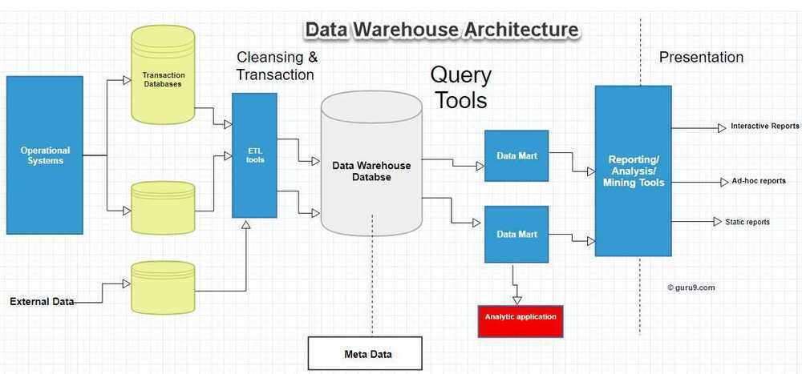

# Concepts

The data warehouse is based on an RDBMS server which is a central information repository that is surrounded by some key components to make the entire environment functional, manageable and accessible

There are mainly five components of Data Warehouse:

## Data Warehouse Database

The central database is the foundation of the data warehousing environment. This database is implemented on the RDBMS technology. Although, this kind of implementation is constrained by the fact that traditional RDBMS system is optimized for transactional database processing and not for data warehousing. For instance, ad-hoc query, multi-table joins, aggregates are resource intensive and slow down performance.

Hence, alternative approaches to Database are used as listed below-

- In a datawarehouse, relational databases are deployed in parallel to allow for scalability. Parallel relational databases also allow shared memory or shared nothing model on various multiprocessor configurations or massively parallel processors.
- New index structures are used to bypass relational table scan and improve speed.
- Use of multidimensional database (MDDBs) to overcome any limitations which are placed because of the relational data model. Example: Essbase from Oracle.

## Sourcing, Acquisition, Clean-up and Transformation Tools (ETL)

The data sourcing, transformation, and migration tools are used for performing all the conversions, summarizations, and all the changes needed to transform data into a unified format in the datawarehouse. They are also called Extract, Transform and Load (ETL) Tools.
Their functionality includes:

- Anonymize data as per regulatory stipulations.
- Eliminating unwanted data in operational databases from loading into Data warehouse.
- Search and replace common names and definitions for data arriving from different sources.
- Calculating summaries and derived data
- In case of missing data, populate them with defaults.
- De-duplicated repeated data arriving from multiple datasources.

These Extract, Transform, and Load tools may generate cron jobs, background jobs, Cobol programs, shell scripts, etc. that regularly update data in datawarehouse. These tools are also helpful to maintain the Metadata.

These ETL Tools have to deal with challenges of Database & Data heterogeneity.

## Metadata

The name Meta Data suggests some high- level technological concept. However, it is quite simple. Metadata is data about data which defines the data warehouse. It is used for building, maintaining and managing the data warehouse.

In the Data Warehouse Architecture, meta-data plays an important role as it specifies the source, usage, values, and features of data warehouse data. It also defines how data can be changed and processed. It is closely connected to the data warehouse.
For example, a line in sales database may contain:

4030 KJ732 299.90

This is a meaningless data until we consult the Meta that tell us it was

- Model number: 4030
- Sales Agent ID: KJ732
- Total sales amount of $299.90

Therefore, Meta Data are essential ingredients in the transformation of data into knowledge.
Metadata helps to answer the following questions

- What tables, attributes, and keys does the Data Warehouse contain?
- Where did the data come from?
- How many times do data get reloaded?
- What transformations were applied with cleansing?

Metadata can be classified into following categories:

- **Technical Meta Data:** This kind of Metadata contains information about warehouse which is used by Data warehouse designers and administrators.
- **Business Meta Data:** This kind of Metadata contains detail that gives end-users a way easy to understand information stored in the data warehouse.

## Query Tools

One of the primary objects of data warehousing is to provide information to businesses to make strategic decisions. Query tools allow users to interact with the data warehouse system.

#### Reporting tools

Reporting tools can be further divided into production reporting tools and desktop report writer.

1. Report writers: This kind of reporting tool are tools designed for end-users for their analysis.

2. Production reporting: This kind of tools allows organizations to generate regular operational reports. It also supports high volume batch jobs like printing and calculating. Some popular reporting tools are Brio, Business Objects, Oracle, PowerSoft, SAS Institute.- Managed query tools

This kind of access tools helps end users to resolve snags in database and SQL and database structure by inserting meta-layer between users and database.

#### Application Development tools

Sometimes built-in graphical and analytical tools do not satisfy the analytical needs of an organization. In such cases, custom reports are developed using Application development tools.

#### Data mining tools

Data mining is a process of discovering meaningful new correlation, pattens, and trends by mining large amount data. Data mining tools are used to make this process automatic.

#### OLAP tools

These tools are based on concepts of a multidimensional database. It allows users to analyse the data using elaborate and complex multidimensional views.

## Data warehouse Bus Architecture

Data warehouse Bus determines the flow of data in your warehouse. The data flow in a data warehouse can be categorized as Inflow, Upflow, Downflow, Outflow and Meta flow.

While designing a Data Bus, one needs to consider the shared dimensions, facts across data marts.

## Data warehouse Architecture Best Practices

To design Data Warehouse Architecture, you need to follow below given best practices:

- Use a data model which is optimized for information retrieval which can be the dimensional mode, denormalized or hybrid approach.
- Need to assure that Data is processed quickly and accurately. At the same time, you should take an approach which consolidates data into a single version of the truth.
- Carefully design the data acquisition and cleansing process for Data warehouse.
- Design a MetaData architecture which allows sharing of metadata between components of Data Warehouse
- Consider implementing an ODS model when information retrieval need is near the bottom of the data abstraction pyramid or when there are multiple operational sources required to be accessed.
- One should make sure that the data model is integrated and not just consolidated. In that case, you should consider 3NF data model. It is also ideal for acquiring ETL and Data cleansing tools

https://www.guru99.com/data-warehouse-architecture.html
