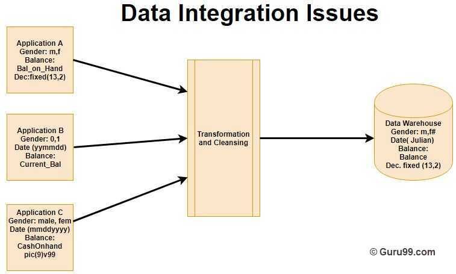

# Characteristics

## Characteristics of Data warehouse

A data warehouse has following characteristics:

- Subject-Oriented
- Integrated
- Time-variant
- Non-volatile

## Subject-Oriented

A data warehouse is subject oriented as it offers information regarding a theme instead of companies' ongoing operations. These subjects can be sales, marketing, distributions, etc.
A data warehouse never focuses on the ongoing operations. Instead, it put emphasis on modeling and analysis of data fordecision making. It also provides a simple and concise view around the specific subject by excluding data which not helpful to support the decision process.

## Integrated

In Data Warehouse, integration means the establishment of a common unit of measure for all similar data from the dissimilar database. The data also needs to be stored in the Datawarehouse in common and universally acceptable manner.
A data warehouse is developed by integrating data from varied sources like a mainframe, relational databases, flat files, etc. Moreover, it must keep consistent naming conventions, format, and coding.
This integration helps in effective analysis of data. Consistency in naming conventions, attribute measures, encoding structure etc. have to be ensured. Consider the following example:

In the above example, there are three different application labeled A, B and C. Information stored in these applications are Gender, Date, and Balance. However, each application's data is stored different way.

- In Application A gender field store logical values like M or F
- In Application B gender field is a numerical value,
- In Application C application, gender field stored in the form of a character value.
- Same is the case with Date and balance
However, after transformation and cleaning process all this data is stored in common format in the Data Warehouse.

## Time-Variant

The time horizon for data warehouse is quite extensive compared with operational systems. The data collected in a data warehouse is recognized with a particular period and offers information from the historical point of view. It contains an element of time, explicitly or implicitly.
One such place where Datawarehouse data display time variance is in in the structure of the record key. Every primary key contained with the DW should have either implicitly or explicitly an element of time. Like the day, week month, etc.
Another aspect of time variance is that once data is inserted in the warehouse, it can't be updated or changed.

## Non-volatile

Data warehouse is also non-volatile means the previous data is not erased when new data is entered in it.
Data is read-only and periodically refreshed. This also helps to analyze historical data and understand what & when happened. It does not require transaction process, recovery and concurrency control mechanisms.
Activities like delete, update, and insert which are performed in an operational application environment are omitted in Data warehouse environment. Only two types of data operations performed in the Data Warehousing are

- Data loading

- Data access
Here, are some major differences between Application and Data Warehouse

| **Operational Application**                                                                                                    | **Data Warehouse**                                                        |
|--------------------------------------------|----------------------------|
| Complex program must be coded to make sure that data upgrade processes maintain high integrity of the final product.           | This kind of issues does not happen because data update is not performed. |
| Data is placed in a normalized form to ensure minimal redundancy.                                                              | Data is not stored in normalized form.                                    |
| Technology needed to support issues of transactions, data recovery, rollback, and resolution as its deadlock is quite complex. | It offers relative simplicity in technology.                              |
https://www.guru99.com/data-warehouse-architecture.html
