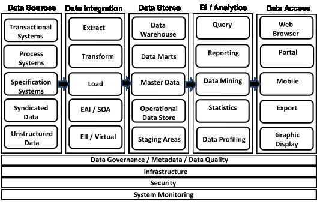

# Architecture

There are mainly three types of Datawarehouse Architectures: -

## Single-tier architecture

The objective of a single layer is to minimize the amount of data stored. This goal is to remove data redundancy. This architecture is not frequently used in practice.

## Two-tier architecture

Two-layer architecture separates physically available sources and data warehouse. This architecture is not expandable and also not supporting a large number of end-users. It also has connectivity problems because of network limitations.

## Three-tier architecture

This is the most widely used architecture.
It consists of the Top, Middle and Bottom Tier.

- **Bottom Tier:** The database of the Datawarehouse servers as the bottom tier. It is usually a relational database system. Data is cleansed, transformed, and loaded into this layer using back-end tools.

- **Middle Tier:** The middle tier in Data warehouse is an OLAP server which is implemented using either ROLAP or MOLAP model. For a user, this application tier presents an abstracted view of the database. This layer also acts as a mediator between the end-user and the database.

- **Top-Tier:** The top tier is a front-end client layer. Top tier is the tools and API that you connect and get data out from the data warehouse. It could be Query tools, reporting tools, managed query tools, Analysis tools and Data mining tools.

## Architecture Components

## Data Warehouse Tech Stack

| **ITEM** | **DESCRIPTION** |
|---|---|
| **Metadata Repository** | A software tool that contains data that describes other data. Here are the two kinds of metadata: business metadata and technical metadata. |
| **Data Modeling Tool** | A software tool that enables the design of data and databases through graphical means. This tool provides a detailed design capability that includes the design of tables, columns, relationships, rules, and business definitions. |
| **Data Profiling Tool** | A software tool that supports understanding data through exploration and comparison. This tool accesses the data and explores it, looking for patterns such as typical values, outlying values, ranges, and allowed values. It is meant to help you better understand the content and quality of the data. |
| **Data Integration Tools** | ETL (extract, transfer & load) tools, as well as realtime integration tools like the ESB (enterprise service bus) software tools. These tools copy data from place to place and also scrub and clean the data. |
| **RDBMS (Relational Database Management System)** | Software that stores data in a relational format using SQL (Structured Query Language). This is really the Database system that is going to maintain robust data and store it. It is also important to the expandability of the system. |
| **MOLAP (Multidimensional OLAP)** | Database software designed for data mart-type operations. This software organizes data into multiple dimensions, known as "cubes," to support analytics. |
| **Big Data Store** | Software that manages huge amounts of data (relational databases, for example) that other types of software cannot. This Big Data tends to be unstructured and consists of text, images, video, and audio. |
| **Reporting and Query Tools** | Business-intelligence software tools that select data through query and present it as reports and/or graphical displays. The business or analyst will be able to explore the data-exploration sanction. These tools also help produce reports and outputs that are desired and needed to understand the data. |
| **Data Mining Tools** | Software tools that find patterns in stores of data or databases. These tools are useful for predictive analytics and optimization analytics. |

## More (dzone refcardz) -

- Data
- Data Modeling
- Normalized Data
- Atomic Data Warehouse
- Supporting Tables
- Dimensional Database
- Facts
- Dimension
- Data Integration
    - Extract Transform Load (ETL)
    - Extract Load Transform (ELT)
    - Change Data Capture (CDC)
