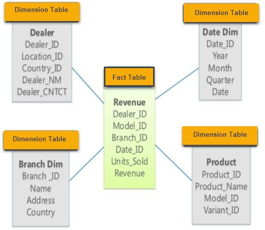
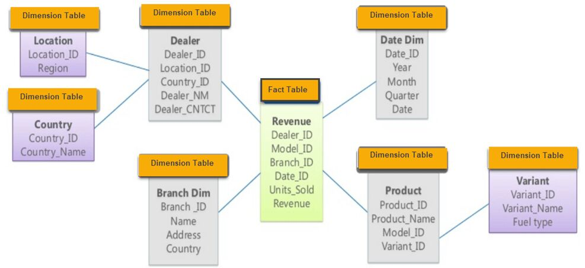
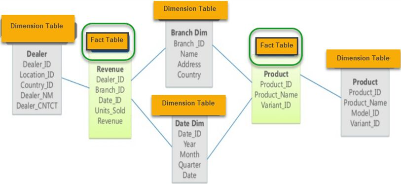
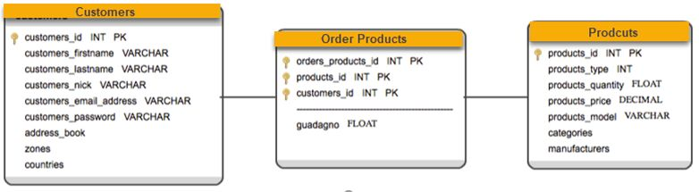

# Warehouse Schemas

Multidimensional schema is especially designed to model data warehouse systems. The schemas are designed to address the unique needs of very large databases designed for the analytical purpose (OLAP).

## Types of Data Warehouse Schema

- Star Schema
- Snowflake Schema
- Galaxy Schema
- Star Cluster Schema

## What is a Star Schema?

In the Star Schema, the center of the star can have one fact table and a number of associated dimension tables. It is known as star schema as its structure resembles a star. The star schema is the simplest type of Data Warehouse schema. It is also known as Star Join Schema and is optimized for querying large data sets.

Star schema is a mature modeling approach widely adopted by relational data warehouses. It requires modelers to classify their model tables as either dimension or fact.

### Example of Star Schema

For example, as you can see in the above-given image that fact table is at the center which contains keys to every dimension table like Dealer_ID, Model ID, Date_ID, Product_ID, Branch_ID & other attributes like Units sold and revenue.

### Characteristics of Star Schema

- Every dimension in a star schema is represented with the only one-dimension table
- The dimension table should contain the set of attributes
- The dimension table is joined to the fact table using a foreign key
- The dimension table are not joined to each other
- Fact table would contain key and measure
- The Star schema is easy to understand and provides optimal disk usage
- The dimension tables are not normalized. For instance, in the above figure, Country_ID does not have Country lookup table as an OLTP design would have
- The schema is widely supported by BI Tools

[**https://docs.microsoft.com/en-us/power-bi/guidance/star-schema**](https://docs.microsoft.com/en-us/power-bi/guidance/star-schema)

Book - The Data Warehouse Toolkit: The Definitive Guide to Dimensional Modeling(3rd edition, 2013) by Ralph Kimball et al

## What is a Snowflake Schema?

A Snowflake Schema is an extension of a Star Schema, and it adds additional dimensions. It is called snowflake because its diagram resembles a Snowflake.

The dimension tables are normalized which splits data into additional tables. In the following example, Country is further normalized into an individual table.

### Characteristics of Snowflake Schema

- The main benefit of the snowflake schema it uses smaller disk space.
- Easier to implement when  a dimension is added to the schema
- Due to multiple tables query performance is reduced
- The primary challenge that you will face while using the snowflake schema is that you need to perform more maintenance efforts because of the more lookup tables.

## Star Vs Snowflake Schema: Key Differences

| **Star Schema** | **Snow Flake Schema** |
|---|---|
| Hierarchies for the dimensions are stored in the dimensional table. | Hierarchies are divided into separate tables. |
| It contains a fact table surrounded by dimension tables. | One fact table surrounded by dimension table which are in turn surrounded by dimension table |
| In a star schema, only single join creates the relationship between the fact table and any dimension tables. | A snowflake schema requires many joins to fetch the data. |
| Simple DB Design. | Very Complex DB Design. |
| Denormalized Data structure and query also run faster. | Normalized Data Structure. |
| High level of Data redundancy | Very low-level data redundancy |
| Single Dimension table contains aggregated data. | Data Split into different Dimension Tables. |
| Cube processing is faster. | Cube processing might be slow because of the complex join. |
| Offers higher performing queries using Star Join Query Optimization. Tables may be connected with multiple dimensions. | The Snow Flake Schema is represented by centralized fact table which unlikely connected with multiple dimensions. |

## What is a Galaxy schema?

A Galaxy Schema contains two fact table that shares dimension tables. It is also called Fact Constellation Schema. The schema is viewed as a collection of stars hence the name Galaxy Schema.

As you can see in above figure, there are two facts table - Revenue & Product

In Galaxy schema shared dimensions are called **Conformed Dimensions.**

### Characteristics of Galaxy Schema

- The dimensions in this schema are separated into separate dimensions based on the various levels of hierarchy.
- For example, if geography has four levels of hierarchy like region, country, state, and city then Galaxy schema should have four dimensions.
- Moreover, it is possible to build this type of schema by splitting the one-star schema into more Star schemes.
- The dimensions are large in this schema which is needed to build based on the levels of hierarchy.
- This schema is helpful for aggregating fact tables for better understanding.

## What is Star Cluster Schema?

Snowflake schema contains fully expanded hierarchies. However, this can add complexity to the Schema and requires extra joins. On the other hand, star schema contains fully collapsed hierarchies, which may lead to redundancy. So, the best solution may be a balance between these two schemas which is star cluster schema design.

Overlapping dimensions can be found as forks in hierarchies. A fork happens when an entity acts as a parent in two different dimensional hierarchies. Fork entities then identified as classification with one-to-many relationships.

## Summary

- Multidimensional schema is especially designed to model data warehouse systems
- The star schema is the simplest type of Data Warehouse schema.
- A Snowflake Schema is an extension of a Star Schema, and it adds additional dimensions.
- In a star schema, only single join creates the relationship between the fact table and any dimension tables.
- Star schema contains a fact table surrounded by dimension tables.
- Snow flake schema is surrounded by dimension table which are in turn surrounded by dimension table
- A snowflake schema requires many joins to fetch the data.
- A Galaxy Schema contains two fact table that shares dimension tables. It is also called Fact Constellation Schema.
- Star cluster schema contains attributes of Star schema and Slow flake schema.

https://www.guru99.com/star-snowflake-data-warehousing.html

https://www.geeksforgeeks.org/difference-between-star-schema-and-snowflake-schema
