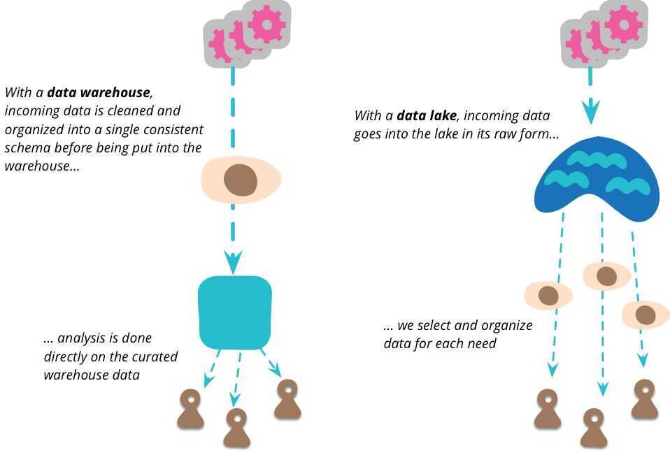

# Data Lake

Also called Data Swamp

The idea is to have a single store for all of the raw data that anyone in an organization might need to analyze. Commonly people use Hadoop to work on the data in the lake.

The data lake stores *raw* data, in whatever form the data source provides. There is no assumptions about the schema of the data, each data source can use whatever schema it likes. It's up to the consumers of that data to make sense of that data for their own purposes.

It is important that all data put in the lake should have a clear provenance in place and time. Every data item should have a clear trace to what system it came from and when the data was produced.
The data lake is schemaless
|                 | **Data Lake**                                                                   | **Data Warehouse**                                                                |
|----------|-------------------------------|--------------------------------|
| **Type of data** | Unstructured and structured data from various company data sources              | Historical data that has been structured to fit a relational database schema      |
| **Purpose**      | Cost-effective big data storage                                                 | Analytics for business decisions                                                  |
| **Analytics**    | Machine learning, predictive analytics, data discovery, and profiling           | Batch reporting, BI, and visualizations                                           |
| **Users**        | Data scientists and engineers                                                   | Data analysts and business analysts                                               |
| **Tasks**        | Storing data and big data analytics, like deep learning and real-time analytics | Typically read-only queries for aggregating and summarizing data                  |
| **Size**         | Stores all data that might be used - can take up petabytes!                     | Only stores data relevant to analysis                                             |
|                 | Seperation of compute and storage                                               | Tightly coupled compute and storage                                               |
|                 | Designed prior to the data warehouse implementation **(Schema on read**)        | Written at the time of analysis **(Schema on write**)                             |
|                 | Great for storing granular data; raw as well as processed data                  | Great for storing frequently accessed data as well as data aggregates and summary |
| **Data Quality** | Any data that may or may not be curated (i.e., raw data)                        | Highly curated data that serves as the central version of the truth               |

## References

<https://martinfowler.com/bliki/DataLake.html>
