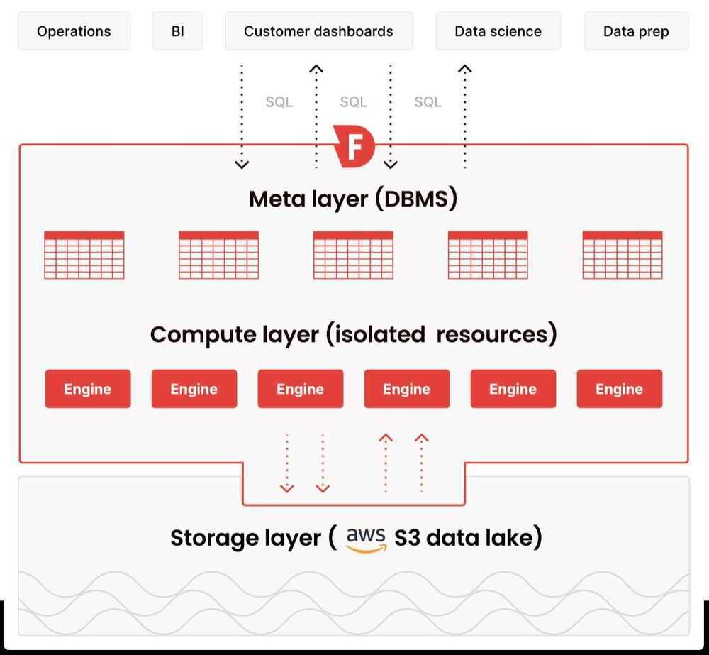

# DW - Databases

1. SnowFlake
2. AWS Redshift
3. Snowflake
4. AWS Athena
5. Google BigQuery
6. Elastic
7. Hadoop
8. Druid/Impy
9. MemSQL
10. Presto
11. FireBolt

## A new class of cloud data warehouses built for AWS

Firebolt has completely redesigned the cloud data warehouse to deliver a super fast, incredibly efficient analytics experience at any scale

Firebolt's serverless architecture connects to your S3 data lake as its data source and to the entire data ecosystem using standard SQL as its destination

