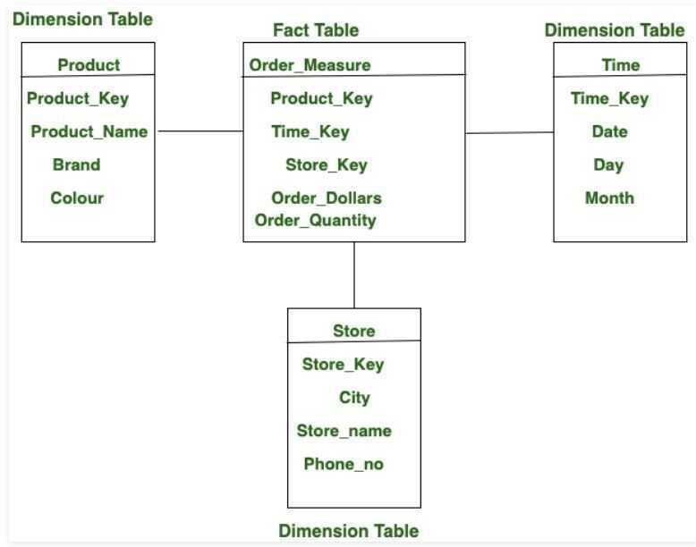

# Fact / Dimension Tables

## Fact tables

Typically contain point-in-time transactional data. Each row in the table can be extremely simple and is often represented as a unit of transaction. Because of their simplicity, they are often the source of truth tables from which business metrics are derived. For example, fact tables that track transaction-like events such as bookings, reservations, alterations, cancellations, and more.

Fact tables store observations or events, and can be sales orders, stock balances, exchange rates, temperatures, etc. A fact table contains dimension key columns that relate to dimension tables, and numeric measure columns. The dimension key columns determine thedimensionalityof a fact table, while the dimension key values determine the granularity of a fact table. For example, consider a fact table designed to store sale targets that has two dimension key columns **Date** and **ProductKey**. It's easy to understand that the table has two dimensions. The granularity, however, can't be determined without considering the dimension key values. In this example, consider that the values stored in the Date column are the first day of each month. In this case, the granularity is at month-product level

## Dimension tables

Typically contain slowly changing attributes of specific entities, and attributes sometimes can be organized in a hierarchical structure. These attributes are often called "dimensions", and can be joined with the fact tables, as long as there is a foreign key available in the fact table. Ex - dimension tables such as users, listings, and markets that can help to slice and dice data.

Dimension tables describe business entities - thethingsyou model. Entities can include products, people, places, and concepts including time itself. The most consistent table you'll find in a star schema is a date dimension table. A dimension table contains a key column (or columns) that acts as a unique identifier, and descriptive columns

- Dimension tables support filtering and grouping
- Fact tables support summarization

## Fact table vs Dimension table

| **Fact Table** | **Dimension Table** |
|---|---|
| Fact table contains the measuring on the attributes of a dimension table. | Dimension table contains the attributes on that truth table calculates the metric. |
| In fact table, There is less attributes than dimension table. | While in dimension table, There is more attributes than fact table. |
| In fact table, There is more records than dimension table. | While in dimension table, There is less records than fact table. |
| Fact table forms a vertical table. | While dimension table forms a horizontal table. |
| The attribute format of fact table is in numerical format and text format. | While the attribute format of dimension table is in text format. |
| It comes after dimension table. | While it comes before fact table. |
| The number of fact table is less than dimension table in a schema. | While the number of dimension is more than fact table in a schema. |
| It is used for analysis purpose and decision making. | While the main task of dimension table is to store the information about a business and its process. |

<https://www.geeksforgeeks.org/difference-between-fact-table-and-dimension-table>
