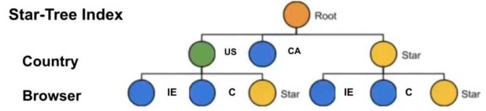

# Database Index

A database index is a [data structure](https://en.wikipedia.org/wiki/Data_structure) that improves the speed of data retrieval operations on a [database table](https://en.wikipedia.org/wiki/Table_(database)) at the cost of additional writes and storage space to maintain the index data structure. Indexes are used to quickly locate data without having to search every row in a database table every time a database table is accessed. Indexes can be created using one or more [columns of a database table](https://en.wikipedia.org/wiki/Column_(database)), providing the basis for both rapid random [lookups](https://en.wikipedia.org/wiki/Lookup) and efficient access of ordered records.

An index is a copy of selected columns of data from a table that can be searched very efficiently that also includes a low-level disk block address or direct link to the complete row of data it was copied from. Some databases extend the power of indexing by letting developers create indexes on functions or [expressions](https://en.wikipedia.org/wiki/Expression_(programming)). For example, an index could be created on upper(last_name), which would only store the upper-case versions of the last_name field in the index. Another option sometimes supported is the use of [partial indices](https://en.wikipedia.org/wiki/Partial_index), where index entries are created only for those records that satisfy some conditional expression. A further aspect of flexibility is to permit indexing on [user-defined functions](https://en.wikipedia.org/wiki/User-defined_function), as well as expressions formed from an assortment of built-in functions.

## Types of indexes

### Bitmap index

A bitmap index is a special kind of indexing that stores the bulk of its data as [bit arrays](https://en.wikipedia.org/wiki/Bit_array) (bitmaps) and answers most queries by performing [bitwise logical operations](https://en.wikipedia.org/wiki/Bitwise_operation) on these bitmaps. The most commonly used indexes, such as [B+ trees](https://en.wikipedia.org/wiki/B%2B_tree), are most efficient if the values they index do not repeat or repeat a small number of times. In contrast, the bitmap index is designed for cases where the values of a variable repeat very frequently. For example, the sex field in a customer database usually contains at most three distinct values: male, female or unknown (not recorded). For such variables, the bitmap index can have a significant performance advantage over the commonly used trees.

### Dense index

A dense index in [databases](https://en.wikipedia.org/wiki/Database) is a [file](https://en.wikipedia.org/wiki/Computer_file) with pairs of keys and [pointers](https://en.wikipedia.org/wiki/Pointer_(computer_programming)) for every [record](https://en.wikipedia.org/wiki/Record_(computer_science)) in the data file. Every key in this file is associated with a particular pointer toa recordin the sorted data file. In clustered indices with duplicate keys, the dense index pointsto the first recordwith that key.

### Sparse index

A sparse index in databases is a file with pairs of keys and pointers for every [block](https://en.wikipedia.org/wiki/Block_(data_storage)) in the data file. Every key in this file is associated with a particular pointerto the blockin the sorted data file. In clustered indices with duplicate keys, the sparse index pointsto the lowest search keyin each block.

### Reverse index

A reverse-key index reverses the key value before entering it in the index. E.g., the value 24538 becomes 83542 in the index. Reversing the key value is particularly useful for indexing data such as sequence numbers, where new key values monotonically increase.
It is an index of keywords that stores records of documents that contain keywords in the list.

Use Case - Create a complete Tweet index.

https://en.wikipedia.org/wiki/Database_index

[Why this query is fast](https://youtu.be/HinCxBt6mNY)

### Partial Index

A partial index can save space by specifying which values get indexed.

A partial index is an index built over a subset of a table; the subset is defined by a conditional expression (called the predicate of the partial index). The index contains entries only for those table rows that satisfy the predicate. Partial indexes are a specialized feature, but there are several situations in which they are useful.

One major reason for using a partial index is to avoid indexing common values. Since a query searching for a common value (one that accounts for more than a few percent of all the table rows) will not use the index anyway, there is no point in keeping those rows in the index at all. This reduces the size of the index, which will speed up those queries that do use the index. It will also speed up many table update operations because the index does not need to be updated in all cases.

```sql
CREATE INDEX orders_completed_user_id
ON orders (user_id)
WHERE completed IS TRUE;
```

https://www.postgresql.org/docs/12/indexes-partial.html

[How Instagram efficiently serves HashTags ordered by count - YouTube](https://www.youtube.com/watch?v=CA2_0ZhVW2g&ab_channel=AsliEngineeringbyArpitBhayani)

## Tips

- B Tree / B+ Tree index is not good for columns with low cardinality (since it's create a full tree for the columns)
- BitMap index is good for low cardinality columns

## Index Data Structures

Search engine architectures vary in the way indexing is performed and in methods of index storage to meet the various design factors.

### [Suffix tree](https://en.wikipedia.org/wiki/Suffix_tree)

Figuratively structured like a tree, supports linear time lookup. Built by storing the suffixes of words. The suffix tree is a type of [trie](https://en.wikipedia.org/wiki/Trie). Tries support [extendible hashing](https://en.wikipedia.org/wiki/Extendible_hashing), which is important for search engine indexing.Used for searching for patterns in [DNA](https://en.wikipedia.org/wiki/DNA) sequences and clustering. A major drawback is that storing a word in the tree may require space beyond that required to store the word itself.An alternate representation is a [suffix array](https://en.wikipedia.org/wiki/Suffix_array), which is considered to require less virtual memory and supports data compression such as the [BWT](https://en.wikipedia.org/wiki/Burrows-Wheeler_transform) algorithm.

### [Inverted index](https://en.wikipedia.org/wiki/Inverted_index)

Stores a list of occurrences of each atomic search criterion, typically in the form of a [hash table](https://en.wikipedia.org/wiki/Hash_table) or [binary tree](https://en.wikipedia.org/wiki/Binary_tree).

### [Citation index](https://en.wikipedia.org/wiki/Citation_index)

Stores citations or hyperlinks between documents to support citation analysis, a subject of [bibliometrics](https://en.wikipedia.org/wiki/Bibliometrics).

### [Ngram index](https://en.wikipedia.org/wiki/N-gram)

Stores sequences of length of data to support other types of retrieval or [text mining](https://en.wikipedia.org/wiki/Text_mining).

### [Document-term matrix](https://en.wikipedia.org/wiki/Document-term_matrix)

Used in latent semantic analysis, stores the occurrences of words in documents in a two-dimensional [sparse matrix](https://en.wikipedia.org/wiki/Sparse_matrix).

### Star Tree Index

Allows us to maintain pre-aggregated values for some combination of dimensions example country and browser in below example. Incredible fast lookup.



https://engineering.linkedin.com/blog/2019/06/star-tree-index--powering-fast-aggregations-on-pinot

https://docs.pinot.apache.org/basics/indexing/star-tree-index

https://en.wikipedia.org/wiki/Search_engine_indexing

## Others

[Understanding database Indexes in PostgreSQL](https://mastermind.dev/indexes-in-postgresql)
