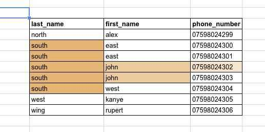
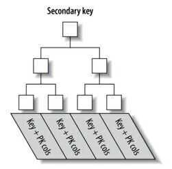

# MySQL Indexing

## Important Points / Keep in mind / Gotchas

- The primary key is already an index
    - We can't have a Primary Key column with a NULL value.
- Using composite indexes is vital if you're trying to speed up a particular query
- Index order is very VERY important
- Avoid performing file sorts
- In a B-Tree the index is sorted first by the leftmost column, then by the next column, and so on
- https://dev.mysql.com/doc/refman/5.7/en/table-scan-avoidance.html
- https://dev.mysql.com/doc/refman/5.7/en/where-optimization.html
- use index hints

## You should never make these mistakes again

- Avoid using functions in predicates
- Avoid using a wildcard (%) at the beginning of a predicate (The predicate LIKE**'%abc'**causes a full table scan.)
- Avoid unnecessary columns in SELECT clause
- The ORDER BY clause is mandatory in SQL if you expect to get a sorted result
- Not taking advantage of indexed top-N queries
- Choosing a poor column order in multi-column indexes
- Inefficient use of like filters
- Not using index-only scans
- FullText index is not always used

#### Use inner join, instead of outer join if possible

Use outer join only when it is necessary. Using it needlessly not only limits database performance but also limits MySQL query optimization options, resulting in slower execution of SQL statements.

#### Use DISTINCT and UNION only if it is necessary

Using UNION and DISTINCT operators without any major purpose causes unwanted sorting and slowing down of SQL execution. Instead of UNION, using UNION ALL brings more efficiency in the process and improves MySQL performance more precisely.

Furthermore: typically MySQL will only use one index, per table, per query, so things are going to be much more performant if we design a single index to satisfy our lookup!

A multiple column (composite) index to the rescue!:

To speed this up, we can sort our list by last name and then by first name.

```sql
ALTER TABLE `phonebook` ADD INDEX (`last_name`, `first_name`);

SELECT phone_number FROM phonebook where first_name = 'john' AND last_name = 'south';
```



As an example: the index we've just discussed `(last_name, first_name)` would not be beneficial for a query such as:

`SELECT * FROM phonebook where first_name = 'Donald';`

This is because we haven't specified any criteria for the last_name. The index we built doesn't sort first names in any logical distribution that would allow us to quickly search through them, so instead, we must fall back to a full table scan. (refer back to the example pic above).

### Online Create Index

In MySQL 5.6 and higher, the table remains available for read and write operations while the index is being created or dropped. The CREATE INDEX or DROP INDEX statement only finishes after all transactions that are accessing the table are completed, so that the initial state of the index reflects the most recent contents of the table. Previously, modifying the table while an index is being created or dropped typically resulted in a deadlock that cancelled the INSERT, UPDATE, or DELETE statement on the table.

## Examples

```sql
INDEX (last, first)
  § WHERE last = … *** Good
  § WHERE last = … AND first = … *** Good
  § WHERE first = … AND last = … *** Good
  § WHERE first = … *** Index Useless

INDEX (a, b) VS INDEX (b, a)
  § WHERE a = 1 AND b = 3 *** Both work well
  § WHERE b = 2 *** Second only
  § WHERE a = 4 *** First only

INDEX(a), INDEX(b) Is not the same as INDEX(a,b)

But using the two indexes (a),(b) can benefit from:
(SELECT … WHERE A …) UNION (SELECT … WHERE B …)
```

## clustered index

The InnoDB term for a primary key index. InnoDB table storage is organized based on the values of the primary key columns, to speed up queries and sorts involving the primary key columns. For best performance, choose the primary key columns carefully based on the most performance-critical queries. Because modifying the columns of the clustered index is an expensive operation, choose primary columns that are rarely or never updated.

In the Oracle Database product, this type of table is known as anindex-organized table.

## Relationship between Primary Key & Clustered Index

You can't create a clustered index manually using InnoDB in MySQL. MySQL chooses it for you. But how does it choose? The following excerpts are from MySQL documentation:

When you define a `PRIMARY KEY` on your table, InnoDB uses it as the clustered index. Define a primary key for each table that you create. If there is no logical unique and non-null column or set of columns, add a new [auto-increment](https://dev.mysql.com/doc/refman/5.7/en/glossary.html#glos_auto_increment) column, whose values are filled in automatically.

If you do not define a PRIMARY KEY for your table, MySQL locates the first UNIQUE index where all the key columns are NOT NULL and InnoDB uses it as the clustered index.

If the table has no PRIMARY KEY or suitable UNIQUE index, InnoDB internally generates a hidden clustered index named GEN_CLUST_INDEX on a synthetic column containing row ID values. The rows are ordered by the ID that InnoDB assigns to the rows in such a table. The row ID is a 6-byte field that increases monotonically as new rows are inserted. Thus, the rows ordered by the row ID are physically in insertion order.

In short, the MySQL InnoDB engine actually manages the primary index as clustered index for improving performance, so the primary key & the actual record on disk are clustered together.

## secondary index

A type of InnoDB index that represents a subset of table columns. An InnoDB table can have zero, one, or many secondary indexes. (Contrast with the clustered index, which is required for each InnoDB table, and stores the data for all the table columns.)

A secondary index can be used to satisfy queries that only require values from the indexed columns. For more complex queries, it can be used to identify the relevant rows in the table, which are then retrieved through lookups using the clustered index.

Creating and dropping secondary indexes has traditionally involved significant overhead from copying all the data in the InnoDB table. The fast index creation feature makes both CREATE INDEX and DROP INDEX statements much faster for InnoDB secondary indexes.

## search index

In MySQL, full-text search queries use a special kind of index, the FULLTEXT index. In MySQL 5.6.4 and up, InnoDB and MyISAM tables both support FULLTEXT indexes; formerly, these indexes were only available for MyISAM tables.

By default MySQL will ignore any word that is in 50% or more of the rows in the table as it considers it would be a 'noise' word.

With very few rows in a table, it is common to hit this 50% limit often (ie. if you have two rows, every word is in at least 50% of the rows!).

There are two modes for MySQL Fulltext searching: natural language mode and Boolean mode. A restriction of natural language mode is " ... words that are present in 50% or more of the rows are considered common and do not match. Full-text searches are natural language searches if no modifier is given." And natural language is the default mode.

https://stackoverflow.com/questions/1125678/mysql-fulltext-not-working

https://dev.mysql.com/doc/refman/5.7/en/innodb-index-types.html

## Primary Key Indexes - MySQL

- Because the clustered index "is" the table in InnoDB, it's important that you choose a suitable primary key, as this key will be used often, and restructuring can be very expensive.
- Non-sequential primary keys could lead to fragmentation issues. Causing page splits and disk fragmentations that lead to overheads in I/O operations.
- You should strive to insert data in primary key order when using InnoDB, and you should try to use a clustering key that will give a monotonically increasing values for each new row. This will ensure that rows are inserted in sequential order and will offer better performance for joins using primary keys.

### Disadvantages of Primary Index

Since the primary index contains a direct reference to the data block address through the virtual address space & disk blocks are physically organized in the order of the index key, every time the OS does some disk page split due toDMLoperations likeINSERT/UPDATE/DELETE, the primary index also needs to be updated. SoDMLoperations puts some pressure on the performance of the primary index.

## Secondary Indexes

Obviously there can only be one clustered index - because you can't store the row data in two places at once; Therefore secondary indexes (any indexes we apply that aren't the primary) are not clustered, and are in fact separate structures to the table itself.
The leaf nodes for secondary indexes don't store row data as the Primary Key B-Tree did, instead they simply store Primary Key values which serve as "pointers" to the row data, as you can see below:



This typically means when utilizing a secondary index, InnoDB will first use the B-Tree of the secondary index to retrieve the Primary Key values of the applicable rows, and then after use these values in conjunction with the Primary Key B-tree to fetch the row data!

### Disadvantages of a Secondary Index

With DML operations like DELETE/INSERT, the secondary index also needs to be updated so that the copy of the primary key column can be deleted / inserted. In such cases, the existence of lots of secondary indexes can create issues.

Also, if a primary key is very large like aURL, since secondary indexes contain a copy of the primary key column value, it can be inefficient in terms of storage. More secondary keys means a greater number of duplicate copies of the primary key column value, so more storage in case of a large primary key. Also the primary key itself stores the keys, so the combined effect on storage will be very high. Because the Primary Key is appended to every secondary index in innoDB, don't pick huge PK's. Ideally keep them short so that it doesn't take up too much memory, and remember all data will be clustered onto this primary key; Therefore a bulky Primary Key will lead to bulky secondary indexes.

Slow, It should be quite obvious that this additional lookup to follow the Primary Key 'pointer' from the secondary index has some overhead, it's still quick because the primary key is indexed, but this is where the 'covering index' optimization comes into play

## UNIQUE Key Index

Like primary keys, unique keys can also identify records uniquely with one difference - the unique key column can containnullvalues.

Unlike other database servers, in MySQL a unique key column can have as many null values as possible. In SQL standard, null means an undefined value. So if MySQL has to contain only one null value in a unique key column, it has to assume that all null values are the same.

But logically this is not correct sincenullmeans undefined - and undefined values can't be compared with each other, it's the nature ofnull. As MySQL can't assert if allnulls mean the same, it allows multiplenullvalues in the column.
The following command shows how to create a unique key index in MySQL:

`CREATE UNIQUE INDEX unique_idx_1 ON index_demo (pan_no);`

## Composite Index

MySQL lets you define indices on multiple columns, up to 16 columns. This index is called a Multi-column / Composite / Compound index.

Let's say we have an index defined on 4 columns -col1,col2,col3,col4. With a composite index, we have search capability oncol1,(col1, col2),(col1, col2, col3),(col1, col2, col3, col4). So we can use any left side prefix of the indexed columns, but we can't omit a column from the middle & use that like ---(col1, col3)or(col1, col2, col4) or col3 or col4 etc. These are invalid combinations.

The following commands create 2 composite indexes in our table:

`CREATE INDEX composite_index_1 ON index_demo (phone_no, name, age);`

`CREATE INDEX composite_index_2 ON index_demo (pan_no, name, age);`

If you have queries containing aWHEREclause on multiple columns, write the clause in the order of the columns of the composite index. The index will benefit that query. In fact, while deciding the columns for a composite index, you can analyze different use cases of your system & try to come up with the order of columns that will benefit most of your use cases.

Composite indices can help you in JOIN & SELECT queries as well. Example: in the following SELECT * query, composite_index_2 is used.

When several indexes are defined, the MySQL query optimizer chooses that index which eliminates the greatest number of rows or scans as few rows as possible for better efficiency.

### Why do we use composite indices? Why not define multiple secondary indices on the columns we are interested in?

MySQL uses only one index per table per query except for UNION.(In a UNION, each logical query is run separately, and the results are merged.) So defining multiple indices on multiple columns does not guarantee those indices will be used even if they are part of the query.

MySQL maintains something called index statistics which helps MySQL infer what the data looks like in the system. Index statistics is a generilization though, but based on this meta data, MySQL decides which index is appropriate for the current query.

### How does composite index work?

The columns used in composite indices are concatenated together, and those concatenated keys are stored in sorted order using a B+ Tree. When you perform a search, concatenation of your search keys is matched against those of the composite index. Then if there is any mismatch between the ordering of your search keys & ordering of the composite index columns, the index can't be used.

In our example, for the following record, a composite index key is formed by concatenating pan_no, name, age - HJKXS9086Wkousik28.

| name     | kousik     |
|----------|------------|
| age      | 28         |
| pan_no   | HJKXS9086W |
| phone_no | 9090909090 |

### How to identify if you need a composite index

- Analyze your queries first according to your use cases. If you see certain fields are appearing together in many queries, you may consider creating a composite index.
- If you are creating an index incol1& a composite index in (col1,col2), then only the composite index should be fine.col1alone can be served by the composite index itself since it's a left side prefix of the index.
- Consider cardinality. If columns used in the composite index end up having high cardinality together, they are good candidate for the composite index.

## Covering Index

A covering index is a special kind of composite index where all the columns specified in the query somewhere exist in the index. So the query optimizer does not need to hit the database to get the data - rather it gets the result from the index itself. Example: we have already defined a composite index on (pan_no, name, age), so now consider the following query:

`SELECT age FROM index_demo WHERE pan_no = 'HJKXS9086W' AND name = 'kousik'`

The columns mentioned in the SELECT & WHERE clauses are part of the composite index. So in this case, we can actually get the value of the age column from the composite index itself. Let's see what the EXPLAIN command shows for this query:

`EXPLAIN FORMAT=JSON SELECT age FROM index_demo WHERE pan_no = 'HJKXS9086W' AND name = '111kousik1';`

In the response, note that there is a key -using_indexwhich is set totruewhich signifies that the covering index has been used to answer the query.

If your secondary index holds all the data needed to satisfy your query (it 'covers' it) then you don't need to follow the Primary Key values to fetch any additional data!

## Partial Index

We already know that Indices speed up our queries at the cost of space. The more indices you have, the more the storage requirement. We have already created an index called `secondary_idx_1` on the columnname. The column name can contain large values of any length. Also in the index, the row locators' or row pointers' metadata have their own size. So overall, an index can have a high storage & memory load.

In MySQL, it's possible to create an index on the first few bytes of data as well. Example: the following command creates an index on the first 4 bytes of name. Though this method reduces memory overhead by a certain amount, the index can't eliminate many rows, since in this example the first 4 bytes may be common across many names. Usually this kind of prefix indexing is supported on CHAR, VARCHAR,BINARY, VARBINARY type of columns.

`CREATE INDEX secondary_index_1 ON index_demo (name(4));`

## What happens under the hood when we define an index?

Let's run the SHOW EXTENDED command again:

`SHOW EXTENDED INDEXES FROM index_demo;`

We defined secondary_index_1 on name, but MySQL has created a composite index on (name,phone_no) where phone_no is the primary key column. We created secondary_index_2 on age & MySQL created a composite index on (age,phone_no). We created composite_index_2 on (pan_no, name, age) & MySQL has created a composite index on (pan_no,name, age, phone_no). The composite index composite_index_1 already has phone_no as part of it.

So whatever index we create, MySQL in the background creates a backing composite index which in-turn points to the primary key. This means that the primary key is a first class citizen in the MySQL indexing world. It also proves that all the indexes are backed by a copy of the primary index -but I am not sure whether a single copy of the primary index is shared or different copies are used for different indexes.

There are many other indices as well like Spatial index and Full Text Search index offered by MySQL. I have not yet experimented with those indices, so I'm not discussing them in this post.

## How Indexes Affect `ORDER and GROUP BY`

Another often overlooked factor is how indexes can be used during ordering and grouping!

Say you've only got an index on(last_name)in your phone book, and you run the query:

`SELECT * FROM phone_book WHERE last_name = 'Simpson'ORDER BY first_name`

This will use the last_name index as you'd hope to quickly narrow down the records with that last name, sadly you now need to perform a sort on these resulting records in order to get them sorted by first name. This is because the index didn't sort the results by first_name in any meaningful way.

This is known as a **File Sort:** a sort that occurs after the query; it requires fetching the data into a temporary buffer and sorting it before finally returning. This wouldn't have been needed if the data was already sorted by the index in the way you wanted!

This also applies even If you only wanted to read 5 rows. Say you ran the following:

`SELECT last_name FROM phonebook WHERE first_name='Homer' ORDER BY last_name LIMIT 5;`

You'll still be fetching thousands of records, sorting them, and only after this, returning the top 5 while discarding the rest of the records you spent time processing.

This also applies to GROUP BY statements. if we ran the following query with this composite index onlast_name and first_name:

`SELECT * FROM phonebook WHERE last_name = 'Burns' GROUP BY first_name`

The records would already be sorted bylast_name, allowing us to quickly filter down the records with thelast_name'Burns'. After these results are returned they are also then sorted byfirst_namedue to the second part of the index, and so they are intrinsically already grouped for us! We wouldn't need to perform any additional sorting at the end which would add further overheads to our query.

INDEX (a,b)

- ORDER BY a ASC, b ASC*** Good
- ORDER BY a DESC, B DESC*** Good
- ORDER BY a ASC, b DESC*** Cannot use index

## Range Queries

Similar to what we've just said with the prefix rule, the second you use a range query on a column in your index you reach as far as you can utilize this index. This should make sense, if you issued a range query such as:

`SELECT * FROM phonebook WHERE last_name LIKE 'f%' AND first_name ='Ned';ADD INDEX (last_name, first_name, phone_number)`

This would utilize the first part (last_name) of our index, allowing us to quickly satisfy the range conditional and find all rows with thelast_namebeginning with 'f'; however after this, there isn't any way our B-Tree can be further utilized to quickly filter onfirst_name.

If you're utilizing an index for range queries, try make sure the column you're performing the range over is ordered last within the index

Similarly, you can't use an index fully to perform range queries on two columns for the points already mentioned.- You may need to have indexes on the same columns in different orders depending on your queries.

- Try use as many columns as possible up to the first range of the query - after a range no other index column can be used. So put the index that is likely to be ranged right at the end.

## Index Condition Pushdown

Index push down essentially allows us to push index conditions down to the database engine so that it doesn't have to return irrelevant rows that would only be filtered out later by MySQL.
This means in some cases we can still use an index past a range condition. It's best to test and see the results for yourself, but regardless of the situation, you'll be most effective if you're able to leave range columns towards the end of your index. ICP will be most useful for when you have no choice.

## Prefix ranges?

`SELECT ... WHERE last_name LIKE "%mithers"`

This isn't a range, we can't use a B-Tree to traverse this obviously. Imagine yourself being at the root of a tree with such a query, do you go left or right? You don't know! This is exactly why we can use an index to support such a query.

## Examples

### INDEX (a, b) VS INDEX (b, a)

- WHERE a = 1 AND b > 3*** First is better
- WHERE b = 5 AND b > 7*** Second is better
- WHERE a > 1 AND b > 3*** Each stops after 1st Column
- WHERE b = 2*** Second only
- WHERE b > 2*** Second only
- WHERE a = 4*** First only
- WHERE a > 4*** First only

### INDEX (a, b, c)

- WHERE a > 1 AND b =3 AND c = 4*** Uses only first part of index
- WHERE a = 1 AND b > 3 AND c = 4*** Uses first 2 parts of index
- WHERE a = 1 AND b = 3 AND c = 4*** Uses all of index

In general all of the below could leave an index unusable:

- !=
- less than equal to operator
- NOT LIKE, NOT IN...
- NOT EXISTS ( SELECT * ... ) - essentially a LEFT JOIN, often efficient
- NOT (expression)

## Don't use functions in your queries

MySQL generally can't use indexes on columns unless the columns are isolated in the query. So don't use functions or expressions in your queries.

The second you do func(column) on left you can't use the index and a full table scan will occur.

Examples:

- WHERE id+3 = 4;*** BAD
- Bad: WHERE start_date + INTERVAL 1 YEAR > NOW()*** BAD
- WHERE YEAR(start_date) = 2015 AND MONTH(start_date) = 1*** BAD
- Where number +0 = 5;*** BAD
- WHERE func(number) = n;*** BAD
- WHERE number = 5+4;*** GOOD
- WHERE number = func(n);*** GOOD
- WHERE start_date > NOW() - INTERVAL 1 YEAR*** GOOD
- WHERE start_date BETWEEN "2015--01--01" AND "2015--01--31"*** GOOD

## Redundant indexes

Over indexing can hurt performance due to overheads

The drawback of having too many indexes is the maintenance cost.

Adding new indexes might have a performance impact for INSERT, UPDATE, and DELETE operations, especially if a new index causes you to hit memory limits.

Every time you perform a write on a table, the indexes will need to be maintained. Furthermore when you run a query, each index must be considered by the MySQL Optimizer.

- If there is an index on (A, B), adding another index (A) would be redundant because it is a prefix of the first index. That is, the index on (A, B) can already be used as an index for column A alone.
- If there is an index on (A, PK_ID). The PK_ID column as you already know is already included if you're using InnoDB, so it's redundant, luckily it won't add it twice so you are safe to do it, you just don't need too.

The only time we want redundant indexes is when extending an existing index makes it much larger and thus reduces performance!

You can easily see which indexes are redundant, especially those that have never been used, by querying the INFORMATION_SCHEMA database.
That being said don't be afraid to add indexes that will actually be used! In a read heavy application the costs will be negligible. It's best to test whether an index is beneficial out for yourself!

## Index Merge

When i said MySQL only uses one index, per query, per table, most of the times this is true! However, sometimes MySQL does in fact have the capabilities to use multiple single column indexes.

For example: it could use several indexes to fetch primary key values, and then perform a union or intersection depending on the query. These are useful in situations where you cannot form a suitable multicolumn index e.g. in the case of several 'OR' conditionals in your query.

However it is rare that these are actually used, and if you are able to form a suitable multicolumn index then you should, because this will typically outperform a merge index

## Index not used

- Sometimes MySQL does not use an index, even if one is available. One circumstance under which this occurs is when the optimizer estimates that using the index would require MySQL to access a very large percentage of the rows in the table. (In this case, a table scan is likely to be much faster because it requires fewer seeks.) However, if such a query uses LIMIT to retrieve only some of the rows, MySQL uses an index anyway, because it can much more quickly find the few rows to return in the result.
- **MySQL will not use indexes if you query the wrong data type (if field is VARCHAR but you are passing integer), but works other way around i.e. index is used in an integer column if you pass string in where column, but you must always use the correct data type while querying**
- The OR operator in filtering conditions

Consider this query:

`select a,b from tbl where a=3 or b=8;`

In many cases, MySQL won't be able to use an index to apply an OR condition, and as a result, this query is not indexable.

Therefore, we recommend to avoid such OR conditions and consider splitting the query to two parts, combined with a UNION DISTINCT (or even better, UNION ALL, in case you know there won't be any duplicate results)

## General Indexing guidelines

- Since indices consume extra memory, carefully decide how many & what type of index will suffice your need.
- With DML operations, indices are updated, so write operations are quite costly with indexes. The more indices you have, the greater the cost. Indexes are used to make read operations faster. So if you have a system that is write heavy but not read heavy, think hard about whether you need an index or not.
- Cardinality is important - cardinality means the number of distinct values in a column. If you create an index in a column that has low cardinality, that's not going to be beneficial since the index should reduce search space. Low cardinality does not significantly reduce search space. Example: if you create an index on a boolean (int1or0only ) type column, the index will be very skewed since cardinality is less (cardinality is 2 here). But if this boolean field can be combined with other columns to produce high cardinality, go for that index when necessary.
- Indices might need some maintenance as well if old data still remains in the index. They need to be deleted otherwise memory will be hogged, so try to have a monitoring plan for your indices.

```sql
-- show cardinality of a table
SHOW INDEXES FROM table_name;
```

- [**https://medium.com/@stormanning/mysql-indexing-101-660f3193dde1**](https://medium.com/@stormanning/mysql-indexing-101-660f3193dde1)
- https://dev.mysql.com/doc/refman/8.0/en/mysql-indexes.html
- https://dev.mysql.com/doc/refman/8.0/en/optimization-indexes.html
- https://www.freecodecamp.org/news/database-indexing-at-a-glance-bb50809d48bd
- [**https://dev.mysql.com/doc/refman/8.0/en/optimization-indexes.html**](https://dev.mysql.com/doc/refman/8.0/en/optimization-indexes.html)

## Unused indexes

`select count(*) from sys.schema_unused_indexes;`

https://www.eversql.com/how-to-find-unused-indexes-in-a-mysql-database

## Full table scans

```sql
select * from sys.x$statements_with_full_table_scans;`

select * from sys.`x$statement_analysis`;

select * from sys.`x$statements_with_runtimes_in_95th_percentile`;
```

## Rebuilding or Repairing Tables or Indexes

Methods for rebuilding a table include

- [Dump and Reload Method](https://dev.mysql.com/doc/refman/8.0/en/rebuilding-tables.html#rebuilding-tables-dump-reload)
- [ALTER TABLE Method](https://dev.mysql.com/doc/refman/8.0/en/rebuilding-tables.html#rebuilding-tables-alter-table)
- [REPAIR TABLE Method](https://dev.mysql.com/doc/refman/8.0/en/rebuilding-tables.html#rebuilding-tables-repair-table)

https://dev.mysql.com/doc/refman/8.0/en/rebuilding-tables.html

## MySQL 8.0 - Invisible Index

Invisible indexes make it possible to test the effect of removing an index on query performance, without making a destructive change that must be undone should the index turn out to be required. Dropping and re-adding an index can be expensive for a large table, whereas making it invisible and visible are fast, in-place operations.

https://dev.mysql.com/doc/refman/8.0/en/invisible-indexes.html
