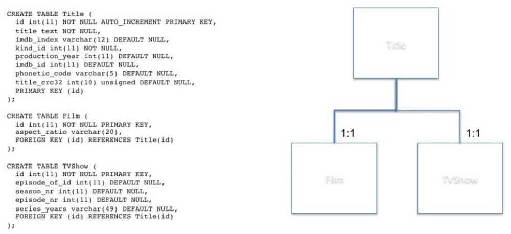

# Data Modeling

Data modeling in [software engineering](https://en.wikipedia.org/wiki/Software_engineering) is the process of creating a [data model](https://en.wikipedia.org/wiki/Data_model) for an [information system](https://en.wikipedia.org/wiki/Information_system) by applying certain formal techniques

The data modeling process. The figure illustrates the way data models are developed and used today . A [conceptual data model](https://en.wikipedia.org/wiki/Conceptual_schema) is developed based on the data [requirements](https://en.wikipedia.org/wiki/Requirement) for the application that is being developed, perhaps in the context of an [activity model](https://en.wikipedia.org/wiki/Activity_diagram). The data model will normally consist of entity types, attributes, relationships, integrity rules, and the definitions of those objects. This is then used as the start point for interface or database design.

https://en.wikipedia.org/wiki/Data_modeling

Data modeling (data modelling) is the process of creating a data model for the data to be stored in a Database. This data model is a conceptual representation of Data objects, the associations between different data objects and the rules. Data modeling helps in the visual representation of data and enforces business rules, regulatory compliances, and government policies on the data. Data Models ensure consistency in naming conventions, default values, semantics, security while ensuring quality of the data.

Data model emphasizes on what data is needed and how it should be organized instead of what operations need to be performed on the data. Data Model is like architect's building plan which helps to build a conceptual model and set the relationship between data items.
The two types of Data Models techniques are

1. Entity Relationship (E-R) Model
2. UML (Unified Modelling Language)

## Why use Data Model?

The primary goal of using data model are:

- Ensures that all data objects required by the database are accurately represented. Omission of data will lead to creation of faulty reports and produce incorrect results.
- A data model helps design the database at the conceptual, physical and logical levels.
- Data Model structure helps to define the relational tables, primary and foreign keys and stored procedures.
- It provides a clear picture of the base data and can be used by database developers to create a physical database.
- It is also helpful to identify missing and redundant data.
- Though the initial creation of data model is labor and time consuming, in the long run, it makes your IT infrastructure upgrade and maintenance cheaper and faster.

## Types of Data Models

There are mainly three different types of data models:

- **Conceptual:** This Data Model defines **WHAT** the system contains. This model is typically created by Business stakeholders and Data Architects. The purpose is to organize, scope and define business concepts and rules.

- **Logical:** Defines **HOW** the system should be implemented regardless of the DBMS. This model is typically created by Data Architects and Business Analysts. The purpose is to developed technical map of rules and data structures.

- **Physical:** This Data Model describes **HOW** the system will be implemented using a specific DBMS system. This model is typically created by DBA and developers. The purpose is actual implementation of the database.

https://www.guru99.com/data-modelling-conceptual-logical.html

## Tenets of NoSQL Data Modeling

- Understand the use case
    - Nature of the application
        - OLTP/OLAP/DSS (Decision Support System)
        - Define the Entity-Relationship Model
        - Identify Data Life Cycle
            - TTL, Backup/Archival, etc
- Define the access patterns
    - Read/Write workloads
        - Identify data sources
        - Define query aggregations
        - Document all workflows
- NoSQL Data Model is not flexible (it's efficient)
- Data-modeling
    - Avoid relational design patterns, use one table
        - 1 application service = 1 table
            - Reduce round trips
            - Simplify access patterns
        - Identify primary keys
            - How will items be inserted and read?
            - Overload items into partitions
        - Define indexes for secondary access patterns
- Review -> Repeat -> Review

https://www.toptal.com/data-modeling/interview-questions

## Schema

From a very simple point of view, a relational database comprises *tables* with multiple *columns* and *rows*, and *relationships* between them. The collection of database objects' definitions associated within a certain namespace is called a *schema*. You can also consider a schema to be the definition of your data structures within your database.

Just as our data changes over time with Data Manipulation Language (DML) statements, so does our schema. We need to add more tables, add and remove columns, and so on. The process of evolving our database structure over time is called *schema evolution*.

Schema evolution uses Data Definition Language (DDL) statements to transition the database structure from one version to the other. The set of statements used in each one of these transitions is called *database migrations*, or simply *migrations*.- Migrating to Microservices Databases, Chapter 3, Evolving your Relational Database

## Extensible Data Modeling

Designing an extensible, flexible schema that supports user customization is a common requirement, but it's easy to paint yourself into a corner.
Examples of extensible database requirements:

- A database that allows users to declare new fields on demand.
- Or an e-commerce catalog with many products, each with distinct attributes.
- Or a content management platform that supports extensions for custom data.

The solutions we use to meet these requirements is overly complex and the performance is terrible. How should we find the right balance between schema and schemaless database design?

I'll briefly cover the disadvantages of Entity-Attribute-Value (EAV), a problematic design that's an example of the antipattern called the Inner-Platform Effect, That is, modeling an attribute-management system on top of the RDBMS architecture, which already provides attributes through columns, data types, and constraints.

Then we'll discuss the pros and cons of alternative data modeling patterns, with respect to developer productivity, data integrity, storage efficiency and query performance, and ease of extensibility.

- Class Table Inheritance
- Serialized BLOB
- Inverted Indexing

### Extensibility

- How can we add new attributes without the pain of schema changes?
- Especially to support user-defined attributes at runtime or after deployment

**Solutions**

#### Extra Columns

#### Entity-Attribute-Value

Store each attribute in a row instead of a column

#### Class Table Inheritance

- Some attributes apply to all, other attributes apply to one subtype or the other
- Title table

#### Title table with subtype tables

#### Pros

- Best to support a finite set of subtypes, which are likely unchanging after creation
- Data types and contraints work normally
- Easy to create or drop subtype tables
- Easy to query attributes common to all subtypes
- Subtype tables are shorter, indexes are smaller

#### Cons

- Adding one entry takes two INSERT statements
- Querying attributes of subtypes requires a join
- Querying all types with subtype attributes requires multiple joins (as many as subtypes)
- Adding a common attribute locks a large table
- Ading an attribute to a populated subtype locks a smaller table- Serialized LOB & Inverted Indexes

### Others

- Online Schema Changes
- Non-relational databases

## Links

- [Extensible Data Modeling](https://www.slideshare.net/billkarwin/extensible-data-modeling)
- [erwin Data Modeler | Industry-Leading Data Modeling Tool | erwin, Inc.](https://www.erwin.com/products/erwin-data-modeler/)
- [Advanced Data Modeling For Financial Services And Insurance (APAC Timezone) | MongoDB](https://www.mongodb.com/resources/solutions/industries/webinar-data-modeling-financial-services-insurance-apac)
