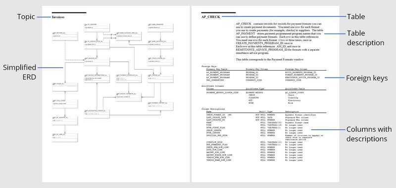

# ER - Tools

https://drawsql.app (Great)

https://drawsql.app/templates

https://dbdiagram.io

https://dbdiagram.io/d/60354600fcdcb6230b212562

https://dataedo.com

[~~https://drawerd.com/~~](https://drawerd.com/)

https://dbdocs.io

https://erdplus.com

https://dbschema.com (local, no web)

https://sqldbm.com (Best but too costly)

https://www.quickdatabasediagrams.com

## Oracle EBS docs (Oracle E-Business Suite)

Oracle E-Business Suite (EBS) applications technical documentation. EBS is an ERP application for enterprises with huge database (24 thousand tables). Its documentation is broken down to application (a module), each having its own document. Each document hasHigh Level Design and Detailed Design.
High Level Design has a list of small diagrams each showing entities and relationships between them of one aspect/topic of the module. Diagrams only include primary key columns.
Low level design section includes a list of tables with a description of their purpose, definition of foreign keys and a list of columns with the description of their purpose.

Data warehouse included many tables from multiple modules (accounts payable, accounts receivable, general ledger, projects, purchasing, inventory and a few more) and this documentation can save weeks or months of figuring out where the data was, the purpose of columns, how to join tables, or which views to use.

https://www.dbml.org

DBML (Database Markup Language)is an open-source DSL language designed to define and document database schemas and structures. It is designed to be simple, consistent and highly-readable.
