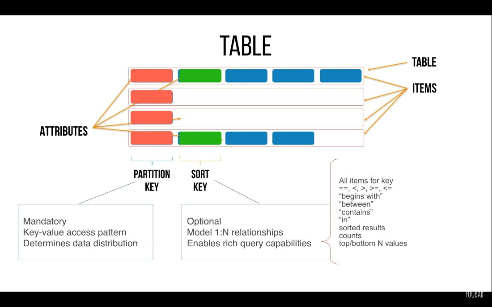
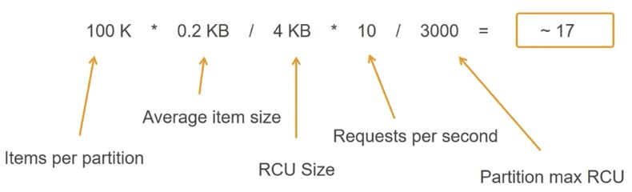

# Working

## DynamoDB Item Sizes

DynamoDB tables are schemaless, except for the primary key, so the items in a table can all have different attributes, sizes, and data types.

The total size of an item is the sum of the lengths of its attribute names and values. You can use the following guidelines to estimate attribute sizes:

- Strings are Unicode with UTF-8 binary encoding. The size of a string is(length of attribute name) + (number of UTF-8-encoded bytes).
- Numbers are variable length, with up to 38 significant digits. Leading and trailing zeroes are trimmed. The size of a number is approximately(length of attribute name) + (1 byte per two significant digits) + (1 byte).
- A binary value must be encoded in base64 format before it can be sent to DynamoDB, but the value's raw byte length is used for calculating size. The size of a binary attribute is(length of attribute name) + (number of raw bytes).
- The size of a null attribute or a Boolean attribute is(length of attribute name) + (1 byte).
- An attribute of typeListorMaprequires 3 bytes of overhead, regardless of its contents. The size of aListorMapis(length of attribute name) + sum (size of nested elements) + (3 bytes). The size of an emptyListorMapis(length of attribute name) + (3 bytes).

https://docs.aws.amazon.com/amazondynamodb/latest/developerguide/CapacityUnitCalculations.html

## Scan vs Query

A query operation searches only primary key attribute values and supports a subset of comparison operators on key attribute values to refine the search process.

Getqueryyou are using a primary key inwherecondition, The computation complexity islog(n)as the most of key structure is binary tree.
A scan operation scans the entire table. You can specify filters to apply to the results to refine the values returned to you, after the complete scan.

whilescanquery you have to scan whole table then apply filter on every singlerowto find the right result. The performance isO(n). Its much slower if your table is big.
Also, think about the global secondary index to support a different kind of queries on different keys to gain performance objective

https://stackoverflow.com/questions/43452219/what-is-the-difference-between-scan-and-query-in-dynamodb-when-use-scan-query

https://medium.com/@amos.shahar/dynamodb-query-vs-scan-sql-syntax-and-join-tables-part-1-371288a7cb8f

## Working

Read capacity unit (RCU)

Write capacity unit (WCU)

Replicated write capacity unit (rWCU)- One **read capacity unit** represents one strongly consistent read per second, or two eventually consistent reads per second, for items up to 4 KB in size. If you need to read an item that is larger than 4 KB, DynamoDB will need to consume additional read capacity units. The total number of read capacity units required depends on the item size, and whether you want an eventually consistent or strongly consistent read.

- One **write capacity unit** represents one write per second for items up to 1 KB in size. If you need to write an item that is larger than 1 KB, DynamoDB will need to consume additional write capacity units. The total number of write capacity units required depends on the item size.

- Secondary Indexes
    - Local secondary indexes
    - Global secondary indexes (asynchronous)

https://aws.amazon.com/dynamodb/pricing/provisioned

## NoSQL Data Modeling

- Normalized vs De-normalized schema

## Common NoSQL Design Patterns

- Composite Keys
- Hierarchical Data
- Relational Data
- Query Filters
- Sparse Indexes

## Vertical Partitioning

- Large items
- Filters vs indexes
- M:N modeling - inbox and outbox

## Modeling Real Applications

- Partitions are 3 way replicated
    - Acknowledgement when 2 out of 3 replicas acknowledges
- Local Secondary Indexes
    - allows you to resort the data in the partition
- Global Secondary Indexes

## Selecting a partition key

- Large number of distinct values
- Items are uniformly requested and randomly distributed
- Examples
    - Bad: Status, Gender
    - Good: CustomerId, DeviceId

## Selecting a sort key

- Model 1:n and n:n relationships
- Efficient/selective patterns
    - Query multiple entities
- Leverage range queries
- Examples
    - Orders and OrderItems- Composite Keys
- Multi-value Sorts and Filters
- DynamoDB Transactions API
    - Transact WriteItems
        - Synchronous update, put, delete, and check
            - Atomic
            - Automated Rollbacks
        - Up to 10 items within a transaction
        - Supports multiple tables
        - Complex conditional checks
    - Good use cases
        - Commit changes across items
        - Conditional batch inserts/updates
    - Bad use case
        - Maintaining normalized data

## Advanced Data Modeling

- How OLTP Apps use data
    - Mostly hierarchical structures
    - Entity driven workflows
    - Data spread across tables
    - Requires complex queries
    - Primary driver for ACID

[AWS re:Invent 2018: Amazon DynamoDB Deep Dive: Advanced Design Patterns for DynamoDB (DAT401)](https://www.youtube.com/watch?v=HaEPXoXVf2k)

## Write Sharding (Shard write-heavy partition keys)

- If there are a lot of writes coming in, then create different partitions and randomly add data to partitions
    - Insert "CandidateA_" + rand(0, 10)
- Scatter gather pattern for shard aggregation
- Increase throughput with concurrency
- Consider RCU/WCU per key, item size and request rate
- **Important when:** your write workload is not horizontally scalable

## Calculating partition counts (reads)

## Time-based workflows

Processing the entire table efficiently

## Adjacency lists and materialized graphs

- Partition table on node ID, add edges to define adjacency list
- Define a default edge for every node type to describe the node itself
- Use partitioned GSIs to query large nodes (dates, places, etc.)
- Use DynamoDB Streams/Lambda/EMR for graph query projections
    - Neighbor entity state
    - Subtree aggregations
    - Breadth first search
    - Node ranking

[AWS re:Invent 2019: [REPEAT 1] Amazon DynamoDB deep dive: Advanced design patterns (DAT403-R1)](https://www.youtube.com/watch?v=6yqfmXiZTlM)
