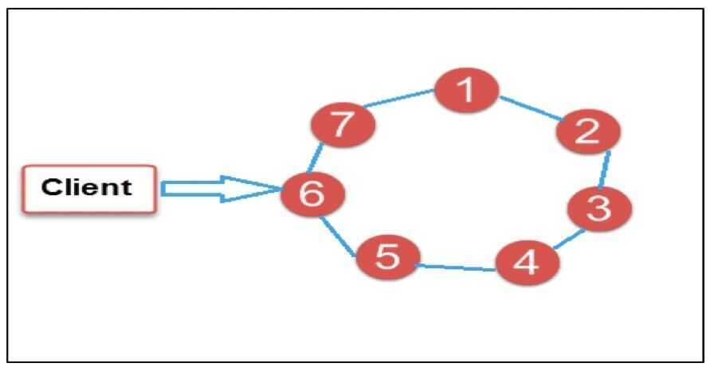

# Cassandra

Apache Cassandra is a [free and open-source](https://en.wikipedia.org/wiki/Free_and_open-source_software), [distributed](https://en.wikipedia.org/wiki/Distributed_database), [wide column store](https://en.wikipedia.org/wiki/Wide_column_store), [NoSQL](https://en.wikipedia.org/wiki/NoSQL)[database](https://en.wikipedia.org/wiki/Database) management system designed to handle large amounts of data across many [commodity servers](https://en.wikipedia.org/wiki/Commodity_computing), providing high availability with no [single point of failure](https://en.wikipedia.org/wiki/Single_point_of_failure). Cassandra offers robust support for [clusters](https://en.wikipedia.org/wiki/Computer_cluster) spanning multiple datacenters, with asynchronous masterless replication allowing low latency operations for all clients.

- Intented to run in a datacenter (and also across DCs)
- Originally designed at Facebook
- Open-sourced later, today an Apache project
- Is a highly scalable, distributed and high-performance NoSQL database. Cassandra is designed to handle a huge amount of data
- Cassandra handles the huge amount of data with its distributed architecture
- Data is placed on different machines with more than one replication factor that provides high availability and no single point of failure

Under hood cassandra uses **consistent hashing to shard your data** and also use **gossiping to keep all the nodes informed about the cluster.**

## Features

#### Distributed columnar data store

Every node in the cluster has the same role. There is no single point of failure. Data is distributed across the cluster (so each node contains different data), but there is no master as every node can service any request.

#### Supports replication and multi data center replication

Replication strategies are configurable. Cassandra is designed as a distributed system, for deployment of large numbers of nodes across multiple data centers. Key features of Cassandra's distributed architecture are specifically tailored for multiple-data center deployment, for redundancy, for failover and disaster recovery.

#### Scalability

Designed to have read and write throughput both increase linearly as new machines are added, with the aim of no downtime or interruption to applications.

#### Fault-tolerant (No single point of failure)

Data is automatically replicated to multiple nodes for [fault-tolerance](https://en.wikipedia.org/wiki/Fault-tolerance).[Replication](https://en.wikipedia.org/wiki/Replication_(computer_science)) across multiple data centers is supported. Failed nodes can be replaced with no downtime.

#### Tunable consistency

Cassandra is typically classified as an [AP system](https://en.wikipedia.org/wiki/CAP_theorem), meaning that availability and partition tolerance are generally considered to be more important than consistency in Cassandra, Writes and reads offer a tunable level of [consistency](https://en.wikipedia.org/wiki/Consistency_(database_systems)), all the way from "writes never fail" to "block for all replicas to be readable", with the [quorum level](https://en.wikipedia.org/wiki/Quorum_(distributed_computing)) in the middle.

Can provide both eventual and strong consistency. (Local Quorum - This many nodes must be written out to transaction to be successful)

#### MapReduce support

Cassandra has [Hadoop](https://en.wikipedia.org/wiki/Hadoop) integration, with [MapReduce](https://en.wikipedia.org/wiki/MapReduce) support. There is support also for [Apache Pig](https://en.wikipedia.org/wiki/Pig_(programming_tool)) and [Apache Hive](https://en.wikipedia.org/wiki/Apache_Hive).

#### Query language

Cassandra introduced the Cassandra Query Language (CQL). CQL is a simple interface for accessing Cassandra, as an alternative to the traditional [Structured Query Language](https://en.wikipedia.org/wiki/SQL)(SQL).

#### Others

1. Time-series data
2. Optimized for availability (through tunable consistency)
3. Optimized for writes
4. Easily maintainable
5. Almost infinitely scalable

## Cassandra Data Model

#### KeySpace

A keyspace in Cassandra is a namespace that defines data replication on nodes. A cluster contains one keyspace per node.

#### Column Family

#### Rows

#### Column

#### SuperColumn

https://www.tutorialspoint.com/cassandra/cassandra_data_model.htm

Cassandra is fundamentally a key-value store and distributes data around the cluster by a **PARTITION KEY**, then sorts the data on that partition (or row) by the **CLUSTERING key**. Adding new data to that row is almost free, and updates are handled by marking the previous cell value with a **tombstone** and adding the new value to the row. Eventually, you will need to **compact** these partitions as data becomes fragmented over multiple files, but remember that you are amortizing your INSERTs and UPDATEs over time with almost instantaneous commits. This makes scanning a single partition or row very fast as the disk head only performs a single seek operation. However, if you want more than a single Cassandra partition, performance goes south fairly quickly as **scatter/gather** queries are an **anti-pattern**, and [secondary indexes](https://www.datastax.com/dev/blog/cassandra-native-secondary-index-deep-dive) are only useful in extremely rare and specific occasions. Therefore, when you know what partition you want to scan, and you don't want to do any aggregations, GROUPBYs, or any other more analytical operations, then you are in good shape. The result is that Cassandra is great for small, tightly constrained, well-known queries and high-volume inserts and updates.

## Node

- 6000 - 12000 transactions/second/core
- 2 - 4 TB

### Cassandra vs RDBMS

- On > 50 GB data
- MySQL
    - Writes 300 ms avg
    - Reads 350 ms avg
- Cassandra
    - Writes 0.12 ms avg
    - Reads 15 ms avg

In the image above, circles are Cassandra nodes and lines between the circles shows distributed architecture, while the client is sending data to the node

## Alternative - ScyllaDB

[How Discord Stores Trillions of Messages | Deep Dive - YouTube](https://www.youtube.com/watch?v=xynXjChKkJc)

## References

- [**https://academy.datastax.com/**](https://academy.datastax.com/)
- https://en.wikipedia.org/wiki/Apache_Cassandra
- http://cassandra.apache.org
- https://www.tutorialspoint.com/cassandra/index.htm
- https://www.freecodecamp.org/news/the-apache-cassandra-beginner-tutorial
- [Introduction to Apache Cassandra™ + What's New in 4.0 by Patrick McFadin | DataStax Presents](https://www.youtube.com/watch?v=d7o6a75sfY0)
- [Cassandra Tutorial Videos](https://www.youtube.com/playlist?list=PL9ooVrP1hQOGJ4Yz9vbytkRmLaD6weg8k)
- [How Uber Scaled Cassandra for Tens of Millions of Queries Per Second?](https://blog.bytebytego.com/p/how-uber-scaled-cassandra-for-tens)
