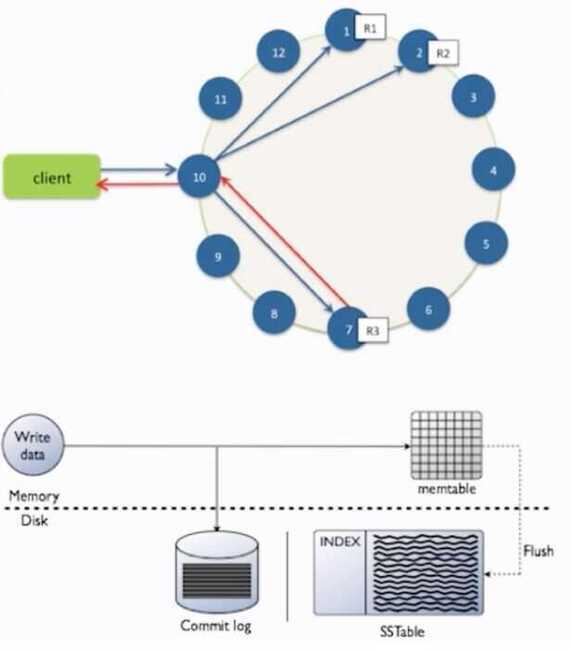
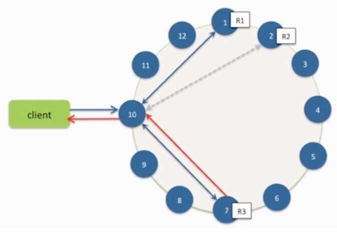

# Working

## Writes

- Need to be lock-free and fast (no reads or disk seeks)
- Client sends write to one coordinator node in Cassandra cluster
    - Coordinator may be per-key, or per-client or per-query
    - Per-key coordinator ensures writes for the key are serialized
- Coordinator uses Partitioner to send query to all replica nodes responsible for key
- When X replicas respond, coordinator returns an acknowledgement to the client

#### Always writable: Hinted Handoff mechanism

- If any replica is down, the coordinator writes to all other replicas, and keeps the write locally until down replica comes back up
- When all replicas are down, the Coordinator (front end) buffers write (for up to a few hours)

#### One ring per datacenter

- Per-DC coordinator elected to coordinate with other DCs
- Election done via Zookeeper, which runs a Paxos (consensus) variant

#### Writes at a replica node

1. Log it in disk commit log (for failure recovery)
2. Make changes to appropriate memtables

- Memtable = In-memory representation of multiple key-value pairs
- Typically append-only datastructure (fast)
- Cache that can be searched by key
- Write-back as opposed to write-through

- Later When memtable is full or old, flush to disk
    - Data File: An SSTable (Sorted String Table) - list of key-value pairs, sorted by key
    - SSTables are immutable (once created, they don't change)
    - Index file: An SSTable of (key, position in data sstable) pairs
    - And a Bloom Filter (for efficient search)

## The Write Path

- Writes are written to any node in the cluster (coordinator)
- Writes are written to commit log, then to memtable
- Every write includes a timestamp
- Memtable flushed to disk periodically (sstable)
- New memtable is created in memory
- Deletes are a special write case, called a "tombstone"

## What is an SSTable

- Immutable data file for row storage
- Every write includes a timestamp of when it was written
- Partition is spread across multiple SSTables
- Same column can be in multiple SSTables
- Merged through compaction, only latest timestamp is kept
- Deletes are written as tombstones
- Easy backups

## The Read Path

- Any server may be queried, it acts as the coordinator
- Contacts nodes with the requested key
- On each node, data is pulled from SSTables and merged
- Consistency < All performs read repair in background (read_repair_chance -default 10% of reads)

### Compaction

- Data updates accumulate over time and SSTables and logs need to be compacted
    - The process of compaction merges SSTables, i.e., by merging updates for a key
    - Run periodically and locally at each server- TimeWindowCompactionStrategy

https://thelastpickle.com/blog/2016/12/08/TWCS-part1.html

## Deletes: don't delete item right away

- Add a tombstone to the log
- Eventually, when compaction encounters tombstone it will delete item

## Reads: Similar to writes, expect

- Coordinator can contact X replicas (e.g., in same rack)
    - Coordinator sends read to replicas that have responded quickest in past
    - When X replicas respond, coordinator returns the latest timestamped value from among those X
- Coordinator also fetches value from other replicas
    - Checks consistency in the background, initiating a read repair if any two values are different
    - This mechanism seeks to eventually bring all replicas up to date
- At a replica
    - A row may be split across SSTables => reads need to touch multiple SSTables => reads slower than writes (but still fast)
