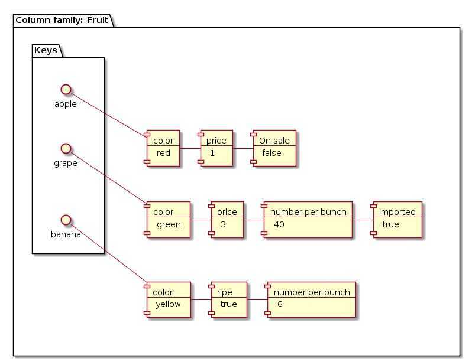

# Column family

Column-family databases, also called non-relational column stores, wide-column databases, or simply column databases, are perhaps the NoSQL type that, on the surface, looks most similar to relational databases. Like relational databases, wide-column databases store data using concepts like rows and columns. However, in wide-column databases, the association between these elements is very different from how relational databases use them.
In relational databases, a schema defines the column layout in a table by specifying what columns the table will have, their respective data types, and other criteria. All of the rows in a table must conform to this fixed schema.

Instead of tables, column-family databases have structures calledcolumn families. Column families contain rows of data, each of which define their own format. A row is composed of a unique row identifier - used to locate the row - followed by sets of column names and values.
With this design, each row in a column family defines its own schema. That schema can be easily modified because it only affects that single row of data. Each row can have different numbers of columns with different types of data. Sometimes it helps to think of column family databases as key-value databases where each key (row identifier) returns a dictionary of arbitrary attributes and their values (the column names and their values).

Column-family databases are good when working with applications that requires great performance for row-based operations and highly scalability. Since all of the data and metadata for an entry is accessible with a single row identifier, no computationally expensive joins are required to find and pull the information. The database system also typically makes sure all of the data in a row is collocated on the same machine in a cluster, simplifying data sharding and scaling.
However, column-family databases do not work well in all scenarios. If you have highly relational data that requires joins, this is not the right type of database for your application. Column-family databases are firmly oriented around row-based operations. This means that aggregate queries like summing, averaging, and other analytics-oriented processes can be difficult or impossible. This can have a great impact on how you design your applications and what types of usage patterns you can use.
Examples:

- [Cassandra](https://cassandra.apache.org/)
- [HBase](https://hbase.apache.org/)
