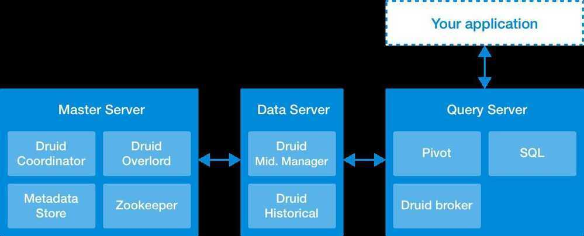
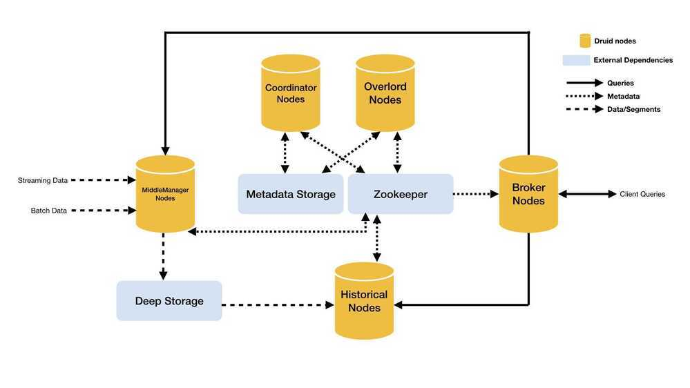

# Architecture

Druid has a multi-process, distributed architecture that is designed to be cloud-friendly and easy to operate. Each Druid process type can be configured and scaled independently, giving you maximum flexibility over your cluster. This design also provides enhanced fault tolerance: an outage of one component will not immediately affect other components.

Druid's process types are:

### [Historical](http://druid.io/docs/latest/design/historical.html)

Historical processes are the workhorses that handle storage and querying on "historical" data (including any streaming data that has been in the system long enough to be committed). Historical processes download segments from deep storage and respond to queries about these segments. They don't accept writes.

- Each Historical process serves up data that has been partitioned into segments. These segments are assigned to Historical by the Coordinator via ZooKeeper
- When a Historical process is assigned a segment, it will copy the file from deep storage to its local storage
- When a query is received from the Broker process, the Historical process returns the results

### [MiddleManager](http://druid.io/docs/latest/design/middlemanager.html)

MiddleManager processes handle ingestion of new data into the cluster. They are responsible for reading from external data sources and publishing new Druid segments.

- The MiddleManager process is a worker process that executes submitted tasks. Middle Managers forward tasks to Peons that run in separate JVMs. The reason we have separate JVMs for tasks is for resource and log isolation. Each [Peon](https://druid.apache.org/docs/latest/design/peons.html) is capable of running only one task at a time, however, a MiddleManager may have multiple Peons.
- During real-time ingestion, the MiddleManager also serves queries on real-time data before it has been pushed to deep storage.
- When a query is received from the Broker process, the MiddleManager process executes that query on real-time data and returns results.

### [Broker](http://druid.io/docs/latest/design/broker.html)

Broker processes receive queries from external clients and forward those queries to Historicals and MiddleManagers. When Brokers receive results from those subqueries, they merge those results and return them to the caller. End users typically query Brokers rather than querying Historicals or MiddleManagers directly.

- Broker process is responsible for knowing the internal state of the cluster (from the ZooKeeper)
- The broker finds out information from ZooKeeper about the Druid cluster
    - Which Historical processes are serving which segments
    - Which MiddleManager processes are serving which tasks' data
    - When a query is run, the Broker will figure out which process to contact

### [Coordinator](http://druid.io/docs/latest/design/coordinator.html)

Coordinator processes watch over the Historical processes. They are responsible for assigning segments to specific servers, and for ensuring segments are well-balanced across Historicals.

- Segment management and distribution
- It communicates with the Historical nodes to:
    - **Load -** Copy a segment from deep storage and start serving it
    - **Drop -** Delete a segment from its local copy and stop serving it

### [Overlord](http://druid.io/docs/latest/design/overlord.html)

Overlord processes watch over the MiddleManager processes and are the controllers of data ingestion into Druid. They are responsible for assigning ingestion tasks to MiddleManagers and for coordinating segment publishing.

- Accepting ingestion supervisors and tasks
- Coordinating which servers run which tasks
- Managing locks so tasks don't conflict with each other
- Returning supervisor and task status to callers

### [Router](http://druid.io/docs/latest/development/router.html)

Router processes are optional processes that provide a unified API gateway in front of Druid Brokers, Overlords, and Coordinators. They are optional since you can also simply contact the Druid Brokers, Overlords, and Coordinators directly.

https://docs.imply.io/cloud/design

Druid processes can be deployed individually (one per physical server, virtual server, or container) or can be colocated on shared servers. One common colocation plan is a three-type plan:

1. **"Data"** servers run Historical and MiddleManager processes.
2. **"Query"** servers run Broker and (optionally) Router processes.
3. **"Master"** servers run Coordinator and Overlord processes. They may run ZooKeeper as well.

In addition to these process types, Druid also has three external dependencies. These are intended to be able to leverage existing infrastructure, where present.

- **[Deep storage](http://druid.io/docs/latest/design/index.html#deep-storage),** shared file storage accessible by every Druid server. This is typically going to be a distributed object store like S3 or HDFS, cassandra, Google Cloud Storage or a network mounted filesystem. Druid uses this to store any data that has been ingested into the system.
- [**Metadata store**](http://druid.io/docs/latest/design/index.html#metadata-storage), shared metadata storage. This is typically going to be a traditional RDBMS like PostgreSQL or MySQL.
- [**ZooKeeper**](http://druid.io/docs/latest/design/index.html#zookeeper) is used for internal service discovery, coordination, and leader election.

The idea behind this architecture is to make a Druid cluster simple to operate in production at scale. For example, the separation of deep storage and the metadata store from the rest of the cluster means that Druid processes are radically fault tolerant: even if every single Druid server fails, you can still relaunch your cluster from data stored in deep storage and the metadata store.

The following diagram shows how queries and data flow through this architecture:

