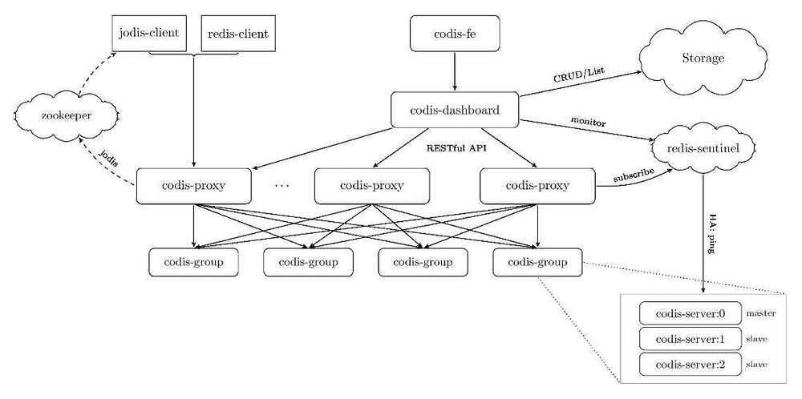

# Redis

## Redis (Remote Dictionary Service)

Redis is an open source (BSD licensed), extremely fast, in-memory data structure store, used as a database, cache and message broker. It can optionally persist to a disk also. It supports different data structures like simple key-value pairs, sets, queues, strings, hashes, lists, sorted sets with range queries, bitmaps, hyprloglogs and geospatial indexes with radis queries. Redis has built-in replication, Lua scripting, LRU eviction, transactions and different levels of on-disk persistence, and provides high availability via Redis Sentinel and automatic partitioning with Redis Cluster

You can run atomic operations on these types, like [appending to a string](https://redis.io/commands/append);[incrementing the value in a hash](https://redis.io/commands/hincrby);[pushing an element to a list](https://redis.io/commands/lpush);[computing set intersection](https://redis.io/commands/sinter), [union](https://redis.io/commands/sunion) and [difference](https://redis.io/commands/sdiff); or [getting the member with highest ranking in a sorted set](https://redis.io/commands/zrangebyscore).

In order to achieve its outstanding performance, Redis works with anin-memory dataset. Depending on your use case, you can persist it either by [dumping the dataset to disk](https://redis.io/topics/persistence#snapshotting) every once in a while, or by [appending each command to a log](https://redis.io/topics/persistence#append-only-file). Persistence can be optionally disabled, if you just need a feature-rich, networked, in-memory cache.

Redis also supports trivial-to-setup [master-slave asynchronous replication](https://redis.io/topics/replication), with very fast non-blocking first synchronization, auto-reconnection with partial resynchronization on net split.

## Features

- Distributed Cache
- Holds all data in-memory
- Can also flush data into hard-drive
- Master-slave, slaves can hold same data as master
- Redis can also do key-value storage

## Other features include

- [Transactions](https://redis.io/topics/transactions)
- [Pub/Sub](https://redis.io/topics/pubsub)
    - Channels
    - PUSH model
- [Lua scripting](https://redis.io/commands/eval)
- [Keys with a limited time-to-live](https://redis.io/commands/expire)
- [LRU eviction of keys](https://redis.io/topics/lru-cache)
- [Automatic failover](https://redis.io/topics/sentinel)

Redis is written in ANSI C and works in most POSIX systems like Linux, *BSD, OS X without external dependencies.

## Advantages

- **Exceptionally fast−** Redis is very fast and can perform about 110000 SETs per second, about 81000 GETs per second.
- **Supports rich data types−** Redis natively supports most of the datatypes that developers already know such as list, set, sorted set, and hashes. This makes it easy to solve a variety of problems as we know which problem can be handled better by which data type.
- **Operations are atomic−** All Redis operations are atomic, which ensures that if two clients concurrently access, Redis server will receive the updated value.
- **Multi-utility tool−** Redis is a multi-utility tool and can be used in a number of use cases such as caching, messaging-queues (Redis natively supports Publish/Subscribe), any short-lived data in your application, such as web application sessions, web page hit counts, etc.

## Optional Durability

- Journaling (append only log AOL)
- Snapshotting
- Both happens asynchronously in the background

## Transport Protocol

- TCP
- Request / response just like HTTP
- Message format is RESP (REdis Serialization Protocol)

## Replication/Clustering

### Default: Master-Slave

When installing the chart withcluster.enabled=true, it will deploy a Redis master StatefulSet (only one master node allowed) and a Redis slave StatefulSet. The slaves will be read-replicas of the master. Two services will be exposed:

- Redis Master service: Points to the master, where read-write operations can be performed
- Redis Slave service: Points to the slaves, where only read operations are allowed.

In case the master crashes, the slaves will wait until the master node is respawned again by the Kubernetes Controller Manager.

### Master-Slave with Sentinel

When installing the chart withcluster.enabled=trueandsentinel.enabled=true, it will deploy a Redis master StatefulSet (only one master allowed) and a Redis slave StatefulSet. In this case, the pods will contain en extra container with Redis Sentinel. This container will form a cluster of Redis Sentinel nodes, which will promote a new master in case the actual one fails. In addition to this, only one service is exposed:

- Redis service: Exposes port 6379 for Redis read-only operations and port 26379 for accesing Redis Sentinel.

For read-only operations, access the service using port 6379. For write operations, it's necessary to access the Redis Sentinel cluster and query the current master using the command below (using redis-cli or similar:

`SENTINEL get-master-addr-by-name mymaster`

This command will return the address of the current master, which can be accessed from inside the cluster.

In case the current master crashes, the Sentinel containers will elect a new master node.

https://redis.io/topics/sentinel

### Redis Cluster

https://redis.io/topics/cluster-tutorial

https://redis.io/topics/cluster-spec

Replication - One leader many followers model

Clustering - Shard data across multiple nodes

https://redis.io/topics/cluster-tutorial

Hybrid - Replication + Clustering

Sentinel - https://redis.io/topics/sentinel

keydb - Multithreaded fork of redis

https://docs.keydb.dev/blog/2019/10/07/blog-post

## twenproxy (by twitter)

twemproxy(pronounced "two-em-proxy"), akanutcrackeris a fast and lightweight proxy for [memcached](http://www.memcached.org/) and [redis](http://redis.io/) protocol. It was built primarily to reduce the number of connections to the caching servers on the backend. This, together with protocol pipelining and sharding enables you to horizontally scale your distributed caching architecture.

https://github.com/twitter/twemproxy

## codis

Proxy based Redis cluster solution supporting pipeline and scaling dynamically

https://github.com/CodisLabs/codis

| | **Codis** | **Twemproxy** | **Redis Cluster** |
|---|---|---|---|
| resharding without restarting cluster | Yes | No | Yes |
| pipeline | Yes | Yes | No |
| hash tags for multi-key operations | Yes | Yes | Yes |
| multi-key operations while resharding | Yes | - | No([details](http://redis.io/topics/cluster-spec#multiple-keys-operations)) |
| Redis clients supporting | Any clients | Any clients | Clients have to support cluster protocol |

## Other in-memory database

1. facebook rocksdb
2. memcached - [Memcached Architecture - Crash Course with Docker, Telnet, NodeJS - YouTube](https://www.youtube.com/watch?v=NCePGsRZFus)
3. [GitHub - paypal/junodb: JunoDB is PayPal's home-grown secure, consistent and highly available key-value store providing low, single digit millisecond, latency at any scale.](https://github.com/paypal/junodb)
4. [Dissecting Juno DB - YouTube](https://www.youtube.com/playlist?list=PLsdq-3Z1EPT3s3nghXpr0NDpgN3ZIoK4O)

## Redis vs Memcached

Both Redis and MemCached are in-memory, open-source data stores. Memcached, a high-performance distributed memory cache service, is designed for simplicity while Redis offers a rich set of features that make it effective for a wide range of use cases.

|  | **Memcached** | **Redis** |
|---|---|---|
| [Sub-millisecond latency](https://aws.amazon.com/elasticache/redis-vs-memcached/#Sub-millisecond_latency) | Yes | Yes |
| [Developer ease of use](https://aws.amazon.com/elasticache/redis-vs-memcached/#Developer_ease_of_use) | Yes | Yes |
| [Data partitioning](https://aws.amazon.com/elasticache/redis-vs-memcached/#Data_partitioning) | Yes | Yes |
| [Support for a broad set of programming languages](https://aws.amazon.com/elasticache/redis-vs-memcached/#Support_for_a_broad_set_of_programming_languages) | Yes | Yes |
| [Advanced data structures](https://aws.amazon.com/elasticache/redis-vs-memcached/#Advanced_data_structures) | - | Yes |
| [**Multithreaded architecture**](https://aws.amazon.com/elasticache/redis-vs-memcached/#Multithreaded_architecture) | **Yes** | **-** |
| [Snapshots](https://aws.amazon.com/elasticache/redis-vs-memcached/#Snapshots) | - | Yes |
| [Replication](https://aws.amazon.com/elasticache/redis-vs-memcached/#Replication) | - | Yes |
| [Transactions](https://aws.amazon.com/elasticache/redis-vs-memcached/#Transactions) | - | Yes |
| [Pub/Sub](https://aws.amazon.com/elasticache/redis-vs-memcached/#Pub.2FSub) | - | Yes |
| [Lua scripting](https://aws.amazon.com/elasticache/redis-vs-memcached/#Lua_scripting) | - | Yes |
| [Geospatial support](https://aws.amazon.com/elasticache/redis-vs-memcached/#Geospatial_support) | - | Yes |

https://aws.amazon.com/elasticache/redis-vs-memcached

[Memcached Tutorial for Beginners - YouTube](https://www.youtube.com/watch?v=VhM2ByShhzE&ab_channel=freeCodeCamp.org)

## Books

https://redislabs.com/redis-in-action

## Redis 6

Redis 6.0 open source

- Access control lists (ACLs)
- Improved evictions
- Threaded I/O
- RESP3 protocol

Redis Enterprise 6.0

- Role-based access control (RBAC)
- Extending active-active
- HyperLogLog
- Streams

## Memory Footprint

- An empty instance uses ~ 3MB of memory
- 1 Million small Keys -> String Value pairs use ~ 85MB of memory
- 1 Million Keys -> Hash value, representing an object with 5 fields, use ~ 160 MB of memory

https://redis.io/topics/faq

## References

- [https://redis.io/](https://redis.io/commands)
- https://redis.io/commands
- https://www.tutorialspoint.com/redis
- https://redis.io/topics/rediscli
- https://dzone.com/articles/introduction-to-redis-data-structures-bitmaps
- [Redis Crash Course](https://www.youtube.com/watch?v=sVCZo5B8ghE)
- https://www.youtube.com/channel/UCybK6TMZFQeSN74jzTiDWfg
- https://university.redislabs.com/courses/course-v1:redislabs+RU202+2020_03/about
- https://university.redislabs.com/courses/course-v1:redislabs+RU201+2020_03/about
- https://github.com/antirez/redis
- [The Bucket Pattern: NoSQL Data Modeling with Redis Stack](https://www.youtube.com/watch?v=5m4YgClPKCg)
- [The Revision Pattern: NoSQL Data Modeling](https://www.youtube.com/watch?v=AtPcQ-jpP6M)
- [Redis Can Do More Than Caching - ByteByteGo Newsletter](https://blog.bytebytego.com/p/redis-can-do-more-than-caching)
- [The 6 Most Impactful Ways Redis is Used in Production Systems](https://blog.bytebytego.com/p/the-6-most-impactful-ways-redis-is)
