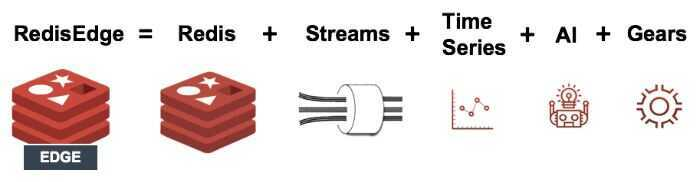

# Others

## Redis Time Series

Redis TimeSeries simplifies the use of Redis for time-series use cases like IoT, stock prices, and telemetry.

With RedisTimeSeries, ingest and query millions of metrics and events per second using an optimal data structure. Advanced techniques such as downsampling and aggregation ensure a small memory footprint without impacting performance. Use a variety of queries for visualization and monitoring with built-in connectors to popular tools like Grafana, Prometheus, and Telegraf.

- Downsampling and retention
- Aggregation, range queries, and special counter operations

https://redislabs.com/redis-enterprise/redis-time-series

https://redislabs.com/blog/redistimeseries-ga-making-4th-dimension-truly-immersive

[RedisTimeSeries Explained](https://www.youtube.com/watch?v=SzcpwtLRgyk)

## RedisAI

https://oss.redislabs.com/redisai

## RedisEdge

RedisEdge from Redis Labs is a purpose-built, multi-model database for the demanding conditions at the Internet of Things (IoT) edge. It can ingest millions of writes per second with `<1ms` latency and a very small footprint (`<5MB`), so it easily resides in constrained compute environments. It can run on a variety of edge devices and sensors ranging from ARM32 to x64-based hardware. RedisEdge bundles open source Redis (version 5 with Redis Streams) with the RedisAI and RedisTimeSeries modules, along with RedisGears for inter-module communication.

## Redis Insight

Inspect your Redis data, monitor health, and perform runtime server configuration with a browser-based management interface for your Redis deployment

`docker run -v redisinsight:/db -p 8001:8001 redislabs/redisinsight`

https://redislabs.com/redisinsight

https://docs.redislabs.com/latest/ri

## Redis Bloom

RedisBloom extends Redis core to support additional probabilistic data structures. It allows for solving computer science problems at a constant memory space with extremely fast processing and a low error rate. It supports scalable Bloom and Cuckoo Filters to determine (with a given degree of certainty) whether an item is present or absent from a collection. Count-Mins-Sketch is used to count the frequency of the different items in sub-linear space and TopK allows Redis to count top k events in a (close to) deterministic manner.

https://redislabs.com/redis-enterprise/redis-bloom

## Redis Json

RedisJSON provides fast in-memory manipulation of JSON documents at high velocity and volume. With RedisJSON, you can natively store document data in a hierarchical, tree-like format to scale and query documents efficiently, significantly improving performance over storing and manipulating JSON with Lua and core Redis data structures.

https://redislabs.com/redis-enterprise/redis-json

https://redislabs.com/blog/redis-as-a-json-store

## Redis Graph

RedisGraph is based on a unique approach and architecture that translates Cypher queries to matrix operations executed over a GraphBLAS engine. This new design allows use cases like social graph operation, fraud detection, and real-time recommendation to be executed 10x -- 600x faster than any other graph database.

https://redislabs.com/redis-enterprise/redis-graph

## RediSearch

RediSearch is a fast search engine that enables you to query your recently indexed Redis data to answer any kind of complex question. Use it as a secondary index for datasets hosted on other data stores, a fast text search or auto-complete engine, and as a search engine that powers other modules like RedisGraph and RedisTimeSeries.
Rich with features, RediSearch supports many capabilities including ranking, boolean queries, geo-filters, synonyms, numeric filters and ranges, aggregation, and more, and even allows you to add your own custom scoring code.

https://redislabs.com/redis-enterprise/redis-search

## Redis on Flash (SSD)

Redis on Flash (RoF) offers users of [Redis Enterprise Software](https://docs.redislabs.com/latest/rs/) and [Redis Enterprise Cloud](https://redislabs.com/redis-enterprise-cloud/) the unique ability to have very large Redis databases but at significant cost savings. Where standard Redis databases must all be in RAM, Redis on Flash enables your Redis databases to span both RAM and dedicated flash memory (SSD).Whilst keys are always stored in RAM, RoF intelligently manages the location of their values (RAM vs Flash) in the database via a LRU-based (least-recently-used) mechanism. Hot values are stored in RAM, but infrequently used, or warm values, are ejected to flash memory. This enables you to have much larger datasets with RAM-like latency and performance, but at dramatically lower cost than an all-RAM database.

https://docs.redislabs.com/latest/rs/concepts/memory-architecture/redis-flash

## Security

https://redis.io/topics/security

https://redis.io/topics/acl

## Migration

[How To Migrate Redis Data to a DigitalOcean Managed Database | DigitalOcean](https://www.digitalocean.com/community/tutorials/how-to-migrate-redis-data-to-a-digitalocean-managed-database)

[MIGRATE | Redis](https://redis.io/commands/migrate/)

[Migrate redis server data from one instance to another instance | by Premanandh | Medium](https://premanandh-s.medium.com/migrate-standalone-redis-server-data-from-one-instance-to-another-instance-c60d79eeca0f)

## Others

- [GitHub - DiceDB/dice: A drop-in replacement of Redis with SQL-based realtime reactivity.](https://github.com/dicedb/dice)
