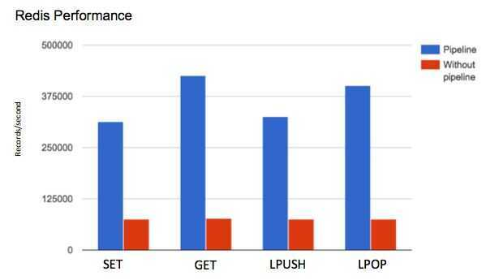
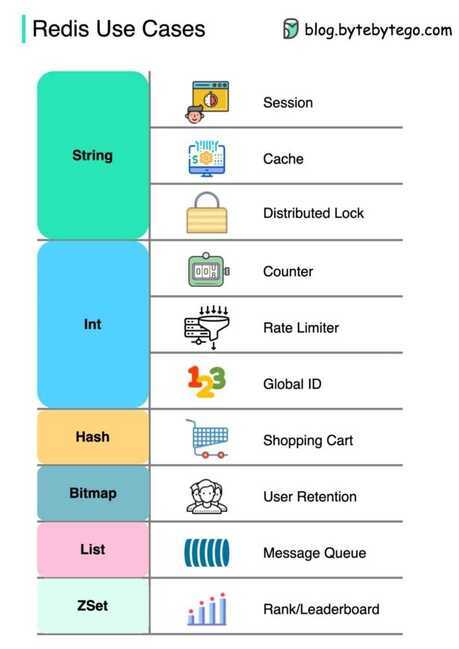

# Redis Data Types

Redis is not aplainkey-value store, it is actually adata structures server, supporting different kinds of values. What this means is that, while in traditional key-value stores you associate string keys to string values, in Redis the value is not limited to a simple string, but can also hold more complex data structures. The following is the list of all the data structures supported by Redis

- **Binary-safe strings**
- **Lists:** collections of string elements sorted according to the order of insertion. They are basicallylinked lists.
- **Sets:** collections of unique, unsorted string elements.
- **Sorted sets,** similar to Sets but where every string element is associated to a floating number value, calledscore. The elements are always taken sorted by their score, so unlike Sets it is possible to retrieve a range of elements (for example you may ask: give me the top 10, or the bottom 10).
- **Hashes,** which are maps composed of fields associated with values. Both the field and the value are strings. This is very similar to Ruby or Python hashes.
- **Bit arrays (or simply bitmaps):** it is possible, using special commands, to handle String values like an array of bits: you can set and clear individual bits, count all the bits set to 1, find the first set or unset bit, and so forth.
- **HyperLogLogs:** this is a probabilistic data structure which is used in order to estimate the cardinality of a set.
- **Streams:** append-only collections of map-like entries that provide an abstract log data type.

## Redis Lists

Redis lists are implemented via Linked Lists. This means that even if you have millions of elements inside a list, the operation of adding a new element in the head or in the tail of the list is performedin constant time. The speed of adding a new element with the [LPUSH](https://redis.io/commands/lpush) command to the head of a list with ten elements is the same as adding an element to the head of list with 10 million elements.

Redis Lists are implemented with linked lists because for a database system it is crucial to be able to add elements to a very long list in a very fast way. Redis Lists can be taken at constant length in constant time.

When fast access to the middle of a large collection of elements is important, there is a different data structure that can be used, called sorted sets. Sorted sets will be covered later in this tutorial.

The [LPUSH](https://redis.io/commands/lpush) command adds a new element into a list, on the left (at the head), while the [RPUSH](https://redis.io/commands/rpush) command adds a new element into a list, on the right (at the tail). Finally the [LRANGE](https://redis.io/commands/lrange) command extracts ranges of elements from lists:

```bash
> rpush mylist A
> lpush mylist first
> lrange mylist 0 -1
```

Note that [LRANGE](https://redis.io/commands/lrange) takes two indexes, the first and the last element of the range to return. Both the indexes can be negative, telling Redis to start counting from the end: so -1 is the last element, -2 is the penultimate element of the list, and so forth.

An important operation defined on Redis lists is the ability topop elements. Popping elements is the operation of both retrieving the element from the list, and eliminating it from the list, at the same time. You can pop elements from left and right, similarly to how you can push elements in both sides of the list:

```bash
> rpush mylist a b c
> rpop mylist
> lpop mylist
```

## Common use cases for lists

- Remember the latest updates posted by users into a social network.
- Communication between processes, using a consumer-producer pattern where the producer pushes items into a list, and a consumer (usually aworker) consumes those items and executed actions. Redis has special list commands to make this use case both more reliable and efficient.

## Capped Lists

Redis allows us to use lists as a capped collections, only remembering the latest N items and discarding all the oldest items using the [LTRIM](https://redis.io/commands/ltrim) command.

The [LTRIM](https://redis.io/commands/ltrim) command is similar to [LRANGE](https://redis.io/commands/lrange), butinstead of displaying the specified range of elementsit sets this range as the new list value. All the elements outside the given range are removed.

Note: while [LRANGE](https://redis.io/commands/lrange) is technically anO(N) command, accessing small ranges towards the head or the tail of the list is a constant time operation.

## Blocking operations on lists

Lists have a special feature that make them suitable to implement queues, and in general as a building block for inter process communication systems: blocking operations.

Imagine you want to push items into a list with one process, and use a different process in order to actually do some kind of work with those items. This is the usual producer / consumer setup, and can be implemented in the following simple way:

- To push items into the list, producers call [LPUSH](https://redis.io/commands/lpush).
- To extract / process items from the list, consumers call [RPOP](https://redis.io/commands/rpop).

However it is possible that sometimes the list is empty and there is nothing to process, so [RPOP](https://redis.io/commands/rpop) just returns NULL. In this case a consumer is forced to wait some time and retry again with [RPOP](https://redis.io/commands/rpop). This is calledpolling, and is not a good idea in this context because it has several drawbacks:

1. Forces Redis and clients to process useless commands (all the requests when the list is empty will get no actual work done, they'll just return NULL).
2. Adds a delay to the processing of items, since after a worker receives a NULL, it waits some time. To make the delay smaller, we could wait less between calls to [RPOP](https://redis.io/commands/rpop), with the effect of amplifying problem number 1, i.e. more useless calls to Redis.

So Redis implements commands called [BRPOP](https://redis.io/commands/brpop) and [BLPOP](https://redis.io/commands/blpop) which are versions of [RPOP](https://redis.io/commands/rpop) and [LPOP](https://redis.io/commands/lpop) able to block if the list is empty: they'll return to the caller only when a new element is added to the list, or when a user-specified timeout is reached.

This is an example of a [BRPOP](https://redis.io/commands/brpop) call we could use in the worker:

```bash
> brpop tasks 5

1) "tasks"
2) "do_something"
```

It means: "wait for elements in the listtasks, but return if after 5 seconds no element is available".

Note that you can use 0 as timeout to wait for elements forever, and you can also specify multiple lists and not just one, in order to wait on multiple lists at the same time, and get notified when the first list receives an element.

A few things to note about [BRPOP](https://redis.io/commands/brpop):

1. Clients are served in an ordered way: the first client that blocked waiting for a list, is served first when an element is pushed by some other client, and so forth.
2. The return value is different compared to [RPOP](https://redis.io/commands/rpop): it is a two-element array since it also includes the name of the key, because [BRPOP](https://redis.io/commands/brpop) and [BLPOP](https://redis.io/commands/blpop) are able to block waiting for elements from multiple lists.
3. If the timeout is reached, NULL is returned.

There are more things you should know about lists and blocking ops. We suggest that you read more on the following:

- It is possible to build safer queues or rotating queues using [RPOPLPUSH](https://redis.io/commands/rpoplpush).
- There is also a blocking variant of the command, called [BRPOPLPUSH](https://redis.io/commands/brpoplpush).

## Automatic creation and removal of keys

So far in our examples we never had to create empty lists before pushing elements, or removing empty lists when they no longer have elements inside. It is Redis' responsibility to delete keys when lists are left empty, or to create an empty list if the key does not exist and we are trying to add elements to it, for example, with [LPUSH](https://redis.io/commands/lpush).

This is not specific to lists, it applies to all the Redis data types composed of multiple elements -- Streams, Sets, Sorted Sets and Hashes.

Basically we can summarize the behavior with three rules:

1. When we add an element to an aggregate data type, if the target key does not exist, an empty aggregate data type is created before adding the element.
2. When we remove elements from an aggregate data type, if the value remains empty, the key is automatically destroyed. The Stream data type is the only exception to this rule.
3. Calling a read-only command such as [LLEN](https://redis.io/commands/llen)(which returns the length of the list), or a write command removing elements, with an empty key, always produces the same result as if the key is holding an empty aggregate type of the type the command expects to find.

## Redis Hashes

Redis hashes look exactly how one might expect a "hash" to look, with field-value pairs:

```bash
> hmset user:1000 username antirez birthyear 1977 verified 1
OK
> hget user:1000 username
"antirez"
> hget user:1000 birthyear
"1977"
> hgetall user:1000

1) "username"
2) "antirez"
3) "birthyear"
4) "1977"
5) "verified"
6) "1"
```

While hashes are handy to representobjects, actually the number of fields you can put inside a hash has no practical limits (other than available memory)

The command [HMSET](https://redis.io/commands/hmset) sets multiple fields of the hash, while [HGET](https://redis.io/commands/hget) retrieves a single field.[HMGET](https://redis.io/commands/hmget) is similar to [HGET](https://redis.io/commands/hget) but returns an array of values:

```bash
> hmget user:1000 username birthyear no-such-field

1) "antirez"
2) "1977"
3) (nil)
```

There are commands that are able to perform operations on individual fields as well, like [HINCRBY](https://redis.io/commands/hincrby):

```bash
> hincrby user:1000 birthyear 10
(integer) 1987
> hincrby user:1000 birthyear 10
(integer) 1997
```

It is worth noting that small hashes (i.e., a few elements with small values) are encoded in special way in memory that make them very memory efficient.

## Redis Sets

Redis Sets are unordered collections of strings. The [SADD](https://redis.io/commands/sadd) command adds new elements to a set. It's also possible to do a number of other operations against sets like testing if a given element already exists, performing the intersection, union or difference between multiple sets, and so forth.

```bash
> sadd myset 1 2 3
(integer) 3
> smembers myset
```

1. 3
2. 1
3. 2

`> sscan myset 0 match f*`

Here I've added three elements to my set and told Redis to return all the elements. As you can see they are not sorted -- Redis is free to return the elements in any order at every call, since there is no contract with the user about element ordering.

Redis has commands to test for membership. For example, checking if an element exists:

```bash
> sismember myset 3
(integer) 1
> sismember myset 30
(integer) 0
```

"3" is a member of the set, while "30" is not.

Sets are good for expressing relations between objects. For instance we can easily use sets in order to implement tags.

There are other non trivial operations that are still easy to implement using the right Redis commands. For instance we may want a list of all the objects with the tags 1, 2, 10, and 27 together. We can do this using the [SINTER](https://redis.io/commands/sinter) command, which performs the intersection between different sets.

In addition to intersection you can also perform unions, difference, extract a random element, and so forth.

The command to extract an element is called [SPOP](https://redis.io/commands/spop), and is handy to model certain problems.

set command that provides the number of elements inside a set. This is often called thecardinality of a setin the context of set theory, so the Redis command is called [SCARD](https://redis.io/commands/scard).

When you need to just get random elements without removing them from the set, there is the [SRANDMEMBER](https://redis.io/commands/srandmember) command suitable for the task. It also features the ability to return both repeating and non-repeating elements.

| **Command** | **Example use and description**                                                                                                                                                                                                                                       |
|---------------|---------------------------------------------------------|
| SADD        | SADD key-name item [item ...]--- Adds the items to the set and returns the number of items added that weren't already present                                                                                                                                      |
| SREM        | SREM key-name item [item ...]--- Removes the items and returns the number of items that were removed                                                                                                                                                               |
| SISMEMBER   | SISMEMBER key-name item - Returns whether the item is in the SET                                                                                                                                                                                                    |
| SCARD       | SCARD key-name - Returns the number of items in the SET                                                                                                                                                                                                             |
| SMEMBERS    | SMEMBERS key-name - Returns all of the items in the SET as a Python set                                                                                                                                                                                             |
| SRANDMEMBER | SRANDMEMBER key-name [count]--- Returns one or more random items from the SET. When count is positive, Redis will return count distinct randomly chosen items, and when count is negative, Redis will return count randomly chosen items that may not be distinct. |
| SPOP        | SPOP key-name - Removes and returns a random item from the SET                                                                                                                                                                                                      |
| SMOVE       | SMOVE source-key dest-key item - If the item is in the source, removes the item from the source and adds it to the destination, returning if the item was moved                                                                                                     |

Operations for combining and manipulating SETs in Redis

| **Command** | **Example use and description**                                                                                                                                                   |
|-------------|-----------------------------------------------------------|
| SDIFF       | SDIFF key-name [key-name ...]--- Returns the items in the first SET that weren't in any of the other SETs (mathematical set difference operation)                              |
| SDIFFSTORE  | SDIFFSTORE dest-key key-name [key-name ...]--- Stores at the dest-key the items in the first SET that weren't in any of the other SETs (mathematical set difference operation) |
| SINTER      | SINTER key-name [key-name ...]--- Returns the items that are in all of the SETs (mathematical set intersection operation)                                                      |
| SINTERSTORE | SINTERSTORE dest-key key-name [key-name ...]--- Stores at the dest-key the items that are in all of the SETs (mathematical set intersection operation)                         |
| SUNION      | SUNION key-name [key-name ...]--- Returns the items that are in at least one of the SETs (mathematical set union operation)                                                    |
| SUNIONSTORE | SUNIONSTORE dest-key key-name [key-name ...]--- Stores at the dest-key the items that are in at least one of the SETs (mathematical set union operation)                       |

## Redis Sorted sets (ZSET)

Sorted sets are a data type which is similar to a mix between a Set and a Hash. Like sets, sorted sets are composed of unique, non-repeating string elements, so in some sense a sorted set is a set as well.

However while elements inside sets are not ordered, every element in a sorted set is associated with a floating point value, calledthe score(this is why the type is also similar to a hash, since every element is mapped to a value).

Moreover, elements in a sorted sets aretaken in order(so they are not ordered on request, order is a peculiarity of the data structure used to represent sorted sets). They are ordered according to the following rule:

- If A and B are two elements with a different score, then A > B if A.score is > B.score.
- If A and B have exactly the same score, then A > B if the A string is lexicographically greater than the B string. A and B strings can't be equal since sorted sets only have unique elements.

Implementation note: Sorted sets are implemented via a dual-ported data structure containing both a skip list and a hash table, so every time we add an element Redis performs anO(log(N))operation. That's good, but when we ask for sorted elements Redis does not have to do any work at all, it's already all sorted

```bash
> zadd hackers 1940 "Alan Kay"

> zrange hackers 0 -1

> zrevrange hackers 0 -1

> zrange hackers 0 -1 withscores

> zrangebyscore hackers -inf 1950

> zremrangebyscore hackers 1940 1960

> zrank hackers "Anita Borg"

> zrevrank hackers "Anita Borg"
```

| **Command**   | **What it does**                                                   |
|------------------|------------------------------------------------------|
| ZADD          | Adds member with the given score to the ZSET                       |
| ZRANGE        | Fetches the items in the ZSET from their positions in sorted order |
| ZRANGEBYSCORE | Fetches items in the ZSET based on a range of scores               |
| ZREM          | Removes the item from the ZSET, if it exists                       |

- Expire an item in list after 2 mins
- Set expire on item if no new data comes then expire the whole key
- When inserting new data remove the data before 2 mins if available

```bash
zadd test_key 1588056957 test_value_1 (add an item to sortedset)

zadd test_key 1588057150 test_value_2 (add an item to sortedset)

zrangebyscore test_key 1588056957 1588057150 (to sortedset items)

zrangebyscore test_key 1588056957 1588057150 withscores (to sortedset items with score)

zremrangebyscore test_key 1588056950 1588056957 (to remove item)
```

## Lexicographical scores

With recent versions of Redis 2.8, a new feature was introduced that allows getting ranges lexicographically, assuming elements in a sorted set are all inserted with the same identical score (elements are compared with the Cmemcmpfunction, so it is guaranteed that there is no collation, and every Redis instance will reply with the same output).

The main commands to operate with lexicographical ranges are [ZRANGEBYLEX](https://redis.io/commands/zrangebylex), [ZREVRANGEBYLEX](https://redis.io/commands/zrevrangebylex), [ZREMRANGEBYLEX](https://redis.io/commands/zremrangebylex) and [ZLEXCOUNT](https://redis.io/commands/zlexcount).

## Updating the score: leader boards

Just a final note about sorted sets before switching to the next topic. Sorted sets' scores can be updated at any time. Just calling [ZADD](https://redis.io/commands/zadd) against an element already included in the sorted set will update its score (and position) withO(log(N)) time complexity. As such, sorted sets are suitable when there are tons of updates.

Because of this characteristic a common use case is leader boards. The typical application is a Facebook game where you combine the ability to take users sorted by their high score, plus the get-rank operation, in order to show the top-N users, and the user rank in the leader board (e.g., "you are the #4932 best score here").

## Bitmaps

Bitmaps are not an actual data type, but a set of bit-oriented operations defined on the String type. Since strings are binary safe blobs and their maximum length is 512 MB, they are suitable to set up to 232different bits.

Bit operations are divided into two groups: constant-time single bit operations, like setting a bit to 1 or 0, or getting its value, and operations on groups of bits, for example counting the number of set bits in a given range of bits (e.g., population counting).

Since bitmap operations don't have a data structure of their own, there isn't a special data structure to describe. The Redis strings themselves are implemented as a binary safe string. Redis string data structure is internally called Simple Dynamic String (SDS). It is essentially a nativechar []with some additional book keeping information.

One of the biggest advantages of bitmaps is that they often provide extreme space savings when storing information. For example in a system where different users are represented by incremental user IDs, it is possible to remember a single bit information (for example, knowing whether a user wants to receive a newsletter) of 4 billion of users using just 512 MB of memory.

Bits are set and retrieved using the [SETBIT](https://redis.io/commands/setbit) and [GETBIT](https://redis.io/commands/getbit) commands:

```bash
> setbit key 10 1
(integer) 1
> getbit key 10
(integer) 1
> getbit key 11
(integer) 0
```

The [SETBIT](https://redis.io/commands/setbit) command takes as its first argument the bit number, and as its second argument the value to set the bit to, which is 1 or 0. The command automatically enlarges the string if the addressed bit is outside the current string length.

[GETBIT](https://redis.io/commands/getbit) just returns the value of the bit at the specified index. Out of range bits (addressing a bit that is outside the length of the string stored into the target key) are always considered to be zero.

There are three commands operating on group of bits:

1. [BITOP](https://redis.io/commands/bitop) performs bit-wise operations between different strings. The provided operations are AND, OR, XOR and NOT.
2. [BITCOUNT](https://redis.io/commands/bitcount) performs population counting, reporting the number of bits set to 1.
3. [BITPOS](https://redis.io/commands/bitpos) finds the first bit having the specified value of 0 or 1.

Both [BITPOS](https://redis.io/commands/bitpos) and [BITCOUNT](https://redis.io/commands/bitcount) are able to operate with byte ranges of the string, instead of running for the whole length of the string. The following is a trivial example of [BITCOUNT](https://redis.io/commands/bitcount) call:

```bash
> setbit key 0 1
(integer) 0
> setbit key 100 1
(integer) 0
> bitcount key
(integer) 2
```

Common use cases for bitmaps are:

- Real time analytics of all kinds.
- Storing space efficient but high performance boolean information associated with object IDs.

For example imagine you want to know the longest streak of daily visits of your web site users. You start counting days starting from zero, that is the day you made your web site public, and set a bit with [SETBIT](https://redis.io/commands/setbit) every time the user visits the web site. As a bit index you simply take the current unix time, subtract the initial offset, and divide by the number of seconds in a day (normally, 3600*24).

This way for each user you have a small string containing the visit information for each day. With [BITCOUNT](https://redis.io/commands/bitcount) it is possible to easily get the number of days a given user visited the web site, while with a few [BITPOS](https://redis.io/commands/bitpos) calls, or simply fetching and analyzing the bitmap client-side, it is possible to easily compute the longest streak.

```bash
BITOP AND andbc b c

bitop not nota a

BITOP OR orbc b c

BITOP XOR xorbc b c
```

Bitmaps are trivial to split into multiple keys, for example for the sake of sharding the data set and because in general it is better to avoid working with huge keys. To split a bitmap across different keys instead of setting all the bits into a key, a trivial strategy is just to store M bits per key and obtain the key name withbit-number/M and the Nth bit to address inside the key withbit-number MOD M.

## HyperLogLogs

A HyperLogLog is a probabilistic data structure used in order to count unique things (technically this is referred to estimating the cardinality of a set). Usually counting unique items requires using an amount of memory proportional to the number of items you want to count, because you need to remember the elements you have already seen in the past in order to avoid counting them multiple times. However there is a set of algorithms that trade memory for precision: you end with an estimated measure with a standard error, which in the case of the Redis implementation is less than 1%. The magic of this algorithm is that you no longer need to use an amount of memory proportional to the number of items counted, and instead can use a constant amount of memory! 12k bytes in the worst case, or a lot less if your HyperLogLog (We'll just call them HLL from now) has seen very few elements.

HLLs in Redis, while technically a different data structure, are encoded as a Redis string, so you can call [GET](https://redis.io/commands/get) to serialize a HLL, and [SET](https://redis.io/commands/set) to deserialize it back to the server.

Conceptually the HLL API is like using Sets to do the same task. You would [SADD](https://redis.io/commands/sadd) every observed element into a set, and would use [SCARD](https://redis.io/commands/scard) to check the number of elements inside the set, which are unique since [SADD](https://redis.io/commands/sadd) will not re-add an existing element.

While you don't reallyadd itemsinto an HLL, because the data structure only contains a state that does not include actual elements, the API is the same:

- Every time you see a new element, you add it to the count with [PFADD](https://redis.io/commands/pfadd).
- Every time you want to retrieve the current approximation of the unique elementsaddedwith [PFADD](https://redis.io/commands/pfadd) so far, you use the [PFCOUNT](https://redis.io/commands/pfcount).

```bash
> pfadd hll a b c d
(integer) 1
> pfcount hll
(integer) 4
```

An example of use case for this data structure is counting unique queries performed by users in a search form every day.

Redis is also able to perform the union of HLLs

## Other Features

- It is possible to [iterate the key space of a large collection incrementally](https://redis.io/commands/scan).
- It is possible to run [Lua scripts server side](https://redis.io/commands/eval) to improve latency and bandwidth.
- Redis is also a [Pub-Sub server](https://redis.io/topics/pubsub).

https://redis.io/topics/data-types-intro

## Redis single-­‐argument commands and their corresponding multi-­‐argument alternatives

| **Single-­‐Argument Command** | **Single-­‐Argument Description**  | **Multi-­‐Argument Alternative** | **Multi-­‐Argument Description**             |
|---------------|------------------------|---------------|------------------|
| **SET**                      | Set the value of a key            | MSET                            | Set multiple keys to multiple values        |
| **GET**                      | Get the value of a key            | MGET                            | Get the values of all the given keys        |
| **LSET**                     | Set value of an element in a list | LPUSH, RPUSH                    | Prepend/append multiple values to a list    |
| **LINDEX**                   | Get an element from a list        | LRANGE                          | Get a range of elements from a list         |
| **HSET**                     | Set the string value of a hash    | HMSET                           | Set multiple hash fields to multiple values |
| **HGET**                     | Get the value of a hash field     | HMGET                           | Get the values of all the given hash fields |

## Pipeline commands

Another way to reduce latency associated with high command volume is to pipeline several commands together so that you reduce latency due to network usage. Rather than sending 10 client commands to the Redis server individually and taking the network latency hit 10 times, pipelining the commands will send them all at once and pay the network latency cost only once. Pipelining commands is supported by the Redis server and by most clients. This is only beneficial if network latency is significantly larger than your instance's



https://redis.io/topics/pipelining

## Redis commands with high time complexity

| **Command**     | **Description**                                 | **Improve Performance By**                                                                   |
|--------------|------------------------------|-----------------------------|
| **ZINTERSTORE** | intersect multiple sorted sets and store result | reducing the number of sets and/or the number of elements in resulting set                   |
| **SINTERSTORE** | intersect multiple sets and store result        | reducing size of smallest set and/or the number of sets                                      |
| **SINTER**      | intersect multiple sets                         | reducing the size of smallest set and/or the number of sets                                  |
| **MIGRATE**     | transfer key from one Redis instance to another | reducing the number of objects stored as values and/or their average size                    |
| **DUMP**        | return serialized value for a given key         | reducing the number of objects stored asvalues and/or their average size                     |
| **ZREM**        | remove one or more members from sorted set      | reducing the number of elements to remove and/or the size of the sorted set                  |
| **ZUNIONSTORE** | add multiple sorted sets and store result       | reducing the total size of the sorted setsand/or the number of elements in the resulting set |
| **SORT**        | sort elements in list, set, or sorted set       | reducing the number of element to sort and/or the number of returned elements                |
| **SDIFFSTORE**  | subtract multiple sets and store result         | reducing the number of elements in all sets                                                  |
| **SDIFF**       | subtract multiple sets                          | reducing the number of elements in all sets                                                  |
| **SUNION**      | add multiple sets                               | reducing the number elements in all sets                                                     |
| **LSET**        | set value of an element in a list               | reducing the length of the list                                                              |
| **LREM**        | remove elements from a list                     | reducing the length of the list                                                              |
| **LRANGE**      | get range of elements from a list               | reduce the start offset and/or the number of elements in range                               |


