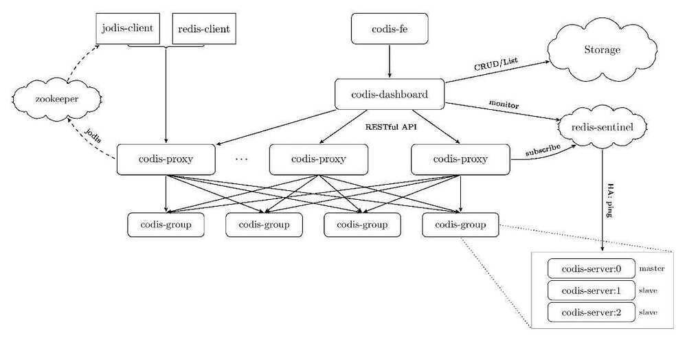

# Scaling

## Replication/Clustering

### Default: Master-Slave

When installing the chart withcluster.enabled=true, it will deploy a Redis master StatefulSet (only one master node allowed) and a Redis slave StatefulSet. The slaves will be read-replicas of the master. Two services will be exposed:

- Redis Master service: Points to the master, where read-write operations can be performed
- Redis Slave service: Points to the slaves, where only read operations are allowed.

In case the master crashes, the slaves will wait until the master node is respawned again by the Kubernetes Controller Manager.

### Master-Slave with Sentinel

When installing the chart with `cluster.enabled=true` and `sentinel.enabled=true`, it will deploy a Redis master StatefulSet (only one master allowed) and a Redis slave StatefulSet. In this case, the pods will contain en extra container with Redis Sentinel. This container will form a cluster of Redis Sentinel nodes, which will promote a new master in case the actual one fails. In addition to this, only one service is exposed:

- Redis service: Exposes port 6379 for Redis read-only operations and port 26379 for accesing Redis Sentinel.

For read-only operations, access the service using port 6379. For write operations, it's necessary to access the Redis Sentinel cluster and query the current master using the command below (using redis-cli or similar:

`SENTINEL get-master-addr-by-name mymaster`

This command will return the address of the current master, which can be accessed from inside the cluster.

In case the current master crashes, the Sentinel containers will elect a new master node.

https://redis.io/topics/sentinel

### Redis Cluster

https://redis.io/topics/cluster-tutorial

https://redis.io/topics/cluster-spec

Replication - One leader many followers model

Clustering - Shard data across multiple nodes

https://redis.io/topics/cluster-tutorial

Hybrid - Replication + Clustering

Sentinel - https://redis.io/topics/sentinel

keydb - Multithreaded fork of redis

https://docs.keydb.dev/blog/2019/10/07/blog-post

## twenproxy (by twitter)

twemproxy (pronounced "two-em-proxy"), aka nutcracker is a fast and lightweight proxy for [memcached](http://www.memcached.org/) and [redis](http://redis.io/) protocol. It was built primarily to reduce the number of connections to the caching servers on the backend. This, together with protocol pipelining and sharding enables you to horizontally scale your distributed caching architecture.

https://github.com/twitter/twemproxy

## codis

Proxy based Redis cluster solution supporting pipeline and scaling dynamically

https://github.com/CodisLabs/codis

| | **Codis** | **Twemproxy** | **Redis Cluster** |
|---|---|---|---|
| resharding without restarting cluster | Yes | No | Yes |
| pipeline | Yes | Yes | No |
| hash tags for multi-key operations | Yes | Yes | Yes |
| multi-key operations while resharding | Yes | - | No([details](http://redis.io/topics/cluster-spec#multiple-keys-operations)) |
| Redis clients supporting | Any clients | Any clients | Clients have to support cluster protocol |

## Redis vs Memcached

Both Redis and MemCached are in-memory, open-source data stores. Memcached, a high-performance distributed memory cache service, is designed for simplicity while Redis offers a rich set of features that make it effective for a wide range of use cases.

|  | **Memcached** | **Redis** |
|---|---|---|
| [Sub-millisecond latency](https://aws.amazon.com/elasticache/redis-vs-memcached/#Sub-millisecond_latency) | Yes | Yes |
| [Developer ease of use](https://aws.amazon.com/elasticache/redis-vs-memcached/#Developer_ease_of_use) | Yes | Yes |
| [Data partitioning](https://aws.amazon.com/elasticache/redis-vs-memcached/#Data_partitioning) | Yes | Yes |
| [Support for a broad set of programming languages](https://aws.amazon.com/elasticache/redis-vs-memcached/#Support_for_a_broad_set_of_programming_languages) | Yes | Yes |
| [Advanced data structures](https://aws.amazon.com/elasticache/redis-vs-memcached/#Advanced_data_structures) | - | Yes |
| [**Multithreaded architecture**](https://aws.amazon.com/elasticache/redis-vs-memcached/#Multithreaded_architecture) | **Yes** | **-** |
| [Snapshots](https://aws.amazon.com/elasticache/redis-vs-memcached/#Snapshots) | - | Yes |
| [Replication](https://aws.amazon.com/elasticache/redis-vs-memcached/#Replication) | - | Yes |
| [Transactions](https://aws.amazon.com/elasticache/redis-vs-memcached/#Transactions) | - | Yes |
| [Pub/Sub](https://aws.amazon.com/elasticache/redis-vs-memcached/#Pub.2FSub) | - | Yes |
| [Lua scripting](https://aws.amazon.com/elasticache/redis-vs-memcached/#Lua_scripting) | - | Yes |
| [Geospatial support](https://aws.amazon.com/elasticache/redis-vs-memcached/#Geospatial_support) | - | Yes |

https://aws.amazon.com/elasticache/redis-vs-memcached

[Memcached Tutorial for Beginners - YouTube](https://www.youtube.com/watch?v=VhM2ByShhzE&ab_channel=freeCodeCamp.org)

## DragonFly

Dragonfly is a drop-in Redis replacement, designed to meet the performance and efficiency requirements of modern cloud-based applications. Organizations that switch to Dragonfly require less hardware and achieve dramatically improved data performance.

- [Dragonfly - The Fastest In-Memory Data Store](https://www.dragonflydb.io/)
- [Redis vs. Dragonfly Scalability and Performance](https://www.dragonflydb.io/blog/scaling-performance-redis-vs-dragonfly)
- [GitHub - dragonflydb/dragonfly: A modern replacement for Redis and Memcached](https://github.com/dragonflydb/dragonfly)
- [DragonflyDB Architecture Overview, Internals, and Trade-offs - hitting 6.43 million ops/sec - YouTube](https://www.youtube.com/watch?v=XbV1LoVsbME&ab_channel=ArpitBhayani)

## Other in-memory database

1. facebook rocksdb
2. memcached - [Memcached Architecture - Crash Course with Docker, Telnet, NodeJS - YouTube](https://www.youtube.com/watch?v=NCePGsRZFus)
3. [GitHub - paypal/junodb: JunoDB is PayPal's home-grown secure, consistent and highly available key-value store providing low, single digit millisecond, latency at any scale.](https://github.com/paypal/junodb)
4. [Dissecting Juno DB - YouTube](https://www.youtube.com/playlist?list=PLsdq-3Z1EPT3s3nghXpr0NDpgN3ZIoK4O)
5. Aerospike
