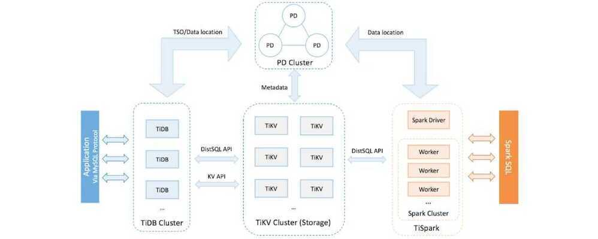

# tidb

TiDB ("Ti" stands for Titanium) is an open-source NewSQL database that supports Hybrid Transactional and Analytical Processing (HTAP) workloads. It is MySQL compatible and features horizontal scalability, strong consistency, and high availability.



Inside the TiDB platform, the main components are as follows:

- [TiDB server](https://github.com/pingcap/tidb) is a stateless SQL layer that processes users' SQL queries, accesses data in the storage layer, and returns the corresponding results to the application. It is MySQL-compatible and sits on top of TiKV.
- [TiKV server](https://github.com/pingcap/tikv) is the distributed transactional key-value storage layer where the data persists. It uses the [Raft](https://raft.github.io/) consensus protocol for replication to ensure strong data consistency and high availability.
- [TiSpark](https://github.com/pingcap/tispark) cluster also sits on top of TiKV. It is an Apache Spark plugin that works with the TiDB platform to support complex Online Analytical Processing (OLAP) queries for business intelligence (BI) analysts and data scientists.
- [Placement Driver (PD) server](https://github.com/pingcap/pd) is a metadata cluster powered by [etcd](https://github.com/etcd-io/etcd) that manages and schedules TiKV.

## Key features

### Easy horizontal scaling

The TiDB architecture design separates computing from storage, letting you scale out or scale in the computing or storage capacity online as needed. The scaling process is transparent to application operations and maintenance staff.

### Financial-grade high availability

Data is stored in multiple replicas, and the Multi-Raft protocol is used to obtain the transaction log. A transaction can only be committed when data has been successfully written into the majority of replicas. This guarantees strong consistency and availability when a minority of replicas go down. You can configure the geographic location and number of replicas as needed to meet different disaster tolerance levels.

### Real-time HTAP

TiDB provides two storage engines: [TiKV](https://docs.pingcap.com/tidb/stable/tikv-overview), a row-based storage engine, and [TiFlash](https://docs.pingcap.com/tidb/stable/tiflash-overview), a columnar storage engine. TiFlash uses the Multi-Raft Learner protocol to replicate data from TiKV in real time, ensuring consistent data between the TiKV row-based storage engine and the TiFlash columnar storage engine. TiKV and TiFlash can be deployed on different machines as needed to solve the problem of HTAP resource isolation.

### Cloud-native distributed database

TiDB is a distributed database designed for the cloud, providing flexible scalability, reliability, and security on the cloud platform. Users can elastically scale TiDB to meet the requirements of their changing workloads. In TiDB, each piece of data has at least 3 replicas, which can be scheduled in different cloud availability zones to tolerate the outage of a whole data center. [TiDB Operator](https://docs.pingcap.com/tidb-in-kubernetes/stable/tidb-operator-overview) helps manage TiDB on Kubernetes and automates tasks related to operating the TiDB cluster, making TiDB easier to deploy on any cloud that provides managed Kubernetes. [TiDB Cloud](https://pingcap.com/tidb-cloud/), the fully-managed TiDB service, is the easiest, most economical, and most resilient way to unlock the full power of [TiDB in the cloud](https://docs.pingcap.com/tidbcloud/), allowing you to deploy and run TiDB clusters with just a few clicks.

### Compatible with the MySQL protocol and MySQL ecosystem

TiDB is compatible with the MySQL protocol, common features of MySQL, and the MySQL ecosystem. To migrate applications to TiDB, you do not need to change a single line of code in many cases, or only need to modify a small amount of code. In addition, TiDB provides a series of [data migration tools](https://docs.pingcap.com/tidb/stable/ecosystem-tool-user-guide) to help easily migrate application data into TiDB.

## Use cases

### Financial industry scenarios

TiDB is ideal for financial industry scenarios with high requirements for data consistency, reliability, availability, scalability, and disaster tolerance. Traditional solutions are costly and inefficient, with low resource utilization and high maintenance costs. TiDB uses multiple replicas and the Multi-Raft protocol to schedule data to different data centers, racks, and machines, ensuring system RTO ≦ 30 seconds and RPO = 0.

### Massive data and high concurrency scenarios

Traditional standalone databases cannot meet the data capacity requirements of rapidly growing applications. TiDB is a cost-effective solution that adopts a separate computing and storage architecture, enabling easy scaling of computing or storage capacity separately. The computing layer supports a maximum of 512 nodes, each node supports a maximum of 1,000 concurrencies, and the maximum cluster capacity is at the PB (petabytes) level.

### Real-time HTAP scenarios

TiDB is ideal for scenarios with massive data and high concurrency that require real-time processing. TiDB introduces the TiFlash columnar storage engine in v4.0, which combines with the TiKV row-based storage engine to build TiDB as a true HTAP database. With a small amount of extra storage cost, you can handle both online transactional processing and real-time data analysis in the same system, which greatly saves cost.

### Data aggregation and secondary processing scenarios

TiDB is suitable for companies that need to aggregate scattered data into the same system and execute secondary processing to generate a T+0 or T+1 report. Compared with Hadoop, TiDB is much simpler. You can replicate data into TiDB using ETL (Extract, Transform, Load) tools or data migration tools provided by TiDB. Reports can be directly generated using SQL statements.

## Links

- [GitHub - pingcap/tidb: TiDB is an open-source, cloud-native, distributed, MySQL-Compatible database for elastic scale and real-time analytics. Try AI-powered Chat2Query free at : https://www.pingcap.com/tidb-serverless/](https://github.com/pingcap/tidb)
- https://pingcap.com/success-stories/lesson-learned-from-queries-over-1.3-trillion-rows-of-data-within-milliseconds-of-response-time-at-zhihu
- https://dzone.com/articles/building-a-large-scale-distributed-storage-system
- [TiDB Architecture | PingCAP Docs](https://docs.pingcap.com/tidb/stable/tidb-architecture)
- [TiDB Storage | PingCAP Docs](https://docs.pingcap.com/tidb/stable/tidb-storage)
- [TiDB Computing | PingCAP Docs](https://docs.pingcap.com/tidb/stable/tidb-computing)
- [TiDB Scheduling | PingCAP Docs](https://docs.pingcap.com/tidb/stable/tidb-scheduling)

## tikv

TiKV ("Ti" stands for Titanium) is an open source distributed transactional key-value database. Unlike other traditional NoSQL systems, TiKV not only provides classical key-value APIs, but also transactional APIs with ACID compliance. Built in Rust and powered by Raft, TiKV was originally created to complement [TiDB](https://github.com/pingcap/tidb), a distributed HTAP database compatible with the MySQL protocol.

https://github.com/tikv/tikv

## TiFlash

The columnar storage extension that uses the Multi-Raft Learner protocol to replicate data from TiKV in real-time, ensuring consistent data between the TiKV row-based storage engine.

## Tuning TiDB

### Index Optimization

Set the following parameters before starting the index.

`@@global.tidb_ddl_reorg_worker_cnt = 16; SET @@global.tidb_ddl_reorg_batch_size = 4096;`

Reset to default values after index creation.

`@@global.tidb_ddl_reorg_worker_cnt = 4; SET @@global.tidb_ddl_reorg_batch_size = 256`

### Partition Pruning

This is mainly important for partitioned tables. It analyzes the filter conditions in query statements and eliminates (prunes) partitions when they do not contain any required data.

`SET @@global.tidb_ddl_reorg_worker_cnt = 16;`

`SET @@global.tidb_ddl_reorg_batch_size = 4096;`

### Tuning Analyze

Sometimes the auto analyzer in TiDB fails if a high volume of data is ingested. In that case, all the queries might use the wrong execution plan and end up scanning the full table. To avoid such a situation we made the following changes in TiDB configurations:

```bash
SET global tidb_max_auto_analyze_time = 86400;
SET global tidb_enable_pseudo_for_outdated_stats = off;
SET global tidb_sysproc_scan_concurrency = 15;
```

If you are working with partitioned tables, we suggest you run analyze table operations manually for one partition at a time to avoid analyzing failures.

## Links

- [Why #TiDB? - YouTube](https://www.youtube.com/watch?v=aWBNNPm21zg&ab_channel=PingCAP)
