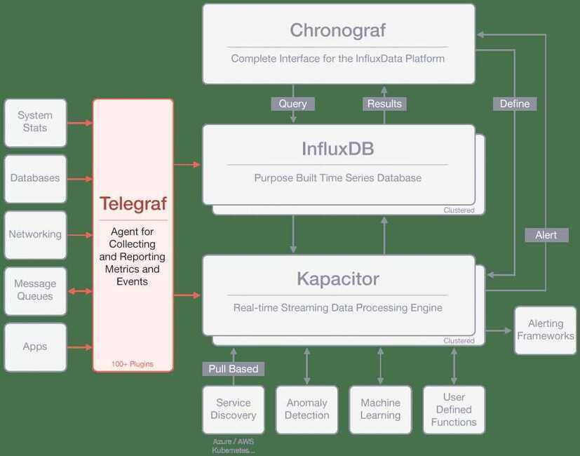

# Influx

The complete time series platform.

## TICK Stack

### 1. Telegraf

Telegraf is the Agent for Collecting & Reporting Metrics & Data

It is part of the TICK stack and is a plugin-driven server agent for collecting and reporting metrics. Telegraf has plugins or integrations to source a variety of metrics directly from the system it's running on, pull metrics from third-party APIs, or even listen for metrics via a StatsD and Kafka consumer services. It also has output plugins to send metrics to a variety of other datastores, services, and message queues, including InfluxDB, Graphite, OpenTSDB, Datadog, Librato, Kafka, MQTT, NSQ, and many others.

### 2. InfluxDB

InfluxDB is the Time Series Database in the [TICK Stack](https://www.influxdata.com/time-series-platform/)

InfluxDB is used as a data store for any use case involving large amounts of timestamped data, including DevOps monitoring, application metrics, IoT sensor data, and real-time analytics. Conserve space on your machine by configuring InfluxDB to keep data for a defined length of time, automatically expiring & deleting any unwanted data from the system. InfluxDB also offers a SQL-like query language for interacting with data.

### 3. Chronograf

Chronograf is the Complete Interface for the InfluxData Platform

Chronograf is the user interface component of InfluxData's [TICK Stack](https://www.influxdata.com/time-series-platform/). It makes the monitoring and alerting for your infrastructure easy to setup and maintain. It is simple to use and includes templates and libraries to allow you to rapidly build dashboards with real-time visualizations of your data.

### 4. Kapacitor

Kapacitor is a Real-time Streaming Data Processing Engine

Kapacitor is a native data processing engine in the [TICK Stack](https://www.influxdata.com/time-series-platform/). It can process both stream and batch data from InfluxDB. It lets you plug in your own custom logic or user-defined functions to process alerts with dynamic thresholds, match metrics for patterns, compute statistical anomalies, and perform specific actions based on these alerts like dynamic load rebalancing. It also integrates with HipChat, OpsGenie, Alerta, Sensu, PagerDuty, Slack, and [more](https://www.influxdata.com/products/integrations/).

https://www.influxdata.com/products
