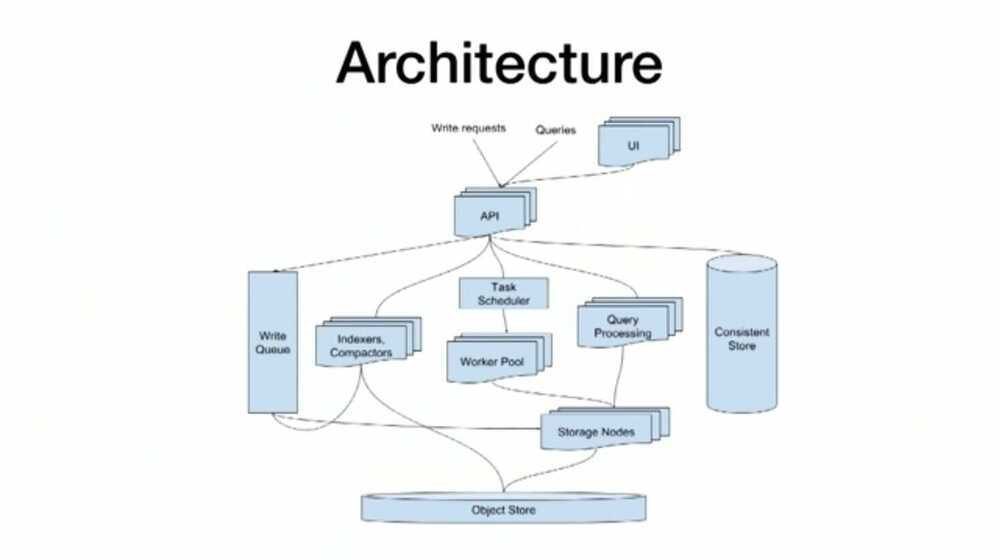
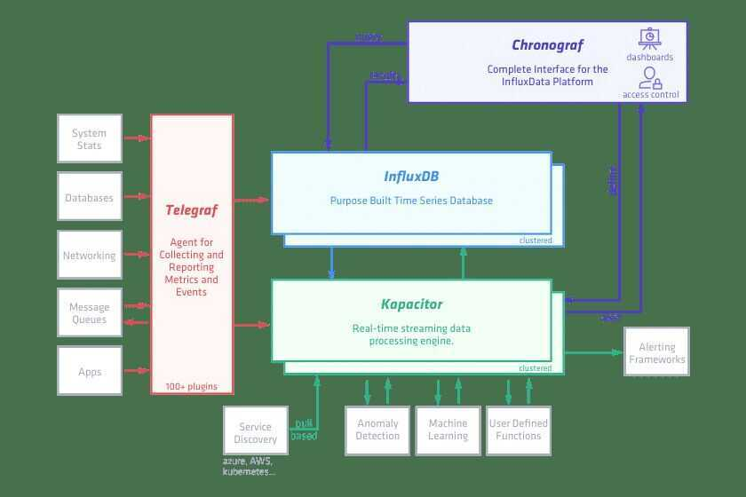

# InfluxDB

Tag sets are indexed, field sets are not. InfluxDB's speed is based on the fact that tag sets are stored in-memory, whereas the field sets are stored on-disk.

## InfluxDB design insights and tradeoffs

InfluxDB is a time series database. Optimizing for this use case entails some tradeoffs, primarily to increase performance at the cost of functionality. Below is a list of some of those design insights that lead to tradeoffs:

1. For the time series use case, we assume that if the same data is sent multiple times, it is the exact same data that a client just sent several times.

- Pro: Simplified [- Conflict resolution](https://docs.influxdata.com/influxdb/v1.7/troubleshooting/frequently-asked-questions/#how-does-influxdb-handle-duplicate-points) increases write performance.
- Con: Cannot store duplicate data; may overwrite data in rare circumstances.

2. Deletes are a rare occurrence. When they do occur it is almost always against large ranges of old data that are cold for writes.

- Pro: Restricting access to deletes allows for increased query and write performance.
- Con: Delete functionality is significantly restricted.

3. Updates to existing data are a rare occurrence and - Contentious updates never happen. Time series data is predominantly new data that is never updated.

- Pro: Restricting access to updates allows for increased query and write performance.
- Con: Update functionality is significantly restricted.

4. The vast majority of writes are for data with very recent timestamps and the data is added in time ascending order.

- Pro: Adding data in time ascending order is significantly more performant.
- Con: Writing points with random times or with time not in ascending order is significantly less performant.

5. Scale is critical. The database must be able to handle a high volume of reads and writes.

- Pro: The database can handle a high volume of reads and writes.
- Con: The InfluxDB development team was forced to make tradeoffs to increase performance.

6. Being able to write and query the data is more important than having a strongly - Consistent view.

- Pro: Writing and querying the database can be done by multiple clients and at high loads.
- Con: Query returns may not include the most recent points if database is under heavy load.

7. Many timeseries are ephemeral. There are often time series that appear only for a few hours and then go away, e.g. a new host that gets started and reports for a while and then gets shut down.

- Pro: InfluxDB is good at managing dis-Continuous data.
- Con: Schema-less design means that some database functions are not supported e.g. there are no cross table joins.

8. No one point is too important.

- Pro: InfluxDB has very powerful tools to deal with aggregate data and large data sets.
- Con: Points don't have IDs in the traditional sense, they are differentiated by timestamp and series.

## InfluxDB schema design and data layouts

Every InfluxDB use case is special and your schema will reflect that uniqueness. There are, however, general guidelines to follow and pitfalls to avoid when designing your schema.

1. General Recommendations
2. Encouraged Schema Design
3. Discouraged Schema Design
4. Shard Group Duration Management

## Basic - Concepts

### 1. Measurement

A measurement is loosely equivalent to the - Concept of a table in relational databases. Measurement is inside which a data is stored and a database can have multiple measurements. A measurement primarily - Consists of 3 types of columns Time, Tags and Fields

### 2. Time

A time is nothing but a column tracking timestamp to perform time series operations in a better way. The default is the Influxdb time which is in nanose- Conds, however, it can be replaced with event time.

### 3. Tags

A tag is similar to an indexed column in a relational database.An important point to remember is that relational operations like WHERE, GROUP BY etc, can be performed on a column only if it is marked as a Tag

### 4. Fields

Fields are the columns on which mathematical operations such as sum, mean, non-negative derivative etc can be performed.However, in recent versions string values can also be stored as a field.

### 5. Series

A series is the most important concept of Influxdb. A series is a combination of tags, measurement, and retention policy (default of Influxdb). An Influxdb database performance is highly dependent on the number of unique series it contains, which in turn is the cardinality of tags *no. of measurement* retention policy

## Glossary of Terms

1. Replication factor
2. Retention policy
3. Schema
4. Series cardinality
5. Shard
6. Shard duration
7. Shard group
8. Subscription
9. tsm (Time Structured Merge tree)
10. wal (Write Ahead Log)

TICK Stack (https://www.influxdata.com/time-series-platform)

- Telegraf
- InfluxDB
- Choronograf
- Kapacitor

