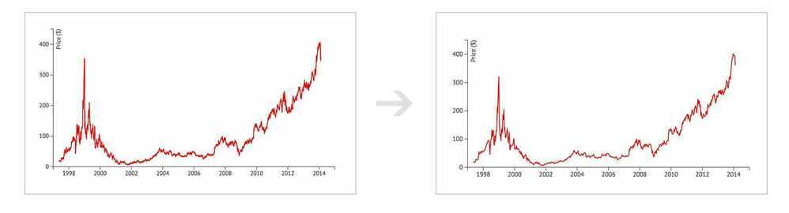

# Time Series Databases

- Optimized for time-stamped or time series data
- built specifically for handling metrics and events or measurements that are time-stamped.
- optimized for measuring change over time.
- Time series are simply measurements or events that are tracked, monitored, downsampled, and aggregated over time.
- Example - server metrics, application performance monitoring, network data, sensor data, events, clicks, trades in a market, analytics data.
- The key difference with time series data from regular data is that you're always asking questions about it over time.
- Properties that make time series data very different than other data workloads are data lifecycle management, summarization, and large range scans of many records.
What Distinguishes the Time Series Workload?

Time Series Databases have key architectural design properties that make them very different from other databases. These include: time-stamp data storage and compression, data lifecycle management, data summarization, ability to handle large time series dependent scans of many records, and time series aware queries.

*For example:* With a Time Series Database, it is common to request a summary of data over a large time period. This requires going over a range of data points to perform some computation like a percentile increase this month of a metric over the same period in the last six months, summarized by month. This kind of workload is very difficult to optimize for with a distributed key value store. TSDB's are optimized for exactly this use case giving millisecond level query times over months of data.

*Another example:* With Time Series Databases, it's common to keep high precision data around for a short period of time. This data is aggregated and downsampled into longer term trend data. This means that for every data point that goes into the database, it will have to be deleted after its period of time is up. This kind of data lifecycle management is difficult for application developers to implement on top of regular databases. They must devise schemes for cheaply evicting large sets of data and constantly summarizing that data at scale. With a Time Series Database, this functionality is provided out of the box.

## Time Series Databases

- [InfluxDB](https://www.influxdata.com/)
- [Kdb+](https://kx.com/discover/)
- [RRDTool](https://oss.oetiker.ch/rrdtool/)
- [Graphite](https://github.com/graphite-project/graphite-web)
- [OpenTSDB](http://opentsdb.net/)
- [Prometheus](https://prometheus.io/)
- [Druid](http://druid.io/)
- [KairosDB](https://github.com/kairosdb/kairosdb)
- [eXtremeDB](http://www.mcobject.com/extremedbfamily.shtml)
- [Riak TS](http://basho.com/products/riak-ts/)
- [Axibase](https://axibase.com/products/axibase-time-series-database/)
- [TimescaleDB](https://www.timescale.com/)
- [FaunaDB](https://fauna.com/)
- [Hawkular Metrics](http://www.hawkular.org/)
- [Warp 10](http://www.warp10.io/)
- GridDB
- [TDengine | Time Series Database Open Source TSDB](https://tdengine.com/)

GridDB is a distributed Key-Value Store (KVS) database built by Toshiba. It has Key-Container data model and time-series functions which are designed specifically to target large data generated by IoT devices. It can be accessed by C and Java APIs, or TQL, a custom SQL-like query language.

https://dbdb.io/db/griddb

## Managed TimeSeries Databases

- Amazon Timestream Database

## References

https://www.influxdata.com/time-series-database

https://misfra.me/2016/04/09/tsdb-list
