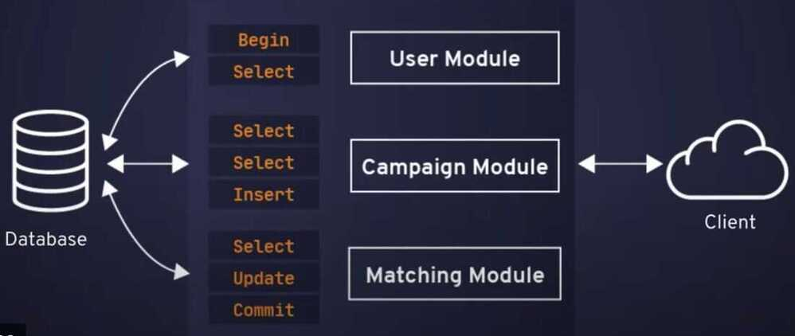

# High Availability (HA) Others

## MySQL Enterprise High Availability

### High Availability with MySQL InnoDB Cluster

MySQL InnoDB Cluster delivers a complete high availability solution for MySQL. Each server in an InnoDB Cluster replicates data to all members of the cluster while providing fault tolerance, automated failover, and elasticity. MySQL InnoDB Cluster provides built-in group membership management, data consistency guarantees, node failure detection and database failover, without the need for manual intervention.

- MySQL Group Replication
- MySQL ReplicaSet
- MySQL ClusterSet
- MySQL Router
- MySQL Shell

#### Disaster Recovery with MySQL InnoDB ClusterSet

MySQL InnoDB ClusterSet provides disaster tolerance for InnoDB Cluster deployments by linking a primary InnoDB Cluster with one or more replicas of itself in different datacenters. InnoDB ClusterSet automatically manages replication from the primary cluster to the replica clusters using a dedicated ClusterSet replication channel. If the primary cluster becomes unavailable due to the loss of the data center or the loss of network connectivity, you can make a replica cluster active instead to restore the availability of the service.

[MySQL Enterprise High Availability](https://www.mysql.com/products/enterprise/high_availability.html)

[Presentation - MySQL Database High Availability Architectures](https://www.mysql.com/content/download/id/768/)

### MySQL NDB Cluster: High Availability

With its distributed, shared-nothing architecture, MySQL NDB Cluster has been carefully designed to deliver 99.999% availability ensuring resilience to failures and the ability to perform scheduled maintenance without downtime.

Protecting against outages:

- **Synchronous Replication** - Data within each data node is synchronously replicated to another data node.
- **Automatic Failover** - MySQL NDB Cluster's heartbeating mechanism instantly detects any failures and automatically fails over, typically within one second, to other nodes in the cluster, without interrupting service to clients.
- **Self Healing** - Failed nodes are able to self-heal by automatically restarting and resynchronizing with other nodes before re-joining the cluster, with complete application transparency
- **Shared Nothing Architecture, No Single Point of Failure** - each node has its own disk and memory, so the risk of a failure caused by shared components such as storage, is eliminated.
- **Geographical Replication** - Geographic replication enables nodes to be mirrored to remote data centers for disaster recovery.

MySQL NDB Cluster also protects against the estimated 30% of downtime resulting from scheduled maintenance activities by allowing on-line operations, including:

- On-Line schema updates
- On-Line scaling (adding nodes for capacity and performance)
- On-Line upgrades and patching of hosts, OS and database
- On-Line backup

[MySQL NDB Cluster: High Availability](https://www.mysql.com/products/cluster/availability.html)

### Master with Active Master (Circular Replication)

Also known as ring topology, this setup requires two or more MySQL servers which act as master. All masters receive writes and generate binlogs with a few caveats:

- You need to set auto-increment offset on each server to avoid primary key collisions.
- There is no conflict resolution.
- MySQL Replication currently does not support any locking protocol between master and slave to guarantee the atomicity of a distributed update across two different servers.
- Common practice is to only write to one master and the other master acts as a hot-standby node. Still, if you have slaves below that tier, you have to switch to the new master manually if the designated master fails.

You can deploy this topology with ClusterControl 1.4 and later. Previously, ClusterControl would raise an alarm because two or more masters were currently running. One master will be configured as read-only while the other is writable. However, locking and conflict resolution need to be handled by the application itself. ClusterControl does not support two writable masters in a replication setup, one of those two masters has to be in read_only mode.

[MySQL replication for high availability | Severalnines](https://severalnines.com/resources/whitepapers/mysql-replication-high-availability/)

## Vitess

Vitess is a database clustering system for horizontal scaling of MySQL through generalized sharding.

By encapsulating shard-routing logic, Vitess allows application code and database queries to remain agnostic to the distribution of data onto multiple shards. With Vitess, you can even split and merge shards as your needs grow, with an atomic cutover step that takes only a few seconds.

### Traditional Transactional Architecture

https://github.com/vitessio/vitess

https://vitess.io

https://www.planetscale.com/blog/videos-intro-to-vitess-its-powerful-capabilities-and-how-to-get-started

[PlanetScale: The world’s most advanced database platform](https://planetscale.com/)

## Others

- [What is MySQL High Availability? How to Choose a Solution](https://www.percona.com/blog/choosing-mysql-high-availability-solutions/)
- [What is MySQL High Availability? | Pure Storage](https://www.purestorage.com/au/knowledge/what-is-mysql-high-availability.html)
- [Architectures for high availability of MySQL clusters on Compute Engine  |  Cloud Architecture Center  |  Google Cloud](https://cloud.google.com/architecture/architectures-high-availability-mysql-clusters-compute-engine)
- [How To Setup MySQL Master Master Replication](https://www.redswitches.com/blog/mysql-master-master-replication/)
- [MySQL Master Master Replication: 4 Easy Steps | Hevo](https://hevodata.com/learn/mysql-master-master-replication/)
- [Galera Cluster for MySQL | The world's most advanced open-source database cluster.](https://galeracluster.com/)
