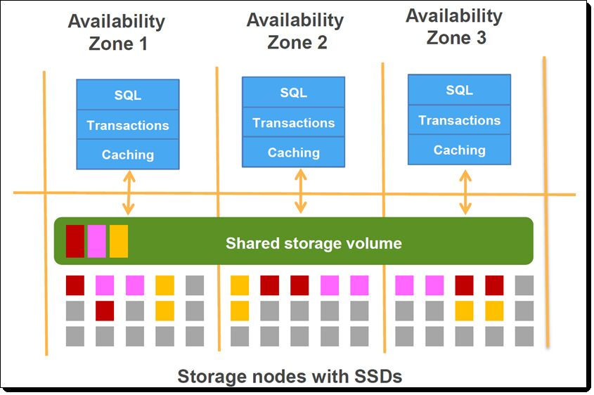

# AWS Aurora

For OLTP

High Performance Managed Relational Database

Amazon Aurora is a relational database offered as a service in Amazon's AWS. Based on the open source version of MySQL, it is a commercial database that claims to be compatible with MySQL and PostgreSQL while providing superior throughput. Being provided as a cloud service, Aurora promises high availability by using distributed replications of backend storage. The system is being actively maintained and updated by Amazon.

## History

Aurora was announced on Nov. 12, 2014 in Amazon's re:Invent conference in Las Vegas. It was officially released and ready to use as a service in AWS on July 27, 2015 by being added into the Amazon Relational Database Service. A major patch of Aurora was added in October 24, 2017, where Aurora was extended with PostgreSQL compatibility.

## Concurrency Control

[Multi-version Concurrency Control (MVCC)](https://dbdb.io/browse?concurrency-control=multi-version-concurrency-control-mvcc)

Aurora decouples the storage engine from its database engine, and the concurrency control protocol is entirely decided by the database engine it used. In the paper that introduced Aurora, the concurrency control model was stated to be exactly the same as the database engine it inherited from. So Aurora has the same concurrency control protocol, MVCC, as MySQL/InnoDB does. InnoDB's MVCC protocol stores a separate data structure for "rollback segments", which are actually undo logs. In the situation of a consistent read (for isolation levels beyond read committed), the logs will be applied in place to reconstruct the requested earlier versions of a row.

## Data Model

[Relational](https://dbdb.io/browse?data-model=relational)

Aurora is stated to be a relational database engine. That can also be inferred from its full inheritance of MySQL/InnoDB's database engine and storage layout.

## Foreign Keys

[Supported](https://dbdb.io/browse?foreign-keys=supported)

Aurora supports foreign keys, just as MySQL/InnoDB does. Best practice guide on Aurora's documentation provided some insights on how to properly use foreign keys, please refer to the citation for more details.

## Indexes

[B+Tree](https://dbdb.io/browse?indexes=btree)[Hash Table](https://dbdb.io/browse?indexes=hash-table)

Aurora uses the same indexes as MySQL/InnoDB. In MySQL, both b-tree and hash indexes are used. The default index choice for MySQL is b-tree unless explicitly specified. Aurora also supports spatial indexes, and its implementation utilizes a b-tree.

## Isolation Levels

[Serializable](https://dbdb.io/browse?isolation-levels=serializable)

In the paper that introduced Aurora, the authors stated that Aurora has exactly the same isolation levels as MySQL. The supported isolation levels includes the standard ANSI levels and Snapshot Isolation.

[Amazon Aurora](https://aws.amazon.com/rds/aurora/) with MySQL compatibility supports the ANSI READ COMMITTED isolation level on read replicas. This isolation level enables long-running queries on an Aurora read replica to execute without impacting the throughput of writes on the writer node.

`SELECT @@TX_ISOLATION;`

`REPEATABLE-READ`

https://docs.aws.amazon.com/AmazonRDS/latest/AuroraUserGuide/AuroraMySQL.Reference.html#AuroraMySQL.Reference.IsolationLevels

## Joins

[Hash Join](https://dbdb.io/browse?joins=hash-join)

Aurora has different join algorithm compared to MySQL. It supports hash join in addition to the already-existing nested loop join in MySQL. When the hash join option is enabled, Aurora's optimizer will automatically choose a join method as it evaluates the query plan. However, there are several restrictions for hash join in Aurora. To be more specific, left-right outer joins, semijoins such as subqueries and multiple-table updates or deletes are not supported.

## Logging

[Logical Logging](https://dbdb.io/browse?logging=logical-logging)

Aurora's logging design is logical logging. The system separates the database engine from the backend storage, where the database engine propagates logs continuously to the backend storage. Such logs are then asynchronously processed by the distributed storage servers to bring the database to its latest state.

## Query Compilation

[Not Supported](https://dbdb.io/browse?query-compilation=not-supported)

Similar to MySQL, Aurora doesn't support query compilation.

## Query Execution

[Tuple-at-a-Time Model](https://dbdb.io/browse?query-execution=tuple-at-a-time-model)

Aurora uses the same query execution engine as MySQL.

## Query Interface

[SQL](https://dbdb.io/browse?query-interface=sql)

Aurora supports the standard SQL query interface. It inherits the SQL compatibility from MySQL, as well as the extensions MySQL made to the SQL standard.

## Storage Architecture

[Disk-oriented](https://dbdb.io/browse?storage-architecture=disk-oriented)

Aurora is a disk-oriented database.

## Storage Model

[N-ary Storage Model (Row/Record)](https://dbdb.io/browse?storage-model=n-ary-storage-model-rowrecord)

Same as MySQL/InnoDB, Aurora is a row-storage DBMS. The tuples are stored row-by-row in the distributed storage servers.

## Stored Procedures

[Supported](https://dbdb.io/browse?stored-procedures=supported)

Same as MySQL/InnoDB, Aurora supports stored procedures.

## System Architecture

[Shared-Nothing](https://dbdb.io/browse?system-architecture=shared-nothing)

Aurora decouples its database engine from the storage backend. The database engine is a modified version with MySQL/InnoDB, where the storage backend consists of distributed replicas that span across different availability zones in AWS. The database engine will propagates logs to the backend storage, and the backend storage utilizes a quorum based synchronization scheme to ensure the consistency of the database.

Aurora architecture works on the basis of a cluster volume that manages the data for all the database instances in that particular cluster. A cluster volume spans across multiple availability zones and is effectively virtual database storage. The underlying storage volume is on top of multiple cluster nodes which are distributed across different availability zones. Separate from this, Aurora database can also have read-replicas. Only one instance usually serves as the primary instance and it supports reads as well as writes. The rest of the instances serve as read-replicas and load balancing needs to be handled by the user. This is different from the multiAZ deployment, where instances are located across the availability zone and support automatic failover.

[Amazon Aurora](https://aws.amazon.com/rds/aurora/) is a relational database that was designed to take full advantage of the abundance of networking, processing, and storage resources available in the cloud. While maintaining compatibility with MySQL and PostgreSQL on the user-visible side, Aurora makes use of a modern, purpose-built distributed storage system under the covers. Your data is striped across hundreds of storage nodes distributed over three distinct AWS Availability Zones, with two copies per zone, on fast SSD storage. Here's what this looks like:

- Asynchronous Key Fetch
- Batched Scans

## Views

[Materialized Views](https://dbdb.io/browse?views=materialized-views)

Same as MySQL, Aurora supports materialized views

https://dbdb.io/db/aurora

https://aws.amazon.com/rds/aurora/faqs

## Questions

- Since storage is shared how will delete in reader work?
- Can you write in aurora reader

## Others

[AWS — Difference between Amazon Aurora and Amazon RDS | by Ashish Patel | Awesome Cloud | Medium](https://medium.com/awesome-cloud/aws-difference-between-amazon-aurora-and-amazon-rds-comparison-aws-aurora-vs-aws-rds-databases-60a69dbec41f)

[Aurora vs RDS: How to Choose the Right AWS Database Solution](https://www.percona.com/blog/when-should-i-use-amazon-aurora-and-when-should-i-use-rds-mysql/)

[Overview of Database Activity Streams - Amazon Aurora](https://docs.aws.amazon.com/AmazonRDS/latest/AuroraUserGuide/DBActivityStreams.Overview.html)
