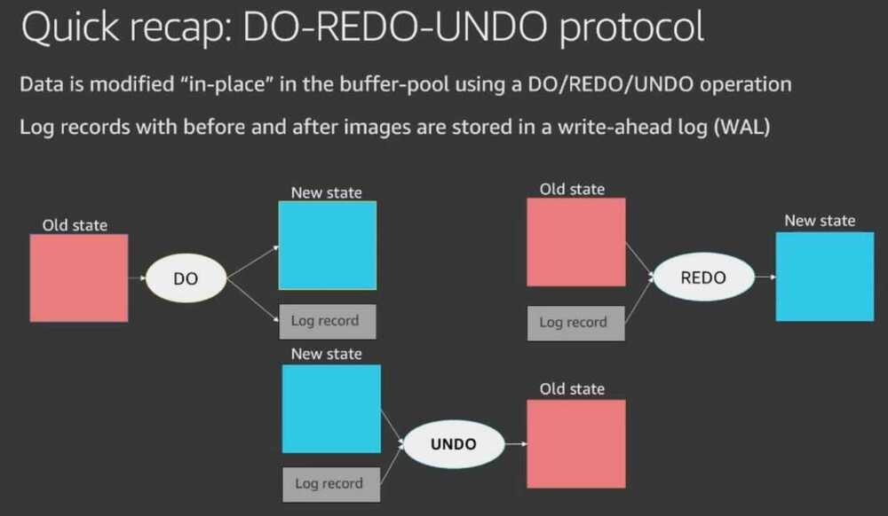
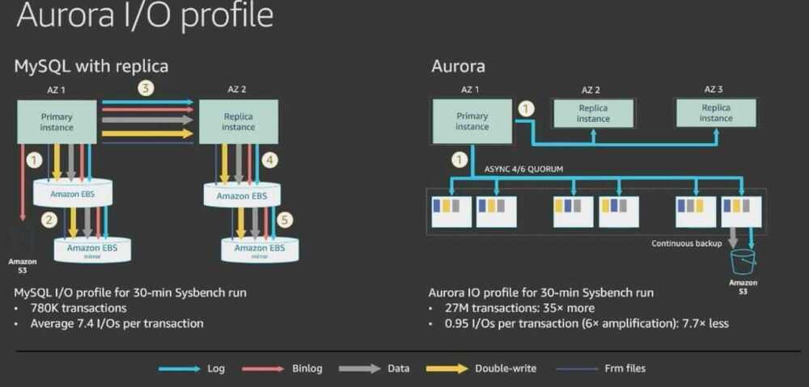
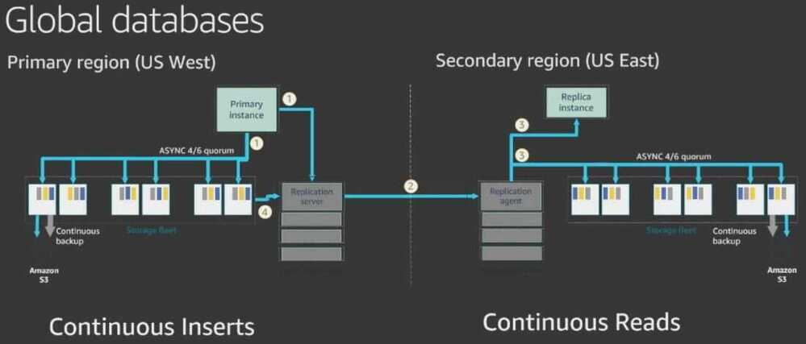
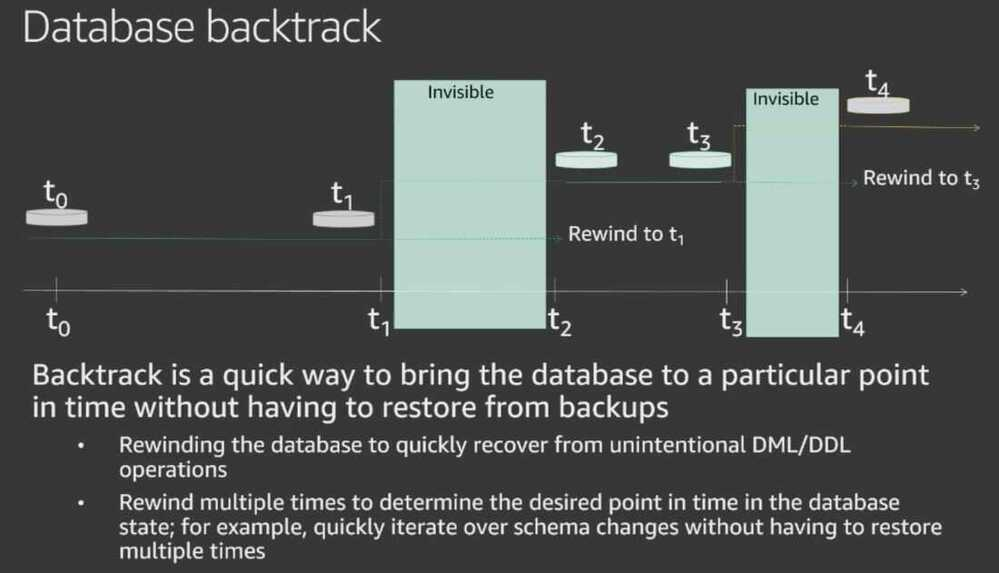

# Storage

[AWS re:Invent 2019: [REPEAT 1] Amazon Aurora storage demystified: How it all works (DAT309-R1)](https://www.youtube.com/watch?v=DrtwAOND1Pc)

[Amazon Aurora storage and reliability - Amazon Aurora](https://docs.aws.amazon.com/AmazonRDS/latest/AuroraUserGuide/Aurora.Overview.StorageReliability.html)

## Cost

| Storage Rate | $0.11per GB-month           |
|--------------|-------------------------------|
| I/O Rate     | $0.22per 1 million requests |

S3 - $0.025per GB

## Storage

The minimum storage is 10GB. Based on your database usage, your Amazon Aurora storage will automatically grow, up to 64 TB, in 10GB increments with no impact to database performance. There is no need to provision storage in advance

## Cloud native database architecture

## Traditional database architecture

- Databases are all about I/O
- Design principles for > 40 years
    - Increase I/O bandwidth
    - Decrease number of I/Os

## Aurora approach: Log is the database

## Aurora approach: Offload checkpointing to the storage fleet

## Durability at scale

## Aurora uses segmented storage

- Partition volume into n fixed-size segments
    - Replicate each segment 6 ways into a protection group (PG)
- Trade-off between likelihood of faults and time to repair
    - If segments are too small, failures are more likely
    - If segments are too big, repairs take too long
- Choose the biggest size that lets us repair "fast enough"
    - We currently picked a segment size of 10 GB, as we repair a 10-GB segment in less than a minute

## Performance results

## Global databases

## Fast database cloning

## Database backtrack

