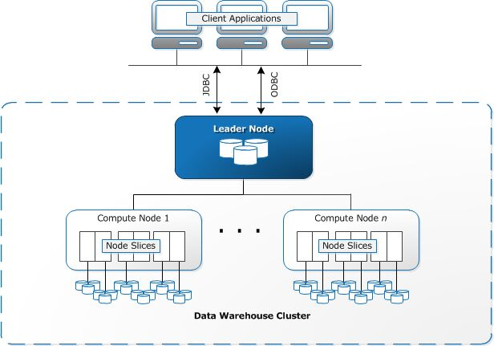
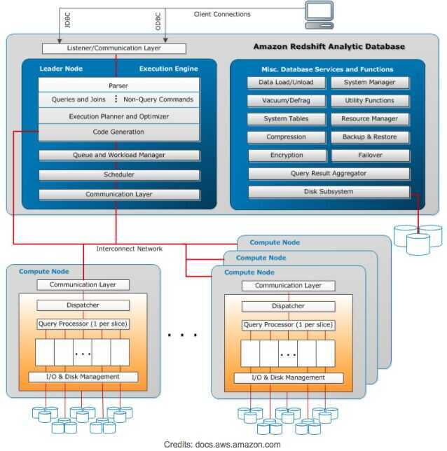

# Architecture

Redshift is meant to work in a Cluster formation. A typical Redshift Cluster has two or more**Compute Nodes** which are coordinated through a**Leader Node**.All client applications communicate with the cluster only with the Leader Node.

## Leader Node

The Leader Node in an Amazon Redshift Cluster manages all external and internal communication. It is responsible for preparing query execution plans whenever a query is submitted to the cluster. Once the query execution plan is ready, the Leader Node distributes query execution code on the compute nodes and assigns slices of data to each to compute node for computation of results.

Leader Node distributes query load to compute node only when the query involves accessing data stored on the compute nodes. Otherwise, the query is executed on the Leader Node itself. There are several functions in Redshift architecture which are always executed on the Leader Node. You can read [SQL Functions Supported on the Leader Node](http://docs.aws.amazon.com/redshift/latest/dg/c_sql-functions-leader-node.html) for more information on these functions.

## Compute Nodes

Compute Nodes are responsible for the actual execution of queries and have data stored with them. They execute queries and return intermediate results to the Leader Node which further aggregates the results.

There are two types of Compute Nodes available in Redshift architecture:

- Dense Storage (DS) --Dense Storage nodes allow you to create large data warehouses using Hard Disk Drives (HDDs) for a low price point.
- Dense Compute (DC) --Dense Compute nodes allow you to create high-performance data warehouses using Solid-State Drives (SSDs).

A more detailed explanation of how responsibilities are divided among Leader and Compute Nodes are depicted in the diagram below:

## Node slices

A compute node consist of slices. Each Slice has a portion of Compute Node's memory and disk assigned to it where it performs Query Operations. The Leader Node is responsible for assigning a Query code and data to a slice for execution. Slices once assigned query load work in parallel to generate query results.

Data is distributed among the Slices on the basis of [Distribution Style and Distribution Key](https://hevodata.com/blog/redshift-distribution-keys/) of a particular table. An even distribution of data enables Redshift to assign workload evenly to slices and maximizes the benefit of parallel processing.

Number of Slices per Compute Node is decided on the basis of the type of node. You can find more information onClusters and Nodes.

## Massively parallel processing (MPP)

Amazon Redshift architecture allows it to use Massively parallel processing (MPP) for fast processing even for the most complex queries and a huge amount of data set. Multiple compute nodes execute the same query code on portions of data to maximize parallel processing.

## Columnar Data Storage

Data in Amazon Redshift data warehouse is stored in a columnar fashion which drastically reduces the I/O on disks. Columnar storage reduces the number of disk I/O requests and minimizes the amount of data loaded into the memory to execute a query. Reduction in I/O speeds up query execution and loading less data means Redshift can perform more in-memory processing.

Redshift uses Sort Keys to sort columns and filter out chunks of data while executing queries. You can read more about Sort Keys in our post on [Choosing the best Sort Keys](https://hevodata.com/blog/redshift-sort-keys-choosing-best-sort-style/)

## Data Compression

Data compression is one of the important factors in ensuring query performance. It reduces storage footprint and enables loading of large amounts of data in the memory fast. Owing to Columnar storage, Redshift can use adaptive compression encoding depending on the column data type. Read more about using compression encodings in [Compression Encodings in Redshift](http://docs.aws.amazon.com/redshift/latest/dg/c_Compression_encodings.html).

## Query Optimizer

Redshift's Query Optimizer generate query plans that are MPP-aware and takes advantage of Columnar Data Storage. Query Optimizer uses analyzed information about tables to generate efficient query plans for execution. Read more about [Analyze](https://hevodata.com/blog/redshift-vacuum-and-analyze/) to know how to make the best of Query Optimizer.

https://hevodata.com/blog/redshift-architecture

https://docs.aws.amazon.com/redshift/latest/dg/c_high_level_system_architecture.html
