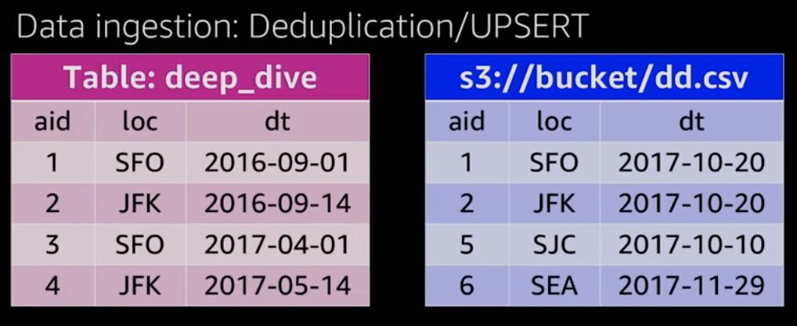
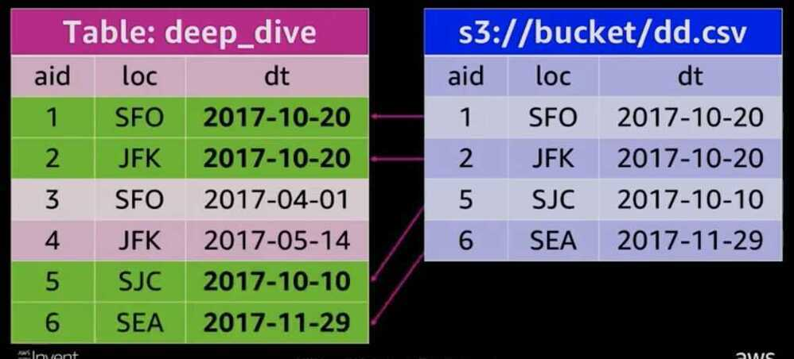
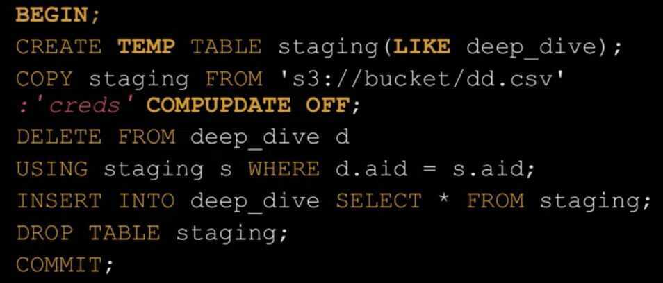

# Deep dive / Best practices

## Insert performance

<https://stackoverflow.com/questions/16485425/aws-redshift-jdbc-insert-performance>

## Optimizations / Best practices

<https://aws.amazon.com/about-aws/whats-new/2020/12/amazon-redshift-announces-automatic-table-optimization>

[**https://docs.aws.amazon.com/redshift/latest/dg/c_designing-tables-best-practices.html**](https://docs.aws.amazon.com/redshift/latest/dg/c_designing-tables-best-practices.html)

[**https://docs.aws.amazon.com/redshift/latest/dg/c_designing-queries-best-practices.html**](https://docs.aws.amazon.com/redshift/latest/dg/c_designing-queries-best-practices.html)

<https://www.youtube.com/watch?v=TJDtQom7SAA>

<https://aws.amazon.com/blogs/big-data/top-8-best-practices-for-high-performance-etl-processing-using-amazon-redshift>

<https://aws.amazon.com/blogs/big-data/top-10-performance-tuning-techniques-for-amazon-redshift>

<https://aws.amazon.com/blogs/big-data/amazon-redshift-engineerings-advanced-table-design-playbook-preamble-prerequisites-and-prioritization>

## Data storage, ingestion and ELT

- **Redundancy**

Amazon Redshift utilizes locally attached storage devices

Compute nodes have 2 to 3 times the advertised storage capacity

Global commit ensures all permanent tables have written blocks to another node in the cluster to ensure data redundancy

Asynchronously backup blocks to Amazon S3 - always consistent snapshot

Every 5 GB of changed data or eight hours

User on-demand manual snapshots

To disable backups at the table level: CREATE TABLE example (id int) BACKUP NO;
Temporary tables

Blocks are not mirrored to the remote partition - two-times faster write performance

Do not trigger a full commit or backups

- **Transactions**

Amazon Redshift is a fully transactional, ACID complaint data warehourse

- Isolation level is serializable
- Two phase commits (local and global commit phases)

Design consideration

- Because of the expense of commit overhead, limit commits by explicitly creating transactions- **Data ingestion: COPY statement**

Ingestion throughput

Each slice's query processors can load one file at a time:

- Streaming decompression
- Parse
- Distribute
- Write

Realizing only partial node usage at 6.25% of slices are active

Number of input files should be a multiple of the number of slices

Splitting the single file into 16 input files, all slices are working to maximize ingestion performance

COPY continues to scale linearly as you add nodes

Recommendation is to use delimited files - 1 MB to 1 GB after gzip compression- **Best practices: COPY ingestion**

Delimited files are recommend

- Pick a simple delimites '|' or ',' or tabs
- Pick a simple NULL character (N)
- Use double quotes and an escape character ('') for varchars
- UTF-8 varchar columns take four bytes per char

Split files into a nuber that is a multiple of the total number of slices in the Amazon Redshift cluster

SELECT count(slice) from stv_slices;- **Data ingestion: Amazon Redshift Spectrum**

Use INSERT INTO SELECT against external Amazon S3 tables

- Aggregate incoming data
- Select subset of columns and/or rows
- Manipulate incoming column data with SQL

Best practices:

- Save cluster resources for querying and reporting rather than on ELT
- Filtering/aggregating incoming data can improve performance over COPY

Design considerations

- Repeated reads against Amazon S3 are not transactional
- $5/TB of (compressed) data scanned
- **Design considerations: Data ingestion**

Designed for large writes

- Batch processing system, optimized for processing massive amounts of data
- 1 MB size plus immutable blocks means that we clone blocks on write so as not to introduce fragmentation
- Small write (~1~10 rows) has similar cost to a larger write (~100K rows)

UPDATE and DELETE

- Immutable blocks means that we only logically delete rows on UPDATE or DELETE
- Must VACUUM or DEEP COPY to remove ghost rows from table

Steps

1. Load CSV data into a staging table
2. Delete duplicate data from the production table
3. Insert (or append) data from the staging into the production table

Create a Transaction

## Best practices: ELT

Wrap workflow/statements in an explicit transaction

Consider using DROP TABLE or TRUNCATE instead of DELETE

Staging tables:

- Use temporary table or permanent table with the "BACKUP NO" option
- If possible use DISTSTYLE KEY on both the staging table and production table to speed up the the INSERT INTO SELECT statement
- Turn off automatic compression - COMPUPDATE OFF
- Copy compression settings from production table or use ANALYZE COMPRESSION statement
  - Use CREATE TABLE LIKE or write encodings into the DDL
- For copying a large number of rows (> hundreds of millions) consider using ALTER TABLE APPEND instead of INSERT INTO SELECT
VACUUM and ANALYZE

VACCUM will globally sort the table and remove rows that are marked as deleted

- For tables with a sort key, ingestion operations will locally sort new data and write it into the unsorted region
ANALYZE collects table statistics for optimal query planning
Best Practices:
- VACUUM should be run only as necessary
  - Typically nightly or weekly
  - Consider Deep Copy (recreating and copying data) for larger or wide tables
- ANALYZE can be run periodically after ingestion on just the columns taht WHERE predicates are filtered on
- Utility to VACUUM and ANALYZE all the tables in the cluster

## Workload management (WLM) and query monitoring rules

Allows for the separation of different query workloads

Goals

- Prioritize important queries
- Throttle/abort less important queries

Control concurrent number of executing of queries

Divide cluster memory

Set query timeouts to abort long running queries

## Terminology and Concepts

## WLM attributes

### Queues

- Assigned a percentage of cluster memory
- SQL queries execute in queue based on
  - Use group: which groups the user belongs to
  - Query group session level variable

### Short query acceleration (SQA)

- Automatically detech short running queries and run them within the short query queue if queuing occurs

## Queue attributes

- Query slots (or Concurrency)
  - Devision of memory within a WLM queue, correlated with the number of simultaneous running queries
  - WLM_QUERY_SLOT_COUNT is a session level variable
    - Useful to increase for memory intensive operations (example: large COPY, VACUUM, larege INSERT INTO SELECT)
- Concurrency Scaling
  - When queues are full, queries are routed to transient Amazon Redshift clusters

## Workload management: Example

## Use Case

- Light ingestion/ELT on a continuous cadence of 10 minutes
- Peak reporting workload during business hours (7 a.m. - 7 p.m.)
- Heavy ingestion / ELT nightly (11 p.m. - 2 a.m.)

## User types

- Business reporting and dashboards
- Analysts and data science teams
- Database administrators

## Create a queue for each workload type

- Unallocated memory goes into a general pool that can be used by any queue

- Enable: Short Query Acceleration
- Hidden superuser queue can be used by admins manually switched into:

SET query_group TO 'superuser'

- The superuser queue has a single slot, the equivalent of 5-7% memory allocation, and no timeout

## Query monitoring rules (QMR)

- Extension of workload management (WLM)
- Allow the automatic handling of runaway (poorly written) queries
- Rules applied to a WLM queue allow queries to be
  - LOGGED
  - ABORTED
  - HOPPED
- Goals
  - Protect against wasteful use of the cluster
  - Log resource-intensive queries

## WLM and QMR

- Keep the number of WLM queues to a minimum, typically just three queues to avoid having unused queues
- Use WLM to limit ingestion/ELT concurrency to two to three
- To maximize query throughput, use WLM to throttle the number of concurrent queries to 15 or less
- Use QMR rather than WLM to set query timeouts
- Use QMR to log long running queries
- Save the superuser queue for administration tasks and cenceling queries
<https://github.com/awslabs/amazon-redshift-utils>

[AWS re:Invent 2018: [REPEAT 1] Deep Dive and Best Practices for Amazon Redshift (ANT401-R1)](https://www.youtube.com/watch?v=TJDtQom7SAA)

## ETL in Redshift

## AWS Data pipeline

AWS data pipeline can integrate with all the available AWS services and provides templates with Redshift or S3 as a target. If you are imagining an ELT system, it would be worthwhile to use the Redshift target template directly so that the data is loaded directly to Redshift. That said, internally even this will use S3 as intermediate storage, but the end-user does not have to worry about that. One issue with AWS data pipeline is that it normally works in the batch mode as periodically scheduled jobs and this does not do a good job in case the data extraction needs to be in real-time or near-real-time.

## AWS RDS Sync with Redshift

If your source data is in RDS and wants to sync the RDS directly to Redshift in real-time, AWS offers partner solutions like Attunity and Flydata which works based on bin log streaming.

## COPY Command

The COPY command loads data into Amazon Redshift tables from either data files or Amazon DynamoDB tables.The copied files may reside in an S3 bucket, an EMR cluster or on a remote host accessed via SSH.Data is loadable from fixed-width, character-delimited text files, including CSV, AVRO and JSON format. Default format is character-delimited UTF-8 text files, delimited by the pipe (|) char.Rows to be copied may not be larger than 4 MB from any single source.Root users and IAM users must have INSERT privileges to modify Redshift (RS) tables.- Use a single COPY command to load from multiple files

- Split your load data
  - When you load compressed data, with the COPY command from multiple files, the data loads in parallel. This divides the workload among the nodes in your cluster. When you load all the data from a single large, compressed file, Amazon Redshift is forced to perform a serialized load, which is much slower.
  - In contrast, when you load delimited data from a large, uncompressed file, Amazon Redshift makes use of multiple slices. These slices work in parallel, automatically. This provides fast load performance. Specifically, when Amazon Redshift loads uncompressed, delimited data, data is split into ranges and handled by slices in each node.
  - If you intend to load data from a large, compressed file, we recommend that you split your data into smaller files that are about equal size, from 1 MB to 1 GB after compression. For optimum parallelism, the ideal file size is 1--125 MB after compression. Make the number of files a multiple of the number of slices in your cluster.
<https://docs.aws.amazon.com/redshift/latest/dg/c_loading-data-best-practices.html>

## Copy Job

Automatically loads the new files detected in the specified Amazon S3 path

<https://aws.amazon.com/about-aws/whats-new/2022/11/amazon-redshift-supports-auto-copy-amazon-s3>

## AWS Glue

## Redshift ETL Best Practices

1. While using the COPY command of Redshift, it is always better to use it on multiple source files rather than one big file. This helps in parallelly loading them and can save a lot of time. Using a manifest file is recommended in case of loading from multiple files.
2. In cases where data needs to be deleted after a specific time, it is better to use the time series tables. This involves creating different tables for different time windows and dropping them when that data is not needed. Dropping a table is way faster than deleting rows from one master table.
3. Execute 'VACUUM' command at regular intervals and after the large update or delete operations. Also, use 'ANALYZE' command frequently to ensure that database statistics are updated.
4. AWS workload management queues enable the user to prioritize different kinds of Redshift loads by creating separate queues for each type of job. It is recommended to create a separate queue for all the ETL jobs and a separate one for reporting jobs.
5. For transformations that span across multiple SQL statements, it is recommended to execute 'commit' command after the complete group is executed rather than committing after each statement. For example, let's say there are two INSERT statements in one of your ETL steps. It is better to use the COMMIT statement after both the statements than using a COMMIT after each statement.
6. While using intermediate tables and transferring data between an intermediate table and master table, it is better to use 'ALTER table APPEND' command to insert data from the temporary table to the target table. This command is generally faster than using "CREATE TABLE AS" or "INSERT INTO" statements. It is to be noted that 'ALTER table APPEND' command empties the source table.
7. If there is a need to extract a large amount of data from Redshift and save to S3 or other storage, it is better to use 'UNLOAD' command rather than 'SELECT' command since the former command will be executed parallelly by all the nodes saving a lot of time.
