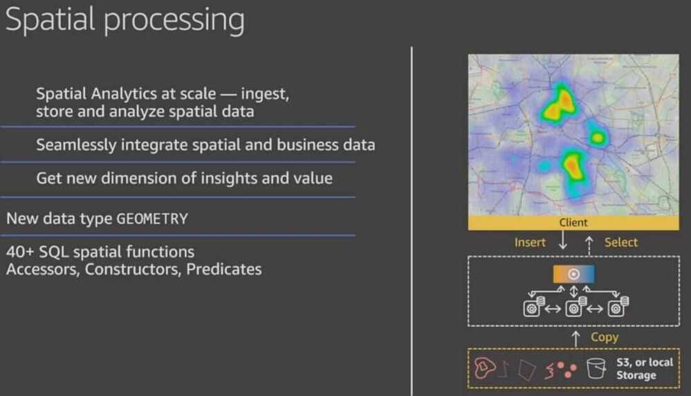

# Others

## Column level access controls

https://aws.amazon.com/about-aws/whats-new/2020/03/announcing-column-level-access-control-for-amazon-redshift

https://aws.amazon.com/blogs/aws/new-aqua-advanced-query-accelerator-for-amazon-redshift

Amazon Redshift spatial provides location-based analytics for rich insights into your data. It seamlessly integrates spatial and business data to provide analytics for decision making.[Amazon Redshift launched native spatial data processing support in November 2019](https://aws.amazon.com/about-aws/whats-new/2019/11/amazon-redshift-announces-support-spatial-data/), with a polymorphic data type GEOMETRY and several key SQL spatial functions. We now support GEOGRAPHY data type, and our library of SQL spatial functions has grown to 80. We support all the common spatial datatypes and standards, including Shapefiles, GeoJSON, WKT, WKB, eWKT, and eWKB.

## Vacuum and Analyze commands

https://hevodata.com/blog/redshift-vacuum-and-analyze

https://docs.aws.amazon.com/redshift/latest/dg/t_Reclaiming_storage_space202.html

https://docs.aws.amazon.com/redshift/latest/dg/r_VACUUM_command.html

## Auto WLM with queue priority

https://docs.aws.amazon.com/redshift/latest/dg/automatic-wlm.html

## Others

STL Load Errors - https://docs.aws.amazon.com/redshift/latest/dg/r_STL_LOAD_ERRORS.html

https://docs.aws.amazon.com/redshift/latest/dg/c_serial_isolation.html
