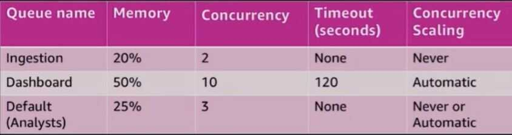

# Workload management (WLM) and query monitoring rules (QMR)

## Workload management (WLM)

Allows for the separation of different query workloads

Goals

- Prioritize important queries
- Throttle/abort less important queries

Control concurrent number of executing of queries

Divide cluster memory

Set query timeouts to abort long running queries

### WLM attributes

#### Queues

- Assigned a percentage of cluster memory
- SQL queries execute in queue based on
    - Use group: which groups the user belongs to
    - Query group session level variable

#### Short query acceleration (SQA)

- Automatically detech short running queries and run them within the short query queue if queuing occurs

### Queue attributes

- Query slots (or Concurrency)
    - Devision of memory within a WLM queue, correlated with the number of simultaneous running queries
    - WLM_QUERY_SLOT_COUNT is a session level variable
        - Useful to increase for memory intensive operations (example: large COPY, VACUUM, larege INSERT INTO SELECT)
- Concurrency Scaling
    - When queues are full, queries are routed to transient Amazon Redshift clusters

### Workload management: Example

#### Use Case

- Light ingestion/ELT on a continuous cadence of 10 minutes
- Peak reporting workload during business hours (7 a.m. - 7 p.m.)
- Heavy ingestion / ELT nightly (11 p.m. - 2 a.m.)

#### User types

- Business reporting and dashboards
- Analysts and data science teams
- Database administrators

#### Create a queue for each workload type

- Unallocated memory goes into a general pool that can be used by any queue

- Enable: Short Query Acceleration
- Hidden superuser queue can be used by admins manually switched into:

SET query_group TO 'superuser'

- The superuser queue has a single slot, the equivalent of 5-7% memory allocation, and no timeout

## Query monitoring rules (QMR)

- Extension of workload management (WLM)
- Allow the automatic handling of runaway (poorly written) queries
- Rules applied to a WLM queue allow queries to be
    - LOGGED
    - ABORTED
    - HOPPED
- Goals
    - Protect against wasteful use of the cluster
    - Log resource-intensive queries

## WLM and QMR

- Keep the number of WLM queues to a minimum, typically just three queues to avoid having unused queues
- Use WLM to limit ingestion/ELT concurrency to two to three
- To maximize query throughput, use WLM to throttle the number of concurrent queries to 15 or less
- Use QMR rather than WLM to set query timeouts
- Use QMR to log long running queries
- Save the superuser queue for administration tasks and cenceling queries

https://github.com/awslabs/amazon-redshift-utils

[AWS re:Invent 2018: [REPEAT 1] Deep Dive and Best Practices for Amazon Redshift (ANT401-R1)](https://www.youtube.com/watch?v=TJDtQom7SAA)
