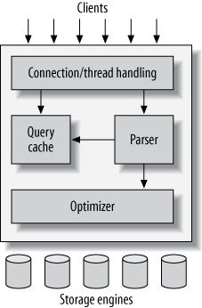
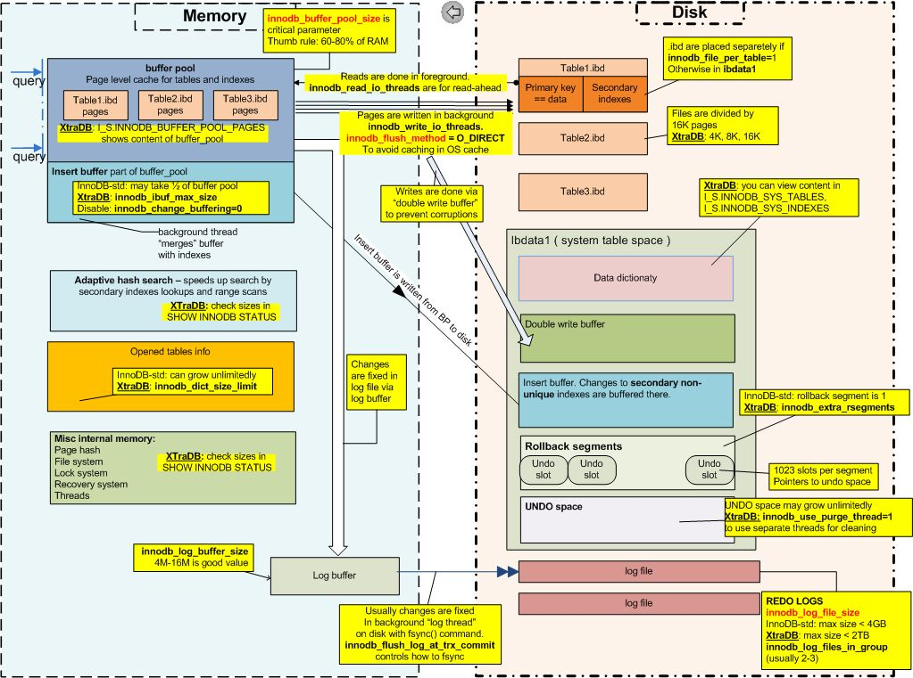

# MySQL

Many tables and relationship between tables

Full set of ACID properties

Master slave architecture, so scales up pretty well

MySQL is an open-source relational database management system. It is considered a "fast, stable, and true multi-user, multi-threaded sql server." MySQL is used in many web applications and websites, and there are several commercial databases that are compatible with it. Users interact with the database through the Structured Query Language (SQL). The default version of MySQL uses InnoDB as a storage engine. However, the MySQL storage engine architecture is pluggable, allowing for a specialized storage engine to be used. MySQL has been actively updated and supported since 1995, with new versions being released every 1-3 years. Several MySQL forks exist, most notably MariaDB, which is led by the original MySQL developers. Oracle, which acquired MySQL in 2010, offers several paid editions of the DBMS that offer additional features.

- MySQL is the most popular open source SQL database. It is typically used for web application development, and often accessed using PHP.
- The main advantages of MySQL are that it is easy to use, inexpensive, reliable (has been around since 1995) and has a large community of developers who can help answer questions.
- Some of the disadvantages are that it has been known to suffer from poor performance when scaling, open source development has lagged since Oracle has taken control of MySQL, and it does not include some advanced features that developers may be used to.

## History

MySQL was first released on May 23, 1995. It was created by MySQL AB, and first developed by two of MySQL AB's founders, David Axmark and Monty Widenius. Sun Microsystems acquired MySQL AB in 2008, and thus Oracle acquired MySQL through their 2010 acquisition of Sun. In response to the Oracle purchase, Michael Widenius forked MySQL, creating MariaDB.

InnoDB became the default storage engine for MySQL at version 5.5, in 2010. Prior to this, the default storage engine had been MyISAM, which lacked transaction support and foreign key support. Some MySQL forks also used a fork of InnoDB.

## Checkpoints

[Fuzzy](https://dbdb.io/browse?checkpoints=fuzzy)

InnoDB takes fuzzy checkpoints during normal operation. When the database shuts down, it takes a sharp checkpoint.

## Compression

[Naïve (Page-Level)](https://dbdb.io/browse?compression=naive-page-level)

InnoDB supports table compression and page compression. Specifically, InnoDB supports transparent page compression. The algorithms used for compression are Zlib and LZ4. In order to compress or uncompress an existing table, the table must be rebuilt. The compressed data is held in small pages in the buffer pool, but in order to extract or update column values, MySQL must also create an uncompressed page in the buffer pool, containing the uncompressed data.

## Concurrency Control

[Multi-version Concurrency Control (MVCC)](https://dbdb.io/browse?concurrency-control=multi-version-concurrency-control-mvcc)[Two-Phase Locking (Deadlock Detection)](https://dbdb.io/browse?concurrency-control=two-phase-locking-deadlock-detection)

MySQL/InnoDB utilizes Multi-version Concurrency Control. In doing so, it seeks to combine the benefits of a multi-versioning database with two phase locking. InnoDB stores information about the old versions of changed rows in a data structure called a rollback segment. This information is used to perform undo operations in the event that a transaction rollback is required. InnoDB uses shared, exclusive, intention, record, gap, next-key, insert intention, and AUTO-INC locks. In addition, when handling spatial indexes, InnoDB utilizes predicate locks.

## Data Model

[Relational](https://dbdb.io/browse?data-model=relational)

MySQL supports a relational model.

## Foreign Keys

[Supported](https://dbdb.io/browse?foreign-keys=supported)

MySQL supports foreign keys and utilizes foreign key constraints to keep the data consistent. InnoDB does not support foreign keys for tables with user-defined partitioning, though certain NDB tables can.

## Indexes

[B+Tree](https://dbdb.io/browse?indexes=btree)

The default InnoDB indexes are B+Tree data structures. MySQL also supports spatial indexes, which use R-trees. Earlier versions supported hash indexes, but current versions do not and hash indexes have been entirely replaced by B+Trees.

Most MySQL indexes (PRIMARY KEY,UNIQUE,INDEX, andFULLTEXT) are stored in [B-trees](https://dev.mysql.com/doc/refman/8.0/en/glossary.html#glos_b_tree). Exceptions: Indexes on spatial data types use R-trees;MEMORYtables also support [hash indexes](https://dev.mysql.com/doc/refman/8.0/en/glossary.html#glos_hash_index);InnoDBuses inverted lists forFULLTEXTindexes.

https://dev.mysql.com/doc/refman/8.0/en/mysql-indexes.html

## Isolation Levels

[Read Uncommitted](https://dbdb.io/browse?isolation-levels=read-uncommitted)[Read Committed](https://dbdb.io/browse?isolation-levels=read-committed)[Serializable](https://dbdb.io/browse?isolation-levels=serializable)[Repeatable Read](https://dbdb.io/browse?isolation-levels=repeatable-read)

MySQL/InnoDB supports all four of the isolation levels defined by the ANSI/ISO SQL standard - read uncommitted, read committed, repeatable read, and serializable. The default isolation level for InnoDB is repeatable read isolation.

## Joins

[Nested Loop Join](https://dbdb.io/browse?joins=nested-loop-join)

MySQL uses the Nested-Loop Join Algorithm and the Block Nested-Loop Join Algorithm to execute joins between tables. The Block Nested-Loop Join Algorithm reduces the number of times the inner table must be read by buffering rows read in the outer loops, making the join faster.

## Logging

[Physical Logging](https://dbdb.io/browse?logging=physical-logging)[Physiological Logging](https://dbdb.io/browse?logging=physiological-logging)

MySQL uses the InnoDB transaction log to support data durability. The InnoDB transaction log handles REDO logging using a physiological logging scheme, which maintains atomicity, consistency, and durability. MySQL also has several server logs, though by default, none of them are enabled. The server logs use physical logging.

## Query Compilation

[Not Supported](https://dbdb.io/browse?query-compilation=not-supported)

## Query Execution

[Tuple-at-a-Time Model](https://dbdb.io/browse?query-execution=tuple-at-a-time-model)

MySQL supports an iterator query processing model. Its iterator interface is tuple-at-a-time, and it does not support intra-query parallelism.

## Query Interface

[SQL](https://dbdb.io/browse?query-interface=sql)

MySQL supports the standard SQL query interface to load data and execute queries. However, there are some slight differences between the MySQL implementation and the standard interface. These differences are found in the utilization of certain commands in the Sybase SQL extension and in the behavior of UPDATE. There are also a few foreign key differences, primarily due to InnoDB. MySQL has also removed the "--" start-comment sequence allowed by SQL, and instead uses only the C syntax comment style used by SQL. In addition, MySQL supports several extensions to the standard SQL query interface.

## Storage Architecture

[Disk-oriented](https://dbdb.io/browse?storage-architecture=disk-oriented)

MySQL/InnoDB is a disk-oriented DBMS. InnoDB uses disk storage and a buffer pool divided into pages in main memory to cache table and index data as it is accessed.The buffer pool uses an LRU replacement policy, moving older pages toward the tail of a sublist as other pages are used, until they are evicted.

## Storage Model

[N-ary Storage Model (Row/Record)](https://dbdb.io/browse?storage-model=n-ary-storage-model-rowrecord)

MySQL/InnoDB is a row-storage DBMS. InnoDB supports four row formats, which determine how the data is stored within the B-trees. The formats are redundant, compact, dynamic, and compressed.

## Storage Organization

[Copy-on-Write / Shadow Paging](https://dbdb.io/browse?storage-organization=copy-on-write-shadow-paging)

InnoDB tables arrange the data on disk based on primary keys, in order to optimize queries. Each table has a clustered index, which is a primary key index that organizes the data. InnoDB primarily uses a buffer pool, change buffer, adaptive hash index, and log buffer as in memory structures, while the disk structures used are primarily tables, indexes, tablespaces, and the doublewrite buffer. InnoDB uses a doublewrite buffer, one of the disk structures, to write pages after they have been flushed, prior to writing pages to the actual data file.

## Stored Procedures

[Supported](https://dbdb.io/browse?stored-procedures=supported)

MySQL supports stored procedures. Supported stored procedures must be written in SQL.

## System Architecture

[Shared-Everything](https://dbdb.io/browse?system-architecture=shared-everything)

MySQL is a shared-everything DBMS. The architecture of the system is comprised of three layers.

The topmost layer is the client application, which contains services such as connection handling, authentication, and security. Each client receives its own thread for connecting to the server. All of that client's queries will be executed within that thread.

The middle layer is the MySQL server layer, which handles the logic of the DBMS. The second layer handles query parsing, analysis, optimization, caching, and built-in functions. This is the layer that handles stored procedures and views.

The third and final layer is responsible for storing and retrieving all of the data. MySQL utilizes a pluggable storage engine architecture, and thus communicates with the selected storage engine - the default of which is InnoDB - using thestorage engine API. Thestorage engine APIallows for different storage engines to be used with MySQL while allowing the DBMS to provide similar levels of functionality.

## Views

[Virtual Views](https://dbdb.io/browse?views=virtual-views)

MySQL supports views, including updatable and insertable views. It does not natively support materialized views

https://dbdb.io/db/mysql

## Architecture

MySQLs design supports a wide range of underlying storage engines, here's a simple picture to illustrate that.

Clients connect to MySQL and issues queries (which may or may not already be cached), these queries are parsed, optimized, and then MySQL through a defined API will interact with a chosen storage engine to retrieve/persist data. Each storage engine has different properties that make it suitable for different use cases.

## Important Paths

- datadir - where the data lives by default - default location for:
    - Data and indexes for non-InnoDB tables
    - InnoDB file-per-table, general, syste, and undo log tablespaces
- innodb_data_home_dir - default location for the InnoDB system tablespace
- innodb_log_group_home_dir - path to the InnoDB redo log files
- innodb_undo_directory - path to the InnoDB undo tablespaces
- log_bin - dual functionality: enable binary logging and set path/file name prefix
- log_error

https://www.mysqltutorial.org/advanced-mysql

## InnoDB internals

