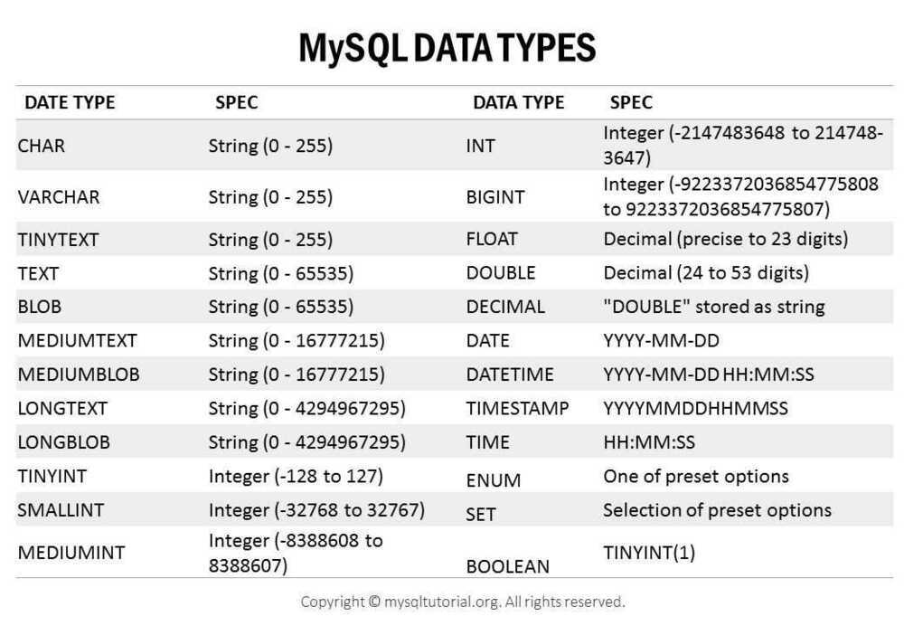

# MySQL Data Types

## 11.1 Numeric Data Types

11.1.1 Numeric Data Type Syntax

11.1.2 Integer Types (Exact Value) - INTEGER, INT, SMALLINT, TINYINT,

MEDIUMINT, BIGINT

11.1.3 Fixed-Point Types (Exact Value) - DECIMAL, NUMERIC

11.1.4 Floating-Point Types (Approximate Value) - FLOAT, DOUBLE

11.1.5 Bit-Value Type - BIT

11.1.6 Numeric Type Attributes

11.1.7 Out-of-Range and Overflow Handling

## 11.2 Date and Time Data Types

11.2.1 Date and Time Data Type Syntax

11.2.2 The DATE, DATETIME, and TIMESTAMP Types

11.2.3 The TIME Type

11.2.4 The YEAR Type

11.2.5 2-Digit YEAR(2) Limitations and Migrating to 4-Digit YEAR

11.2.6 Automatic Initialization and Updating for TIMESTAMP and DATETIME

11.2.7 Fractional Seconds in Time Values

11.2.8 Conversion Between Date and Time Types

11.2.9 2-Digit Years in Dates

## 11.3 String Data Types

11.3.1 String Data Type Syntax

11.3.2 The CHAR and VARCHAR Types

11.3.3 The BINARY and VARBINARY Types

11.3.4 The BLOB and TEXT Types

11.3.5 The ENUM Type

11.3.6 The SET Type

## 11.4 Spatial Data Types

11.4.1 Spatial Data Types

11.4.2 The OpenGIS Geometry Model

11.4.3 Supported Spatial Data Formats

11.4.4 Geometry Well-Formedness and Validity

11.4.5 Creating Spatial Columns

11.4.6 Populating Spatial Columns

11.4.7 Fetching Spatial Data

11.4.8 Optimizing Spatial Analysis

11.4.9 Creating Spatial Indexes

11.4.10 Using Spatial Indexes

## 11.5 The JSON Data Type

TheJSONdata type provides these advantages over storing JSON-format strings in a string column:

- **Automatic validation** of JSON documents stored inJSONcolumns. Invalid documents produce an error.
- **Optimized storage format**. JSON documents stored inJSONcolumns are converted to an internal format that permits quick read access to document elements. When the server later must read a JSON value stored in this binary format, the value need not be parsed from a text representation. The binary format is structured to enable the server to look up subobjects or nested values directly by key or array index without reading all values before or after them in the document.

https://dev.mysql.com/doc/refman/8.0/en/json.html

11.6 Data Type Default Values

## 11.7 Data Type Storage Requirements

| **Type**  | **Storage** | **Minimum Value**     | **Maximum Value**     |
|-----------|-------------|-----------------------|-----------------------|
|          | **(Bytes)** | **(Signed/Unsigned)** | **(Signed/Unsigned)** |
| TINYINT   | 1           | -128                  | 127                   |
|          |            | 0                     | 255                   |
| SMALLINT  | 2           | -32768                | 32767                 |
|          |            | 0                     | 65535                 |
| MEDIUMINT | 3           | -8388608              | 8388607               |
|          |            | 0                     | 16777215              |
| INT       | 4           | -2147483648           | 2147483647            |
|          |            | 0                     | 4294967295            |
| BIGINT    | 8           | -9223372036854775808  | 9223372036854775807   |
|          |            | 0                     | 18446744073709551615  |
| FLOAT(***p***)                                                                                  | `4 bytes if 0 <=***p***<= 24, 8 bytes if 25 <=***p***<= 53` |
| [FLOAT](https://dev.mysql.com/doc/refman/8.0/en/floating-point-types.html)                      | 4 bytes                                                           |
| DOUBLE [PRECISION], [REAL](https://dev.mysql.com/doc/refman/8.0/en/floating-point-types.html) | 8 bytes                                                           |
| DECIMAL(***M***, ***D***),NUMERIC(***M***, ***D***)                                              | Varies; see following discussion                                  |
| BIT(***M***)                                                                                    | approximately (***M***+7)/8 bytes                                 |

## int(11)

The number in the parenthesis i.e()does not determines the max and min values that can be stored in the integer field. The max and min values that can be stored are always fixed. It is just **display widthof integer** data type.

## INT UNSIGNED

## INT(11) ZEROFILL

| **Data Type**                                                                                                                    | **Storage Required as of MySQL 5.6.4**                                                                                                                                                                                                                                                                                                                                                                             |
| -------------------------------------------------------------------------------------------------------------------------------- | ------------------------------------------------------------------------------------------------------------------------------------------------------------------------------------------------------------------------------------------------------------------------------------------------------------------------------------------------------------------------------------------------------------------ |
| [YEAR](https://dev.mysql.com/doc/refman/8.0/en/year.html)                                                                        | 1 byte                                                                                                                                                                                                                                                                                                                                                                                                             |
| [DATE](https://dev.mysql.com/doc/refman/8.0/en/datetime.html)                                                                    | 3 bytes                                                                                                                                                                                                                                                                                                                                                                                                            |
| [TIME](https://dev.mysql.com/doc/refman/8.0/en/time.html)                                                                        | 3 bytes + fractional seconds storage                                                                                                                                                                                                                                                                                                                                                                               |
| [DATETIME](https://dev.mysql.com/doc/refman/8.0/en/datetime.html)                                                                | 5 bytes + fractional seconds storage                                                                                                                                                                                                                                                                                                                                                                               |
| [TIMESTAMP](https://dev.mysql.com/doc/refman/8.0/en/datetime.html)                                                               | 4 bytes + fractional seconds storage                                                                                                                                                                                                                                                                                                                                                                               |
| **Fractional Seconds Precision**                                                                                                 | **Storage Required**                                                                                                                                                                                                                                                                                                                                                                                               |                                                                                                                                                                                                                                                                                                                 |
| 0                                                                                                                                | 0 bytes                                                                                                                                                                                                                                                                                                                                                                                                            |
| 1, 2                                                                                                                             | 1 byte                                                                                                                                                                                                                                                                                                                                                                                                             |
| 3, 4                                                                                                                             | 2 bytes                                                                                                                                                                                                                                                                                                                                                                                                            |
| 5, 6                                                                                                                             | 3 bytes                                                                                                                                                                                                                                                                                                                                                                                                            |
| **Data Type**                                                                                                                    | **Storage Required**                                                                                                                                                                                                                                                                                                                                                                                               |
| CHAR(***M***)                                                                                                                    | The compact family of InnoDB row formats optimize storage for variable-length character sets. See [COMPACT Row Format Storage Characteristics](https://dev.mysql.com/doc/refman/8.0/en/innodb-row-format.html#innodb-compact-row-format-characteristics). Otherwise, `***M***×***w***bytes,<= ***M*** <=255`, where ***w*** is the number of bytes required for the maximum-length character in the character set. |
| BINARY(***M***)                                                                                                                  | ***M***bytes, `0<=***M***<=255`                                                                                                                                                                                                                                                                                                                                                                                    |
| VARCHAR(***M***),VARBINARY(***M***)                                                                                              | ***L***+ 1 bytes if column values require 0 − 255 bytes, ***L***+ 2 bytes if values may require more than 255 bytes                                                                                                                                                                                                                                                                                                |
| [TINYBLOB](https://dev.mysql.com/doc/refman/8.0/en/blob.html), [TINYTEXT](https://dev.mysql.com/doc/refman/8.0/en/blob.html)     | ***L***+ 1 bytes, where ***L*** `<` 2^8^                                                                                                                                                                                                                                                                                                                                                                            |
| [BLOB](https://dev.mysql.com/doc/refman/8.0/en/blob.html), [TEXT](https://dev.mysql.com/doc/refman/8.0/en/blob.html)             | ***L***+ 2 bytes, where***L***`<` 2^16^                                                                                                                                                                                                                                                                                                                                                                              |
| [MEDIUMBLOB](https://dev.mysql.com/doc/refman/8.0/en/blob.html), [MEDIUMTEXT](https://dev.mysql.com/doc/refman/8.0/en/blob.html) | ***L***+ 3 bytes, where***L***`<` 2^24^                                                                                                                                                                                                                                                                                                                                                                              |
| [LONGBLOB](https://dev.mysql.com/doc/refman/8.0/en/blob.html), [LONGTEXT](https://dev.mysql.com/doc/refman/8.0/en/blob.html)     | ***L***+ 4 bytes, where***L***`<` 2^32^                                                                                                                                                                                                                                                                                                                                                                              |
| ENUM('***value1***','***value2***',...)                                                                                          | 1 or 2 bytes, depending on the number of enumeration values (65,535 values maximum)                                                                                                                                                                                                                                                                                                                                |
| SET('***value1***','***value2***',...)                                                                                           | 1, 2, 3, 4, or 8 bytes, depending on the number of set members (64 members maximum)                                                                                                                                                                                                                                                                                                                                |

## TEXT

- fixed max size of 65535 characters (you cannot limit the max size)
- takes 2 +c bytes of disk space, where c is the length of the stored string.
- cannot be (fully) part of an index. One would need to specify a prefix length.

## VARCHAR(M)

- variable max size ofMcharacters
- Mneeds to be between 1 and 65535
- takes 1 +cbytes (forM≤ 255) or 2 +c(for 256 ≤M≤ 65535) bytes of disk space wherecis the length of the stored string
- can be part of an index

https://dev.mysql.com/doc/refman/8.0/en/storage-requirements.html

https://chartio.com/resources/tutorials/understanding-strorage-sizes-for-mysql-text-data-types

## 11.8 Choosing the Right Type for a Column

For optimum storage, you should try to use the most precise type in all cases. For example, if an integer column is used for values in the range from 1 to 99999, MEDIUMINT UNSIGNED is the best type. Of the types that represent all the required values, this type uses the least amount of storage.

All basic calculations (+,-,\*, and /) with [DECIMAL](https://dev.mysql.com/doc/refman/8.0/en/fixed-point-types.html) columns are done with precision of 65 decimal (base 10) digits. See [Section11.1.1, "Numeric Data Type Syntax"](https://dev.mysql.com/doc/refman/8.0/en/numeric-type-syntax.html).
If accuracy is not too important or if speed is the highest priority, the [DOUBLE](https://dev.mysql.com/doc/refman/8.0/en/floating-point-types.html) type may be good enough. For high precision, you can always convert to a fixed-point type stored in a [BIGINT](https://dev.mysql.com/doc/refman/8.0/en/integer-types.html). This enables you to do all calculations with 64-bit integers and then convert results back to floating-point values as necessary.

## 11.9 Using Data Types from Other Database Engines

https://dev.mysql.com/doc/refman/8.0/en/data-types.html

https://www.mysqltutorial.org/mysql-data-types.aspx

## Optimizing data types

### [8.4.2.1 Optimizing for Numeric Data](https://dev.mysql.com/doc/refman/8.0/en/optimize-numeric.html)

- For unique IDs or other values that can be represented as either strings or numbers, **prefer numeric columns to string columns**. Since large numeric values can be stored in fewer bytes than the corresponding strings, it is faster and takes less memory to transfer and compare them.
- If you are using numeric data, it is faster in many cases to access information from a database (using a live connection) than to access a text file. Information in the database is likely to be stored in a more compact format than in the text file, so accessing it involves fewer disk accesses. You also save code in your application because you can avoid parsing the text file to find line and column boundaries.

### [8.4.2.2 Optimizing for Character and String Types](https://dev.mysql.com/doc/refman/8.0/en/optimize-character.html)

- Use binary collation order for fast comparison and sort operations, when you do not need language-specific collation features. You can use the [BINARY](https://dev.mysql.com/doc/refman/8.0/en/cast-functions.html#operator_binary) operator to use binary collation within a particular query.
- When comparing values from different columns, declare those columns with the same character set and collation wherever possible, to avoid string conversions while running the query.
- For column values less than 8KB in size, use **binaryVARCHARinstead ofBLOB**. TheGROUP BYandORDER BYclauses can generate temporary tables, and these temporary tables can use theMEMORYstorage engine if the original table does not contain anyBLOBcolumns.
- If a table contains string columns such as name and address, but many queries do not retrieve those columns, consider **splitting the string columns into a separate table** and using join queries with a foreign key when necessary. When MySQL retrieves any value from a row, it reads a data block containing all the columns of that row (and possibly other adjacent rows). Keeping each row small, with only the most frequently used columns, allows more rows to fit in each data block. Such compact tables reduce disk I/O and memory usage for common queries.
- When you use a randomly generated value as a primary key in anInnoDBtable, prefix it with an ascending value such as the current date and time if possible. When consecutive primary values are physically stored near each other,InnoDBcan insert and retrieve them faster.

### [8.4.2.3 Optimizing for BLOB Types](https://dev.mysql.com/doc/refman/8.0/en/optimize-blob.html)

- When storing a large blob containing textual data, consider **compressing** it first. Do not use this technique when the entire table is compressed byInnoDBorMyISAM.
- For a table with several columns, to reduce memory requirements for queries that do not use the BLOB column, consider **splitting the BLOB column into a separate table** and referencing it with a join query when needed.
- Since the performance requirements to retrieve and display a BLOB value might be very different from other data types, you could put the BLOB-specific table on a different storage device or even a separate database instance. For example, to retrieve a BLOB might require a large sequential disk read that is better suited to a traditional hard drive than to an [SSD device](https://dev.mysql.com/doc/refman/8.0/en/glossary.html#glos_ssd).
- **A binary VARCHAR column is sometimes preferable to an equivalent BLOB column.**
- Rather than testing for equality against a very long text string, you can store a hash of the column value in a separate column, index that column, and test the hashed value in queries. (Use theMD5()orCRC32()function to produce the hash value.) Since hash functions can produce duplicate results for different inputs, you still include a clause AND blob_column = long_string_value in the query to guard against false matches; the performance benefit comes from the smaller, easily scanned index for the hashed values.

https://www.oreilly.com/library/view/high-performance-mysql/9781449332471/ch04.html

https://dev.mysql.com/doc/refman/8.0/en/optimize-data-types.html
