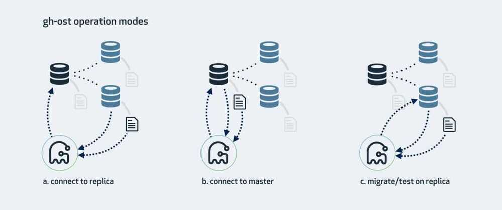

# SQL / MySQL Tools

## Monitoring

https://www.percona.com/doc/percona-monitoring-and-management/index.html

## MySQL Diagnostic Manager (Monyog)

[Top 5 MySQL Monitoring tools 2021](https://www.eversql.com/top-5-mysql-monitoring-tools)

[Monyog | Monitor MySQL Databases Configuration in Real-Time | Webyog](https://www.webyog.com/product/monyog)

## Testing

### mysqlslap

It's a benchmarking tool that can help DBAs and developers load test their database servers.

mysqlslap can emulate a large number of client connections hitting the database server at the same time. The load testing parameters are fully configurable and the results from different test runs can be used to fine-tune database design or hardware resources.

https://www.digitalocean.com/community/tutorials/how-to-measure-mysql-query-performance-with-mysqlslap

## Optimizations

### MySQLTuner

https://github.com/major/MySQLTuner-perl

https://github.com/pdufault/mysqlfragfinder/blob/master/mysqlfragfinder.sh

### Mysqlreport

Mysqlreport transforms the values from SHOW STATUS into an easy-to-read report that provides an in-depth understanding of how well MySQL is running. mysqlreport is a better alternative (and practically the only alternative) to manually interpreting SHOW STATUS.

### Event Reduce

An algorithm to optimize database queries that run multiple times

https://github.com/pubkey/event-reduce

### SQLCheck

SQL anti-patterns can slow down queries, but often it takes experienced DBAs and developers poring over code to identify and resolve them.

Four categories of anti-pattern:

- Logical database design
- Physical database design
- Query
- Application development

Sqlcheck can be targeted at varying risk levels, categorized as low, medium, or high risk. This is helpful if your list of anti-patterns is large, since you can prioritize the queries with the greatest performance impact.All you need to do to get started is gather a list of your distinct queries into a file and then pass them as an argument to the tool.

https://github.com/jarulraj/sqlcheck

### Others

[AI-Powered Automatic PostgreSQL & MySQL Tuning | OtterTune](https://ottertune.com/)

## Gh-ost (Ghost)

If like 99 percent of MySQL DBAs you have faced implementing a change to a MySQL table while fearing the impact on production, then you should consider [Gh-ost](https://github.com/github/gh-ost) (GitHub Online Schema Migration). Gh-ost provides MySQL schema changes without blocking writes, without using triggers, and with the ability to pause and resume the migration!

Why is this so important? Since MySQL 5.6 shipped with new [ALTER TABLE ... ALGORITHM=INPLACE](https://dev.mysql.com/doc/refman/5.6/en/alter-table.html) DDL (Data Definition Language) functionality, it became possible to modify a table without blocking writes for common operations such as adding an index (B-tree). However, there remain a few conditions where [writes (DML statements) are blocked](https://dev.mysql.com/doc/refman/5.7/en/innodb-create-index-overview.html#innodb-online-ddl-summary-grid), most notably the addition of a `FULLTEXT` index, the encryption of the tablespace, and the conversion of a column type.

Other popular online schema change tools, such as Percona's [pt-online-schema-change](https://www.percona.com/doc/percona-toolkit/LATEST/pt-online-schema-change.html), work by implementing a set of three triggers (INSERT, UPDATE, andDELETE) on the master to keep a shadow copy table in sync with changes. This introduces a small performance penalty due to write amplification, but more significantly requires seven instances of metadata locks. These effectively stall DML (Data Manipulation Language) events.

Since Gh-ost operates using the binary log, it is not susceptible to the [trigger-based drawbacks](https://github.com/github/gh-ost/blob/master/doc/why-triggerless). Finally Gh-ost is able to effectively [throttle activity to zero events](https://github.com/github/gh-ost/blob/master/doc/interactive-commands#examples), allowing you to pause the schema migration for a while if your server begins to struggle, and resume when the activity bubble moves on.

So how does Gh-ost work? By default, Gh-ost connects to a replica (slave), identifies the master, and applies the migration on the master. It receives changes on a replica to the source table in [binlog_format=ROW](https://dev.mysql.com/doc/en/binary-log-setting.html), parses the log, and converts these statements to be re-executed on the master's shadow table.It keeps track of the row counts on the replica and identifies when it is time to perform an atomic cutover (switch tables).

### Gh-ost operation modes

Gh-ost provides an alternative mode where you execute the migration directly on the master (whether it has slaves or not), read back the master's `binlog_format=ROW` events, and then re-apply them to the shadow table.

A final option is available to run the migration only on the replica without impacting the master, so you can test or otherwise validate the migration.

### Gh-ost general flow

Note that if your schema has foreign keys then Gh-ost may not operate cleanly, as this configuration is not supported.

### Ghost Tables

A ghost table is a database table that is no longer in use but still takes up space. Ghost tables are often created during schema changes or data migrations

### Links

https://github.com/github/gh-ost

https://www.infoworld.com/article/3241730/top-5-open-source-tools-for-mysql-administrators.html

[GH-OST for MySQL Schema Change.](https://www.mydbops.com/blog/gh-ost-for-mysql-schema-change)

[How we Altered a MySQL Table with 50 Million Rows without Downtime using gh-ost - Browntape](https://browntape.com/how-we-altered-a-mysql-table-with-50m-rows-without-downtime-with-gh-ost/)

Alternatives - [GitHub - cashapp/spirit: Online Schema Change Tool for MySQL 8.0+](https://github.com/cashapp/spirit)

## Maintenance Scripts

https://jonlabelle.com/snippets/view/shell/mysql-database-maintenance-script

Backup + Optimize - https://github.com/mmerian/MySQL-Maint/blob/master/mysql_maint.sh

InnoDB stores data using a page-allocation method and does not suffer from fragmentation in the same way that legacy storage engines (such as MyISAM) will. When considering whether or not to run optimize, consider the workload of transactions that your server will process:

- Some level of fragmentation is expected. InnoDB only fills pages 93% full, to leave room for updates without having to split pages.
- Delete operations might leave gaps that leave pages less filled than desired, which could make it worthwhile to optimize the table.
- Updates to rows usually rewrite the data within the same page, depending on the data type and row format, when sufficient space is available. See Section 14.10.5, "How Compression Works for InnoDB Tables" and Section 14.12.1, "Overview of InnoDB Row Storage".
- High-concurrency workloads might leave gaps in indexes over time, as InnoDB retains multiple versions of the same data due through its MVCC mechanism. See Section 14.5.12, "InnoDB Multi-Versioning".

## Orchestrator

orchestrator is a MySQL high availability and replication management tool, runs as a service and provides command line access, HTTP API and Web interface.

https://github.com/openark/orchestrator

## CueObserve

Anomaly detection on SQL data warehouses and databases

https://github.com/cuebook/cueobserve

https://cueobserve.cuebook.ai

## Others

- [Best Oracle Developer and Administrator Database Tools | Free Trial](https://www.quest.com/products/toad-for-oracle/)
