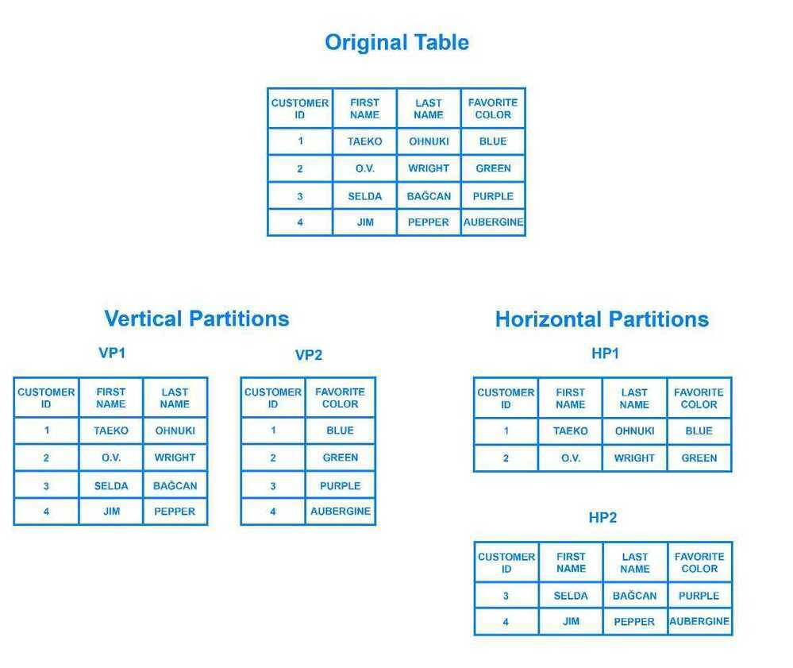
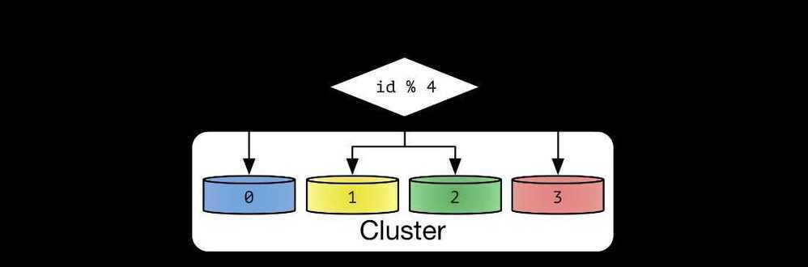
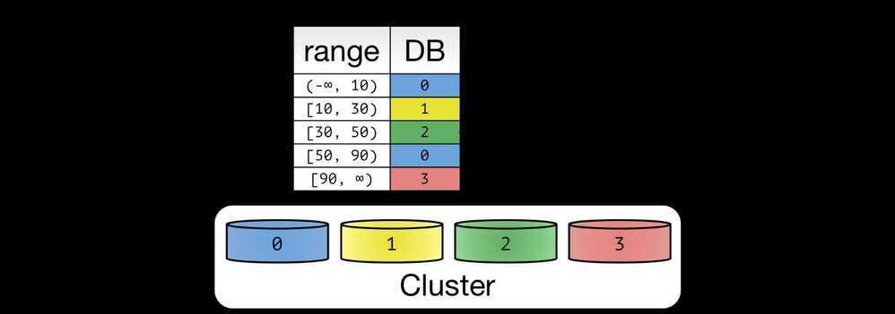
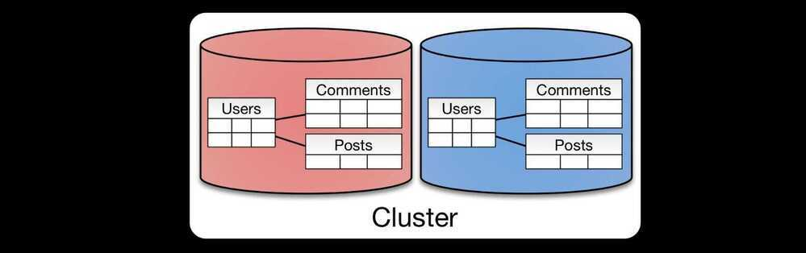
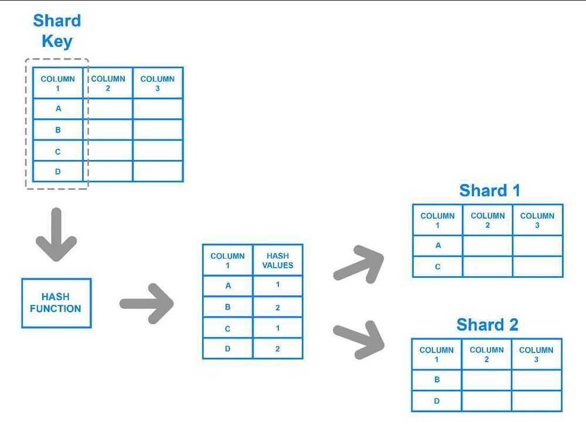
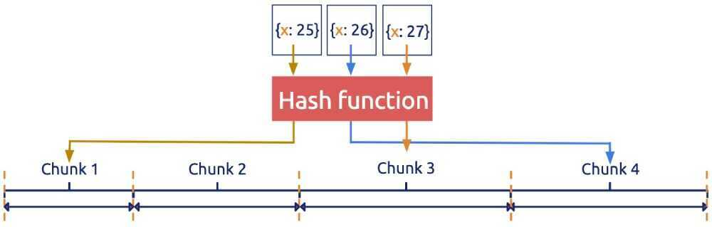
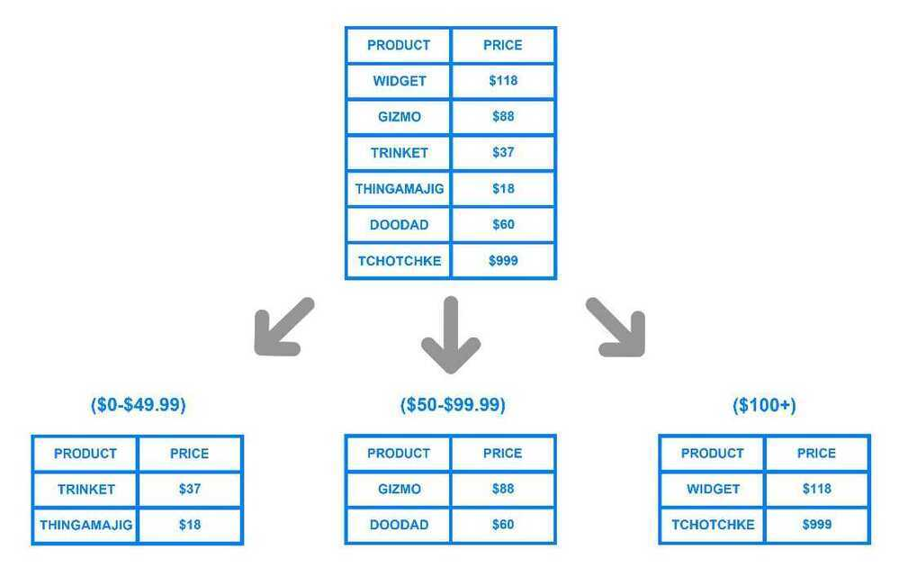
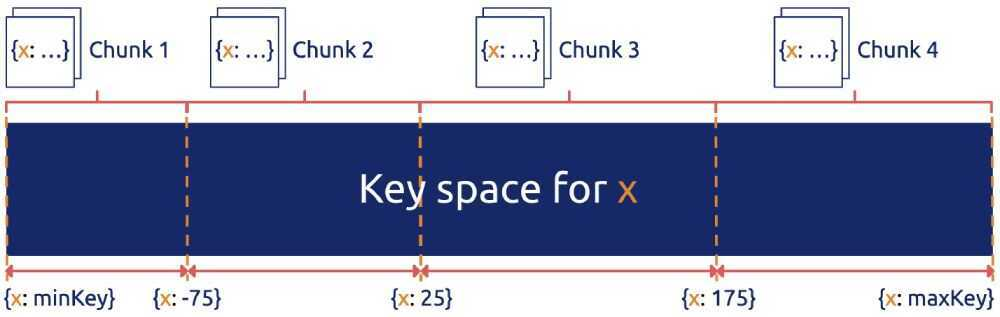
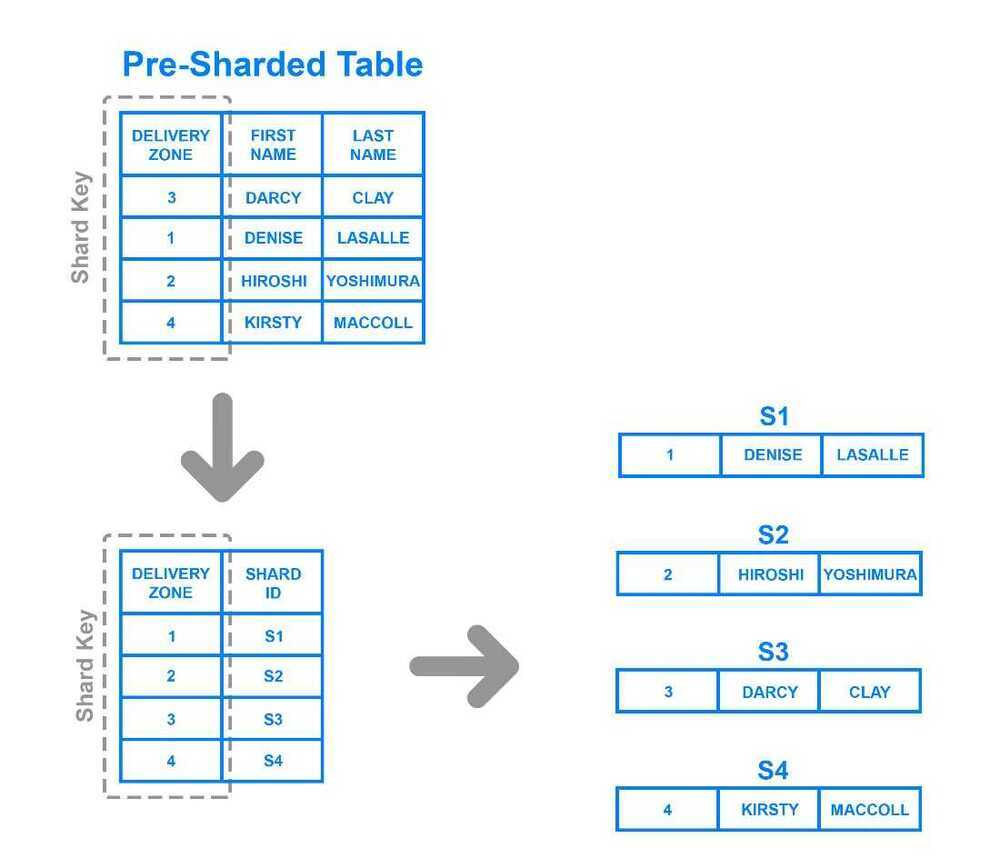

# Partitioning / Sharding

## Partitioning / Sharding Data

We cannot store 1 Trillion entries in a database, so we can shard / split / divide databases into parts where one part is responsible for that amount of data.

## Partitioning vs Sharding

Shard is also commonly used to mean "shared nothing" partitioning. But it's also possible to have a "shared nothing" architecture without partitioning

A partition is a physically separate file that comprises a subset of rows of a logical file, which occupies the same CPU+memory+storage node as its peer partitions.

A shard is a physical compute node comprised of CPU+memory+storage. A shard's schema (and integrity constraints) may be replicated across as many shards as needed. Shards may contain unpartioned and partitioned tables.

When using shards and partitions together we effectively have two keys which we can use to chunk out the data. How we decide to choose those keys depends on the query biases of the main applications reading and writing data.

For example, Facebook could shard its data by User Key (so you might live on one MySQL node, and I might live on another MySQL node). But within those nodes, they could also partition data based on Create Date of the timeline item (e.g. items posted could be broken down by month).

This sharding and partitioning scheme would make sense for Facebook because of Facebook's natural query biases during operations. People normally look at the stuff that pertains to them (which can live on the same shard - even if some of that data is replicated from other user shards), and they will then dig into stuff that is recent (which will live within a small physical file, holding the current month's partition). So the partition key could be based on User ID + Month ID (since presumably within the shard multiple users would still exist). Keep in mind that both shard keys and partition keys can be composite keys based on multiple columns.

Another thing to keep in mind is that within a shard, the RDBMS can protect data integrity. So Facebook could configure foreign key constraints to other local tables (e.g. the local MySQL instance can guarantee that a photo has to belongs to a valid Facebook User). If Facebook were to instead shard based on Date instead of User ID, then they would not be able to provide these integrity guarantees for user items, like photos.

So it is important to recognize that sharding and partitioning keys are not necessarily interchangeable.

For data warehouse design, integrity constraints are of little concerns (since consistency should be maintained in the operational database). So in that case the only thing to consider is the analyst's query bias. For example, Facebook's data warehouse may decide to shard on Advertiser ID and partition on Advertiser ID + date.

https://www.quora.com/Whats-the-difference-between-sharding-DB-tables-and-partitioning-them

Sharding is a database architecture pattern related to **horizontal partitioning - the practice of separating one table's rows into multiple different tables, known as partitions.** Each partition has the same schema and columns, but also entirely different rows. Likewise, the data held in each is unique and independent of the data held in other partitions.

It can be helpful to think of horizontal partitioning in terms of how it relates tovertical partitioning. **In a vertically-partitioned table, entire columns are separated out and put into new, distinct tables.** The data held within one vertical partition is independent from the data in all the others, and each holds both distinct rows and columns. The following diagram illustrates how a table could be partitioned both horizontally and vertically:



## Logical vs Physical Shard

Sharding involves breaking up one's data into two or more smaller chunks, calledlogical shards. The logical shards are then distributed across separate database nodes, referred to asphysical shards, which can hold multiple logical shards. Despite this, the data held within all the shards collectively represent an entire logical dataset.

Shard or Partition Key is a portion of primary key which determines how data should be distributed. A partition key allows you to retrieve and modify data efficiently by routing operations to the correct database. Entries with the same partition key are stored in the same node. A **logical shard**is a collection of data sharing the same partition key. A database node, sometimes referred as a **physical shard**, contains multiple logical shards

Database shards exemplify a [shared-nothing architecture](https://en.wikipedia.org/wiki/Shared-nothing_architecture). This means that the shards are autonomous; they don't share any of the same data or computing resources. In some cases, though, it may make sense to replicate certain tables into each shard to serve as reference tables. For example, let's say there's a database for an application that depends on fixed conversion rates for weight measurements. By replicating a table containing the necessary conversion rate data into each shard, it would help to ensure that all of the data required for queries is held in every shard.

Oftentimes, sharding is implemented at the application level, meaning that the application includes code that defines which shard to transmit reads and writes to. However, some database management systems have sharding capabilities built in, allowing you to implement sharding directly at the database level.

## Benefits of Sharding

The main appeal of sharding a database is that it can help to facilitatehorizontal scaling, also known asscaling out. Horizontal scaling is the practice of adding more machines to an existing stack in order to spread out the load and allow for more traffic and faster processing. This is often contrasted withvertical scaling, otherwise known asscaling up, which involves upgrading the hardware of an existing server, usually by adding more RAM or CPU.

It's relatively simple to have a relational database running on a single machine and scale it up as necessary by upgrading its computing resources. Ultimately, though, any non-distributed database will be limited in terms of storage and compute power, so having the freedom to scale horizontally makes your setup far more flexible.

Another reason why some might choose a sharded database architecture is to speed up query response times. When you submit a query on a database that hasn't been sharded, it may have to search every row in the table you're querying before it can find the result set you're looking for. For an application with a large, monolithic database, queries can become prohibitively slow. By sharding one table into multiple, though, queries have to go over fewer rows and their result sets are returned much more quickly.

Sharding can also help to make an application more reliable by mitigating the impact of outages. If your application or website relies on an unsharded database, an outage has the potential to make the entire application unavailable. With a sharded database, though, an outage is likely to affect only a single shard. Even though this might make some parts of the application or website unavailable to some users, the overall impact would still be less than if the entire database crashed.

## Drawbacks of Sharding

While sharding a database can make scaling easier and improve performance, it can also impose certain limitations. Here, we'll discuss some of these and why they might be reasons to avoid sharding altogether.

The first difficulty that people encounter with sharding is the sheer complexity of properly implementing a sharded database architecture. If done incorrectly, there's a significant risk that the sharding process can lead to lost data or corrupted tables. Even when done correctly, though, sharding is likely to have a major impact on your team's workflows. Rather than accessing and managing one's data from a single entry point, users must manage data across multiple shard locations, which could potentially be disruptive to some teams.

One problem that users sometimes encounter after having sharded a database is that the shards eventually become unbalanced. By way of example, let's say you have a database with two separate shards, one for customers whose last names begin with letters A through M and another for those whose names begin with the letters N through Z. However, your application serves an inordinate amount of people whose last names start with the letter G. Accordingly, the A-M shard gradually accrues more data than the N-Z one, causing the application to slow down and stall out for a significant portion of your users. The A-M shard has become what is known as adatabase hotspot. In this case, any benefits of sharding the database are canceled out by the slowdowns and crashes. The database would likely need to be repaired and resharded to allow for a more even data distribution.

Another major drawback is that once a database has been sharded, it can be very difficult to return it to its unsharded architecture. Any backups of the database made before it was sharded won't include data written since the partitioning. Consequently, rebuilding the original unsharded architecture would require merging the new partitioned data with the old backups or, alternatively, transforming the partitioned DB back into a single DB, both of which would be costly and time consuming endeavors.

A final disadvantage to consider is that sharding isn't natively supported by every database engine. For instance, PostgreSQL does not include automatic sharding as a feature, although it is possible to manually shard a PostgreSQL database. There are a number of Postgres forks that do include automatic sharding, but these often trail behind the latest PostgreSQL release and lack certain other features. Some specialized database technologies - like MySQL Cluster or certain database-as-a-service products like MongoDB Atlas - do include auto-sharding as a feature, but vanilla versions of these database management systems do not. Because of this, sharding often requires a "roll your own" approach. This means that documentation for sharding or tips for troubleshooting problems are often difficult to find.

## Sharding Architectures

### Algorithmic vs Dynamic Sharding

In algorithmic sharding, the client can determine a given partition's database without any help. In dynamic sharding, a separate locator service tracks the partitions amongst the nodes.



An algorithmically sharded database, with a simple sharding function



A dynamic sharding scheme using range based partitioning.

## Entity Groups



Entity Groups partitions all related tables together

The concept of entity groups is very simple. Store related entities in the same partition to provide additional capabilities within a single partition. Specifically:

1. Queries within a single physical shard are efficient.
2. Stronger consistency semantics can be achieved within a shard.

https://medium.com/@jeeyoungk/how-sharding-works-b4dec46b3f6

### Key / Hash based sharding

Key based sharding, also known as hash based sharding, involves using a value taken from newly written data - such as a customer's ID number, a client application's IP address, a ZIP code, etc. - and plugging it into ahash functionto determine which shard the data should go to. A hash function is a function that takes as input a piece of data (for example, a customer email) and outputs a discrete value, known as ahash value. In the case of sharding, the hash value is a shard ID used to determine which shard the incoming data will be stored on. Altogether, the process looks like this:



To ensure that entries are placed in the correct shards and in a consistent manner, the values entered into the hash function should all come from the same column. This column is known as ashard key. In simple terms, shard keys are similar to [primary keys](https://en.wikipedia.org/wiki/Primary_key) in that both are columns which are used to establish a unique identifier for individual rows. Broadly speaking, a shard key should be static, meaning it shouldn't contain values that might change over time. Otherwise, it would increase the amount of work that goes into update operations, and could slow down performance.

While key based sharding is a fairly common sharding architecture, it can make things tricky when trying to dynamically add or remove additional servers to a database. As you add servers, each one will need a corresponding hash value and many of your existing entries, if not all of them, will need to be remapped to their new, correct hash value and then migrated to the appropriate server. As you begin rebalancing the data, neither the new nor the old hashing functions will be valid. Consequently, your server won't be able to write any new data during the migration and your application could be subject to downtime.

The main appeal of this strategy is that it can be used to evenly distribute data so as to prevent hotspots. Also, because it distributes data algorithmically, there's no need to maintain a map of where all the data is located, as is necessary with other strategies like range or directory based sharding.

Hash-based sharding processes keys using a hash function and then uses the results to get the sharding ID, as shown in Figure 3 (source:[MongoDB uses hash-based sharding to partition data](https://docs.mongodb.com/manual/core/hashed-sharding/)).

Contrary to range-based sharding, where all keys can be put in order, hash-based sharding has the advantage that keys are distributed almost randomly, so the distribution is even. As a result, it is more friendly to systems with heavy write workloads and read workloads that are almost all random. This is because the write pressure can be evenly distributed in the cluster. But apparently, operations likerange scanare almost impossible.



Some typical examples of hash-based sharding are [Cassandra Consistent hashing](https://docs.datastax.com/en/archived/cassandra/2.1/cassandra/architecture/architectureDataDistributeHashing_c.html), presharding of Redis Cluster and [Codis](https://github.com/CodisLabs/codis), and [Twemproxy consistent hashing](https://github.com/twitter/twemproxy/blob/master/README#features).

### Range based sharding

Range based sharding involves sharding data based on ranges of a given value. To illustrate, let's say you have a database that stores information about all the products within a retailer's catalog. You could create a few different shards and divvy up each products' information based on which price range they fall into, like this:



The main benefit of range based sharding is that it's relatively simple to implement. Every shard holds a different set of data but they all have an identical schema as one another, as well as the original database. The application code just reads which range the data falls into and writes it to the corresponding shard.

On the other hand, range based sharding doesn't protect data from being unevenly distributed, leading to the aforementioned database hotspots. Looking at the example diagram, even if each shard holds an equal amount of data the odds are that specific products will receive more attention than others. Their respective shards will, in turn, receive a disproportionate number of reads.

Range-based sharding assumes that all keys in the database system can be put in order, and it takes a continuous section of keys as a sharding unit.
It's very common to sort keys in order. HBase keys are sorted in byte order, while MySQL keys are sorted in auto-increment ID order. For some storage engines, the order is natural. In the case of both log-structured merge-tree (LSM-Tree) and B-Tree, keys are naturally in order.



In Figure 2 (source:[MongoDB uses range-based sharding to partition data](https://docs.mongodb.com/manual/core/ranged-sharding/)), the key space is divided into (minKey, maxKey). Each sharding unit (chunk) is a section of continuous keys. The advantage of range-based sharding is that the adjacent data has a high probability of being together (such as the data with a common prefix), which can well support operations like range scan. For example, HBase Region is a typical range-based sharding strategy.

However, range-based sharding is not friendly to sequential writes with heavy workloads. For example, in the time series type of write load, the write hotspot is always in the last Region. This occurs because the log key is generally related to the timestamp, and the time is monotonically increasing. But relational databases often need to executetable scan(orindex scan), and the common choice is range-based sharding.

### Hash-Range combination sharding

Note that hash-based and range-based sharding strategies are not isolated. Instead, you can flexibly combine them. For example, you can establish a multi-level sharding strategy, which uses hash in the uppermost layer, while in each hash-based sharding unit, data is stored in order.

### Directory based sharding

To implementdirectory based sharding, one must create and maintain alookup tablethat uses a shard key to keep track of which shard holds which data. In a nutshell, a lookup table is a table that holds a static set of information about where specific data can be found. The following diagram shows a simplistic example of directory based sharding:



Here, theDelivery Zonecolumn is defined as a shard key. Data from the shard key is written to the lookup table along with whatever shard each respective row should be written to. This is similar to range based sharding, but instead of determining which range the shard key's data falls into, each key is tied to its own specific shard. Directory based sharding is a good choice over range based sharding in cases where the shard key has a low cardinality and it doesn't make sense for a shard to store a range of keys. Note that it's also distinct from key based sharding in that it doesn't process the shard key through a hash function; it just checks the key against a lookup table to see where the data needs to be written.

The main appeal of directory based sharding is its flexibility. Range based sharding architectures limit you to specifying ranges of values, while key based ones limit you to using a fixed hash function which, as mentioned previously, can be exceedingly difficult to change later on. Directory based sharding, on the other hand, allows you to use whatever system or algorithm you want to assign data entries to shards, and it's relatively easy to dynamically add shards using this approach.

While directory based sharding is the most flexible of the sharding methods discussed here, the need to connect to the lookup table before every query or write can have a detrimental impact on an application's performance. Furthermore, the lookup table can become a single point of failure: if it becomes corrupted or otherwise fails, it can impact one's ability to write new data or access their existing data.

### Geo-Sharding

Data partitioned based on geographical region. Each shard stores data which is related to user's specific geographic area.

### Others

- Initial Implementation in Cassandra -- Linear Hash Sharding
- DynamoDB and Cassandra -- Consistent Hash Sharding
- Google Spanner and HBase -- Range Sharding

https://blog.yugabyte.com/four-data-sharding-strategies-we-analyzed-in-building-a-distributed-sql-database

## Should I Shard?

Whether or not one should implement a sharded database architecture is almost always a matter of debate. Some see sharding as an inevitable outcome for databases that reach a certain size, while others see it as a headache that should be avoided unless it's absolutely necessary, due to the operational complexity that sharding adds.

Because of this added complexity, sharding is usually only performed when dealing with very large amounts of data. Here are some common scenarios where it may be beneficial to shard a database:

- The amount of application data grows to exceed the storage capacity of a single database node.
- The volume of writes or reads to the database surpasses what a single node or its read replicas can handle, resulting in slowed response times or timeouts.
- The network bandwidth required by the application outpaces the bandwidth available to a single database node and any read replicas, resulting in slowed response times or timeouts.

Before sharding, you should exhaust all other options for optimizing your database. Some optimizations you might want to consider include:

- Setting up a remote database. If you're working with a monolithic application in which all of its components reside on the same server, you can improve your database's performance by moving it over to its own machine. This doesn't add as much complexity as sharding since the database's tables remain intact. However, it still allows you to vertically scale your database apart from the rest of your infrastructure.
- Implementing [caching](https://en.wikipedia.org/wiki/Database_caching). If your application's read performance is what's causing you trouble, caching is one strategy that can help to improve it. Caching involves temporarily storing data that has already been requested in memory, allowing you to access it much more quickly later on.
- Creating one or more read replicas. Another strategy that can help to improve read performance, this involves copying the data from one database server (theprimary server) over to one or moresecondary servers. Following this, every new write goes to the primary before being copied over to the secondaries, while reads are made exclusively to the secondary servers. Distributing reads and writes like this keeps any one machine from taking on too much of the load, helping to prevent slowdowns and crashes. Note that creating read replicas involves more computing resources and thus costs more money, which could be a significant constraint for some.
- Upgrading to a larger server. In most cases, scaling up one's database server to a machine with more resources requires less effort than sharding. As with creating read replicas, an upgraded server with more resources will likely cost more money. Accordingly, you should only go through with resizing if it truly ends up being your best option.

https://www.digitalocean.com/community/tutorials/understanding-database-sharding

High Scalability - http://highscalability.com/unorthodox-approach-database-design-coming-shard

https://docs.oracle.com/cd/B19306_01/server.102/b14220/partconc.htm

https://dev.mysql.com/doc/refman/5.7/en/partitioning-overview.html

https://www.vertabelo.com/blog/everything-you-need-to-know-about-mysql-partitions

MySQL partitioning is about altering -- ideally, optimizing -- the way the database engine physically stores data. It allows you to distribute portions of table data (a.k.a. partitions) across the file system based on a set of user-defined rules (a.k.a. the "partitioning function"). In this way, if the queries you perform access only a fraction of table data and the partitioning function is properly set, there will be less to scan and queries will be faster.

It is important to note that partitioning makes the most sense when dealing with large data sets. If you have fewer than a million rows or only thousands of records, partitioning will not make a difference.

## Advantages

- **Storage:** It is possible to store more data in one table than can be held on a single disk or file system partition.
- **Deletion:** Dropping a useless partition is almost instantaneous, but a classical DELETE query run in a very large table could take minutes.
- **Partition Pruning:** This is the ability to exclude non-matching partitions and their data from a search; it makes querying faster. Also, MySQL 5.7 supports explicit partition selection in queries, which greatly increases the search speed. (Obviously, this only works if you know in advance which partitions you want to use.) This also applies for DELETE, INSERT, REPLACE, and UPDATE statements as well as LOAD DATA and LOAD XML.

## Partition Types

Four partition types available: RANGE, LIST, HASH and KEY

## Queries

```sql
-- Hash Partitioning
CREATE TABLE t1 ( id INT, year_col INT );

ALTER TABLE t1
    PARTITION BY HASH(id)
    PARTITIONS 8;

-- Range Paritioning
CREATE TABLE t1 (
    id INT,
    year_col INT
)
PARTITION BY RANGE (year_col) (
    PARTITION p0 VALUES LESS THAN (1991),
    PARTITION p1 VALUES LESS THAN (1995),
    PARTITION p2 VALUES LESS THAN (1999)
);

ALTER TABLE t1 ADD PARTITION (PARTITION p3 VALUES LESS THAN (2002));

ALTER TABLE t1 DROP PARTITION p0, p1;

ALTER TABLE t1 DISCARD PARTITION p2, p3 TABLESPACE;

ALTER TABLE t1 IMPORT PARTITION p2, p3 TABLESPACE;

CREATE TABLE raw_log_2011_4 (
  id bigint(20) NOT NULL AUTO_INCREMENT,
  logid char(16) NOT NULL,
  tid char(16) NOT NULL,
  reporterip char(46) DEFAULT NULL,
  ftime datetime DEFAULT NULL,
  KEY id (id)
) ENGINE=InnoDB AUTO_INCREMENT=286802795 DEFAULT CHARSET=utf8
  PARTITION BY RANGE( TO_DAYS(ftime) ) (
    PARTITION p20110401 VALUES LESS THAN (TO_DAYS('2011-04-02')),
    PARTITION p20110402 VALUES LESS THAN (TO_DAYS('2011-04-03')),
    PARTITION p20110403 VALUES LESS THAN (TO_DAYS('2011-04-04')),
    PARTITION p20110404 VALUES LESS THAN (TO_DAYS('2011-04-05')),
    ...
    PARTITION p20110426 VALUES LESS THAN (TO_DAYS('2011-04-27')),
    PARTITION p20110427 VALUES LESS THAN (TO_DAYS('2011-04-28')),
    PARTITION p20110428 VALUES LESS THAN (TO_DAYS('2011-04-29')),
    PARTITION p20110429 VALUES LESS THAN (TO_DAYS('2011-04-30')),
    PARTITION future VALUES LESS THAN MAXVALUE
  );

-- Remove partition
ALTER TABLE tbl_name REMOVE PARTITIONING;
```

`PARTITION BY RANGE(TO_DAYS(date))` and have daily partitions. Every night `DROP PARTITION` for the week-old partition and `REORGANIZE` the normally empty "future" partition into tomorrow and a new "future".

That makes the delete essentially free and instantaneous. And keeps the disk space down to not much more than a week's worth of data.

[15.1.9.1 ALTER TABLE Partition Operations](https://dev.mysql.com/doc/refman/8.0/en/alter-table-partition-operations.html)

## Links

[How @ShopifyEngineering avoids hot shards by moving data across databases without any downtime - YouTube](https://www.youtube.com/watch?v=7v-wrJjcg4k)

[Mastering PostgreSQL Table Partitioning](https://fragland.dev/a-guide-to-table-partitioning-with-postgresql-12)
