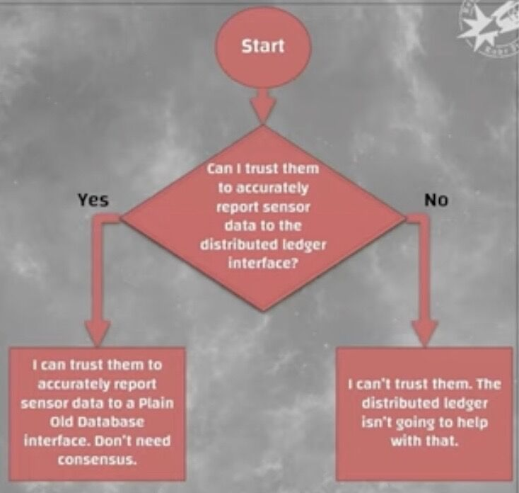

# Blockchain

Inventor - Satoshi Nakamoto

"Most technologies tend to automate workers on the periphery who are doing menial tasks. But blockchains automate away the center. Instead of putting taxi drivers out of a job, blockchain puts Uber out of a job, and lets the taxi drivers work with the customer directly." - Vitalik Buterin, Creator of Ethereum

A blockchain is a data structure that enables identifying and tracking transactions digitally and sharing this information across a distributed network of computers, creating a distributed trust network.

A blockchain is a **shared public ledger that exists and is digitally distributed across a network.**

Blockchain is to the money what email was to the letter.

Phygital

The more participants you actually have in the decentralized network, the more stable the entire cryptocurrency is going to be.

Solving double spend problem

#### Timechain

[https://blog.goodaudience.com/timechain-a-decade-of-misunderstanding-blockchain-bcb56d7839a3](https://blog.goodaudience.com/timechain-a-decade-of-misunderstanding-blockchain-bcb56d7839a3)

[The Blockchain Timeline. A history of blockchain technology that… | by Madeline Mann | Gem HQ](https://blog.gem.co/the-blockchain-timeline-3fdffe281378)

## What problem does blockchain solves

- Creating / updating / deleting anything in physical word requires money, but in digital world it's free
- How can we make sure that information that is digital can be trusted, so it doesn't get altered
- So in current system we have centralized institutions that create data, store data, update/delete data, and we have to trust them
- Instead of two parties having contract, every participant has a copy of that contract and transactions
- But only the people who created that data, can alter that data with their private key, but everyone sees that who and what has been edited

[Which problem does a blockchain solve?](https://www.youtube.com/watch?v=YGjL9ky6Duc)

## Featues of Blockchain

- **Distributed / Decentralized -** Data is replicated on all the nodes in a distributed P2P network, and each copy of the ledger is identical to others. It can also be decentralised with some lighter nodes not having full data storage with limited connection.
- **Consensus mechanism -** All users in the network can come to a pre-determined programmable agreement on the method of validation and can be by consensus.
- **Irreversibility and crypto security -** One would need to command at least 51% of the computing power (or nodes or stake) to take control of the bitcoin blockchain.
- **Cryptographically secure -** That means that the minting of digital currency is secured by mathematical algorithms that make it very difficult to break. It prevents bad actors from creating fake transactions, erasing transactions, stealing funds, etc.
- **Finite-state machines -** In Computer Science, a state machine is a machine that will analyze a series of inputs and based on those inputs will transition to a new state. Blockchains have one instance responsible for all the transactions being created by the system. There's one global truth that all nodes adhere to, they all share the same state.

## Permissionless vs Permissioned Blockchains

Permissionless blockchains are open to anyone to use. You can even participate in their consensus mechanisms, given that you meet specific requirements. Bitcoin, Ethereum, and BNB Chain are all examples of permissionless blockchains, which are typically transparent and decentralized.

Permissioned blockchains, on the other hand, require invitations to join. They’re typically used in private business settings and tailored for certain use cases. Power is restricted to a small group of validators who make most of the network decisions. Transparency can be limited, but network upgrade time and scalability are often greatly improved.

[What Are Permissioned and Permissionless Blockchains? | Binance Academy](https://academy.binance.com/en/articles/what-are-permissioned-and-permissionless-blockchains)

[Permissioned blockchain vs. permissionless blockchain: Key differences](https://cointelegraph.com/learn/permissioned-blockchain-vs-permissionless-blockchain-key-differences)

[Permissioned And Permissionless Blockchains: A Comprehensive Guide](https://www.blockchain-council.org/blockchain/permissioned-and-permissionless-blockchains-a-comprehensive-guide/)

## Oracle problem

- Cryptography works only within the system
- Any interface to the real world requires trust in a node other than self
    - In which case no distributed consensus is required
- Cryptocurrencies have, more or less by definition, only one use case: **Ponzi schemes and other scams**
- A pure timestamping hash chain/Merkle tree (without consensus overhead) can be useful

https://blog.chain.link/what-is-the-blockchain-oracle-problem

[SchellingCoin: A Minimal-Trust Universal Data Feed | Ethereum Foundation Blog](https://blog.ethereum.org/2014/03/28/schellingcoin-a-minimal-trust-universal-data-feed)

## Attacks

[The P + epsilon Attack | Ethereum Foundation Blog](https://blog.ethereum.org/2015/01/28/p-epsilon-attack)

### DDOS in blockchains

- DDoS attacks via transaction flooding
- DDoS attacks via smart contract

[DDoS in Blockchain - GeeksforGeeks](https://www.geeksforgeeks.org/ddos-in-blockchain/)

### Double Spending

- [Double spending](https://www.geeksforgeeks.org/solutions-to-prevent-double-spending-of-bitcoins/) means the expenditure of the same digital currency twice or more to avail the multiple services. It is a technical flaw that allows users to duplicate money.
- Since digital currencies are nothing but files, a malicious user can create multiple copies of the same currency file and can use it in multiple places.
- This issue can also occur if there is an alteration in the network or copies of the currency are only used and not the original one.
- There are also double spends that allow hackers to reverse transactions so that transaction happens two times.
- By doing this, the user loses money two times one for the fake block created by the hacker and for the original block as well.
- The hacker gets incentives as well for the fake blocks that have been mined and confirmed.

#### Types Of Double Spending Attacks

- **Finney Attack:** Finney Attack is a type of Double spending Attack. In this, a merchant accepts an unauthorized transaction. The original block is eclipsed by the hacker using an eclipse attack. The transaction is performed on an unauthorized one. After that, the real block shows up and again the transaction is done automatically for the real block. Thus the merchant loses money two times.
- **Race attack:** is an attack in which there is a ‘race’ between two transactions. The attacker sends the same money using different machines to two different merchants. The merchants send their goods but transactions get invalid.
- **51% Attack:** This type of attack is prevalent in small blockchains. Hackers usually take over 51% of the mining power of blockchain and therefore can do anything of their own will.

[What is Double Spending in Blockchain? - GeeksforGeeks](https://www.geeksforgeeks.org/what-is-double-spending-in-blockchain/)

## Working

### How bitcoin or ethererum wallets connect to their networks

Bitcoin and Ethereum wallets connect to their respective networks through a process called "node synchronization."

When you open a Bitcoin or Ethereum wallet, the wallet software connects to a network of nodes that are running the same software. These nodes are essentially servers that maintain a copy of the blockchain, which is a public ledger of all transactions that have ever occurred on the network.

The wallet software communicates with these nodes to obtain information about your account balance and to send and receive transactions. The synchronization process involves downloading a copy of the blockchain onto your computer or device, which can take some time depending on the speed of your internet connection and the size of the blockchain.

Once your wallet is synchronized with the network, you can send and receive Bitcoin or Ethereum transactions. When you send a transaction, it is broadcast to the network of nodes, which verify and record the transaction on the blockchain. This ensures that all transactions on the network are secure and transparent, and that no one can manipulate the system for their own gain.

### Initial seeding / connection

When a Bitcoin or Ethereum wallet software starts up, it typically begins by connecting to a few pre-configured nodes that are known to be stable and reliable. These nodes are often maintained by the developers of the software or by other trusted members of the community.

Once the wallet software has connected to these initial nodes, it will send a message requesting a list of other nodes on the network. The nodes that the wallet is connected to will respond with a list of nodes that they know about. This process is called "node discovery."

The wallet software will then attempt to connect to some of the nodes on this list. If the connection is successful, it will request information about the blockchain from the node, such as the latest block and the current state of the network. If the node responds with the requested information, the wallet software will add it to its list of known nodes and continue to connect to it in the future.

The process of node discovery and connection is often repeated several times until the wallet software has connected to a sufficient number of nodes to synchronize with the network. In this way, the wallet can ensure that it is connected to a diverse and robust set of nodes on the network, which helps to improve its reliability and security.

### Pre-configured DNS / DNS Seeds

#### For Bitcoin

- Bitcoin Core, the reference implementation of the Bitcoin protocol, maintains a set of DNS seeds that can be used to bootstrap new nodes. These include seed.bitcoin.sipa.be, dnsseed.bluematt.me, and seed.bitcoinstats.com, among others.
- Many Bitcoin wallet software also include hard-coded IP addresses for well-known nodes on the network, such as Bitseed and Bitnodes.

#### For Ethereum

- The Geth implementation of the Ethereum protocol maintains a set of bootnodes that can be used to bootstrap new nodes. These include enode://a24df51ba24fb4f28833a67a2db1ad346f87342dc61bdc9947e174d55c53e7f9fb6b66bd6de0b1773d3c8ca088f2720c7d76f0b562455ab8f2a1eafdd281b799@52.16.188.185:30303 and enode://enode://c9[1b8631fbdda623568c7b937d92d924408d8baae698fc988e7f2d2c13df05244cc2a735cc69e0d39ebd06c126fa8618b0a66b3d0de08b3c00da1b78a9e92a96@bootnode.ethdevops.io](mailto:1b8631fbdda623568c7b937d92d924408d8baae698fc988e7f2d2c13df05244cc2a735cc69e0d39ebd06c126fa8618b0a66b3d0de08b3c00da1b78a9e92a96@bootnode.ethdevops.io):30303
- The Parity implementation of the Ethereum protocol also maintains a set of bootnodes, including enode://[::ffff:52.169.42.101]:30303 and enode://[::ffff:54.153.6.94]:30303.

These are just a few examples, and the specific nodes used by different wallet software may vary. Additionally, some wallet software may allow users to configure their own set of preferred nodes to connect to.

Ex - http://203.184.52.247:8333/

### UTXO (Unspent Transaction Output)

An unspent transaction output (UTXO) refers to a transaction output that can be used as input in a new transaction. In essence, UTXOs define where each blockchain transaction starts and finishes. The UTXO model is a fundamental element of Bitcoin and many other cryptocurrencies.

- A UTXO is the amount of digital currency remaining after a cryptocurrency transaction is executed.
- UTXOs are processed continuously and are part of the beginning and end of each transaction.
- When a transaction is completed, any unspent outputs are recorded into a database as inputs that can be used later for a new transaction.

Ethereum uses an account-based approach with account balances, so there are no UTXOs in the Ethereum Virtual Machine.

#### Example

Alice has 0.45 BTC in her [wallet](https://academy.binance.com/en/articles/crypto-wallet-types-explained). This isn’t a fraction of a coin as we might conceptualize it. It’s rather a collection of UTXOs. Specifically, two UTXOs worth 0.4 BTC, and 0.05 BTC - outputs from past transactions. Now let's imagine that Alice needs to make a payment to Bob of 0.3 BTC.

Her only option here is to break up the 0.4 BTC unit and to send 0.3 BTC to Bob, and 0.1 BTC back to herself. She would normally reclaim less than 0.1 BTC due to mining fees, but let's simplify and leave the [miner](https://academy.binance.com/en/articles/what-is-cryptocurrency-mining) out.

Alice creates a transaction that essentially says to the network: take my 0.4 BTC UTXO as an input, break it up, send 0.3 BTC of it to Bob’s address and return the 0.1 BTC to my address. The 0.4 BTC is now a spent output, and can’t be reused. Meanwhile, two new UTXOs have been created (0.3 BTC and 0.1 BTC).

Note that we broke up a UTXO in this example, but if Alice had to pay 0.42 BTC, she could just as easily have combined her 0.4 BTC with another 0.05 BTC to produce a UTXO worth 0.42 BTC, while returning 0.03 BTC to herself.

#### UTXO Model VS Accounting Model

|**S.No.**|**UTXO Model**|**Accounting Model**|
|---|---|---|
|1.|The transaction requires more storage space.|The transaction requires less storage space.|
|2.|The state is saved in transactions.|The state is saved on the nodes.|
|3.|The transactions are computationally simpler.|The transactions utilize complex calculations.|
|4.|Bulk transactions are less efficient.|Bulk transactions are more efficient.|

[Unspent Transaction Output (UTXO) | Binance Academy](https://academy.binance.com/en/glossary/unspent-transaction-output-utxo)

[UTXO Model: Definition, How It Works, and Goals](https://www.investopedia.com/terms/u/utxo.asp)

[What is Unspent Transaction Output (UTXO)? - GeeksforGeeks](https://www.geeksforgeeks.org/what-is-unspent-transaction-output-utxo/)

## Privacy

All Bitcoin transactions are public, traceable, and permanently stored in the Bitcoin network. Anyone can see the balance and all transactions of any address. Since users usually have to reveal their identity in order to receive services or goods, Bitcoin addresses cannot remain fully anonymous.

For these reasons, Bitcoin addresses should only be used once and users must be careful not to disclose their addresses. People who send you money cannot see what other Bitcoin addresses you own and what you do with them.

[Protect your privacy - Bitcoin](https://bitcoin.org/en/protect-your-privacy)

[Top 10 Security and Privacy Tips for Cryptocurrency Holders](https://www.analyticsinsight.net/top-10-security-and-privacy-tips-for-cryptocurrency-holders/)

Layering - Tumblr / Mixers

- [6 BEST Bitcoin Mixers & Tumblers (2023 List)](https://www.guru99.com/best-bitcoin-mixers-tumblers.html)
- [What is a Bitcoin Tumbler? (Legality + Examples) - YouTube](https://www.youtube.com/watch?v=LxnC8eFCOFA)

[Protect bitcoin privacy](https://bitcoinmagazine.com/culture/how-i-protect-my-bitcoin-privacy)

[GitHub - ameensol/privacy-pools: Privacy 2.0 for Ethereum](https://github.com/ameensol/privacy-pools)

## Blockspace

[GitHub - 0xperp/awesome-blockspace: Overview of Blockspace its demand, pricing, and trading](https://github.com/0xperp/awesome-blockspace)

[Ramblings on Blockspace - Nate](https://mirror.xyz/0x0C23E0dE114d28112f52203cb9583B9826b05dDe/UG0YC5cmw1Ib2DiOivp22suh6gZJyMqVoR3mhu8M2b8)

## Links

- [Blockchain 102 and The Dark Side of Blockchain](https://www.youtube.com/watch?v=-so3AtnToek)
- [Intersection of Blockchain and Video Games: Is Blockchain Technology Ready for the Gaming Industry? - YouTube](https://www.youtube.com/watch?v=A19ZOAIOywE)
- [What is Bitcoin and Blockchain (by Charles Hoskinson) - YouTube](https://www.youtube.com/watch?v=U8OSOrbNrjI)
- [Picking the Right Blockchain For the Job - YouTube](https://www.youtube.com/watch?v=rgiP5W8ckl8)
- [Yes, You Too Can Break Crypto: Exploiting Common Crypto Mistakes - YouTube](https://www.youtube.com/watch?v=eTHRv2uSc_Y)
- [Blockchain 101 (or How to Build a Blockchain with JavaScript) - YouTube](https://www.youtube.com/watch?v=JiEAuaNFZGo)
- [How do you get from a private key to a Bitcoin address? | Part 12 Cryptography Crashcourse - YouTube](https://www.youtube.com/watch?v=2idX-V8riy0)
- [How do Hierarchical Deterministic Wallets work? | Part 13 Cryptography Crashcourse - YouTube](https://www.youtube.com/watch?v=nF2l6mdi7Ts)
- [How does a Bitcoin transaction work in detail? | Part 14 Cryptography Crashcourse - YouTube](https://www.youtube.com/watch?v=zdhuEytjYH4)
- [Bitcoin Mining Explained in Detail: Nonce, Merkle Root, SPV,... | Part 15 Cryptography Crashcourse - YouTube](https://www.youtube.com/watch?v=C1n4SI7xzds)
- [Will Quantum Computers kill Bitcoin? | Part 16 Cryptography Crashcourse - YouTube](https://www.youtube.com/watch?v=SD6WBud04xc)
- [Blockchain node deployment on AWS: A comprehensive guide | AWS Database Blog](https://aws.amazon.com/blogs/database/blockchain-node-deployment-on-aws-a-comprehensive-guide/)
