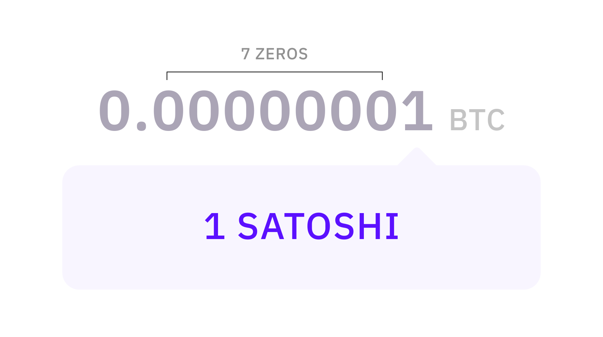
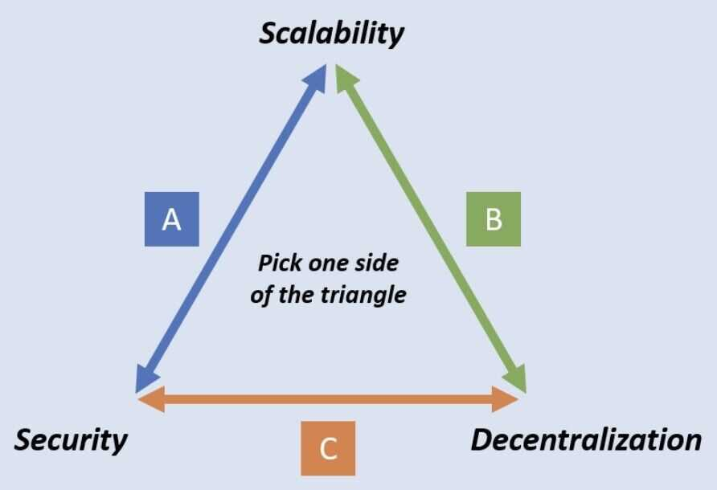

# Bitcoin

- Bitcoin (2008): first combination of proof-of-work / distributed ledger / hashchain
- Solves Byzantine agreemeent, permissionless, Sybil-proof, reasonable cryptographic assumptions
- Elegant in its simplicity
- Limited scripting for transaction confirmation

## Bitcoin Facts

- Total number of bitcoins that can be issued is 21 million
- A unit of bitcoin is divisible to eight decimal places (100 millionths of one bitcoin). Hence, it can be purchased in smaller units called a Satoshi - which, as you might have already guessed, was named in homage to Bitcoin’s creator(s) – Satoshi Nakamoto.

- 2 pizza for 10,000 bitcoins which are now worth $100 million
- A new block is added every 10 minutes
- Bitcoin has not been premined, meaning that no coins have been mined and/or distributed between the founders before it became available to the public.
- Bitcoin is deflationary
- Bitcoin addresses prevent confusion, it don't allow
  - zero `0`
  - Uppercase `O`
  - Uppercase `I`
  - Lowercase `l`
  - Because it's created using base58 encoding

### Wrapped Bitcoin

Wrapped Bitcoin, or WBTC, is a token representation of Bitcoin existing on other blockchains (e.g., Ethereum). It mimics the price of Bitcoin. Wrapped bitcoins are backed 1:1 by Bitcoin itself. Whenever you decide to return to your BTC, you can exchange WBTC back to BTC.

## Scaling Problem

Bitcoin has a scaling problem. Bitcoin is designed to store all transactions in a data structure called a [block](https://en.bitcoin.it/wiki/Block). A block contains information about the previous block, miscellaneous data about mining rewards, and most of the block is just transaction data. Blocks are also fixed at a maximum of 1 MB in size. This last bit is where the trouble is.

Because blocks are 1 MB in size, and a block is created every 10 minutes, assuming the transactions are not SegWit (coming up later) the network can process a maximum of [between 3.3 and 7 transactions per second](https://link.springer.com/chapter/10.1007/978-3-662-53357-4_8). For a currency designed for mass use by billions of humans and their machines, 7 transactions a second just isn't up to par. Visa, on the other hand, claims to be able to process [24,000 transactions](https://web.archive.org/web/20181023104241/https:/usa.visa.com/run-your-business/small-business-tools/retail.html) per second.

<https://towardsdatascience.com/the-blockchain-scalability-problem-the-race-for-visa-like-transaction-speed-5cce48f9d44>

## Bitcoin Lightning Network

Lightning Network is a second-layer network that transmits signed, but unbroadcast, transactions among peers and relies on the Bitcoin blockchain only for final settlement of funds.

The Bitcoin Lightning Network is another project being worked on as a second-layer protocol that intends to take transactions off-chain for the purpose of speeding up the network.

[Lightning Network](https://lightning.network/)

[What is Lightning Network? | How Do Bitcoin and Crypto Work? | Get Started with Bitcoin.com](https://www.bitcoin.com/get-started/what-is-lightning-network/)

[Lightning Network Explained - YouTube](https://www.youtube.com/watch?v=9UIOeoBEjmw&ab_channel=Finematics)

### How BLN work?

The Lightning Network uses a network of nodes that hold funds in multi-sig wallets ("channels") and exchange signed, but unbroadcast, transactions.

## The Scalability Trilemma / Blockchain Trilemma

The blockchain trilemma is a concept coined by [Vitalik Buterin](https://coinmarketcap.com/alexandria/glossary/vitalik-buterin) that proposes a set of three main issues - decentralization, security and scalability - that developers encounter when building blockchains, forcing them to ultimately sacrifice one "aspect" for as a trade-off to accommodate the other two

<https://medium.com/logos-network/everything-you-know-about-the-scalability-trilemma-is-probably-wrong-bc4f4b7a7ef>

<https://www.toptal.com/bitcoin/intro-to-bitcoin-lightning-network>

<https://www.freecodecamp.org/news/create-cryptocurrency-using-python>

## Is a greener, faster and more decentralised alternative to Bitcoin possible?

This piece is a counter of sorts to this week's Long Read 3 about how tech is taking over geopolitics, at the core of whose argument lies smart contracts (self-executing rules, not enforced by an intermediary or an authority) that run on blockchains (decentralised or distributed databases). The most popular application of this concept so far has been cryptocurrencies. This article argues that even cryptocurrencies including the popular Bitcoin has flaws which threaten not only its own sustainability but the larger extension to other spheres of life, let alone replacement of nation states.

The three main issues the article points to are that the technology is energy intensive and hence not particularly eco-friendly, that they are not fast enough to claim supremacy over the status quo and finally that it is not decentralised enough as mining is still done by a few large pools (as access to resources is an edge).

"Hence the quest to come up with better blockchains. Chia, for instance, is a system based on "proof of space and time". As with Bitcoin, the carrot is that participating users earn coins. Yet the stick is different: instead of wasting computing power, Chia wastes digital storage. It is not yet clear, though, whether Chia will prove more sustainable and less centralised than Bitcoin if it becomes widely used.

The smart digital money is therefore on another approach: proof of stake. Here decisions about updating the blockchain are made not through a computing arms race, but by a vote among the holders of a cryptocurrency. Voting power as well as the share of the rewards depend on how much holders are willing to bet on the outcome. This stake can be destroyed if a participant misbehaves. In this system both carrot and stick are the cryptocurrency itself.

Proof of stake does use much less energy. And its latest incarnations are much faster than Bitcoin: Avalanche, a blockchain that uses the approach, processes thousands of transactions a second. But it still has big problems. Coders have been attempting to shift Ethereum, the preferred blockchain for DeFi apps, from proof of work to proof of stake. Even Vitalik Buterin, one of the inventors of Ethereum, admits that proof of stake is "surprisingly complex". That means that lots can go wrong, especially when nearly $100bn in capital in DeFi apps must switch over. After several delays, the coders hope to make the move in 2022.

Yet this system would still tend towards centralisation. Bigger holders can reap more rewards, increasing their holdings further. This concentrates power among early buyers of a cryptocurrency and could allow them to take control of the blockchain. Newer projects that use proof of stake are trying to find ways to avoid this. Hedera Hashgraph is governed by a consortium, much like the one that runs Visa, a credit-card network. Avalanche and Tezos seek to ensure decentralisation by making it easy for "validators", participants who maintain the blockchain, to join.

To critics, centralisation is inevitable, even if energy inefficiency and complexity are not. The problem of increasing returns to scale will raise its head for any popular blockchain, predicts David Rosenthal, an early practitioner. "You waste all these resources only to end up with a system that is controlled by people you have even less reason to trust than those who run conventional financial institutions," he says.

To others, a degree of centralisation may simply be a price to pay for the other advantages of blockchains. Emin Gün Sirer of Cornell University, who co-founded Ava Labs, which created Avalanche, says that the main benefit is that governments will find it harder to influence blockchains than they do conventional banks. Kevin Werbach of the Wharton School of the University of Pennsylvania says that the openness of blockchains makes it easier to develop innovative financial services. Still, if the quest to come up with better blockchains shows one thing, it is that even in crypto-paradise there is no free lunch."

<https://www.economist.com/finance-and-economics/2022/01/01/is-a-greener-faster-and-more-decentralised-alternative-to-bitcoin-possible>

## Is bitcoin deflationary

Yes, Bitcoin is deflationary.

Bitcoin's monetary policy is designed to create a limited supply of coins, with a maximum of 21 million Bitcoins that can ever exist. This means that unlike traditional currencies, which can be printed and issued by central banks, the supply of Bitcoin is fixed and cannot be increased beyond the predetermined limit.

As more people adopt Bitcoin and demand for it increases, the limited supply of Bitcoins creates upward pressure on the price, resulting in deflationary effects. In other words, as the demand for Bitcoin grows, its value tends to increase, and the cost of goods and services priced in Bitcoin tends to decrease over time.

This deflationary aspect of Bitcoin is one of the factors that makes it attractive to investors, as they believe that the limited supply and potential increase in demand will drive up its value in the long term. However, it also poses challenges for its use as a currency, as deflation can discourage spending and investment in the short term, which can affect economic growth.

[What happens when all 21 million Bitcoin are mined? - MoonPay](https://www.moonpay.com/learn/bitcoin/what-happens-when-21-million-bitcoins-are-mined)

## P2PKH

**Pay-to-Public-Key-Hash (P2PKH)** is a method of sending bitcoin to a specific address. In this method, instead of sending money to a public key, as in P2PK transactions, a hash of the public key is used.

By using the hash of the public key rather than the public key itself, P2PKH enchances bitcoin security. This is because the hash is secured by SHA-256 encryption. Currently no known quantum algorithms can break the SHA-256 encryption. This means that even if a quantum computer were to be used to try to derive the private key from the public key, it would not be able to do so because the public key is not visible on the blockchain, only its hash is.

In the context of P2PKH, SHA-256 is used to create a hash of the public key. This hash is then used in the **ScriptPubKey** of the P2PKH transaction. A scriptPubKey is a script that is included in the output of a transaction. It sets the rules that must be satisfied in order to use the funds related to that output.

In P2PKH, the scriptPubKey contains the hash of the public key, while the ScriptSig includes the signature and the public key. The public key is only visible on the blockchain when the coins are spent, and not when they are received.

It is one of the most commonly used transaction types in bitcoin transactions.

P2PKH addresses start with a "1"

[Pay-to-Public-Key-Hash (P2PKH) and Trezor](https://trezor.io/learn/a/pay-to-public-key-hash-p2pkh)

[P2PKH (Pay To Pubkey Hash)](https://learnmeabitcoin.com/technical/p2pkh)

## Upgrades

### Taproot

- Taproot, Bitcoin's latest upgrade, is its most significant one in four years.
- The Taproot upgrade batches multiple signatures and transactions together, making it easier and faster to verify transactions on Bitcoin's network.
- It also scrambles transactions with single and multiple signatures together and makes it more difficult to identify transaction inputs on Bitcoin's blockchain.
- Taproot could help scale the number of transactions occurring on Bitcoin's network.

[Bitcoin's Taproot Upgrade: What You Should Know](https://www.investopedia.com/bitcoin-taproot-upgrade-5210039)

[What are the Taproot Wizards and why do Bitcoin Maxis hate them? | by Ordzaar | May, 2023 | Medium](https://medium.com/@ordzaar/what-are-the-taproot-wizards-and-why-do-bitcoin-maxis-hate-them-6558fb641678)

## Forks

### Bitcoin Cash ($BCH)

This is a Bitcoin hard fork (aka a spinoff) created in 2017 to have lower fees and transaction times (BCH is also one of the four tokens available on the new EDX Market exchange)

### Bitcoin SV ($BSV)

This is a hard fork of Bitcoin Cash (aka it’s a spinoff of the spinoff) with even faster transaction times

### Stacks ($STX)

This is a Layer-2 on the Bitcoin network and helps power stuff like Ordinals (aka NFTs on Bitcoin)

## Links

[Bitcoin price today, BTC to USD live, marketcap and chart | CoinMarketCap](https://coinmarketcap.com/currencies/bitcoin/)

[What Is Bitcoin Halving | The Code Behind Bitcoin Halving Explained - YouTube](https://www.youtube.com/watch?v=OWeGcD6zJhA&ab_channel=Finematics)

[GitHub - bitcoinbook/bitcoinbook: Mastering Bitcoin 2nd Edition - Programming the Open Blockchain](https://github.com/bitcoinbook/bitcoinbook)

[GitHub - BlockchainCommons/Learning-Bitcoin-from-the-Command-Line: A complete course for learning Bitcoin programming and usage from the command](https://github.com/BlockchainCommons/Learning-Bitcoin-from-the-Command-Line)

[Modeling Bitcoin Value with Scarcity | Medium](https://medium.com/@100trillionUSD/modeling-bitcoins-value-with-scarcity-91fa0fc03e25)

[Will BITCOIN Collapse At The 21 Million Limit?? 😰 - YouTube](https://www.youtube.com/watch?v=rnKdpf-P1TI)
