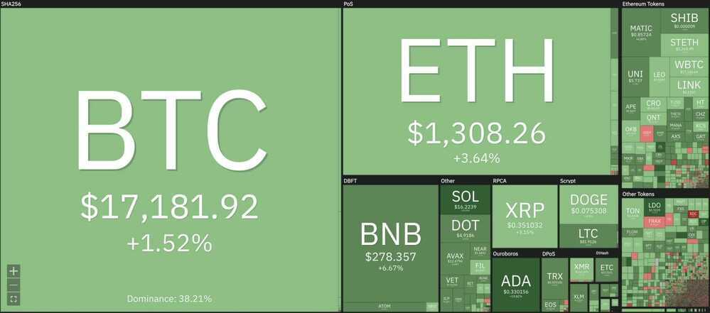

# Crypto News

- crypto winter
- [Bitcoin Obituaries - "Bitcoin is Dead" Declared 400+ Times](https://99bitcoins.com/bitcoin-obituaries/)
- [Rekt - Home](https://rekt.news/)
- [State of Crypto 2023 - Google Slides](https://docs.google.com/presentation/d/1_bRyqC8MVjeAmGpOtmhpJydHsxoWWU0wWKsacdx9ovM/edit)
- [2023 State of Crypto Report: Introducing the State of Crypto Index - a16z crypto](https://a16zcrypto.com/content/article/state-of-crypto-report-2023/)

### Cake DeFi CEO briefing, 2nd week of 2023

1. The calm week 53 in 2022 and week 1 in 2023 played out as expected. For this week, I am expecting the pent-up demand to buy and/or sell cryptos or equities to happen this week… So, get ready for lots of volatility in the upcoming days. IMPORTANT: This is NOT a new up- or down-trend. It is just the supply and demand of the past 2-3 weeks.

2. The key things in crypto to watch is the DCG/Genesis/Gemini story… Let me know if you want me to explain this in greater detail, but you can read up on it here: <https://twitter.com/julianhosp/status/1609953125254709251> The short version is: Did DCG do the same embezzlement with Genesis, as FTX did with Alameda?! If it turns out as yes, we may see struggle in crypto. Otherwise I am not too bearish.

3. In the macro economy we have US CPI numbers on Thursday. I am expecting inflation to get lower than the general market expects. This will be bullish in the mid-term.

4. In the general markets, banks are starting to report Q4 2022 earnings this week. Get ready for a roller coaster!!

### The Fall of Terra: A Timeline of the Meteoric Rise and Crash of UST and LUNA

The Terra network and its leader, Do Kwon, rose to the highest tier of the crypto world thanks to big-shot investors, only to fall apart within a few days in May 2022.

On May 7, the price of the then-$18-billion algorithmic stablecoin terraUSD (UST), which is supposed to maintain a $1 peg, started to wobble and fell to 35 cents on May 9. Its companion token, LUNA, which was meant to stabilize UST's price, fell from $80 to a few cents by May 12.

<https://www.coindesk.com/learn/the-fall-of-terra-a-timeline-of-the-meteoric-rise-and-crash-of-ust-and-luna/>

### List of major cryptocurrency companies that have gone bankrupt

20 Jan 2023 - [Crypto lending unit of Genesis files for US bankruptcy](https://www.livemint.com/companies/news/crypto-lending-unit-of-genesis-files-for-us-bankruptcy/amp-11674228914150.html)
    - The lending unit of crypto firm Genesis filed for U.S. bankruptcy protection on Thursday, owing creditors at least $3.4 billion, after being toppled by a market rout along with the likes of exchange FTX and lender BlockFi.

**Three Arrows Capital:** The crypto hedge fund defaulted on a crypto loan worth more than $650 million soon after the terraUSD-Luna collapse and filed for bankruptcy on July 1, 2022.

**Voyager:** The US crypto lender filed for bankruptcy just five days after Three Arrows Capital went bust.

**Celsuis:** The crypto lender filed for bankruptcy on July 14 after falling victim to the terraUSD-Luna collapse.

**FTX:** The collapse of FTX, the world’s second largest crypto exchange, shocked the world in November. Founder Sam Bankman-Fried was arrested in the Bahamas and extradited to the US after a long delay, during which he went on an ill-advised media tour. Earlier this month he pleaded not guilty to criminal charges.

**Genesis:** One of the world’s largest crypto lenders, Genesis froze withdrawals in November after the spectacular collapse of FTX.

**BlockFi:** The crypto lender filed for bankruptcy in late November, a fortnight after FTX collapsed, as it had substantial exposure to the crypto exchange. Another victim of the terraUSD collapse, It had been relying on a $400 million credit facility from FTX to stay solvent after Voyager and Celsius went bankrupt in July.

### Sources

- CoinMarketCap
- CoinBureau
- [DeFi Pulse](https://www.defipulse.com/)

### CBDC

[Global CBDC System Incoming!! This Report Will SCARE You!! - YouTube](https://www.youtube.com/watch?v=5VPwG8hSbhw)

### News

[I HOPE YOU'RE PAYING ATTENTION - BIG Money Is BACK In The Market](https://www.youtube.com/watch?v=9-go6CV2Nws)

[BIG SURPRISE! Ethereum Layer 2 Airdrop & Major Crypto Regulations News!](https://www.youtube.com/watch?v=M1twe6riV30)

[How Much Bitcoin Should You Own? The Richest Bitcoin Owners](https://www.youtube.com/watch?v=MHHidZBAFRI)

[Which Is Better 1 Bitcoin OR 32 Ethereum? Long Term Investment Strategy](https://www.youtube.com/watch?v=TX90g0s1ovg)

[The Next Bull Market Will Be The BIGGEST EVER...](https://www.youtube.com/watch?v=iSKybRTYoyU)

[The Secretive World Of MEV, Where Bots Front-Run Crypto Investors For Big Profits](https://www.forbes.com/sites/jeffkauflin/2022/10/11/the-secretive-world-of-mev-where-crypto-bots-scalp-investors-for-big-profits/?sh=b4e0e672d8dc)

[Hopium Diaries - Dystopian Dreams - YouTube](https://www.youtube.com/watch?v=v1Z5BnBuFyE)

[SEC TARGETING Crypto: Which Projects At RISK?? 😨 - YouTube](https://www.youtube.com/watch?v=uPBR3mn6wKU)

[Still Hope For Crypto?! This Will REALLY Surprise You!! 😮 - YouTube](https://www.youtube.com/watch?v=65QgI_Kzq38)

[This SAYS It ALL!! Crypto Adoption Incoming!! - YouTube](https://www.youtube.com/watch?v=J6-LCwPRJWo)

[US Government Plan For Crypto, CBDC, Ukraine, China & More!! - YouTube](https://www.youtube.com/watch?v=nUyJ911jmL0)

[ETH to $50,000?! Crypto Price Prediction Report! - YouTube](https://www.youtube.com/watch?v=PQsb5TX56QY)

[ETHEREUM Updates!! Where Is ETH Price Going In 2023?! - YouTube](https://www.youtube.com/watch?v=FcT9AnkO6GY)

[Bitcoin Is GROWING Fast!! Ethereum Dominance OVER!? - YouTube](https://www.youtube.com/watch?v=IyuwI5q7HwA)

[Commercial Real Estate CRASH is Coming!! Why I'm Worried! - YouTube](https://www.youtube.com/watch?v=PziydUm1ees)

[Preparing For a BEAR Market!! Complete 101 Guide!! 🐻 - YouTube](https://www.youtube.com/watch?v=Vbjb-mGSMXo)
