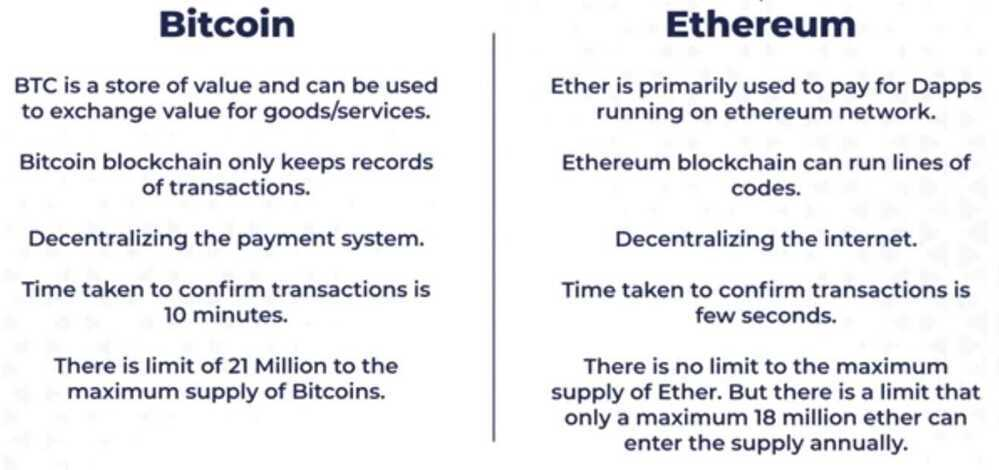
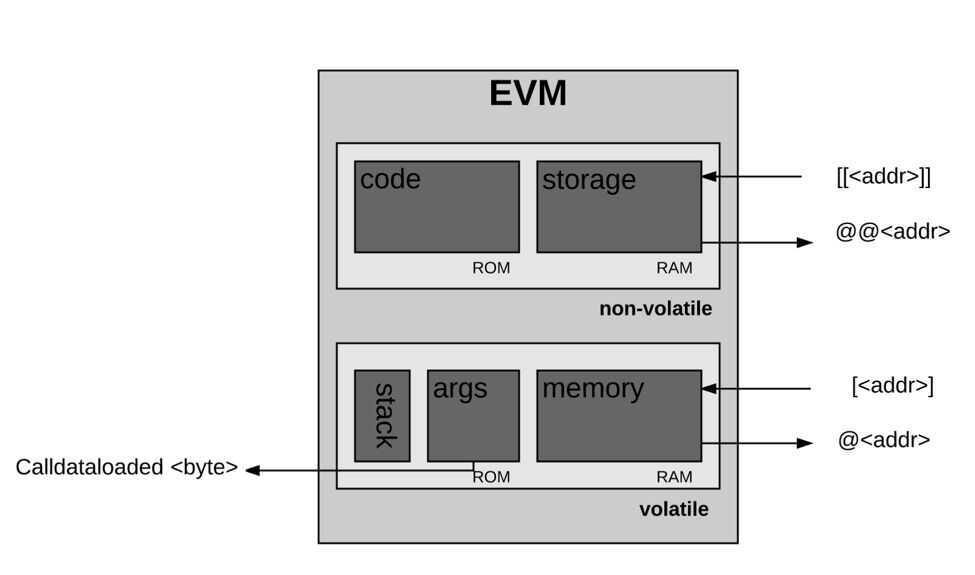

# Ethereum

Ethereum is a **decentralized platform** that runs smart contracts: applications that run exactly as programmed without any possibility of downtime, censorship, fraud or third-party interference.

Uses Solidity as a programming language.

Ethereum's mechanism to choose the most valid chain is called the "GHOST protocol". GHOST stands for "Greedy Heaviest Observed Subtree". Essentially, it picks the path that has had the most computation done on it. The protocol uses the block number of the most recent block, this represents the total number of blocks in the current path. The higher the block number, the longer the path and as such the larger the mining effort that had to have gone into arriving at the most recent block. This allows the network to agree on the correct version of the current state.

- Mining Algorithm - Ethhash
- Ethereum (2015): full-blown, Turing-complete smart contracts
- Built-in currency caller **Ether**
- Operations in smart contracts have a **gas cost** that gets paid to the miners
- Blockchains will be to finance what the Internet was to music and video
- Follow the longest chain or heaviest chain
- Problems
    - Loss of data
    - Confidentiality
- Ethereum is the blockchain of blockchains

[ETHEREUM 2.0 - A GAME CHANGER? Proof Of Stake, The Beacon Chain, Sharding, Docking Explained](https://youtu.be/ctzGr58_jeI)

- Solidity
- Ether = Token (is the fuel to run this Dapps)
- Ethereum - Platform to develop our own Dapps
- Gas fees
- Smart contracts
- DeFi - Decentralized Finance
- Proof of work -> Proof of stake
- Sharding will increasing 1000 TPS
- EIP 1559

## Points

- Blockchains all start with a **genesis state**.
- Each transaction in the Ethereum network is grouped into what are called blocks. A single block contains a set of transactions and each block points to the next block. This makes a chain of blocks aka blockchain.
- Mining is when a specific group of nodes (miners) uses their computing power to create a block of valid transactions.
- The processes of validating each block by having a miner provide a mathematical proof are called the 'proof of work' algorithm.
- Miners who validate new blocks get rewarded with an intrinsic digital token called 'Ether'. Every single time a miner proves a block as valid, the network generates new Ethers and awards the miner.
- In scenarios where multiple paths are generated by miners, a 'fork' happens. Forks are to be avoided since they are disruptive to the system and force nodes to choose which chain they believe to be the most valid.
- Ethereum's mechanism to choose the most valid chain is called the "GHOST protocol". GHOST stands for "Greedy Heaviest Observed Subtree". Essentially, it picks the path that has had the most computation done on it. The protocol uses the block number of the most recent block, this represents the total number of blocks in the current path. The higher the block number, the longer the path and as such the larger the mining effort that had to have gone into arriving at the most recent block. This allows the network to agree on the correct version of the current state.

## Components

### Accounts

- Externally Owned Account
    - Ether Balance
- Smart Contract Account
    - Ether Balance
    - Contract Code
- Every account has a state
    - nonce
        - represents number of transactions sent from the address of the account
    - balance
        - amount of Ether owned by the address
    - storageRoot
        - root node of its Merkle tree
    - codeHash
        - hash of the Ethereum Virtual Machine code
- Merkle Tree

### Fees

- Every single computation/transaction on the Ethereum blockchain requires a fee. That fee is paid in whats called 'gas'. Gas is the unit Ethereum uses to measure computation fees. Gas price is an amount of Ether a node is willing to spend on every gas unit, measured in 'gwei' (since 'wei' is the smallest unit of Ether).
- For each transaction, a sender sets a gas limit and a gas price. The gas limit represents the maximum gas the sender is willing to pay. If the sender doesn't provide the necessary gas to execute a transaction, the transaction is considered invalid. And since the Ethereum network had to expend computational effort to run the calculations before running out of gas, none of the gas gets refunded to the sender. The money spent on gas by the sender is sent to some miners address since miners are expanding the computational effort to validate transactions. The gas fee acts as a reward for the miners. Importantly, gas is used to pay for storage usage as well.
- Fees help prevent users from overtaxing the Ethereum network. Its very computationally expensive to run computational steps on the Ethereum Virtual Machine, so smart contracts should be used for simple tasks like verifying ownership instead of more complex tasks like machine learning or file storage. Fees also help protect the network from malicious attacks. Ethereum has its own Turing complete programming language called Solidity for creating smart contracts. Turing complete means it can simulate any computer algorithm. It allows for-loops, so a bad actor could disrupt the network by executing an infinite loop within a transaction, but thanks to fees this becomes infeasible.
- There are two types of transactions in Ethereum, the message call and the contract creation (creates new smart contracts). Both are initiated by externally owned accounts and submitted to the blockchain. They are what bridge the external world to the internal state of Ethereum. Contracts can talk to other contracts via messages. Messages are like internal transactions. These messages are generated by contracts, and when one contract sends a message to another, the code that exists on the recipient contract account is executed.

### Ethereum Virtual Machine

The EVM is a complete virtual machine, and its only limitation is that its bound by gas. Meaning the total amount of computation it can do is limited by the amount of gas provided. Its a stack-based architecture (last-in, first-out). It has temporary memory and long-term storage. It even has its own language! (called EVM bytecode). When we write smart contracts, it's in a higher level language like Solidity, but this compiles down to EVM bytecode.

- Ethereum Virtual Machine is a decentralized virtual machine that can run crypto economically secured bits of code called smart contract.
- The smart contracts language Solidity is tailored to the ethereum blockchain since it compiles down to bytecode specific for Ethereum's stack machine.
- Solidity is Turing-complete meaning it can theoretically any kind of computation.

## Geth

Geth (go-ethereum) is a Go implementation of Ethereum - a gateway into the decentralized web.

Geth has been a core part of Ethereum since the very beginning. Geth was one of the original Ethereum implementations making it the most battle-hardened and tested client.

Geth is an Ethereum execution client meaning it handles transactions, deployment and execution of smart contracts and contains an embedded computer known as the Ethereum Virtual Machine.

Running Geth alongside a consensus client turns a computer into an Ethereum node.

Codebase - [GitHub - ethereum/go-ethereum: Official Go implementation of the Ethereum protocol](https://github.com/ethereum/go-ethereum)

[Home | go-ethereum](https://geth.ethereum.org/)

[The Ethereum source code explained in 2 mins](https://www.youtube.com/watch?v=NC41G9A1w0I)

## Ethereum Push Notification Service (EPNS)

Protocol for blockchain based notifications that are chain agnostic, platform independent and incentivized!

https://epns.io

## Crypto-enabled financial trickery

- Smart contracts allow automatic execution of contract stipulations, no matter their form
- Classic: Arbitrage between different platforms
- New: Uncollateralized flash loans - [Borrow Millions In DEFI With NO COLLATERAL? FLASH LOANS Explained (Aave, dYdX) - YouTube](https://www.youtube.com/watch?v=mCJUhnXQ76s&ab_channel=Finematics)

## Self-soverign identities (SSI)

- Self-sovereign identity (SSI) is an approach to digital identity that gives individuals control of their digital identities
- No single standard, specification, or shared understanding **what** that may be

## MEV (Maximal Extractable Value)

Maximal extractable value (MEV) refers to the maximum value that can be extracted from block production in excess of the standard block reward and gas fees by including, excluding, and changing the order of transactions in a block.

### Miner extractable value

Maximal extractable value was first applied in the context of proof-of-work, and initially referred to as "miner extractable value". This is because in proof-of-work, miners control transaction inclusion, exclusion, and ordering. However, since the transition to proof-of-stake via The Merge validators have been responsible for these roles, and mining is no longer part of the Ethereum protocol. The value extraction methods still exist, though, so the term "Maximal extractable value" is now used instead.

- [Maximal extractable value (MEV) | ethereum.org](https://ethereum.org/en/developers/docs/mev/)
- [Overview | Flashbots Docs](https://docs.flashbots.net/flashbots-auction/overview)
- [MEVconomics - YouTube](https://www.youtube.com/playlist?list=PLXzKMXK2aHh7bW0j2dhpnLNiIJIMnPgsD)
- [What is Flashbots? - How To Use & MEV Protection](https://milkroad.com/flashbots)
- [MEV Activities Since the Merge - Strategies, Searchers and Builders during Market Panic - Elaine Hu - YouTube](https://www.youtube.com/watch?v=2iseYQwd2dA&ab_channel=ETHGlobal)
- [Information is the New Money - Phil Daian - YouTube](https://www.youtube.com/watch?v=vi-rVTFTb6s&ab_channel=ETHGlobal)
- [Protocol economics the Ethereum protocol’s perspective - Vitalik Buterin - YouTube](https://www.youtube.com/watch?v=cXswTUqlZPQ&ab_channel=ETHGlobal)
- [Decentralizing Sequencers Wait it’s all PBS Always have been - Hasu - YouTube](https://www.youtube.com/watch?v=6xS0xMzh9Tc&ab_channel=ETHGlobal)
- [MEVeconomics in L2 - A Closer Look at the Sequencer's Role and MEV - Patrick McCorry - YouTube](https://www.youtube.com/watch?v=kb8nY2-Osjc&ab_channel=ETHGlobal)
- [MEVconomics for Modular Blockchain Stacks - John Adler - YouTube](https://www.youtube.com/watch?v=Tsg8fiQUdjY&ab_channel=ETHGlobal)
- [The MEVconomics of bridging - James Prestwich - YouTube](https://www.youtube.com/watch?v=W0ZJ_MamKM4&ab_channel=ETHGlobal)
- [What is MEV: A beginner’s guide to Ethereum’s invisible tax](https://cointelegraph.com/learn/what-is-mev-ethereums-invisible-tax)
- [Easy to Use Arbitrage MEV Bot for Uniswap - MEVBot](https://uniarbitrage.com/0x9ea3cda5c2adf0370454b9ee28786a068227b1a4)

### Others

- PBS - Proposer-Builder Separation
- ePBS - enshrined Proposer-Builder Separation
- PTC - Payload-Timeliness Committee
- ToB - Top-of-Block

[Relays in a post-ePBS world - Proof-of-Stake - Ethereum Research](https://ethresear.ch/t/relays-in-a-post-epbs-world/16278)

[GitHub - skip-mev/pob: Skip's protocol-owned MEV builder implementation](https://github.com/skip-mev/pob)

## Testing

[What are Testnets?](https://www.alchemy.com/overviews/what-are-testnets)

### What is a testnet Ethereum faucet

An Ethereum faucet is a developer tool to get testnet Ether (ETH) in order to test and troubleshoot your decentralized application or protocol before going live on Ethereum mainnet, where one must use real Ether. Most faucets require social authentication (e.g. Twitter post or login confirming you are a real human) or place you in a queue to wait for a testnet token through the faucet. The Alchemy Goerli faucet is free, fast, and does not require authentication, though you can optionally login to Alchemy to get an increased drip.

[https://goerlifaucet.com/](https://goerlifaucet.com/)

### What is a testnet token?

Testnet tokens are a test currency that allows you to test your Ethereum application before going live on mainnet. Testnet tokens can be used in place of mainnet Ether tokens on testnets like Goerli.

## Others

[Can ETH Become DEFLATIONARY? EIP 1559 Explained - YouTube](https://www.youtube.com/watch?v=MGemhK9t44Q&ab_channel=Finematics)

[**How does Ethereum work, anyway?**](https://www.preethikasireddy.com/post/how-does-ethereum-work-anyway)

[Ethereum (ETH) Blockchain Explorer](https://etherscan.io/)

[Blockscan Chat - Wallet to Wallet Messaging for Web3](https://chat.blockscan.com/start)

- A messaging platform for users to simply and instantly message each other wallet-to-wallet, powered by  Log-in With Ethereum

[GitHub - graphprotocol/graph-node: Graph Node indexes data from blockchains such as Ethereum and serves it over GraphQL](https://github.com/graphprotocol/graph-node)

[Remix - Ethereum IDE](https://remix.ethereum.org/)

Ethereum By Henning Diedrich

[How Do Ethereum Withdrawals Work? All You Need To Know - YouTube](https://www.youtube.com/watch?v=RwwU3P9n3uo)

[How does Ethereum work, anyway](https://www.preethikasireddy.com/post/how-does-ethereum-work-anyway)
