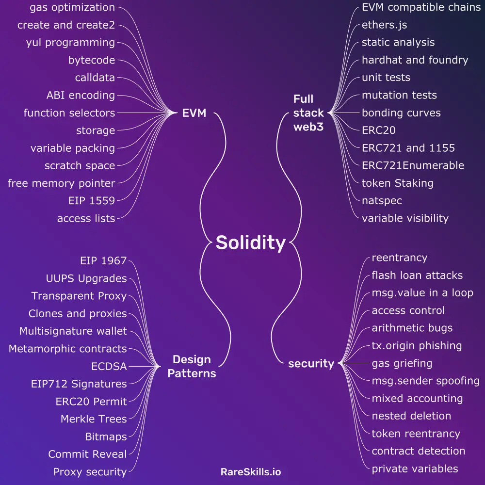

# Solidity

## Links

[Advanced Solidity | RareSkills](https://www.rareskills.io/advanced-solidity)

[Introduction to Smart Contracts - Solidity 0.8.20 documentation](https://docs.soliditylang.org/en/latest/introduction-to-smart-contracts.html)

[Solidity Bootcamps & Senior Web3 Blockchain Engineer Courses](https://www.rareskills.io/solidity-bootcamp)

### Module 1: Token Protocols and Advanced Solidity development

#### Week 1: ERC777 and 1363 and token sales with bonding curves

Understand the upgrades to the ERC20 protocol and build a token sale with bonding curves.

You will also learn every nook and cranny of the ERC20 protocol and its evolutions: ERC777 and ERC1363.

#### Week 2: ERC721, ERC721Enumerable, and ERC1155 staking and security considerations

Put an ERC721 on OpenSea and store images on IPFS. Build a project that depends on ERC721Enumerable. You will make NFTs stakable to yield ERC20 tokens, and you will be build an exchange that mints NFTs when paid in ERC20 tokens.

Like the previous week, you will come out of this understanding every last bit of the ERC721 protocol and implementation. You will practice and understand re-entrancy as it relates to 721 and 1155 implementations.

#### Week 3-4: Advanced testing methodologies: Mutation tests and fuzzing

Master unit tests that not only assesses functionality, but also all the state transitions a smart contract can undergo. You will learn how to automatically catch mistakes and clean up your code with slither and solhint.

You will implement mutation testing with hardhat to determine the quality of your tests and automatically catch corner cases you didn’t think of. You will practice bug discovery using the Trail of Bits Echida library.

### Module 2: Security

#### Week 5-9: Re-entrancy, Read only Reentrancy, msg.value in a loop, access controls, gas griefing, Denial of service, insecure randomness, arithmetic errors, improper data validation, business logic errors, and msg.sender spoofing

We select problems from Damn Vulnerable DeFi, Capture the Ether, and Ethernaut that you now have the prerequisite knowledge for (nothing is more frustrating that trying to do a hack on a subject you haven’t studied before).

But we also have a secret repository created just for RareSkills students that will test you on exercises you won’t find elsewhere online!

### Module 3: Gas Optimization, Assembly Programming, and the EVM

#### Week 10-12: Writing and Deciphering Raw Bytecode without a decompiler

Learn from the bestselling author of the Udemy courses on gas optimization and assembly programming. It’s not just enough to master Solidity. You must master the environment that it runs in: the Ethereum Virtual Machine.

You will learn how the EVM actually conducts the transactions, stores information, and the protocols it uses to receive instructions.

Students in this bootcamp get access to those courses for free.

You will do lots of Gas Optimization Puzzles and EVM puzzles. You will complete puzzles that require you to write raw bytecode to really drill your knowledge of the EVM.

You will also work on the Ethernaut puzzles that aren’t hackable without understanding the storage layout. You will practice the problems in our Github repo here.

#### Week 13-15: Yul programming

Build a non-trivial smart contract entirely in Yul (assembly). This is the hardest assignment you will have in the class. You will parse calldata without syntactic sugar for arguments, layout the storage word by word, and allocate the memory byte by byte.

You’ll build a non-trivial and tested smart contract without any Solidity.

Our students have universally said this is one of the hardest things they have ever done, but it’s also when they begin to earn the feeling of truly mastering ethereum smart contract development.

This section is exceptionally challenging, some students require up to 4 weeks to complete it.

### Module 4: Design Patterns

#### Week 16-17: Proxy patterns and proxy security

Now that you have the EVM under your belt, understanding proxy patterns will be a piece of cake. You will clearly understand the motivation behind EIP 1967, UUPS, and Transparent Upgradeable Proxies.

You will also practice relevant hacking exercises to break incorrectly implemented proxy patterns. You will learn how to do these safely with the OpenZeppelin Hardhat plugin.

You will also implement variations of EIP 1167 Minimal Proxy (or clones).

#### Week 18-19: Advanced design patterns

This week will study two upgrade patterns: metamorphic smart contracts and the diamond pattern. Although they are rarely used in practice, implementing them strongly enforces how the EVM works and also helps you be mindful that some widely believed limitations on smart contracts (e.g. immutability) are not actually true!

We will learn other miscellaneous design patterns that don’t fall nicely into their own category, including multicall, merkle trees, bitmaps, commit reveal, multisignature wallets, leading zero addresses.

#### Week 20-22: Applied Elliptic Curve Cryptography

In this section you will learn how ECDSA (Elliptic Curve Digital Signature Algorithm) works and how it is used in smart contracts. You will also learn the surprising ways it breaks and what to do about it.

You will hack custom smart contracts we deploy to the main net (and get a little cryptocurrency out of it!). You will also learn relevant design patterns that depend on ECDSA signatures like EIP 712, Governance, ERC 20 Permit, Metatransactions (gasless transactions) and Relayers.

## Others

[Slither - a Solidity static analysis framework | Trail of Bits Blog](https://blog.trailofbits.com/2018/10/19/slither-a-solidity-static-analysis-framework/)

[Introduction - The Move Book](https://move-language.github.io/move/)
