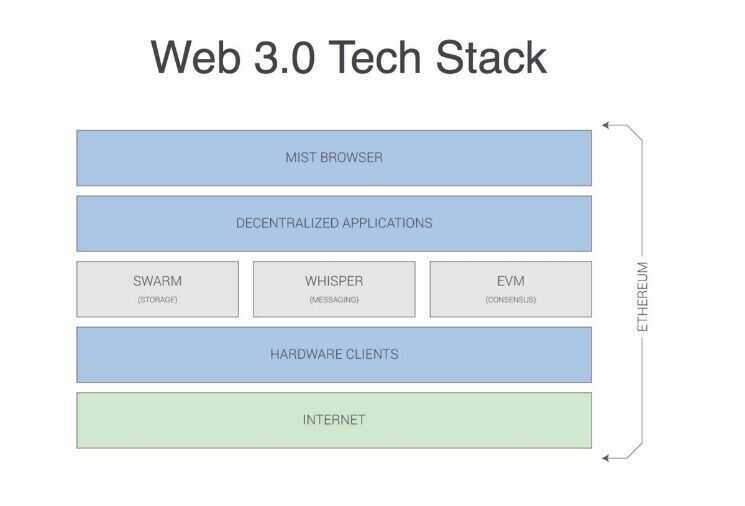

# Others

## IPFS (InterPlanatery File System)

InterPlanetary File System(IPFS) is a [protocol](https://en.wikipedia.org/wiki/Communications_protocol) and network designed to create a [content-addressable](https://en.wikipedia.org/wiki/Content-addressable_storage), [peer-to-peer](https://en.wikipedia.org/wiki/Peer-to-peer) method of storing and sharing [hypermedia](https://en.wikipedia.org/wiki/Hypermedia) in a [distributed file system](https://en.wikipedia.org/wiki/Distributed_file_system)

IPFS is a peer-to-peer distributed file system that seeks to connect all computing devices with the same system of files. IPFS could be seen as a single [BitTorrent](https://en.wikipedia.org/wiki/BitTorrent) swarm, exchanging objects within one [Git](https://en.wikipedia.org/wiki/Git_(software)) repository. In other words, IPFS provides a high-throughput, content-addressed [block storage](https://en.wikipedia.org/wiki/Block_storage) model, with content-addressed [hyperlinks](https://en.wikipedia.org/wiki/Hyperlink).Distributed Content Delivery saves bandwidth and prevents [DDoS attacks](https://en.wikipedia.org/wiki/Denial-of-service_attack), which HTTP struggles with.

### Working

- Each file and all of the blocks within it are given a unique fingerprint called a cryptographic hash.
- IPFS removes duplications across the network.
- Each network nodestores only content it is interested in, and some indexing information that helps figure out who is storing what.
- When looking up files, you're asking the network to find nodes storing the content behind a unique hash.
- Every file can be found by human-readable names using a decentralized naming system called IPNS.

https://ipfs.io

https://en.wikipedia.org/wiki/InterPlanetary_File_System

## Orbit Chat

A distributed, serverless, peer-to-peer chat application on IPFS

https://github.com/orbitdb/orbit

## OrbitDB

Peer-to-Peer Databases for the Decentralized Web

https://github.com/orbitdb

## OpenBazaar

OpenBazaar is an open source project developing a protocol for [e-commerce](https://en.wikipedia.org/wiki/E-commerce) transactions in a fully [decentralized](https://en.wikipedia.org/wiki/Decentralization) marketplace. It uses [cryptocurrencies](https://en.wikipedia.org/wiki/Cryptocurrency) as medium of exchange and was inspired by a [hackathon](https://en.wikipedia.org/wiki/Hackathon) project called - DarkMarket

https://en.wikipedia.org/wiki/OpenBazaar

https://openbazaar.org

## EOS Storage

EOS.IO Storage is a proposed decentralized file system designed to give everyone the ability to permanently store and host files accessible by any web browser.

https://medium.com/eosio/start-an-eos-meetup-in-your-community-761be355fce

Earth Observation System - https://eos.com/eos-storage

https://github.com/cern-eos/eos

## XRootD

The XROOTD project aims at giving high performance, scalable fault tolerant access to data repositories of many kinds. The typical usage is to give access to file-based ones. It is based on a scalable architecture, a communication protocol, and a set of plugins and tools based on those. The freedom to configure it and to make it scale (for size and performance) allows the deployment of data access clusters of virtually any size, which can include sophisticated features, like authentication/authorization, integrations with other systems, WAN data distribution, etc.

XRootD software framework is a fully generic suite for fast, low latency and scalable data access, which can serve natively any kind of data, organized as a hierarchical filesystem-like namespace, based on the concept of directory. As a general rule, particular emphasis has been put in the quality of the core software parts.

http://xrootd.org

## Bittorrent

- 💭 Who Created BitTorrent?
- 🥊 BitTorrent vs Cient-Server Downloading
- 📑 High Level Overview
- 📁 What's in a Torrent Descriptor File, Anyway?
- 🧀 The Piece Selection Algorithm of BitTorrent
- 🌆 What Are Sub-Pieces and the Piece Selection Algorithm?
- 🌱 Resource Allocation Using Tit-For-Tat
- 🎐 The Choking Algorithm
- 😎 Optimistic Unchoking
- 🤕 Anti-Snubbing
- 🤔 What If We Upload Only?
- 🐝 What Is a Tracker?
- 🧲 Magnet Links - Trackerless Torrents
- 🐍 Distributed Hash Tables
- 📌 Routing Table
- 🤺 Attacks on BitTorrent

https://dev.to/brandonskerritt/how-does-bittorrent-work-a-plain-english-guide-16a2

https://skerritt.blog/bit-torrent

### WebTorrent

https://github.com/webtorrent/webtorrent

## DApps

- [Audius - Empowering Creators](https://audius.co/)
- [The HUSL | Music, NFT's & Entertainment in the Metaverse](https://thehusl.io/)
- [FanTiger - Invest in Songs](https://www.fantiger.com/)
- [Mirror](https://mirror.xyz/)
- [GitHub - district0x/ethlance: Ethlance is the first job market platform built entirely on the Ethereum blockchain. Free to use forever!](https://github.com/district0x/ethlance)
- [Snyper - The first Web3 Social Marketplace](https://snyper.notion.site/Snyper-Angel-Memo-V1-3-73117de4d4cf44b7bcc6208b5e915cc0)
- [Link3.to | A Web3 Social Network of Verifiable Identities](https://link3.to/)
- [CyberConnect | Web3's Earliest & Biggest Decentralized Social Network](https://cyberconnect.me/)

### Decentralized database

https://gun.eco

[GUN Decentralized Graph DB in 100 Seconds](https://www.youtube.com/watch?v=oTQXzhm8w_8)

### Decentralized Social Network

- [GitHub - mastodon/mastodon: Your self-hosted, globally interconnected microblogging community](https://github.com/mastodon/mastodon)
- [Mastodon - Decentralized social media](https://joinmastodon.org/)
- [Mastodon (social network) - Wikipedia](https://en.wikipedia.org/wiki/Mastodon_(social_network))
- [What is Mastodon? - YouTube](https://www.youtube.com/watch?v=IPSbNdBmWKE&ab_channel=Mastodon)
- [Why I'm not telling you to host your own Mastodon - YouTube](https://www.youtube.com/watch?v=mqocW7DUFpg)
- [Mastodon Is More Than A Twitter Replacement - YouTube](https://www.youtube.com/watch?v=0H-P7LhFy2A)

## Decentralized Chat (Whisper)

1. Building first whisper chat app
2. Sending messages with Geth + Whisper
3. Off chain P2P communication protocol
4. Scalability issues
5. Peer to peer chat

## What is Whisper

- Darkness as a feature
    https://github.com/llSourcell/Decentralized_Chat/blob/master/Decentralized%20Chat.ipynb
- Decentralized News
- Decentralized Games
- Decentralized Rides
- Decentralized Music
- Decentralized Search Engine App
- Decentralized Marketplace
- Decentralized Social Network
- Decentralized Artificial Intelligence
